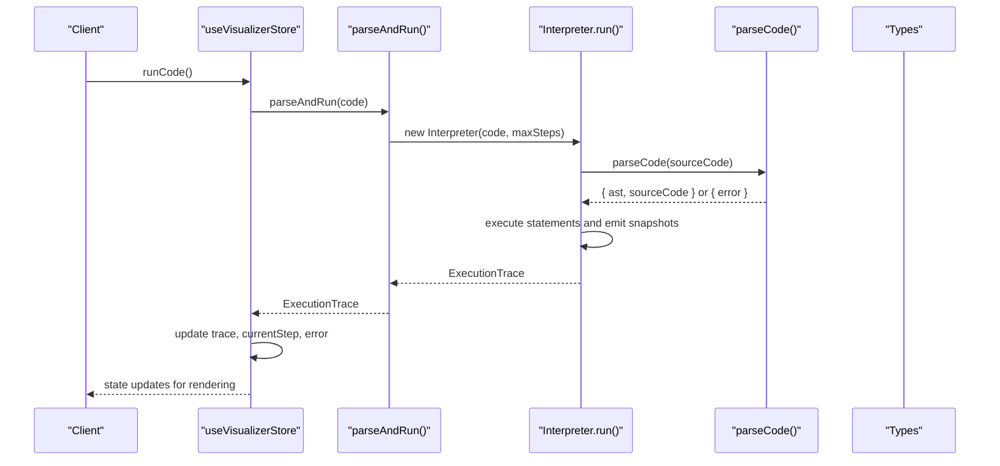
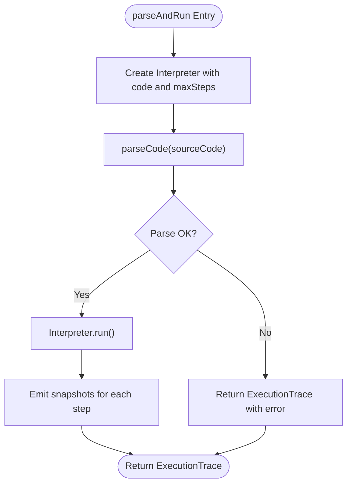
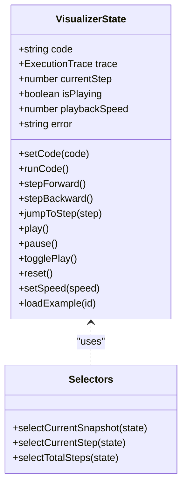
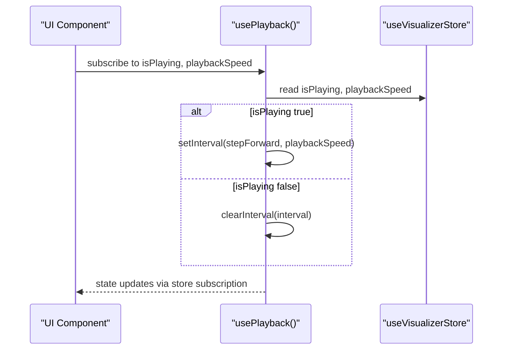
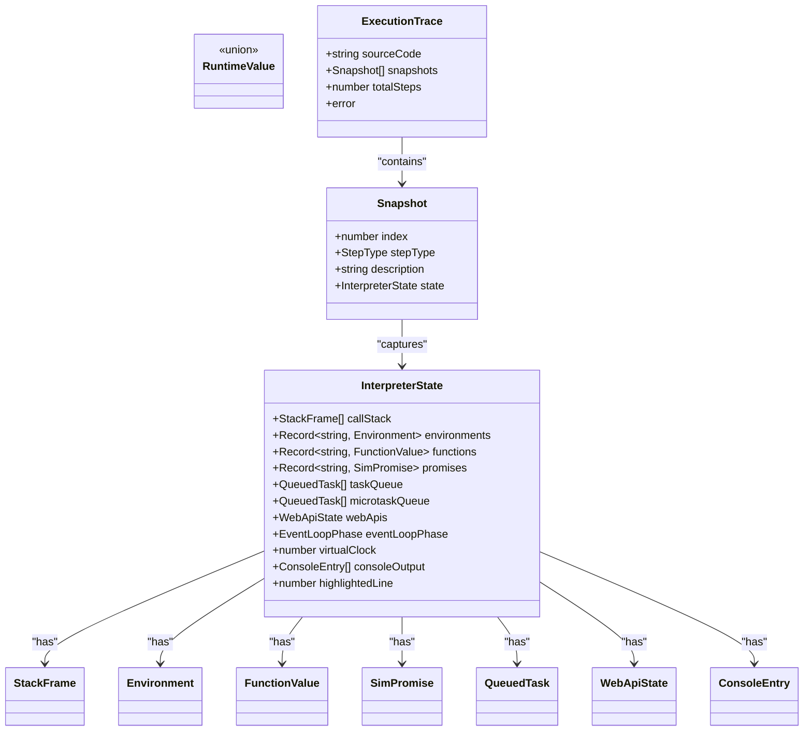
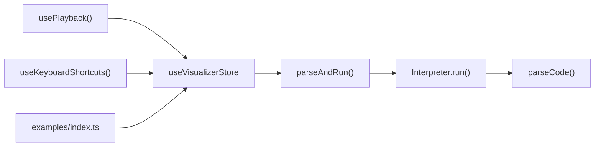

# API Reference

<cite>
**Referenced Files in This Document**
- [src/engine/index.ts](file://src/engine/index.ts)
- [src/engine/interpreter/index.ts](file://src/engine/interpreter/index.ts)
- [src/engine/parser/index.ts](file://src/engine/parser/index.ts)
- [src/engine/runtime/types.ts](file://src/engine/runtime/types.ts)
- [src/store/useVisualizerStore.ts](file://src/store/useVisualizerStore.ts)
- [src/hooks/usePlayback.ts](file://src/hooks/usePlayback.ts)
- [src/examples/index.ts](file://src/examples/index.ts)
- [package.json](file://package.json)
</cite>

## Table of Contents
1. [Introduction](#introduction)
2. [Project Structure](#project-structure)
3. [Core Components](#core-components)
4. [Architecture Overview](#architecture-overview)
5. [Detailed Component Analysis](#detailed-component-analysis)
6. [Dependency Analysis](#dependency-analysis)
7. [Performance Considerations](#performance-considerations)
8. [Troubleshooting Guide](#troubleshooting-guide)
9. [Conclusion](#conclusion)
10. [Appendices](#appendices)

## Introduction
This API reference documents the public interfaces and programmatic access points for the JavaScript Visualizer engine. It covers:
- Engine public API for initializing and running code execution
- Store API for state selection, actions, and subscriptions
- Hook APIs for playback control and keyboard shortcuts
- Type definitions for runtime values, execution traces, and state structures
- Function signatures, parameters, return values, usage examples, error handling, performance characteristics, and integration patterns

The goal is to enable developers to integrate the visualizer into larger applications and extend its capabilities.

## Project Structure
The project is organized around three primary layers:
- Engine: parsing, interpreting, and simulating JavaScript execution with detailed snapshots
- Store: state container for code, execution trace, playback controls, and UI state
- Hooks: React utilities for playback automation and keyboard shortcuts

```mermaid
graph TB
subgraph "Engine"
Parser["Parser<br/>parseCode()"]
Interpreter["Interpreter<br/>run(), parseAndRun()"]
Types["Runtime Types<br/>ExecutionTrace, Snapshot, RuntimeValue, etc."]
end
subgraph "Store"
Zustand["Zustand Store<br/>useVisualizerStore"]
Selectors["Selectors<br/>selectCurrentSnapshot, selectCurrentStep, selectTotalSteps"]
end
subgraph "Hooks"
PlaybackHook["usePlayback()"]
ShortcutsHook["useKeyboardShortcuts()"]
end
subgraph "Examples"
Examples["examples/index.ts"]
end
Parser --> Interpreter
Interpreter --> Types
Zustand --> Interpreter
Zustand --> Selectors
PlaybackHook --> Zustand
ShortcutsHook --> Zustand
Examples --> Zustand
```

**Diagram sources**
- [src/engine/parser/index.ts:1-25](file://src/engine/parser/index.ts#L1-L25)
- [src/engine/interpreter/index.ts:1361-1365](file://src/engine/interpreter/index.ts#L1361-L1365)
- [src/engine/runtime/types.ts:1-249](file://src/engine/runtime/types.ts#L1-L249)
- [src/store/useVisualizerStore.ts:1-109](file://src/store/useVisualizerStore.ts#L1-L109)
- [src/hooks/usePlayback.ts:1-79](file://src/hooks/usePlayback.ts#L1-L79)
- [src/examples/index.ts:1-153](file://src/examples/index.ts#L1-L153)

**Section sources**
- [src/engine/index.ts:1-17](file://src/engine/index.ts#L1-L17)
- [src/engine/interpreter/index.ts:1361-1365](file://src/engine/interpreter/index.ts#L1361-L1365)
- [src/engine/parser/index.ts:1-25](file://src/engine/parser/index.ts#L1-L25)
- [src/engine/runtime/types.ts:1-249](file://src/engine/runtime/types.ts#L1-L249)
- [src/store/useVisualizerStore.ts:1-109](file://src/store/useVisualizerStore.ts#L1-L109)
- [src/hooks/usePlayback.ts:1-79](file://src/hooks/usePlayback.ts#L1-L79)
- [src/examples/index.ts:1-153](file://src/examples/index.ts#L1-L153)

## Core Components
This section documents the public APIs exposed by the engine, store, and hooks.

- Engine public API
  - parseAndRun(sourceCode: string, maxSteps?: number): ExecutionTrace
    - Initializes an interpreter with the given source code and executes it, returning a complete execution trace with snapshots and metadata.
    - Parameters:
      - sourceCode: JavaScript source code string to execute
      - maxSteps: optional maximum number of execution steps (default configured inside interpreter)
    - Returns: ExecutionTrace containing sourceCode, snapshots, totalSteps, and error if present
    - Errors: Throws on excessive steps or runtime errors captured during execution
    - Usage example: See [src/engine/interpreter/index.ts:1361-1365](file://src/engine/interpreter/index.ts#L1361-L1365)

- Store API (Zustand)
  - State shape and actions
    - State fields:
      - code: string
      - trace: ExecutionTrace | null
      - currentStep: number
      - isPlaying: boolean
      - playbackSpeed: number (milliseconds per step)
      - error: string | null
    - Actions:
      - setCode(code: string): void
      - runCode(): void
      - stepForward(): void
      - stepBackward(): void
      - jumpToStep(step: number): void
      - play(): void
      - pause(): void
      - togglePlay(): void
      - reset(): void
      - setSpeed(speed: number): void
      - loadExample(id: string): void
    - Selectors:
      - selectCurrentSnapshot(state): Snapshot | null
      - selectCurrentStep(state): number
      - selectTotalSteps(state): number
    - Usage example: See [src/store/useVisualizerStore.ts:27-98](file://src/store/useVisualizerStore.ts#L27-L98)

- Hook APIs (React)
  - usePlayback(): void
    - Manages automatic stepping forward based on isPlaying and playbackSpeed.
    - Subscribes to store state and sets up/clears intervals accordingly.
    - Usage example: See [src/hooks/usePlayback.ts:4-28](file://src/hooks/usePlayback.ts#L4-L28)
  - useKeyboardShortcuts(): void
    - Adds global keyboard event listeners for navigation and playback control.
    - Ignores editor inputs to avoid conflicts.
    - Usage example: See [src/hooks/usePlayback.ts:30-79](file://src/hooks/usePlayback.ts#L30-L79)

- Type definitions
  - ExecutionTrace: includes sourceCode, snapshots, totalSteps, and error
  - Snapshot: includes index, stepType, description, and InterpreterState
  - InterpreterState: callStack, environments, functions, promises, queues, webApis, eventLoopPhase, virtualClock, consoleOutput, highlightedLine
  - RuntimeValue and helpers: RuntimeValue union, UNDEFINED, NULL_VAL, makeNumber, makeString, makeBool, runtimeToString, runtimeToJS, isTruthy
  - StepType: enumeration of step categories
  - Additional types: Binding, Environment, FunctionValue, StackFrame, QueuedTask, WebApiTimer, WebApiFetch, WebApiState, SimPromise, ThenHandler, ConsoleEntry, EventLoopPhase
  - Usage example: See [src/engine/runtime/types.ts:1-249](file://src/engine/runtime/types.ts#L1-L249)

**Section sources**
- [src/engine/interpreter/index.ts:1361-1365](file://src/engine/interpreter/index.ts#L1361-L1365)
- [src/store/useVisualizerStore.ts:5-98](file://src/store/useVisualizerStore.ts#L5-L98)
- [src/hooks/usePlayback.ts:4-79](file://src/hooks/usePlayback.ts#L4-L79)
- [src/engine/runtime/types.ts:1-249](file://src/engine/runtime/types.ts#L1-L249)

## Architecture Overview
The engine parses JavaScript code into an AST, then simulates execution with detailed snapshots. The store orchestrates state and playback, while hooks provide convenient integrations for UI control.



**Diagram sources**
- [src/engine/interpreter/index.ts:75-135](file://src/engine/interpreter/index.ts#L75-L135)
- [src/engine/parser/index.ts:5-24](file://src/engine/parser/index.ts#L5-L24)
- [src/engine/interpreter/index.ts:1361-1365](file://src/engine/interpreter/index.ts#L1361-L1365)
- [src/store/useVisualizerStore.ts:37-50](file://src/store/useVisualizerStore.ts#L37-L50)

## Detailed Component Analysis

### Engine Public API
- parseAndRun(sourceCode: string, maxSteps?: number): ExecutionTrace
  - Purpose: Initialize and run the interpreter on source code, capturing a full execution trace.
  - Parameters:
    - sourceCode: JavaScript code to execute
    - maxSteps: optional cap on execution steps to prevent infinite loops
  - Returns: ExecutionTrace with snapshots and error metadata
  - Behavior:
    - Parses code; if parse fails, returns error in ExecutionTrace
    - Executes program body, then drains event loop
    - Emits snapshots for each significant step
  - Errors:
    - Throws if maxSteps exceeded
    - Captures runtime errors and records them in snapshots
  - Usage example: See [src/engine/interpreter/index.ts:1361-1365](file://src/engine/interpreter/index.ts#L1361-L1365)



**Diagram sources**
- [src/engine/interpreter/index.ts:1361-1365](file://src/engine/interpreter/index.ts#L1361-L1365)
- [src/engine/parser/index.ts:5-24](file://src/engine/parser/index.ts#L5-L24)

**Section sources**
- [src/engine/interpreter/index.ts:1361-1365](file://src/engine/interpreter/index.ts#L1361-L1365)
- [src/engine/parser/index.ts:5-24](file://src/engine/parser/index.ts#L5-L24)

### Store API (Zustand)
- State shape
  - code: string
  - trace: ExecutionTrace | null
  - currentStep: number
  - isPlaying: boolean
  - playbackSpeed: number
  - error: string | null
- Actions
  - setCode(code: string): void
  - runCode(): void
  - stepForward(): void
  - stepBackward(): void
  - jumpToStep(step: number): void
  - play(): void
  - pause(): void
  - togglePlay(): void
  - reset(): void
  - setSpeed(speed: number): void
  - loadExample(id: string): void
- Selectors
  - selectCurrentSnapshot(state): Snapshot | null
  - selectCurrentStep(state): number
  - selectTotalSteps(state): number
- Behavior
  - runCode() calls parseAndRun() and updates state with trace and error
  - Navigation actions manipulate currentStep and playback state
  - loadExample() replaces code and resets state
- Usage example: See [src/store/useVisualizerStore.ts:27-98](file://src/store/useVisualizerStore.ts#L27-L98)



**Diagram sources**
- [src/store/useVisualizerStore.ts:5-25](file://src/store/useVisualizerStore.ts#L5-L25)
- [src/store/useVisualizerStore.ts:100-109](file://src/store/useVisualizerStore.ts#L100-L109)

**Section sources**
- [src/store/useVisualizerStore.ts:5-98](file://src/store/useVisualizerStore.ts#L5-L98)
- [src/store/useVisualizerStore.ts:100-109](file://src/store/useVisualizerStore.ts#L100-L109)

### Hook APIs (React)
- usePlayback()
  - Purpose: Automate stepping forward when isPlaying is true, using playbackSpeed.
  - Behavior: Sets up an interval to call stepForward() and clears it appropriately.
  - Usage example: See [src/hooks/usePlayback.ts:4-28](file://src/hooks/usePlayback.ts#L4-L28)
- useKeyboardShortcuts()
  - Purpose: Add keyboard shortcuts for stepping, toggling playback, and resetting.
  - Behavior: Listens to keydown events and invokes store actions; ignores editor inputs.
  - Usage example: See [src/hooks/usePlayback.ts:30-79](file://src/hooks/usePlayback.ts#L30-L79)



**Diagram sources**
- [src/hooks/usePlayback.ts:4-28](file://src/hooks/usePlayback.ts#L4-L28)
- [src/store/useVisualizerStore.ts:5-25](file://src/store/useVisualizerStore.ts#L5-L25)

**Section sources**
- [src/hooks/usePlayback.ts:4-79](file://src/hooks/usePlayback.ts#L4-L79)

### Type Definitions
- RuntimeValue and helpers
  - RuntimeValue union covering primitives, objects, arrays, functions, and promises
  - Helpers: UNDEFINED, NULL_VAL, makeNumber, makeString, makeBool, runtimeToString, runtimeToJS, isTruthy
- ExecutionTrace and Snapshot
  - ExecutionTrace: sourceCode, snapshots[], totalSteps, error
  - Snapshot: index, stepType, description, state
- InterpreterState and related
  - InterpreterState: callStack, environments, functions, promises, taskQueue, microtaskQueue, webApis, eventLoopPhase, virtualClock, consoleOutput, highlightedLine
  - StepType: enumeration of step categories
  - Additional types: Binding, Environment, FunctionValue, StackFrame, QueuedTask, WebApiTimer, WebApiFetch, WebApiState, SimPromise, ThenHandler, ConsoleEntry, EventLoopPhase
- Usage example: See [src/engine/runtime/types.ts:1-249](file://src/engine/runtime/types.ts#L1-L249)



**Diagram sources**
- [src/engine/runtime/types.ts:1-249](file://src/engine/runtime/types.ts#L1-L249)

**Section sources**
- [src/engine/runtime/types.ts:1-249](file://src/engine/runtime/types.ts#L1-L249)

## Dependency Analysis
- Internal dependencies
  - parseAndRun depends on Interpreter.run, which depends on parseCode
  - useVisualizerStore depends on parseAndRun and examples
  - usePlayback and useKeyboardShortcuts depend on useVisualizerStore
- External dependencies
  - acorn for parsing
  - zustand for state management
  - react for hooks and components
- Versioning and stability
  - The project version is 1.0.0
  - No explicit deprecations or migration notes observed in the codebase



**Diagram sources**
- [src/engine/interpreter/index.ts:1361-1365](file://src/engine/interpreter/index.ts#L1361-L1365)
- [src/engine/parser/index.ts:5-24](file://src/engine/parser/index.ts#L5-L24)
- [src/store/useVisualizerStore.ts:2-3](file://src/store/useVisualizerStore.ts#L2-L3)
- [src/hooks/usePlayback.ts:1-2](file://src/hooks/usePlayback.ts#L1-L2)
- [src/examples/index.ts:1-6](file://src/examples/index.ts#L1-L6)

**Section sources**
- [package.json:1-33](file://package.json#L1-L33)
- [src/engine/interpreter/index.ts:1361-1365](file://src/engine/interpreter/index.ts#L1361-L1365)
- [src/engine/parser/index.ts:5-24](file://src/engine/parser/index.ts#L5-L24)
- [src/store/useVisualizerStore.ts:2-3](file://src/store/useVisualizerStore.ts#L2-L3)
- [src/hooks/usePlayback.ts:1-2](file://src/hooks/usePlayback.ts#L1-L2)
- [src/examples/index.ts:1-6](file://src/examples/index.ts#L1-L6)

## Performance Considerations
- Execution limits
  - Maximum steps: enforced by the interpreter to prevent infinite loops
  - Event loop draining: bounded to avoid unbounded cycles
- Memory footprint
  - Snapshots capture full interpreter state; large traces increase memory usage
- Rendering cost
  - Each snapshot includes a deep clone of interpreter state; consider limiting maxSteps and trace length
- Recommendations
  - Tune playbackSpeed for responsiveness
  - Prefer smaller examples for rapid iteration
  - Reset state after long executions to free memory

[No sources needed since this section provides general guidance]

## Troubleshooting Guide
- Common errors
  - Parse errors: Returned in ExecutionTrace.error when parseCode fails
  - Runtime errors: Caught during execution and emitted as snapshots
  - Excessive steps: Throws when maxSteps exceeded
- Store state
  - error field holds last error message; clear it by setting code or running again
  - trace is cleared when code changes or on loadExample
- Hooks
  - usePlayback stops intervals automatically when isPlaying becomes false
  - useKeyboardShortcuts avoids interfering with editor inputs

**Section sources**
- [src/engine/parser/index.ts:14-24](file://src/engine/parser/index.ts#L14-L24)
- [src/engine/interpreter/index.ts:120-127](file://src/engine/interpreter/index.ts#L120-L127)
- [src/engine/interpreter/index.ts:140-142](file://src/engine/interpreter/index.ts#L140-L142)
- [src/store/useVisualizerStore.ts:37-50](file://src/store/useVisualizerStore.ts#L37-L50)
- [src/hooks/usePlayback.ts:10-27](file://src/hooks/usePlayback.ts#L10-L27)

## Conclusion
This API reference outlines the public interfaces for the JavaScript Visualizer engine, store, and hooks. Developers can initialize execution via parseAndRun, manage state with the store, and integrate playback and keyboard controls through hooks. The type definitions provide a complete model of runtime values and execution traces. For production use, monitor execution limits, tune performance, and leverage selectors to minimize re-renders.

[No sources needed since this section summarizes without analyzing specific files]

## Appendices

### API Index
- Engine
  - parseAndRun(sourceCode: string, maxSteps?: number): ExecutionTrace
- Store
  - Actions: setCode, runCode, stepForward, stepBackward, jumpToStep, play, pause, togglePlay, reset, setSpeed, loadExample
  - Selectors: selectCurrentSnapshot, selectCurrentStep, selectTotalSteps
- Hooks
  - usePlayback(): void
  - useKeyboardShortcuts(): void
- Types
  - ExecutionTrace, Snapshot, InterpreterState, RuntimeValue, StepType, and related

**Section sources**
- [src/engine/interpreter/index.ts:1361-1365](file://src/engine/interpreter/index.ts#L1361-L1365)
- [src/store/useVisualizerStore.ts:13-25](file://src/store/useVisualizerStore.ts#L13-L25)
- [src/store/useVisualizerStore.ts:100-109](file://src/store/useVisualizerStore.ts#L100-L109)
- [src/hooks/usePlayback.ts:4-79](file://src/hooks/usePlayback.ts#L4-L79)
- [src/engine/runtime/types.ts:1-249](file://src/engine/runtime/types.ts#L1-L249)