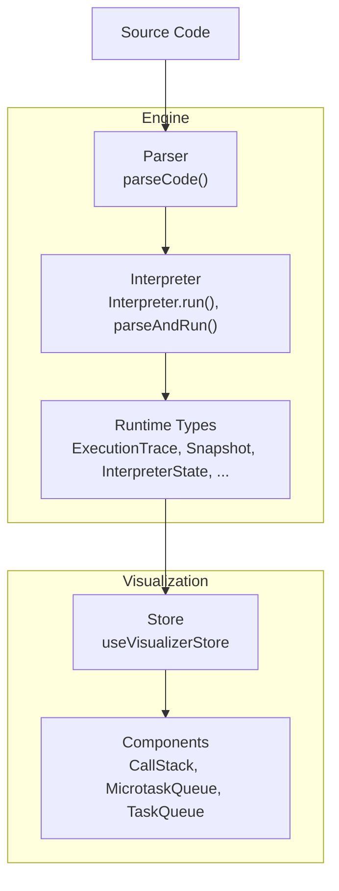
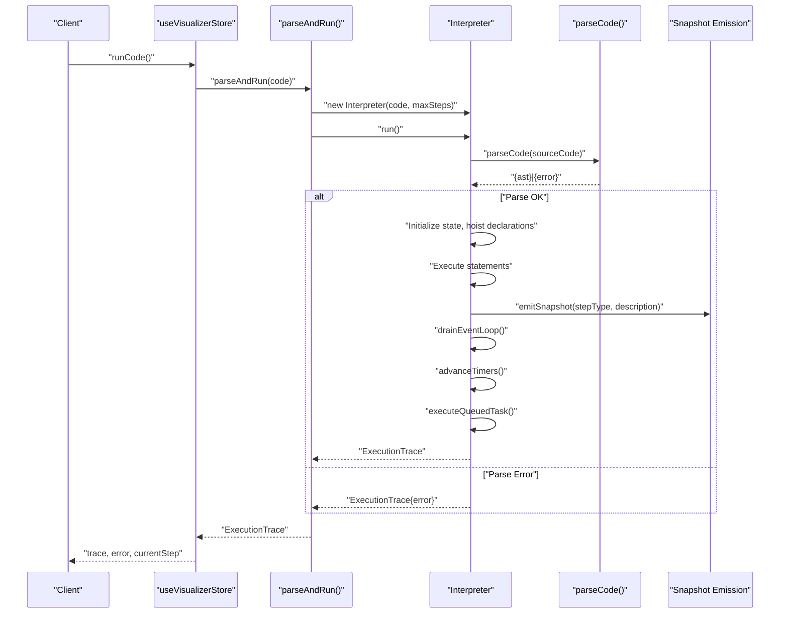
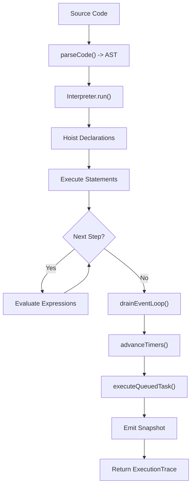
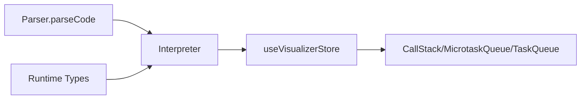

# Engine API

<cite>
**Referenced Files in This Document**
- [index.ts](file://src/engine/index.ts)
- [index.ts](file://src/engine/interpreter/index.ts)
- [types.ts](file://src/engine/runtime/types.ts)
- [index.ts](file://src/engine/parser/index.ts)
- [preprocess.ts](file://src/engine/parser/preprocess.ts)
- [useVisualizerStore.ts](file://src/store/useVisualizerStore.ts)
- [examples/index.ts](file://src/examples/index.ts)
- [CallStack.tsx](file://src/components/visualizer/CallStack.tsx)
- [MicrotaskQueue.tsx](file://src/components/visualizer/MicrotaskQueue.tsx)
- [TaskQueue.tsx](file://src/components/visualizer/TaskQueue.tsx)
</cite>

## Table of Contents
1. [Introduction](#introduction)
2. [Project Structure](#project-structure)
3. [Core Components](#core-components)
4. [Architecture Overview](#architecture-overview)
5. [Detailed Component Analysis](#detailed-component-analysis)
6. [Dependency Analysis](#dependency-analysis)
7. [Performance Considerations](#performance-considerations)
8. [Troubleshooting Guide](#troubleshooting-guide)
9. [Conclusion](#conclusion)
10. [Appendices](#appendices)

## Introduction
This document provides comprehensive API documentation for the JavaScript engine interface used by the visualization system. It focuses on the parseAndRun function, the execution model, and the exported runtime types that represent interpreter state, snapshots, and visualization-ready data structures. It also explains how parsed AST nodes relate to runtime execution states and how the engine integrates with the visualization components.

## Project Structure
The engine is organized into three primary areas:
- Parser: Converts source code into an ESTree AST and handles parsing errors.
- Interpreter: Executes the AST, maintains interpreter state, and produces snapshots at each step.
- Runtime Types: Defines the shared types used across the engine and visualization.

**Diagram sources**
- [index.ts:1-17](file://src/engine/index.ts#L1-L17)
- [index.ts:1361-1364](file://src/engine/interpreter/index.ts#L1361-L1364)
- [types.ts:183-240](file://src/engine/runtime/types.ts#L183-L240)
- [index.ts:5-24](file://src/engine/parser/index.ts#L5-L24)
- [useVisualizerStore.ts:1-109](file://src/store/useVisualizerStore.ts#L1-L109)

**Section sources**
- [index.ts:1-17](file://src/engine/index.ts#L1-L17)
- [index.ts:1361-1364](file://src/engine/interpreter/index.ts#L1361-L1364)
- [types.ts:183-240](file://src/engine/runtime/types.ts#L183-L240)
- [index.ts:5-24](file://src/engine/parser/index.ts#L5-L24)

## Core Components
- parseAndRun: Public entry point that parses source code and executes it, returning an ExecutionTrace with snapshots and error metadata.
- Interpreter: Internal class orchestrating parsing, execution, event loop, and snapshot emission.
- Runtime Types: Shared type definitions for values, environments, queues, promises, web APIs, snapshots, and execution traces.

Key exports are re-exported from the engine index for convenient consumption by the visualization store and components.

**Section sources**
- [index.ts:1-17](file://src/engine/index.ts#L1-L17)
- [index.ts:1361-1364](file://src/engine/interpreter/index.ts#L1361-L1364)
- [types.ts:3-240](file://src/engine/runtime/types.ts#L3-L240)

## Architecture Overview
The engine follows a deterministic execution model:
- Source code is parsed into an AST.
- A global environment is created and hoisted declarations are processed.
- The interpreter executes statements and expressions, emitting snapshots at each significant step.
- The event loop drains microtasks, advances timers, and executes macrotasks until idle.
- The store consumes ExecutionTrace to drive the visualization panels.

**Diagram sources**
- [index.ts:75-135](file://src/engine/interpreter/index.ts#L75-L135)
- [index.ts:1361-1364](file://src/engine/interpreter/index.ts#L1361-L1364)
- [index.ts:5-24](file://src/engine/parser/index.ts#L5-L24)
- [types.ts:226-240](file://src/engine/runtime/types.ts#L226-L240)

## Detailed Component Analysis

### parseAndRun API
- Purpose: Parse and execute JavaScript code, returning a complete execution trace with snapshots and error information.
- Parameters:
  - sourceCode: string
  - maxSteps: number (optional, default 10000)
- Execution flow:
  - Creates an Interpreter with the given source code and step limit.
  - Invokes Interpreter.run(), which parses the code, initializes state, executes statements, and drains the event loop.
  - Emits snapshots for each major step (variable declaration, function call, promise resolution, etc.).
  - Returns an ExecutionTrace containing sourceCode, snapshots, totalSteps, and error metadata.
- Return value: ExecutionTrace
- Error handling:
  - If parsing fails, returns ExecutionTrace with error metadata and empty snapshots.
  - If runtime errors occur during execution, captures error message and emits a snapshot indicating runtime-error.
  - Throws if maximum steps exceeded to prevent infinite loops.
- Usage example (conceptual):
  - Call parseAndRun(code) from the store action runCode().
  - Use trace.error to display parsing/runtime errors.
  - Iterate trace.snapshots to render visualization panels.

**Section sources**
- [index.ts:1361-1364](file://src/engine/interpreter/index.ts#L1361-L1364)
- [index.ts:75-135](file://src/engine/interpreter/index.ts#L75-L135)
- [types.ts:235-240](file://src/engine/runtime/types.ts#L235-L240)

### ExecutionTrace
- Description: Encapsulates the entire execution result.
- Fields:
  - sourceCode: string
  - snapshots: Snapshot[]
  - totalSteps: number
  - error: { message: string; line?: number } | null

**Section sources**
- [types.ts:235-240](file://src/engine/runtime/types.ts#L235-L240)

### Snapshot
- Description: A single moment in execution captured as a deep clone of the interpreter state plus metadata.
- Fields:
  - index: number
  - stepType: StepType
  - description: string
  - state: InterpreterState

**Section sources**
- [types.ts:226-231](file://src/engine/runtime/types.ts#L226-L231)

### StepType
- Description: Enumerated step categories emitted during execution.
- Values include program lifecycle, variable operations, function calls/returns, expression evaluation, console logs, Web API registrations, promise lifecycle, microtask/macrotask enqueue/dequeue, event loop checks, await suspension/resumption, and runtime errors.

**Section sources**
- [types.ts:199-224](file://src/engine/runtime/types.ts#L199-L224)

### InterpreterState
- Description: Complete runtime state at a given time.
- Fields:
  - callStack: StackFrame[]
  - environments: Record<string, Environment>
  - functions: Record<string, FunctionValue>
  - promises: Record<string, SimPromise>
  - taskQueue: QueuedTask[]
  - microtaskQueue: QueuedTask[]
  - webApis: WebApiState
  - eventLoopPhase: EventLoopPhase
  - virtualClock: number
  - consoleOutput: ConsoleEntry[]
  - highlightedLine: number | null

**Section sources**
- [types.ts:183-195](file://src/engine/runtime/types.ts#L183-L195)

### StackFrame
- Description: Represents a function invocation on the call stack.
- Fields:
  - id: string
  - label: string
  - functionId: string | null
  - envId: string
  - line: number | null

**Section sources**
- [types.ts:102-108](file://src/engine/runtime/types.ts#L102-L108)

### Environment and Binding
- Description: Lexical scoping model with bindings.
- Fields:
  - Environment: id, label, parentId, bindings
  - Binding: name, value, kind, mutable, tdz

**Section sources**
- [types.ts:72-85](file://src/engine/runtime/types.ts#L72-L85)

### FunctionValue
- Description: Stored representation of a function with metadata.
- Fields:
  - id, name, params, bodyNodeIndex, closureEnvId, isAsync, isArrow, node

**Section sources**
- [types.ts:89-98](file://src/engine/runtime/types.ts#L89-L98)

### QueuedTask
- Description: A scheduled callback for the event loop.
- Fields:
  - id, label, callbackFunctionId, args

**Section sources**
- [types.ts:112-117](file://src/engine/runtime/types.ts#L112-L117)

### SimPromise and ThenHandler
- Description: Simplified promise model for simulation.
- Fields:
  - SimPromise: id, state, value, reason, thenHandlers, label
  - ThenHandler: onFulfilled, onRejected, resultPromiseId

**Section sources**
- [types.ts:147-160](file://src/engine/runtime/types.ts#L147-L160)

### WebApiTimer and WebApiFetch
- Description: Simulated Web APIs tracked by the interpreter.
- Fields:
  - WebApiTimer: id, type, callbackFunctionId, delay, registeredAt, firesAt, label
  - WebApiFetch: id, url, promiseId, registeredAt, completesAt, label

**Section sources**
- [types.ts:121-138](file://src/engine/runtime/types.ts#L121-L138)

### ConsoleEntry
- Description: Console output entries.
- Fields:
  - id, text, type

**Section sources**
- [types.ts:175-179](file://src/engine/runtime/types.ts#L175-L179)

### RuntimeValue and Helpers
- Description: Primitive and composite runtime values with helpers.
- Types:
  - RuntimeValue union: undefined, null, number, string, boolean, function, promise, object, array
- Helpers:
  - makeNumber, makeString, makeBool
  - runtimeToString, runtimeToJS
  - isTruthy

**Section sources**
- [types.ts:3-68](file://src/engine/runtime/types.ts#L3-L68)

### EventLoopPhase
- Description: Current phase of the event loop.
- Values: idle, executing-sync, checking-microtasks, executing-microtask, checking-macrotasks, executing-macrotask, advancing-timers

**Section sources**
- [types.ts:164-171](file://src/engine/runtime/types.ts#L164-L171)

### Relationship Between AST Nodes and Runtime Execution States
- Parsing: parseCode converts source to ESTree with locations and ranges.
- Hoisting: Function and var declarations are hoisted into environments before execution.
- Execution: Statements and expressions are evaluated, updating environments, call stack, queues, and promises.
- Snapshots: Each significant operation emits a snapshot capturing the InterpreterState at that moment.

**Diagram sources**
- [index.ts:5-24](file://src/engine/parser/index.ts#L5-L24)
- [index.ts:75-135](file://src/engine/interpreter/index.ts#L75-L135)
- [index.ts:1198-1254](file://src/engine/interpreter/index.ts#L1198-L1254)
- [index.ts:1256-1312](file://src/engine/interpreter/index.ts#L1256-L1312)
- [types.ts:226-231](file://src/engine/runtime/types.ts#L226-L231)

## Dependency Analysis
- parseAndRun depends on Interpreter and parseCode.
- Interpreter depends on:
  - Runtime types for state and values
  - Parser for AST construction
  - Built-in handling for console, timers, fetch, and Promise
- Visualization store consumes ExecutionTrace and selects current snapshot for rendering.
- Visualization components consume typed data from the store and engine types.

**Diagram sources**
- [index.ts:1361-1364](file://src/engine/interpreter/index.ts#L1361-L1364)
- [index.ts:5-24](file://src/engine/parser/index.ts#L5-L24)
- [types.ts:183-240](file://src/engine/runtime/types.ts#L183-L240)
- [useVisualizerStore.ts:1-109](file://src/store/useVisualizerStore.ts#L1-L109)
- [CallStack.tsx:1-79](file://src/components/visualizer/CallStack.tsx#L1-L79)
- [MicrotaskQueue.tsx:1-41](file://src/components/visualizer/MicrotaskQueue.tsx#L1-L41)
- [TaskQueue.tsx:1-41](file://src/components/visualizer/TaskQueue.tsx#L1-L41)

**Section sources**
- [index.ts:1361-1364](file://src/engine/interpreter/index.ts#L1361-L1364)
- [index.ts:5-24](file://src/engine/parser/index.ts#L5-L24)
- [types.ts:183-240](file://src/engine/runtime/types.ts#L183-L240)
- [useVisualizerStore.ts:1-109](file://src/store/useVisualizerStore.ts#L1-L109)

## Performance Considerations
- Step limits: The interpreter enforces a maximum step count to prevent infinite loops and long-running executions.
- Loop safety: While loops and for loops include iteration counters to guard against excessive iterations.
- Event loop bounds: The event loop drains microtasks and advances timers with safeguards to avoid unbounded cycles.
- Snapshot overhead: Each snapshot clones the interpreter state; consider reducing maxSteps or limiting snapshot frequency for very large programs.

[No sources needed since this section provides general guidance]

## Troubleshooting Guide
Common scenarios:
- Parsing errors: parseCode returns an error object with message and line/column. ExecutionTrace.error reflects this.
- Runtime errors: Caught during execution; the interpreter sets error metadata and emits a runtime-error snapshot.
- Infinite loops: Detected by step counter and loop iteration guards; throws to terminate execution.
- Maximum steps exceeded: Thrown when exceeding maxSteps configured in parseAndRun.

Integration tips:
- Use trace.error to display user-friendly messages in the UI.
- Use trace.snapshots to drive step-by-step visualization.
- Use store actions to control playback and reset state.

**Section sources**
- [index.ts:14-24](file://src/engine/parser/index.ts#L14-L24)
- [index.ts:120-127](file://src/engine/interpreter/index.ts#L120-L127)
- [index.ts:140-142](file://src/engine/interpreter/index.ts#L140-L142)
- [index.ts:372-373](file://src/engine/interpreter/index.ts#L372-L373)
- [index.ts:399-401](file://src/engine/interpreter/index.ts#L399-L401)

## Conclusion
The Engine API provides a deterministic, snapshot-driven execution model suitable for visualization. parseAndRun offers a simple entry point, while the runtime types and snapshots expose the interpreter state needed to render call stacks, queues, promises, and Web APIs. The visualization store and components integrate seamlessly with the engine’s ExecutionTrace to deliver an interactive learning experience.

[No sources needed since this section summarizes without analyzing specific files]

## Appendices

### Integration Patterns with Visualization System
- Store usage:
  - runCode calls parseAndRun and updates trace, currentStep, and error.
  - Playback actions step forward/backward, jump to step, play/pause/reset.
- Component usage:
  - CallStack renders InterpreterState.callStack.
  - MicrotaskQueue and TaskQueue render InterpreterState.microtaskQueue and InterpreterState.taskQueue.
  - Panels use current snapshot’s state to reflect interpreter progress.

**Section sources**
- [useVisualizerStore.ts:37-97](file://src/store/useVisualizerStore.ts#L37-L97)
- [CallStack.tsx:12-78](file://src/components/visualizer/CallStack.tsx#L12-L78)
- [MicrotaskQueue.tsx:12-40](file://src/components/visualizer/MicrotaskQueue.tsx#L12-L40)
- [TaskQueue.tsx:12-40](file://src/components/visualizer/TaskQueue.tsx#L12-L40)

### Example Usage References
- Examples demonstrate typical constructs (setTimeout, Promise, closures, nested timers) suitable for visualization.
- The store loads examples and runs them via parseAndRun.

**Section sources**
- [examples/index.ts:8-152](file://src/examples/index.ts#L8-L152)
- [useVisualizerStore.ts:92-97](file://src/store/useVisualizerStore.ts#L92-L97)