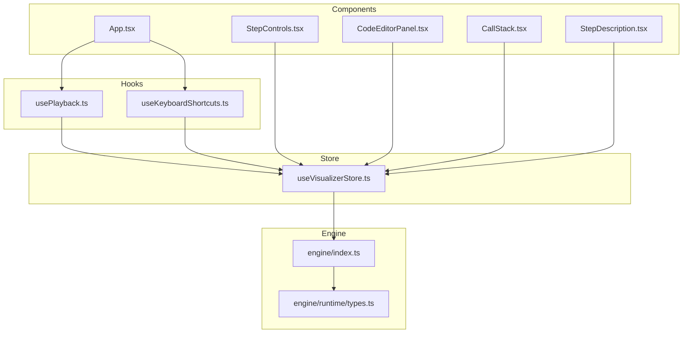
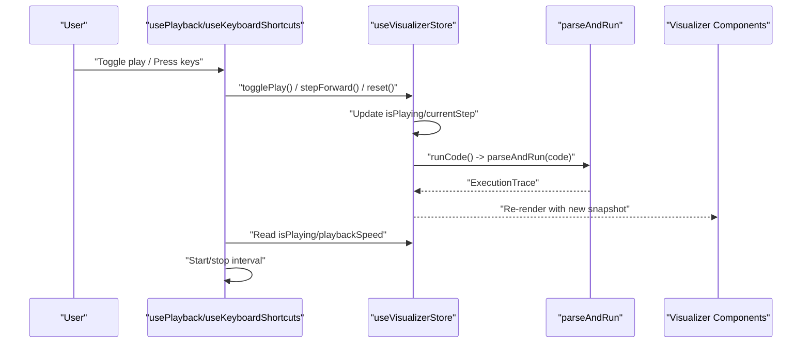
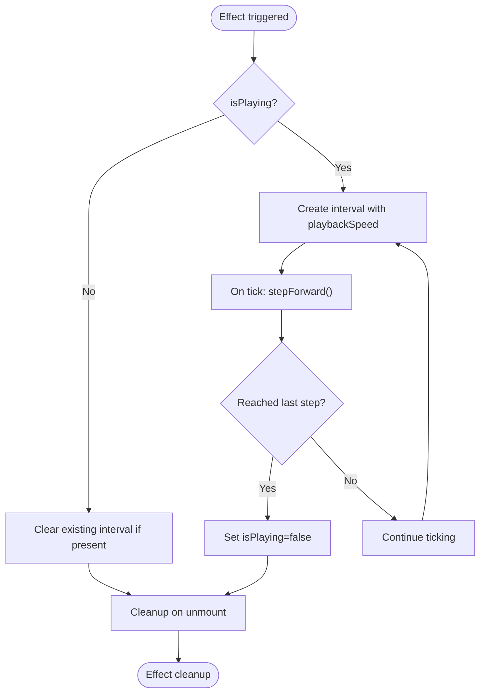
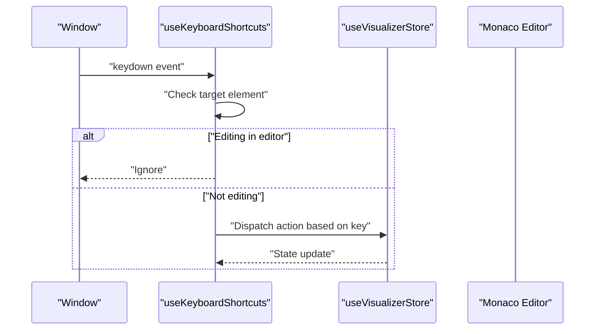
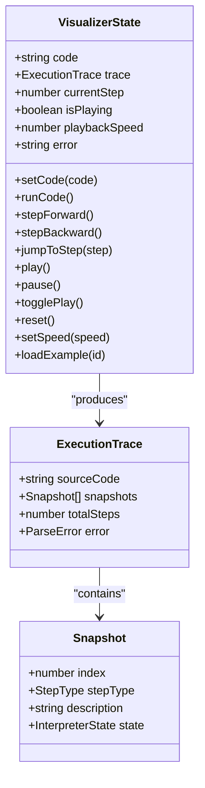
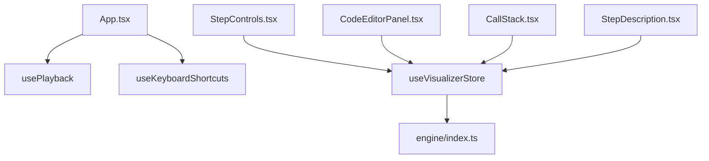
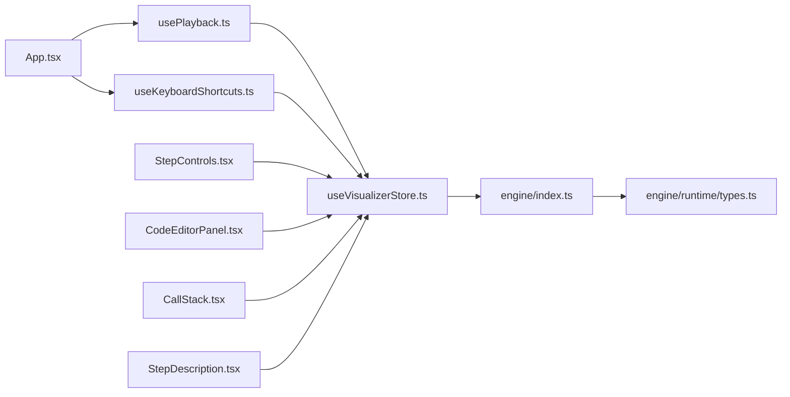

# Hook API

<cite>
**Referenced Files in This Document**
- [usePlayback.ts](file://src/hooks/usePlayback.ts)
- [useVisualizerStore.ts](file://src/store/useVisualizerStore.ts)
- [index.ts](file://src/engine/index.ts)
- [types.ts](file://src/engine/runtime/types.ts)
- [App.tsx](file://src/App.tsx)
- [StepControls.tsx](file://src/components/controls/StepControls.tsx)
- [CodeEditorPanel.tsx](file://src/components/editor/CodeEditorPanel.tsx)
- [CallStack.tsx](file://src/components/visualizer/CallStack.tsx)
- [StepDescription.tsx](file://src/components/controls/StepDescription.tsx)
- [index.ts](file://src/examples/index.ts)
- [package.json](file://package.json)
</cite>

## Table of Contents
1. [Introduction](#introduction)
2. [Project Structure](#project-structure)
3. [Core Components](#core-components)
4. [Architecture Overview](#architecture-overview)
5. [Detailed Component Analysis](#detailed-component-analysis)
6. [Dependency Analysis](#dependency-analysis)
7. [Performance Considerations](#performance-considerations)
8. [Troubleshooting Guide](#troubleshooting-guide)
9. [Conclusion](#conclusion)
10. [Appendices](#appendices)

## Introduction
This document provides comprehensive documentation for the custom React hooks used in the JavaScript Visualizer application. It focuses on the playback and keyboard shortcut hooks, detailing their parameters, return values, state management, side effects, and integration with the store and engine systems. It also covers usage patterns, performance optimizations, and best practices for consuming these hooks within components.

## Project Structure
The hooks are part of a modular React application that visualizes JavaScript execution traces. The primary hook resides in the hooks module and integrates with a Zustand store that orchestrates the execution trace and playback state. The engine module produces execution traces consumed by the store and visualizer components.

**Diagram sources**
- [usePlayback.ts:1-79](file://src/hooks/usePlayback.ts#L1-L79)
- [useVisualizerStore.ts:1-109](file://src/store/useVisualizerStore.ts#L1-L109)
- [index.ts:1-17](file://src/engine/index.ts#L1-L17)
- [types.ts:1-249](file://src/engine/runtime/types.ts#L1-L249)
- [App.tsx:125-137](file://src/App.tsx#L125-L137)
- [StepControls.tsx:1-208](file://src/components/controls/StepControls.tsx#L1-L208)
- [CodeEditorPanel.tsx:1-162](file://src/components/editor/CodeEditorPanel.tsx#L1-L162)
- [CallStack.tsx:1-79](file://src/components/visualizer/CallStack.tsx#L1-L79)
- [StepDescription.tsx:1-87](file://src/components/controls/StepDescription.tsx#L1-L87)

**Section sources**
- [usePlayback.ts:1-79](file://src/hooks/usePlayback.ts#L1-L79)
- [useVisualizerStore.ts:1-109](file://src/store/useVisualizerStore.ts#L1-L109)
- [App.tsx:125-137](file://src/App.tsx#L125-L137)

## Core Components
This section documents the two primary custom hooks and their roles in the application.

- usePlayback
  - Purpose: Manages automatic playback of execution steps using a timer interval controlled by the store’s playback state and speed.
  - Key behaviors:
    - Starts/stops an interval based on isPlaying.
    - Invokes stepForward on each tick.
    - Clears the interval on unmount and when playback stops.
  - Dependencies: isPlaying, playbackSpeed, stepForward from the store.
  - Side effects: Sets/clears intervals; updates store state indirectly via stepForward.

- useKeyboardShortcuts
  - Purpose: Provides global keyboard shortcuts for stepping through execution, toggling playback, and resetting.
  - Key behaviors:
    - Listens to window keydown events.
    - Prevents default actions for captured keys to avoid conflicts with browser/editor behavior.
    - Ignores keystrokes when editing code in Monaco editor.
    - Supports ArrowRight (step forward), ArrowLeft (step backward), Space (toggle play/pause), and R/r (reset).
  - Dependencies: stepForward, stepBackward, togglePlay, reset, trace from the store.
  - Side effects: Adds/removes a window event listener; calls store actions.

**Section sources**
- [usePlayback.ts:4-28](file://src/hooks/usePlayback.ts#L4-L28)
- [usePlayback.ts:30-78](file://src/hooks/usePlayback.ts#L30-L78)

## Architecture Overview
The hooks integrate with the store to orchestrate playback and user interactions. The store encapsulates the execution trace and current step, while the engine generates the trace from user code. Visualizer components subscribe to the store to render the current state.

**Diagram sources**
- [usePlayback.ts:4-28](file://src/hooks/usePlayback.ts#L4-L28)
- [usePlayback.ts:30-78](file://src/hooks/usePlayback.ts#L30-L78)
- [useVisualizerStore.ts:37-50](file://src/store/useVisualizerStore.ts#L37-L50)
- [index.ts:1-17](file://src/engine/index.ts#L1-L17)
- [App.tsx:125-137](file://src/App.tsx#L125-L137)

## Detailed Component Analysis

### usePlayback Hook
- Parameters: None (consumes store state internally).
- Return values: None (performs side effects).
- State management:
  - Reads isPlaying, playbackSpeed, and stepForward from the store.
  - Uses a ref to track the interval ID for cleanup.
- Side effects:
  - Creates an interval when isPlaying is true.
  - Clears the interval when isPlaying becomes false or on component unmount.
  - Calls stepForward on each tick.
- Dependencies:
  - React: useEffect, useRef, useCallback.
  - Store: isPlaying, playbackSpeed, stepForward.
- Best practices:
  - Keep playbackSpeed in sync with UI controls.
  - Ensure interval is cleared on unmount to prevent memory leaks.

**Diagram sources**
- [usePlayback.ts:10-27](file://src/hooks/usePlayback.ts#L10-L27)
- [useVisualizerStore.ts:52-60](file://src/store/useVisualizerStore.ts#L52-L60)

**Section sources**
- [usePlayback.ts:4-28](file://src/hooks/usePlayback.ts#L4-L28)

### useKeyboardShortcuts Hook
- Parameters: None (consumes store state internally).
- Return values: None (performs side effects).
- State management:
  - Reads stepForward, stepBackward, togglePlay, reset, and trace from the store.
- Side effects:
  - Adds a window keydown listener on mount.
  - Removes the listener on unmount.
  - Prevents default behavior for captured keys.
  - Ignores keystrokes when focused inside Monaco editor or input/textarea elements.
- Dependencies:
  - React: useCallback, useEffect.
  - Store: stepForward, stepBackward, togglePlay, reset, trace.
- Best practices:
  - Ensure trace is non-null before handling keys.
  - Avoid capturing keys during editor input to prevent interfering with typing.

**Diagram sources**
- [usePlayback.ts:30-78](file://src/hooks/usePlayback.ts#L30-L78)
- [CodeEditorPanel.tsx:40-49](file://src/components/editor/CodeEditorPanel.tsx#L40-L49)

**Section sources**
- [usePlayback.ts:30-78](file://src/hooks/usePlayback.ts#L30-L78)

### Store Integration and Engine Relationship
- Store responsibilities:
  - Holds code, trace, currentStep, isPlaying, playbackSpeed, and error state.
  - Provides actions: setCode, runCode, stepForward, stepBackward, jumpToStep, play, pause, togglePlay, reset, setSpeed, loadExample.
  - Exposes selectors for efficient re-renders: selectCurrentSnapshot, selectCurrentStep, selectTotalSteps.
- Engine integration:
  - runCode calls parseAndRun(code) to produce an ExecutionTrace.
  - ExecutionTrace contains snapshots and totalSteps used by the UI.
- Visualizer components:
  - Subscribe to store via selectors to render current snapshot and step counters.
  - StepControls and StepDescription consume store state to provide interactive playback and contextual descriptions.

**Diagram sources**
- [useVisualizerStore.ts:5-25](file://src/store/useVisualizerStore.ts#L5-L25)
- [useVisualizerStore.ts:27-98](file://src/store/useVisualizerStore.ts#L27-L98)
- [types.ts:235-240](file://src/engine/runtime/types.ts#L235-L240)
- [types.ts:226-231](file://src/engine/runtime/types.ts#L226-L231)

**Section sources**
- [useVisualizerStore.ts:1-109](file://src/store/useVisualizerStore.ts#L1-L109)
- [index.ts:1-17](file://src/engine/index.ts#L1-L17)
- [types.ts:183-195](file://src/engine/runtime/types.ts#L183-L195)

### Component Integration Patterns
- App initialization:
  - App mounts both hooks to enable playback and keyboard shortcuts globally.
- StepControls:
  - Consumes store state to render buttons and progress bar.
  - Provides speed controls and step navigation.
- CodeEditorPanel:
  - Integrates with Monaco editor and store to manage code editing and execution lifecycle.
- Visualizer components:
  - CallStack and others subscribe to store via selectors to render current interpreter state.

**Diagram sources**
- [App.tsx:125-137](file://src/App.tsx#L125-L137)
- [StepControls.tsx:13-24](file://src/components/controls/StepControls.tsx#L13-L24)
- [CodeEditorPanel.tsx:9-17](file://src/components/editor/CodeEditorPanel.tsx#L9-L17)
- [CallStack.tsx:12-10](file://src/components/visualizer/CallStack.tsx#L12-L10)
- [StepDescription.tsx:37-86](file://src/components/controls/StepDescription.tsx#L37-L86)
- [useVisualizerStore.ts:100-108](file://src/store/useVisualizerStore.ts#L100-L108)

**Section sources**
- [App.tsx:125-137](file://src/App.tsx#L125-L137)
- [StepControls.tsx:13-24](file://src/components/controls/StepControls.tsx#L13-L24)
- [CodeEditorPanel.tsx:9-17](file://src/components/editor/CodeEditorPanel.tsx#L9-L17)

## Dependency Analysis
- Internal dependencies:
  - usePlayback depends on useVisualizerStore for playback state and step actions.
  - useKeyboardShortcuts depends on useVisualizerStore for step actions and trace state.
  - App consumes both hooks to enable playback and keyboard controls.
- External dependencies:
  - Zustand for state management.
  - Monaco Editor for code editing.
  - Motion for animations.
  - Lucide icons for UI controls.
- Potential circular dependencies:
  - None observed; hooks depend on store, store depends on engine, components depend on store.

**Diagram sources**
- [usePlayback.ts:1-2](file://src/hooks/usePlayback.ts#L1-L2)
- [useVisualizerStore.ts:1-3](file://src/store/useVisualizerStore.ts#L1-L3)
- [App.tsx:13-14](file://src/App.tsx#L13-L14)
- [index.ts:1-1](file://src/engine/index.ts#L1-L1)
- [types.ts:1-1](file://src/engine/runtime/types.ts#L1-L1)
- [StepControls.tsx:4-4](file://src/components/controls/StepControls.tsx#L4-L4)
- [CodeEditorPanel.tsx:6-6](file://src/components/editor/CodeEditorPanel.tsx#L6-L6)
- [CallStack.tsx:6-6](file://src/components/visualizer/CallStack.tsx#L6-L6)
- [StepDescription.tsx:4-4](file://src/components/controls/StepDescription.tsx#L4-L4)

**Section sources**
- [package.json:12-22](file://package.json#L12-L22)

## Performance Considerations
- Selector primitives:
  - Use primitive selectors (selectCurrentStep, selectTotalSteps) to avoid unnecessary re-renders.
- Interval management:
  - Ensure intervals are cleared on unmount and when playback stops to prevent memory leaks.
- Keyboard event handling:
  - Debounce or throttle key handlers if needed, though the current implementation is lightweight.
- Rendering optimization:
  - Components should rely on selectors to minimize re-renders when unrelated store state changes occur.

[No sources needed since this section provides general guidance]

## Troubleshooting Guide
- Playback does not start:
  - Verify isPlaying is true and playbackSpeed is a positive number.
  - Confirm stepForward is callable and trace exists.
- Keyboard shortcuts not working:
  - Ensure trace is non-null and the focus is not inside an editor input.
  - Check that the window keydown listener is attached and not removed prematurely.
- Steps not advancing:
  - Confirm currentStep is less than totalSteps before calling stepForward.
  - Verify togglePlay resets to step 0 when at the end of the trace.
- Editor input conflicts:
  - The hooks intentionally ignore keystrokes when editing to avoid interfering with typing.

**Section sources**
- [usePlayback.ts:10-27](file://src/hooks/usePlayback.ts#L10-L27)
- [usePlayback.ts:37-72](file://src/hooks/usePlayback.ts#L37-L72)
- [useVisualizerStore.ts:52-86](file://src/store/useVisualizerStore.ts#L52-L86)
- [CodeEditorPanel.tsx:40-49](file://src/components/editor/CodeEditorPanel.tsx#L40-L49)

## Conclusion
The custom hooks provide a clean separation of concerns for playback and keyboard interaction, delegating state management to the store and relying on the engine for execution traces. Their integration with visualizer components enables an intuitive, responsive user experience. Following the best practices outlined here ensures predictable behavior, optimal performance, and maintainable code.

[No sources needed since this section summarizes without analyzing specific files]

## Appendices

### Usage Examples and Best Practices
- Consuming usePlayback:
  - Mount the hook in App to enable automatic playback globally.
  - Pair with StepControls for manual overrides and speed adjustments.
- Consuming useKeyboardShortcuts:
  - Mount the hook in App to enable global keyboard controls.
  - Ensure trace is non-null before handling keys.
- Integration with visualizer components:
  - Use selectors to subscribe to current snapshot and step counts.
  - Render contextual descriptions and call stacks based on the current snapshot.
- Performance tips:
  - Prefer primitive selectors to reduce re-renders.
  - Clean up intervals and event listeners in useEffect return functions.
  - Avoid heavy computations in hooks; delegate to store actions and engine.

**Section sources**
- [App.tsx:125-137](file://src/App.tsx#L125-L137)
- [StepControls.tsx:13-24](file://src/components/controls/StepControls.tsx#L13-L24)
- [useVisualizerStore.ts:100-108](file://src/store/useVisualizerStore.ts#L100-L108)
- [CallStack.tsx:12-10](file://src/components/visualizer/CallStack.tsx#L12-L10)
- [StepDescription.tsx:37-86](file://src/components/controls/StepDescription.tsx#L37-L86)