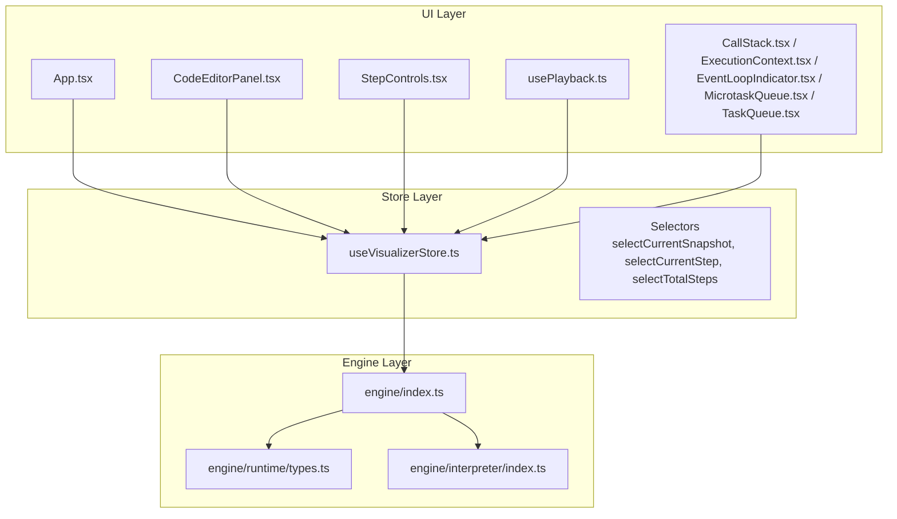
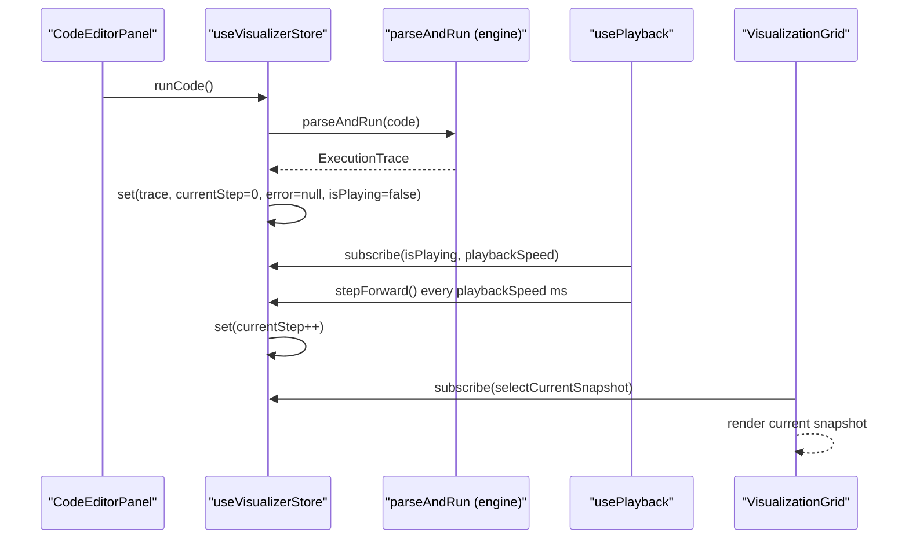
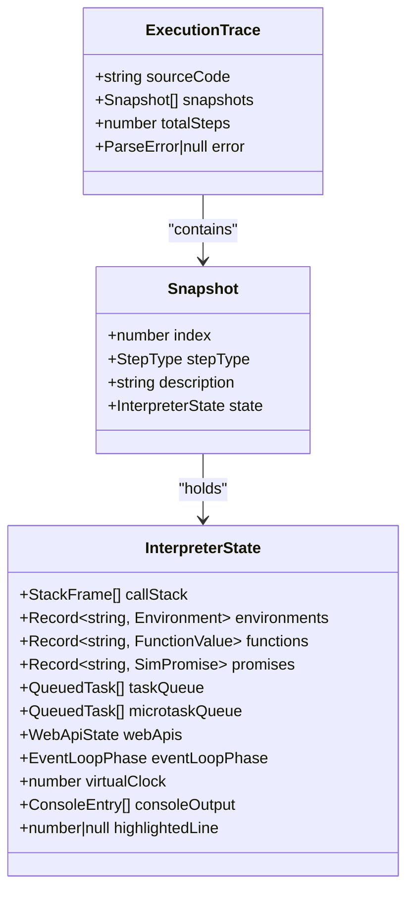
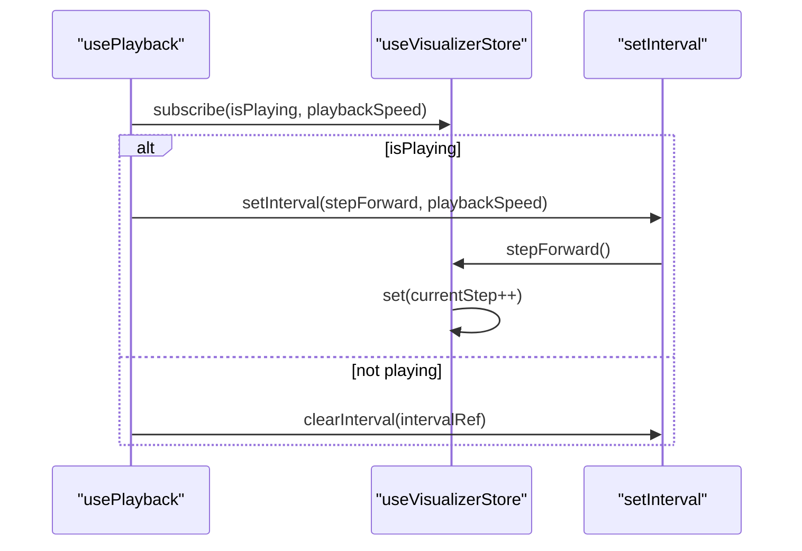
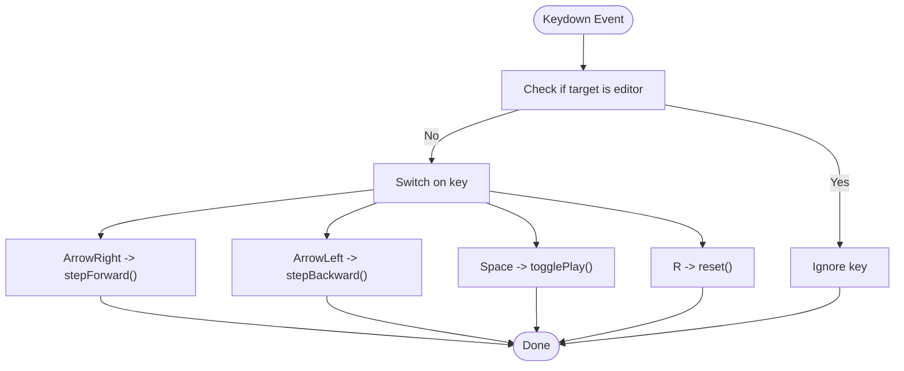
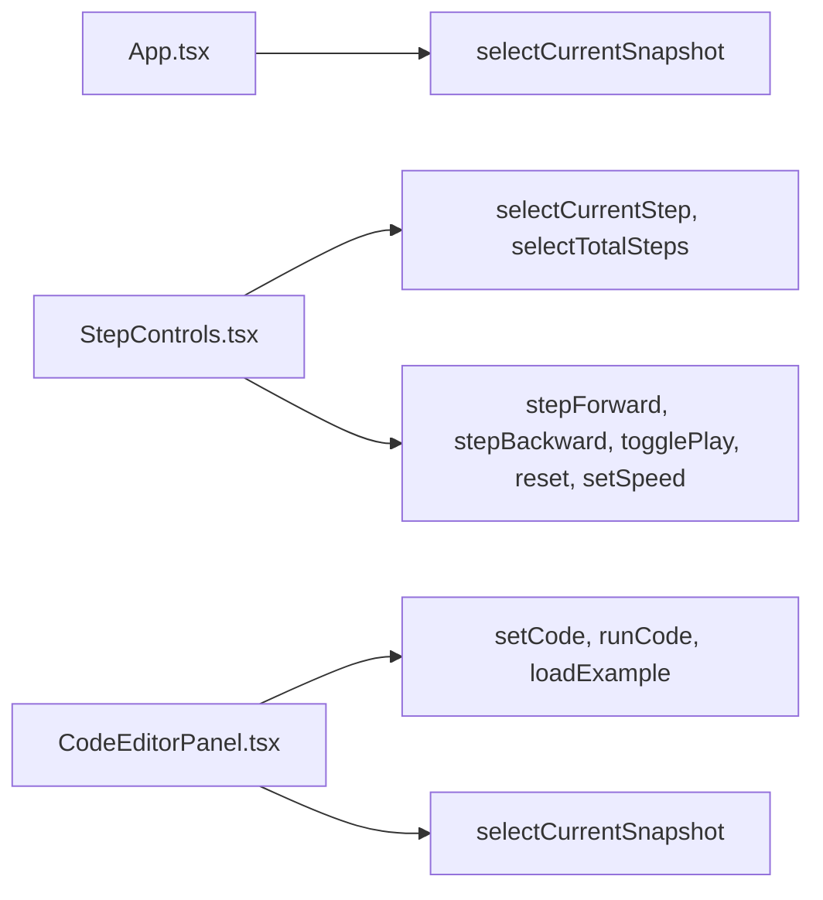
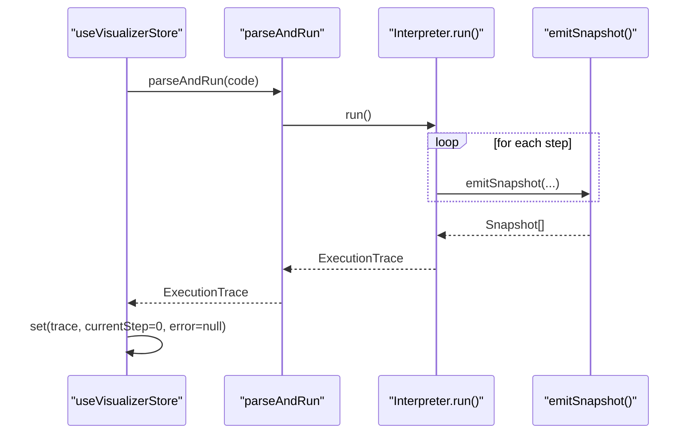
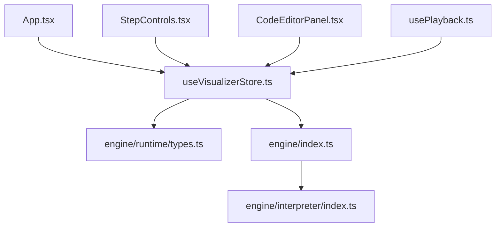

# Store API

<cite>
**Referenced Files in This Document**
- [useVisualizerStore.ts](file://src/store/useVisualizerStore.ts)
- [types.ts](file://src/engine/runtime/types.ts)
- [index.ts](file://src/engine/index.ts)
- [usePlayback.ts](file://src/hooks/usePlayback.ts)
- [App.tsx](file://src/App.tsx)
- [StepControls.tsx](file://src/components/controls/StepControls.tsx)
- [CodeEditorPanel.tsx](file://src/components/editor/CodeEditorPanel.tsx)
- [CallStack.tsx](file://src/components/visualizer/CallStack.tsx)
- [ExecutionContext.tsx](file://src/components/visualizer/ExecutionContext.tsx)
- [EventLoopIndicator.tsx](file://src/components/visualizer/EventLoopIndicator.tsx)
- [MicrotaskQueue.tsx](file://src/components/visualizer/MicrotaskQueue.tsx)
- [TaskQueue.tsx](file://src/components/visualizer/TaskQueue.tsx)
- [index.ts](file://src/engine/interpreter/index.ts)
- [index.ts](file://src/examples/index.ts)
</cite>

## Table of Contents
1. [Introduction](#introduction)
2. [Project Structure](#project-structure)
3. [Core Components](#core-components)
4. [Architecture Overview](#architecture-overview)
5. [Detailed Component Analysis](#detailed-component-analysis)
6. [Dependency Analysis](#dependency-analysis)
7. [Performance Considerations](#performance-considerations)
8. [Troubleshooting Guide](#troubleshooting-guide)
9. [Conclusion](#conclusion)
10. [Appendices](#appendices)

## Introduction
This document provides comprehensive API documentation for the Zustand store used by the JS Visualizer application. It covers the complete state shape, selectors, action dispatchers, subscription mechanisms, and state update patterns. It also explains how the store integrates with the engine to produce execution traces, how playback works, and how React components subscribe to and consume the store. Best practices for performance and state normalization are included.

## Project Structure
The store is implemented as a single Zustand store module and is consumed by multiple UI components and hooks. The engine produces execution traces that drive the store’s state.

**Diagram sources**
- [useVisualizerStore.ts:1-109](file://src/store/useVisualizerStore.ts#L1-L109)
- [types.ts:183-240](file://src/engine/runtime/types.ts#L183-L240)
- [index.ts:1-17](file://src/engine/index.ts#L1-L17)
- [index.ts:75-135](file://src/engine/interpreter/index.ts#L75-L135)
- [App.tsx:13-137](file://src/App.tsx#L13-L137)
- [CodeEditorPanel.tsx:9-161](file://src/components/editor/CodeEditorPanel.tsx#L9-L161)
- [StepControls.tsx:13-207](file://src/components/controls/StepControls.tsx#L13-L207)
- [usePlayback.ts:4-28](file://src/hooks/usePlayback.ts#L4-L28)

**Section sources**
- [useVisualizerStore.ts:1-109](file://src/store/useVisualizerStore.ts#L1-L109)
- [types.ts:183-240](file://src/engine/runtime/types.ts#L183-L240)
- [index.ts:1-17](file://src/engine/index.ts#L1-L17)
- [index.ts:75-135](file://src/engine/interpreter/index.ts#L75-L135)
- [App.tsx:13-137](file://src/App.tsx#L13-L137)
- [CodeEditorPanel.tsx:9-161](file://src/components/editor/CodeEditorPanel.tsx#L9-L161)
- [StepControls.tsx:13-207](file://src/components/controls/StepControls.tsx#L13-L207)
- [usePlayback.ts:4-28](file://src/hooks/usePlayback.ts#L4-L28)

## Core Components
This section documents the store’s state shape, selectors, and actions.

- State shape
  - code: string
  - trace: ExecutionTrace | null
  - currentStep: number
  - isPlaying: boolean
  - playbackSpeed: number (milliseconds per step)
  - error: string | null

- Selectors
  - selectCurrentSnapshot(state): Snapshot | null
  - selectCurrentStep(state): number
  - selectTotalSteps(state): number

- Action dispatchers
  - setCode(code: string): void
  - runCode(): void
  - stepForward(): void
  - stepBackward(): void
  - jumpToStep(step: number): void
  - play(): void
  - pause(): void
  - togglePlay(): void
  - reset(): void
  - setSpeed(speed: number): void
  - loadExample(id: string): void

- Subscription mechanisms
  - Components subscribe using selector functions passed to the store hook.
  - Primitive selectors (e.g., selectCurrentStep, selectTotalSteps) avoid unnecessary re-renders by returning primitives.

- State update patterns
  - Actions update the state immutably using Zustand’s set function.
  - runCode parses and executes code, producing an ExecutionTrace and updating currentStep and error accordingly.
  - Playback toggles isPlaying and relies on a hook to advance steps at intervals.

**Section sources**
- [useVisualizerStore.ts:5-25](file://src/store/useVisualizerStore.ts#L5-L25)
- [useVisualizerStore.ts:100-109](file://src/store/useVisualizerStore.ts#L100-L109)
- [useVisualizerStore.ts:27-98](file://src/store/useVisualizerStore.ts#L27-L98)

## Architecture Overview
The store orchestrates the visualization pipeline:
- UI triggers runCode via the editor panel.
- The engine parses and executes the code, emitting snapshots at each step.
- The store receives the ExecutionTrace and updates currentStep and error.
- A playback hook advances currentStep automatically when isPlaying is true.
- UI components subscribe to the store to render the current snapshot and playback controls.

**Diagram sources**
- [CodeEditorPanel.tsx:100-122](file://src/components/editor/CodeEditorPanel.tsx#L100-L122)
- [useVisualizerStore.ts:37-50](file://src/store/useVisualizerStore.ts#L37-L50)
- [index.ts:1](file://src/engine/index.ts#L1)
- [usePlayback.ts:10-27](file://src/hooks/usePlayback.ts#L10-L27)
- [useVisualizerStore.ts:52-67](file://src/store/useVisualizerStore.ts#L52-L67)
- [App.tsx:17-107](file://src/App.tsx#L17-L107)

## Detailed Component Analysis

### Store API Reference
- State shape
  - code: string
  - trace: ExecutionTrace | null
  - currentStep: number
  - isPlaying: boolean
  - playbackSpeed: number
  - error: string | null

- Selectors
  - selectCurrentSnapshot(state): Snapshot | null
  - selectCurrentStep(state): number
  - selectTotalSteps(state): number

- Action dispatchers
  - setCode(code: string): void
  - runCode(): void
  - stepForward(): void
  - stepBackward(): void
  - jumpToStep(step: number): void
  - play(): void
  - pause(): void
  - togglePlay(): void
  - reset(): void
  - setSpeed(speed: number): void
  - loadExample(id: string): void

- Behavior notes
  - runCode parses and executes code, sets trace and error, resets playback state.
  - togglePlay handles end-of-trace behavior by resetting to step 0 when starting playback from the end.
  - jumpToStep clamps the target step to valid bounds.
  - loadExample replaces code and clears trace/playback state.

**Section sources**
- [useVisualizerStore.ts:5-25](file://src/store/useVisualizerStore.ts#L5-L25)
- [useVisualizerStore.ts:100-109](file://src/store/useVisualizerStore.ts#L100-L109)
- [useVisualizerStore.ts:27-98](file://src/store/useVisualizerStore.ts#L27-L98)

### State Model and Execution Traces
The store consumes ExecutionTrace objects produced by the engine. These define the complete history of execution snapshots.

**Diagram sources**
- [types.ts:235-240](file://src/engine/runtime/types.ts#L235-L240)
- [types.ts:226-231](file://src/engine/runtime/types.ts#L226-L231)
- [types.ts:183-195](file://src/engine/runtime/types.ts#L183-L195)

**Section sources**
- [types.ts:235-240](file://src/engine/runtime/types.ts#L235-L240)
- [types.ts:226-231](file://src/engine/runtime/types.ts#L226-L231)
- [types.ts:183-195](file://src/engine/runtime/types.ts#L183-L195)

### Playback Mechanism
The playback hook manages automatic stepping based on isPlaying and playbackSpeed.

**Diagram sources**
- [usePlayback.ts:4-28](file://src/hooks/usePlayback.ts#L4-L28)
- [useVisualizerStore.ts:75-86](file://src/store/useVisualizerStore.ts#L75-L86)

**Section sources**
- [usePlayback.ts:4-28](file://src/hooks/usePlayback.ts#L4-L28)
- [useVisualizerStore.ts:75-86](file://src/store/useVisualizerStore.ts#L75-L86)

### Keyboard Shortcuts Integration
The keyboard shortcuts hook listens to global keydown events and dispatches store actions when not editing code.

**Diagram sources**
- [usePlayback.ts:30-78](file://src/hooks/usePlayback.ts#L30-L78)
- [useVisualizerStore.ts:52-88](file://src/store/useVisualizerStore.ts#L52-L88)

**Section sources**
- [usePlayback.ts:30-78](file://src/hooks/usePlayback.ts#L30-L78)
- [useVisualizerStore.ts:52-88](file://src/store/useVisualizerStore.ts#L52-L88)

### UI Integration Patterns
- App subscribes to selectCurrentSnapshot to render the visualization grid when a trace and snapshot are available.
- StepControls subscribes to trace, isPlaying, playbackSpeed, and selectors for current and total steps to render controls and progress.
- CodeEditorPanel subscribes to code, setCode, runCode, loadExample, trace, error, and selectCurrentSnapshot to manage editing, running, and highlighting.

**Diagram sources**
- [App.tsx:17-107](file://src/App.tsx#L17-L107)
- [StepControls.tsx:13-207](file://src/components/controls/StepControls.tsx#L13-L207)
- [CodeEditorPanel.tsx:9-161](file://src/components/editor/CodeEditorPanel.tsx#L9-L161)

**Section sources**
- [App.tsx:17-107](file://src/App.tsx#L17-L107)
- [StepControls.tsx:13-207](file://src/components/controls/StepControls.tsx#L13-L207)
- [CodeEditorPanel.tsx:9-161](file://src/components/editor/CodeEditorPanel.tsx#L9-L161)

### Engine Integration
The store delegates code parsing and execution to the engine. The interpreter emits snapshots and returns an ExecutionTrace.

**Diagram sources**
- [useVisualizerStore.ts:37-50](file://src/store/useVisualizerStore.ts#L37-L50)
- [index.ts:1](file://src/engine/index.ts#L1)
- [index.ts:75-135](file://src/engine/interpreter/index.ts#L75-L135)
- [index.ts:139-150](file://src/engine/interpreter/index.ts#L139-L150)

**Section sources**
- [useVisualizerStore.ts:37-50](file://src/store/useVisualizerStore.ts#L37-L50)
- [index.ts:1](file://src/engine/index.ts#L1)
- [index.ts:75-135](file://src/engine/interpreter/index.ts#L75-L135)
- [index.ts:139-150](file://src/engine/interpreter/index.ts#L139-L150)

## Dependency Analysis
- Store depends on engine runtime types for ExecutionTrace and Snapshot.
- UI components depend on the store for state and actions.
- Playback hook depends on store subscriptions for isPlaying and playbackSpeed.
- The interpreter depends on runtime types and emits snapshots.

**Diagram sources**
- [useVisualizerStore.ts:1-2](file://src/store/useVisualizerStore.ts#L1-L2)
- [types.ts:183-240](file://src/engine/runtime/types.ts#L183-L240)
- [index.ts:1-17](file://src/engine/index.ts#L1-L17)
- [index.ts:75-135](file://src/engine/interpreter/index.ts#L75-L135)
- [App.tsx:13-14](file://src/App.tsx#L13-L14)
- [StepControls.tsx:4](file://src/components/controls/StepControls.tsx#L4)
- [CodeEditorPanel.tsx:6](file://src/components/editor/CodeEditorPanel.tsx#L6)
- [usePlayback.ts:2](file://src/hooks/usePlayback.ts#L2)

**Section sources**
- [useVisualizerStore.ts:1-2](file://src/store/useVisualizerStore.ts#L1-L2)
- [types.ts:183-240](file://src/engine/runtime/types.ts#L183-L240)
- [index.ts:1-17](file://src/engine/index.ts#L1-L17)
- [index.ts:75-135](file://src/engine/interpreter/index.ts#L75-L135)
- [App.tsx:13-14](file://src/App.tsx#L13-L14)
- [StepControls.tsx:4](file://src/components/controls/StepControls.tsx#L4)
- [CodeEditorPanel.tsx:6](file://src/components/editor/CodeEditorPanel.tsx#L6)
- [usePlayback.ts:2](file://src/hooks/usePlayback.ts#L2)

## Performance Considerations
- Prefer primitive selectors for frequently accessed scalars to minimize re-renders.
  - Use selectCurrentStep and selectTotalSteps to avoid object churn.
- Avoid deep equality checks in selectors; keep selectors pure and fast.
- Limit snapshot cloning to necessary points; the interpreter already clones snapshots.
- Keep playbackSpeed tuned to balance responsiveness and CPU usage.
- Debounce UI interactions that trigger frequent store updates (e.g., progress bar clicks) if needed.

[No sources needed since this section provides general guidance]

## Troubleshooting Guide
- No visualization appears
  - Ensure runCode was invoked and trace is non-null.
  - Verify selectCurrentSnapshot returns a non-null snapshot.
- Playback does not advance
  - Confirm isPlaying is true and playbackSpeed is set.
  - Check that the playback hook is mounted in the app.
- Keyboard shortcuts not working
  - Ensure the editor is not focused when typing.
  - Verify the keyboard hook is attached to the window.
- Error messages displayed
  - The store sets error during parsing or runtime errors.
  - Clear error by resetting or loading a new example.

**Section sources**
- [useVisualizerStore.ts:37-50](file://src/store/useVisualizerStore.ts#L37-L50)
- [usePlayback.ts:10-27](file://src/hooks/usePlayback.ts#L10-L27)
- [CodeEditorPanel.tsx:146-158](file://src/components/editor/CodeEditorPanel.tsx#L146-L158)

## Conclusion
The Zustand store provides a clean, predictable API for managing execution traces, playback state, and UI synchronization. By using primitive selectors, immutable updates, and a dedicated playback hook, the system remains responsive and easy to reason about. Integrating with the engine is straightforward, and the UI components remain decoupled from the engine internals.

[No sources needed since this section summarizes without analyzing specific files]

## Appendices

### API Reference Summary

- State selectors
  - selectCurrentSnapshot(state): Snapshot | null
  - selectCurrentStep(state): number
  - selectTotalSteps(state): number

- Action dispatchers
  - setCode(code: string): void
  - runCode(): void
  - stepForward(): void
  - stepBackward(): void
  - jumpToStep(step: number): void
  - play(): void
  - pause(): void
  - togglePlay(): void
  - reset(): void
  - setSpeed(speed: number): void
  - loadExample(id: string): void

- Example integration
  - Load example by ID using loadExample.
  - Use runCode to generate a new trace.
  - Use stepForward/stepBackward to navigate manually.
  - Use togglePlay/pause to control playback.
  - Use setSpeed to adjust playback speed.

**Section sources**
- [useVisualizerStore.ts:100-109](file://src/store/useVisualizerStore.ts#L100-L109)
- [useVisualizerStore.ts:27-98](file://src/store/useVisualizerStore.ts#L27-L98)
- [index.ts](file://src/examples/index.ts)