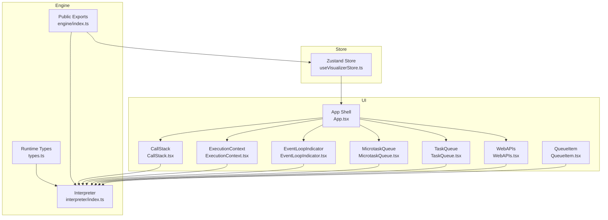
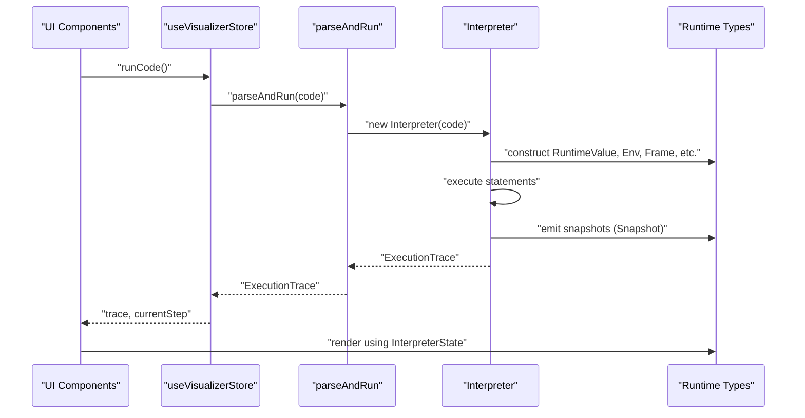
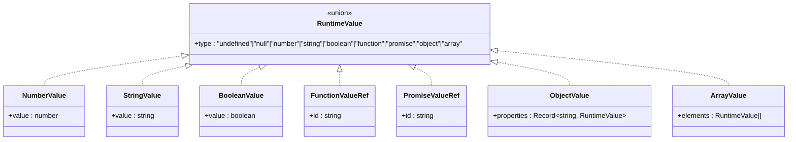
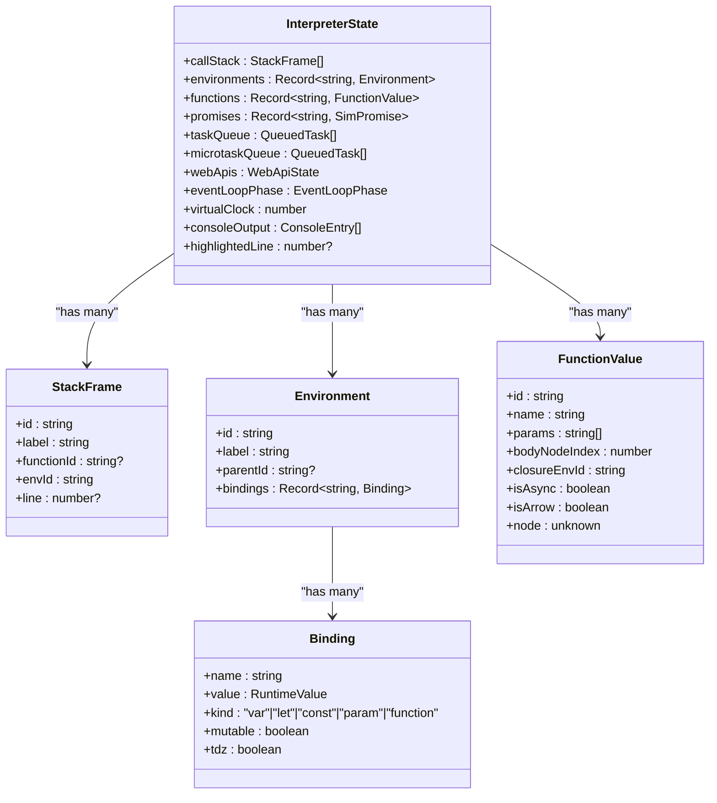
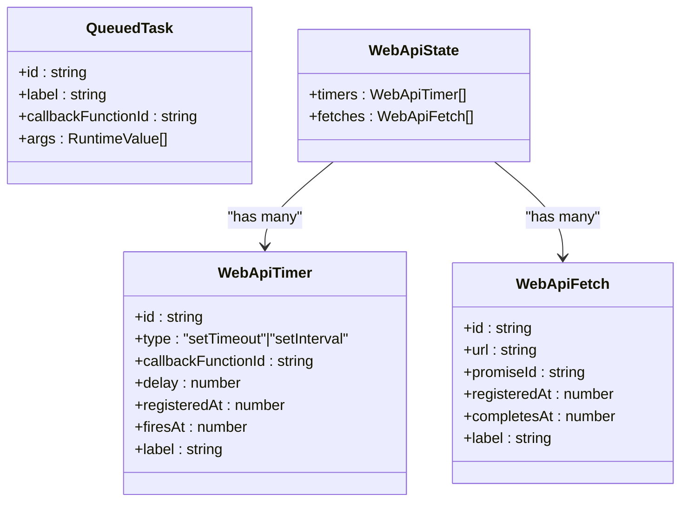
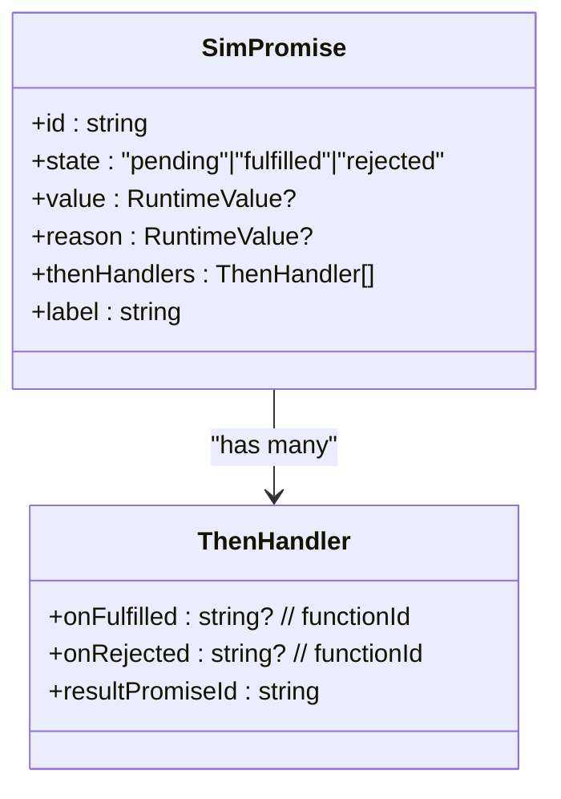
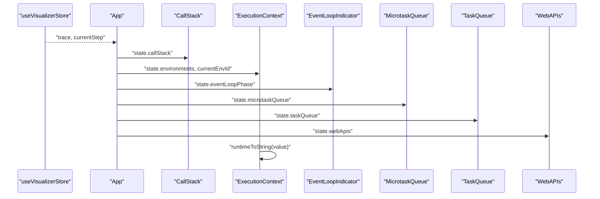
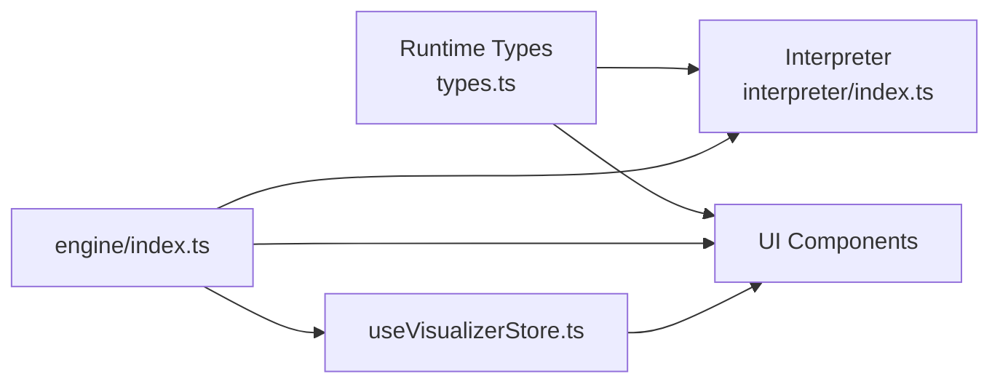

# Type Definitions

<cite>
**Referenced Files in This Document**
- [types.ts](file://src/engine/runtime/types.ts)
- [index.ts](file://src/engine/interpreter/index.ts)
- [index.ts](file://src/engine/index.ts)
- [useVisualizerStore.ts](file://src/store/useVisualizerStore.ts)
- [App.tsx](file://src/App.tsx)
- [ExecutionContext.tsx](file://src/components/visualizer/ExecutionContext.tsx)
- [EventLoopIndicator.tsx](file://src/components/visualizer/EventLoopIndicator.tsx)
- [MicrotaskQueue.tsx](file://src/components/visualizer/MicrotaskQueue.tsx)
- [TaskQueue.tsx](file://src/components/visualizer/TaskQueue.tsx)
- [WebAPIs.tsx](file://src/components/visualizer/WebAPIs.tsx)
- [CallStack.tsx](file://src/components/visualizer/CallStack.tsx)
- [QueueItem.tsx](file://src/components/visualizer/QueueItem.tsx)
- [index.ts](file://src/examples/index.ts)
</cite>

## Table of Contents
1. [Introduction](#introduction)
2. [Project Structure](#project-structure)
3. [Core Components](#core-components)
4. [Architecture Overview](#architecture-overview)
5. [Detailed Component Analysis](#detailed-component-analysis)
6. [Dependency Analysis](#dependency-analysis)
7. [Performance Considerations](#performance-considerations)
8. [Troubleshooting Guide](#troubleshooting-guide)
9. [Conclusion](#conclusion)

## Introduction
This document explains the TypeScript type definitions that underpin the JavaScript execution visualization engine. It covers runtime value types, execution state, queues, Web API simulations, event loop phases, and snapshot formats. It also describes how these types relate to runtime behavior, how they are used across components, and how to reason about type safety and common pitfalls.

## Project Structure
The type system is centralized in a single module and consumed by the interpreter, UI components, and the store. The engine exports a concise set of public types via a barrel file, while the UI consumes these types to render execution state.



**Diagram sources**
- [types.ts:1-249](file://src/engine/runtime/types.ts#L1-L249)
- [index.ts:1-1365](file://src/engine/interpreter/index.ts#L1-L1365)
- [index.ts:1-17](file://src/engine/index.ts#L1-L17)
- [useVisualizerStore.ts:1-109](file://src/store/useVisualizerStore.ts#L1-L109)
- [App.tsx:1-138](file://src/App.tsx#L1-L138)
- [CallStack.tsx:1-79](file://src/components/visualizer/CallStack.tsx#L1-L79)
- [ExecutionContext.tsx:1-128](file://src/components/visualizer/ExecutionContext.tsx#L1-L128)
- [EventLoopIndicator.tsx:1-143](file://src/components/visualizer/EventLoopIndicator.tsx#L1-L143)
- [MicrotaskQueue.tsx:1-41](file://src/components/visualizer/MicrotaskQueue.tsx#L1-L41)
- [TaskQueue.tsx:1-41](file://src/components/visualizer/TaskQueue.tsx#L1-L41)
- [WebAPIs.tsx:1-154](file://src/components/visualizer/WebAPIs.tsx#L1-L154)
- [QueueItem.tsx:1-38](file://src/components/visualizer/QueueItem.tsx#L1-L38)

**Section sources**
- [types.ts:1-249](file://src/engine/runtime/types.ts#L1-L249)
- [index.ts:1-17](file://src/engine/index.ts#L1-L17)

## Core Components
This section documents the primary type categories and their roles in simulating JavaScript execution.

- Runtime value types
  - Primitive wrappers and compound structures used to represent values during execution.
  - Includes tagged unions for undefined, null, number, string, boolean, function, promise, object, and array.
  - Utility constructors and conversion helpers are provided for consistent construction and rendering.

- Execution state and environment
  - Stack frames, environments, and bindings model scoping and variable storage.
  - Functions carry metadata for closures, parameters, and body references.

- Queues and Web APIs
  - Task and microtask queues represent enqueued callbacks.
  - Web API timers and fetch entries track asynchronous operations and their lifecycles.

- Promises
  - Simulated promises capture state, value/reason, and then handlers for chaining.

- Event loop
  - Phases enumerate the event loop stages for visualization and control flow.

- Snapshots and traces
  - Snapshots capture the interpreter state at discrete moments.
  - Execution traces bundle snapshots, source code, and optional error metadata.

- Console
  - Console entries record log/warn/error messages emitted during execution.

**Section sources**
- [types.ts:3-161](file://src/engine/runtime/types.ts#L3-L161)
- [types.ts:164-249](file://src/engine/runtime/types.ts#L164-L249)

## Architecture Overview
The interpreter builds a typed execution trace by stepping through statements and expressions, emitting snapshots at key events. UI components consume the current snapshot to render call stacks, environments, queues, Web APIs, and the event loop phase.



**Diagram sources**
- [index.ts:1361-1365](file://src/engine/interpreter/index.ts#L1361-L1365)
- [index.ts:1-17](file://src/engine/index.ts#L1-L17)
- [useVisualizerStore.ts:37-50](file://src/store/useVisualizerStore.ts#L37-L50)
- [types.ts:183-249](file://src/engine/runtime/types.ts#L183-L249)

## Detailed Component Analysis

### Runtime Value Types
Runtime values unify JavaScript primitives and complex structures with explicit typing for safe pattern matching and rendering.

- Discriminated union for runtime values
  - Covers undefined, null, number, string, boolean, function, promise, object, and array.
  - Provides helpers to construct values and convert them to strings or JS equivalents.

- Truthiness evaluation
  - A dedicated predicate determines truthy/falsy semantics for visualization and control flow.

- Rendering and conversion
  - Human-readable string representation and safe conversion to native JS values for display.



**Diagram sources**
- [types.ts:3-12](file://src/engine/runtime/types.ts#L3-L12)

**Section sources**
- [types.ts:3-68](file://src/engine/runtime/types.ts#L3-L68)

### Execution State and Environment
The interpreter maintains a typed execution state that captures the current call stack, environments, functions, promises, queues, Web APIs, event loop phase, clock, console output, and highlighted line.

- Call stack frames
  - Track function identity, environment, and line number for visualization.

- Environments and bindings
  - Bindings store name, value, kind (var/let/const/param/function), mutability, and TDZ state.

- Functions
  - Encapsulate metadata for closures, parameters, body reference, and flags for async/arrow.



**Diagram sources**
- [types.ts:102-108](file://src/engine/runtime/types.ts#L102-L108)
- [types.ts:80-85](file://src/engine/runtime/types.ts#L80-L85)
- [types.ts:72-78](file://src/engine/runtime/types.ts#L72-L78)
- [types.ts:89-98](file://src/engine/runtime/types.ts#L89-L98)
- [types.ts:183-195](file://src/engine/runtime/types.ts#L183-L195)

**Section sources**
- [types.ts:70-108](file://src/engine/runtime/types.ts#L70-L108)
- [types.ts:183-195](file://src/engine/runtime/types.ts#L183-L195)

### Queues and Web API Simulation
Queued tasks represent callbacks awaiting execution. Web API timers and fetch entries simulate browser APIs.

- Queued tasks
  - Carry a function identifier and arguments to be executed in a fresh frame.

- Web API timers
  - Track setTimeout/setInterval with registration and firing times.

- Web API fetches
  - Track fetch initiations and completion times, linking to a promise.



**Diagram sources**
- [types.ts:112-143](file://src/engine/runtime/types.ts#L112-L143)

**Section sources**
- [types.ts:112-143](file://src/engine/runtime/types.ts#L112-L143)

### Promise Simulation
Promises are modeled with state, value/reason, and then handlers. Resolution or rejection schedules microtasks accordingly.

- Simulated promise
  - Tracks id, state, value/reason, then handlers, and label.

- Then handlers
  - Capture fulfillment/rejection callbacks and chained result promise ids.



**Diagram sources**
- [types.ts:147-160](file://src/engine/runtime/types.ts#L147-L160)

**Section sources**
- [types.ts:145-161](file://src/engine/runtime/types.ts#L145-L161)

### Event Loop Phases
The event loop phases are modeled as a closed set of literals to drive visualization and control flow.

- Event loop phases
  - idle, executing-sync, checking-microtasks, executing-microtask, checking-macrotasks, executing-macrotask, advancing-timers.

**Section sources**
- [types.ts:164-171](file://src/engine/runtime/types.ts#L164-L171)

### Snapshots and Traces
Snapshots capture the interpreter state at discrete moments, enabling stepwise visualization. Traces bundle snapshots and metadata.

- Step types
  - Enumerates major execution events (program start/end, variable ops, function ops, promise ops, queue ops, timer/fetch events, await events, runtime errors).

- Snapshot
  - Index, step type, description, and a deep clone of the interpreter state.

- Execution trace
  - Source code, snapshots, total steps, and optional error.

```mermaid
classDiagram
class StepType {
<<union>>
+"program-start"|"variable-declaration"|"variable-assignment"|"function-declaration"|"function-call"|"function-return"|"expression-eval"|"console-log"|"register-timer"|"register-fetch"|"timer-fires"|"fetch-completes"|"promise-created"|"promise-resolved"|"promise-rejected"|"then-registered"|"enqueue-microtask"|"dequeue-microtask"|"enqueue-macrotask"|"dequeue-macrotask"|"event-loop-check"|"await-suspend"|"await-resume"|"program-end"|"runtime-error"
}
class Snapshot {
+index : number
+stepType : StepType
+description : string
+state : InterpreterState
}
class ExecutionTrace {
+sourceCode : string
+snapshots : Snapshot[]
+totalSteps : number
+error : { message : string; line? : number }?
}
ExecutionTrace --> Snapshot : "has many"
```

**Diagram sources**
- [types.ts:199-249](file://src/engine/runtime/types.ts#L199-L249)

**Section sources**
- [types.ts:199-249](file://src/engine/runtime/types.ts#L199-L249)

### Console Entries
Console entries capture emitted logs with type classification.

- Console entry
  - Unique id, text, and severity (log/warn/error).

**Section sources**
- [types.ts:175-179](file://src/engine/runtime/types.ts#L175-L179)

### UI Integration and Type Usage
Components consume typed state to render visualizations.

- App shell
  - Reads current snapshot from the store and passes interpreter state to panels.

- Call stack panel
  - Renders frames with labels and line numbers.

- Execution context panel
  - Walks environment chain, filters TDZ bindings, and renders values with color-coded types.

- Event loop indicator
  - Displays current phase with animated visuals.

- Queue panels
  - Render microtask and task queues using shared queue item component.

- Web APIs panel
  - Visualizes timers and fetches with progress and loading indicators.

- Store
  - Holds ExecutionTrace, current step, playback controls, and exposes selectors for efficient re-renders.



**Diagram sources**
- [useVisualizerStore.ts:101-109](file://src/store/useVisualizerStore.ts#L101-L109)
- [App.tsx:56-104](file://src/App.tsx#L56-L104)
- [CallStack.tsx:12-78](file://src/components/visualizer/CallStack.tsx#L12-L78)
- [ExecutionContext.tsx:33-127](file://src/components/visualizer/ExecutionContext.tsx#L33-L127)
- [EventLoopIndicator.tsx:30-142](file://src/components/visualizer/EventLoopIndicator.tsx#L30-L142)
- [MicrotaskQueue.tsx:12-40](file://src/components/visualizer/MicrotaskQueue.tsx#L12-L40)
- [TaskQueue.tsx:12-40](file://src/components/visualizer/TaskQueue.tsx#L12-L40)
- [WebAPIs.tsx:13-153](file://src/components/visualizer/WebAPIs.tsx#L13-L153)

**Section sources**
- [App.tsx:17-107](file://src/App.tsx#L17-L107)
- [ExecutionContext.tsx:14-117](file://src/components/visualizer/ExecutionContext.tsx#L14-L117)
- [EventLoopIndicator.tsx:10-28](file://src/components/visualizer/EventLoopIndicator.tsx#L10-L28)
- [MicrotaskQueue.tsx:1-41](file://src/components/visualizer/MicrotaskQueue.tsx#L1-L41)
- [TaskQueue.tsx:1-41](file://src/components/visualizer/TaskQueue.tsx#L1-L41)
- [WebAPIs.tsx:1-154](file://src/components/visualizer/WebAPIs.tsx#L1-L154)
- [useVisualizerStore.ts:1-109](file://src/store/useVisualizerStore.ts#L1-L109)

## Dependency Analysis
The type system is consumed by the interpreter and UI components. The engine’s public exports centralize type availability.



**Diagram sources**
- [types.ts:1-249](file://src/engine/runtime/types.ts#L1-L249)
- [index.ts:1-18](file://src/engine/interpreter/index.ts#L1-L18)
- [index.ts:1-17](file://src/engine/index.ts#L1-L17)
- [useVisualizerStore.ts:1-3](file://src/store/useVisualizerStore.ts#L1-L3)

**Section sources**
- [index.ts:1-17](file://src/engine/index.ts#L1-L17)
- [index.ts:1-18](file://src/engine/interpreter/index.ts#L1-L18)

## Performance Considerations
- Snapshot cloning
  - Snapshots use a deep clone of the interpreter state to ensure immutability and reliable playback. Consider the cost of cloning large environments and arrays when designing examples and tests.

- Rendering complexity
  - Rendering large objects and arrays can be expensive. Prefer compact string representations and avoid unnecessary re-renders by using primitive selectors in the store.

- Event loop simulation
  - The interpreter advances timers and drains queues deterministically. Keep examples bounded to prevent long simulation runs.

[No sources needed since this section provides general guidance]

## Troubleshooting Guide
Common type-related issues and remedies:

- Undefined or null access
  - Ensure runtime values are checked for undefined/null before property access. The interpreter throws descriptive errors for invalid operations.

- Variable scoping and TDZ
  - Accessing a variable before initialization triggers a TDZ error. Verify hoisting and block scoping logic when stepping through code.

- Promise resolution timing
  - Then handlers are scheduled as microtasks. Misunderstanding the order of microtasks vs. macrotasks can lead to confusion; rely on the event loop visualization.

- Function calls and return values
  - Returning from functions uses a sentinel mechanism. Ensure return paths are handled consistently.

- Console output
  - Console methods are captured as entries with severity. Validate that console methods are invoked correctly.

**Section sources**
- [index.ts:176-210](file://src/engine/interpreter/index.ts#L176-L210)
- [index.ts:744-758](file://src/engine/interpreter/index.ts#L744-L758)
- [index.ts:1342-1353](file://src/engine/interpreter/index.ts#L1342-L1353)

## Conclusion
The type system provides a robust foundation for modeling JavaScript execution, enabling precise visualization of runtime behavior. By leveraging discriminated unions, immutable snapshots, and typed queues and Web APIs, the system balances expressiveness with maintainability. Adhering to the type contracts ensures correctness across the interpreter and UI layers.