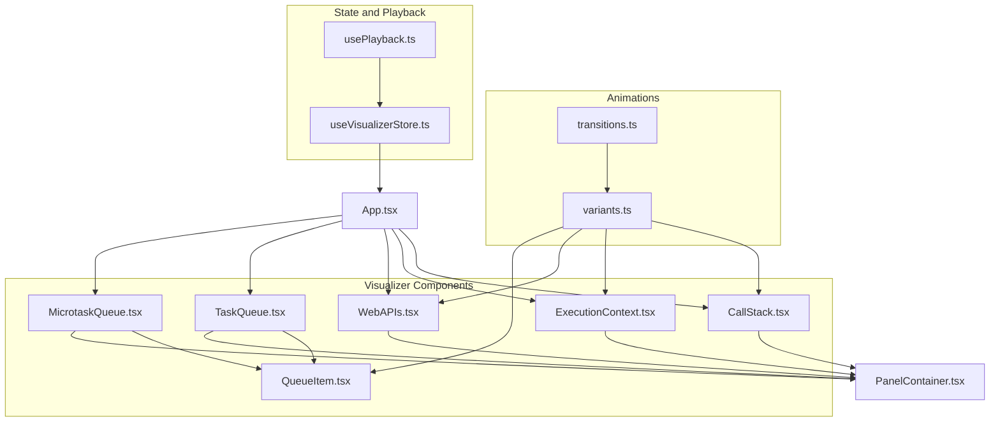
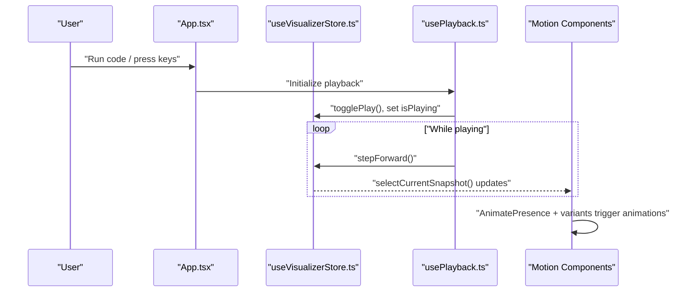
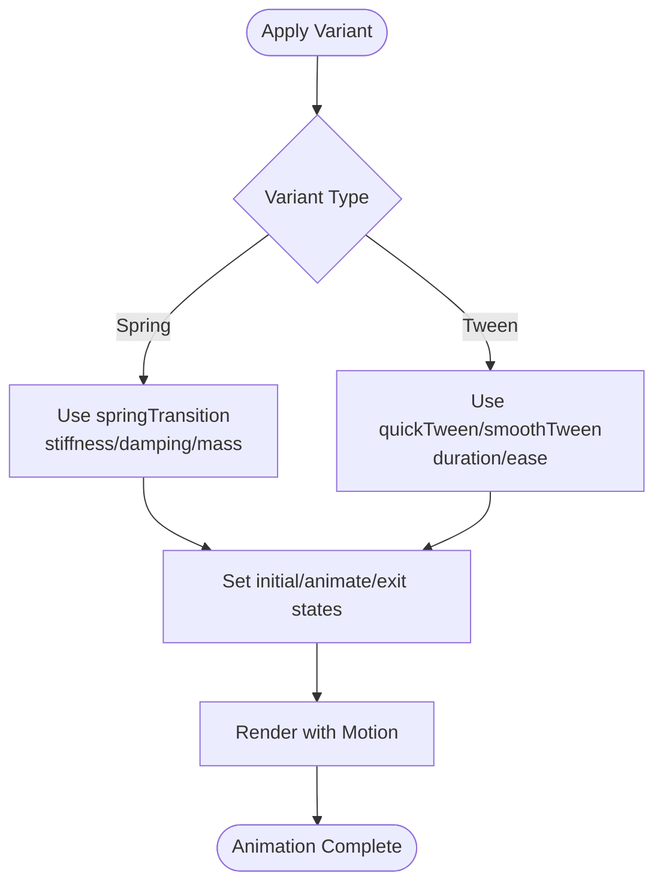
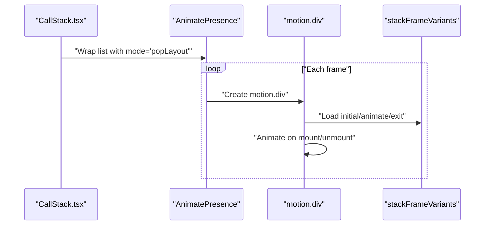
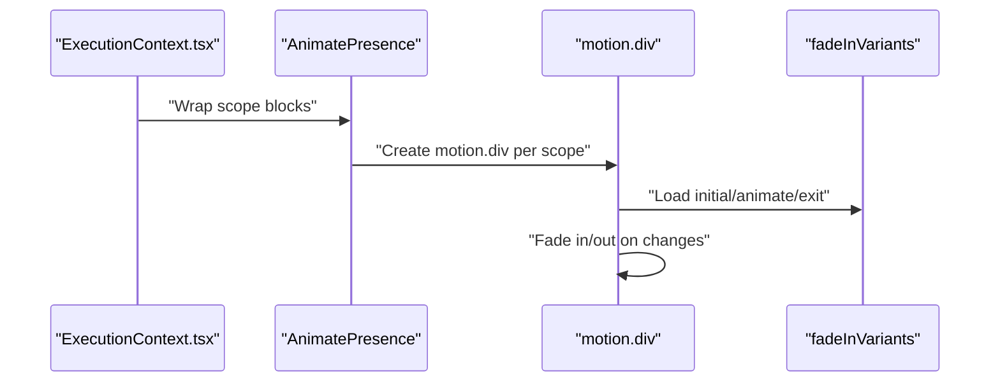
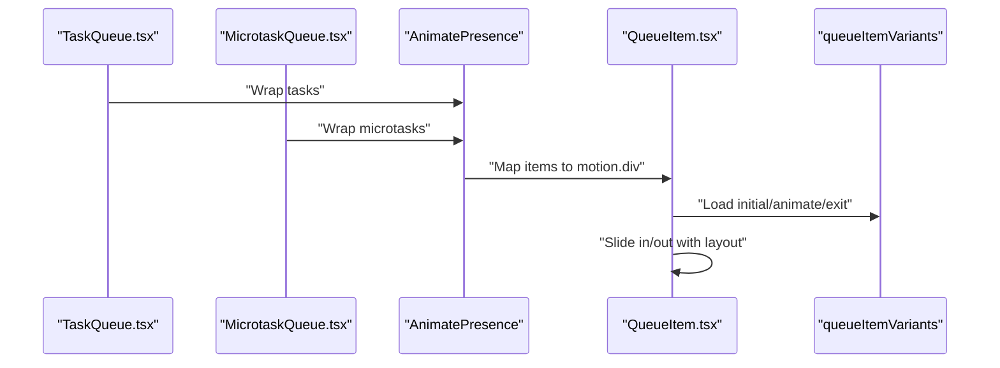
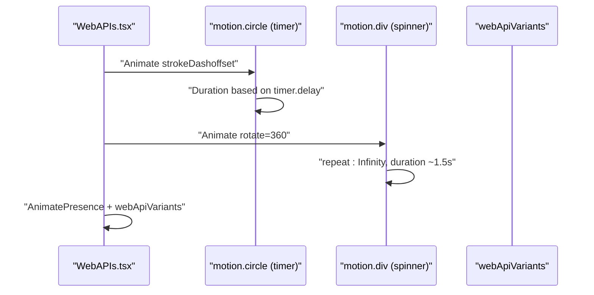
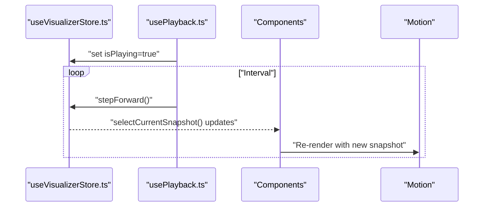
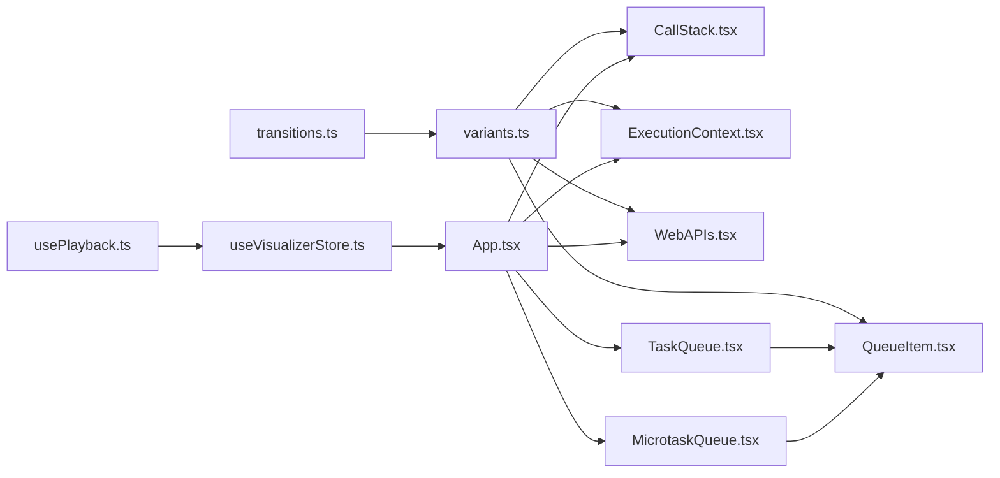

# Animation System and Motion Variants

<cite>
**Referenced Files in This Document**
- [variants.ts](file://src/animations/variants.ts)
- [transitions.ts](file://src/animations/transitions.ts)
- [CallStack.tsx](file://src/components/visualizer/CallStack.tsx)
- [ExecutionContext.tsx](file://src/components/visualizer/ExecutionContext.tsx)
- [WebAPIs.tsx](file://src/components/visualizer/WebAPIs.tsx)
- [QueueItem.tsx](file://src/components/visualizer/QueueItem.tsx)
- [TaskQueue.tsx](file://src/components/visualizer/TaskQueue.tsx)
- [MicrotaskQueue.tsx](file://src/components/visualizer/MicrotaskQueue.tsx)
- [usePlayback.ts](file://src/hooks/usePlayback.ts)
- [useVisualizerStore.ts](file://src/store/useVisualizerStore.ts)
- [App.tsx](file://src/App.tsx)
- [PanelContainer.tsx](file://src/components/layout/PanelContainer.tsx)
</cite>

## Table of Contents
1. [Introduction](#introduction)
2. [Project Structure](#project-structure)
3. [Core Components](#core-components)
4. [Architecture Overview](#architecture-overview)
5. [Detailed Component Analysis](#detailed-component-analysis)
6. [Dependency Analysis](#dependency-analysis)
7. [Performance Considerations](#performance-considerations)
8. [Troubleshooting Guide](#troubleshooting-guide)
9. [Conclusion](#conclusion)

## Introduction
This document explains the animation system built with the Motion library and custom animation variants used throughout the JS-Visualizer application. It focuses on reusable animation configurations defined in variants.ts, transition definitions in transitions.ts, and how these patterns are applied to animate UI elements such as panels, lists, and interactive states. It also documents how animations integrate with the component lifecycle and state changes driven by the Zustand store, along with performance considerations and browser compatibility strategies.

## Project Structure
The animation system is organized under a dedicated folder and consumed by several visualizer components. The key files are:
- Animation definitions: src/animations/variants.ts, src/animations/transitions.ts
- Consumer components: CallStack.tsx, ExecutionContext.tsx, WebAPIs.tsx, QueueItem.tsx, TaskQueue.tsx, MicrotaskQueue.tsx
- Store and playback: useVisualizerStore.ts, usePlayback.ts
- Layout container: PanelContainer.tsx
- Application orchestration: App.tsx



**Diagram sources**
- [variants.ts:1-39](file://src/animations/variants.ts#L1-L39)
- [transitions.ts:1-26](file://src/animations/transitions.ts#L1-L26)
- [CallStack.tsx:1-79](file://src/components/visualizer/CallStack.tsx#L1-L79)
- [ExecutionContext.tsx:1-128](file://src/components/visualizer/ExecutionContext.tsx#L1-L128)
- [WebAPIs.tsx:1-154](file://src/components/visualizer/WebAPIs.tsx#L1-L154)
- [QueueItem.tsx:1-38](file://src/components/visualizer/QueueItem.tsx#L1-L38)
- [TaskQueue.tsx:1-41](file://src/components/visualizer/TaskQueue.tsx#L1-L41)
- [MicrotaskQueue.tsx:1-41](file://src/components/visualizer/MicrotaskQueue.tsx#L1-L41)
- [useVisualizerStore.ts:1-109](file://src/store/useVisualizerStore.ts#L1-L109)
- [usePlayback.ts:1-79](file://src/hooks/usePlayback.ts#L1-L79)
- [PanelContainer.tsx:1-74](file://src/components/layout/PanelContainer.tsx#L1-L74)
- [App.tsx:1-138](file://src/App.tsx#L1-L138)

**Section sources**
- [variants.ts:1-39](file://src/animations/variants.ts#L1-L39)
- [transitions.ts:1-26](file://src/animations/transitions.ts#L1-L26)
- [App.tsx:1-138](file://src/App.tsx#L1-L138)

## Core Components
- Animation variants: Reusable configuration objects for entrance, animate, and exit states, plus idle/active states for interactive effects.
- Transition presets: Spring and tween configurations that define timing and easing characteristics for animations.

Key responsibilities:
- variants.ts defines:
  - Stack frame items with vertical movement and scaling for call stacks
  - Queue items with horizontal movement and scaling for task queues
  - Web API items with scaling for timers and fetches
  - Console lines with vertical fade-in
  - Panel glow states for interactive focus
  - Fade-in variant for simple opacity transitions
- transitions.ts defines:
  - Spring-based transitions with tuned stiffness, damping, and mass
  - Gentle spring for softer interactions
  - Quick tween for fast dismissals
  - Smooth tween for readable transitions

These definitions are imported and applied in multiple visualizer components to ensure consistent motion behavior across the UI.

**Section sources**
- [variants.ts:1-39](file://src/animations/variants.ts#L1-L39)
- [transitions.ts:1-26](file://src/animations/transitions.ts#L1-L26)

## Architecture Overview
The animation pipeline integrates state-driven updates from the Zustand store with Motion components. The store manages the execution trace and current step, while playback hooks advance the step index at a configurable rate. Components subscribe to the store and render according to the current snapshot, triggering Motion animations via AnimatePresence and motion variants.



**Diagram sources**
- [App.tsx:125-137](file://src/App.tsx#L125-L137)
- [usePlayback.ts:1-79](file://src/hooks/usePlayback.ts#L1-L79)
- [useVisualizerStore.ts:1-109](file://src/store/useVisualizerStore.ts#L1-L109)
- [CallStack.tsx:31-73](file://src/components/visualizer/CallStack.tsx#L31-L73)
- [ExecutionContext.tsx:68-122](file://src/components/visualizer/ExecutionContext.tsx#L68-L122)
- [WebAPIs.tsx:34-148](file://src/components/visualizer/WebAPIs.tsx#L34-L148)

## Detailed Component Analysis

### Animation Variants and Transitions
- Spring-based entrance/exit:
  - Stiffness, damping, and mass tuned for snappy yet controlled motion
  - Used for stack frames, queue items, and Web API entries
- Quick tween for exits:
  - Short duration with ease-out for responsive dismissal
- Smooth tween for readable transitions:
  - Subtle easing curve for smoother state changes
- Panel glow:
  - Idle to active transitions with short duration for interactive feedback



**Diagram sources**
- [variants.ts:1-39](file://src/animations/variants.ts#L1-L39)
- [transitions.ts:1-26](file://src/animations/transitions.ts#L1-L26)

**Section sources**
- [variants.ts:1-39](file://src/animations/variants.ts#L1-L39)
- [transitions.ts:1-26](file://src/animations/transitions.ts#L1-L26)

### Call Stack Animation Pattern
- Uses AnimatePresence with popLayout to coordinate layout shifts when frames appear/disappear
- Applies stackFrameVariants for entrance, exit, and animate states
- Highlights the active frame with distinct styling and border



**Diagram sources**
- [CallStack.tsx:31-73](file://src/components/visualizer/CallStack.tsx#L31-L73)
- [variants.ts:3-7](file://src/animations/variants.ts#L3-L7)

**Section sources**
- [CallStack.tsx:1-79](file://src/components/visualizer/CallStack.tsx#L1-L79)
- [variants.ts:3-7](file://src/animations/variants.ts#L3-L7)

### Scope and Variables Animation Pattern
- Uses AnimatePresence without layout to animate child containers
- Applies fadeInVariants for simple opacity transitions between scope blocks



**Diagram sources**
- [ExecutionContext.tsx:68-122](file://src/components/visualizer/ExecutionContext.tsx#L68-L122)
- [variants.ts:34-38](file://src/animations/variants.ts#L34-L38)

**Section sources**
- [ExecutionContext.tsx:1-128](file://src/components/visualizer/ExecutionContext.tsx#L1-L128)
- [variants.ts:34-38](file://src/animations/variants.ts#L34-L38)

### Task and Microtask Queue Animation Pattern
- QueueItem.tsx applies queueItemVariants to each queued task
- TaskQueue.tsx and MicrotaskQueue.tsx wrap their lists with AnimatePresence and popLayout for consistent layout animations



**Diagram sources**
- [TaskQueue.tsx:31-35](file://src/components/visualizer/TaskQueue.tsx#L31-L35)
- [MicrotaskQueue.tsx:31-35](file://src/components/visualizer/MicrotaskQueue.tsx#L31-L35)
- [QueueItem.tsx:14-19](file://src/components/visualizer/QueueItem.tsx#L14-L19)
- [variants.ts:9-13](file://src/animations/variants.ts#L9-L13)

**Section sources**
- [TaskQueue.tsx:1-41](file://src/components/visualizer/TaskQueue.tsx#L1-L41)
- [MicrotaskQueue.tsx:1-41](file://src/components/visualizer/MicrotaskQueue.tsx#L1-L41)
- [QueueItem.tsx:1-38](file://src/components/visualizer/QueueItem.tsx#L1-L38)
- [variants.ts:9-13](file://src/animations/variants.ts#L9-L13)

### Web APIs Animation and Interactive Elements
- WebAPIs.tsx animates timer rings and loading spinners:
  - Timer ring uses animated strokeDashoffset with a duration derived from delay
  - Fetch spinner rotates continuously with linear easing
- Panels use webApiVariants for entrance/exit with scaling



**Diagram sources**
- [WebAPIs.tsx:61-77](file://src/components/visualizer/WebAPIs.tsx#L61-L77)
- [WebAPIs.tsx:124-129](file://src/components/visualizer/WebAPIs.tsx#L124-L129)
- [WebAPIs.tsx:34-148](file://src/components/visualizer/WebAPIs.tsx#L34-L148)
- [variants.ts:15-19](file://src/animations/variants.ts#L15-L19)

**Section sources**
- [WebAPIs.tsx:1-154](file://src/components/visualizer/WebAPIs.tsx#L1-L154)
- [variants.ts:15-19](file://src/animations/variants.ts#L15-L19)

### Panel Container and Interactive Glow
- PanelContainer.tsx provides a consistent panel shell with accent indicators and counts
- panelGlowVariants define idle and active glow states for interactive feedback

```mermaid
flowchart TD
Hover["Hover on Panel"] --> IdleActive["Switch to active glow"]
IdleActive --> Animate["Apply panelGlowVariants.transition"]
Animate --> Render["Render with boxShadow"
Render --> BackIdle["On leave, return to idle"]
```

**Diagram sources**
- [PanelContainer.tsx:12-73](file://src/components/layout/PanelContainer.tsx#L12-L73)
- [variants.ts:26-32](file://src/animations/variants.ts#L26-L32)

**Section sources**
- [PanelContainer.tsx:1-74](file://src/components/layout/PanelContainer.tsx#L1-L74)
- [variants.ts:26-32](file://src/animations/variants.ts#L26-L32)

### Integration with Zustand Store and Playback
- useVisualizerStore.ts manages the execution trace, current step, and playback controls
- usePlayback.ts advances the step index at a configured interval when playback is active
- App.tsx orchestrates the visualization grid and subscribes to store updates



**Diagram sources**
- [useVisualizerStore.ts:1-109](file://src/store/useVisualizerStore.ts#L1-L109)
- [usePlayback.ts:1-79](file://src/hooks/usePlayback.ts#L1-L79)
- [App.tsx:17-106](file://src/App.tsx#L17-L106)

**Section sources**
- [useVisualizerStore.ts:1-109](file://src/store/useVisualizerStore.ts#L1-L109)
- [usePlayback.ts:1-79](file://src/hooks/usePlayback.ts#L1-L79)
- [App.tsx:1-138](file://src/App.tsx#L1-L138)

## Dependency Analysis
- Consumers depend on variants.ts and transitions.ts for consistent animation behavior
- AnimatePresence is used across components to coordinate mounting/unmounting animations
- layout prop enables layout animations for components that change size or position
- Store-driven state changes trigger re-renders that cause Motion to animate



**Diagram sources**
- [transitions.ts:1-26](file://src/animations/transitions.ts#L1-L26)
- [variants.ts:1-39](file://src/animations/variants.ts#L1-L39)
- [CallStack.tsx:1-79](file://src/components/visualizer/CallStack.tsx#L1-L79)
- [ExecutionContext.tsx:1-128](file://src/components/visualizer/ExecutionContext.tsx#L1-L128)
- [WebAPIs.tsx:1-154](file://src/components/visualizer/WebAPIs.tsx#L1-L154)
- [QueueItem.tsx:1-38](file://src/components/visualizer/QueueItem.tsx#L1-L38)
- [TaskQueue.tsx:1-41](file://src/components/visualizer/TaskQueue.tsx#L1-L41)
- [MicrotaskQueue.tsx:1-41](file://src/components/visualizer/MicrotaskQueue.tsx#L1-L41)
- [useVisualizerStore.ts:1-109](file://src/store/useVisualizerStore.ts#L1-L109)
- [usePlayback.ts:1-79](file://src/hooks/usePlayback.ts#L1-L79)
- [App.tsx:1-138](file://src/App.tsx#L1-L138)

**Section sources**
- [variants.ts:1-39](file://src/animations/variants.ts#L1-L39)
- [transitions.ts:1-26](file://src/animations/transitions.ts#L1-L26)
- [CallStack.tsx:1-79](file://src/components/visualizer/CallStack.tsx#L1-L79)
- [ExecutionContext.tsx:1-128](file://src/components/visualizer/ExecutionContext.tsx#L1-L128)
- [WebAPIs.tsx:1-154](file://src/components/visualizer/WebAPIs.tsx#L1-L154)
- [QueueItem.tsx:1-38](file://src/components/visualizer/QueueItem.tsx#L1-L38)
- [TaskQueue.tsx:1-41](file://src/components/visualizer/TaskQueue.tsx#L1-L41)
- [MicrotaskQueue.tsx:1-41](file://src/components/visualizer/MicrotaskQueue.tsx#L1-L41)
- [useVisualizerStore.ts:1-109](file://src/store/useVisualizerStore.ts#L1-L109)
- [usePlayback.ts:1-79](file://src/hooks/usePlayback.ts#L1-L79)
- [App.tsx:1-138](file://src/App.tsx#L1-L138)

## Performance Considerations
- Prefer layout animations only when necessary; excessive layout shifts can be costly
- Use quick tween for exit animations to minimize cumulative animation time
- Keep transition durations short for frequent updates (e.g., playback-driven snapshots)
- Avoid heavy transforms on deeply nested nodes; prefer simpler animations on top-level motion wrappers
- Use AnimatePresence with mode="popLayout" judiciously to prevent layout thrashing
- Leverage primitive selectors to avoid unnecessary re-renders that could trigger animations

## Troubleshooting Guide
- Animations not triggering:
  - Verify AnimatePresence is wrapping lists and that variants are passed to motion components
  - Ensure initial, animate, and exit states are defined in the variant object
- Jittery or inconsistent motion:
  - Confirm consistent transition objects are used across variants
  - Reduce layout animations or stabilize sizes to avoid layout shifts
- Playback feels sluggish:
  - Adjust playbackSpeed in the store and verify interval timing in usePlayback
  - Consider reducing transition durations for frequently changing panels
- Browser compatibility:
  - Motion relies on CSS transforms and opacity; ensure target browsers support these properties
  - For older browsers, consider providing reduced-motion alternatives or disabling certain animations via prefers-reduced-motion media queries

## Conclusion
The animation system leverages Motion and custom variants to deliver smooth, consistent motion across the visualizer. By centralizing transition definitions and applying them consistently across components, the system ensures predictable behavior during code execution visualization. Integration with the Zustand store and playback hooks enables animations to reflect real-time state changes, enhancing user comprehension of JavaScript execution dynamics. With careful tuning of transition durations and layout animations, the system balances responsiveness with visual richness while remaining compatible across modern browsers.