# Component Architecture

<cite>
**Referenced Files in This Document**
- [App.tsx](file://src/App.tsx)
- [main.tsx](file://src/main.tsx)
- [AppShell.tsx](file://src/components/layout/AppShell.tsx)
- [PanelContainer.tsx](file://src/components/layout/PanelContainer.tsx)
- [useVisualizerStore.ts](file://src/store/useVisualizerStore.ts)
- [usePlayback.ts](file://src/hooks/usePlayback.ts)
- [CodeEditorPanel.tsx](file://src/components/editor/CodeEditorPanel.tsx)
- [CallStack.tsx](file://src/components/visualizer/CallStack.tsx)
- [ExecutionContext.tsx](file://src/components/visualizer/ExecutionContext.tsx)
- [WebAPIs.tsx](file://src/components/visualizer/WebAPIs.tsx)
- [MicrotaskQueue.tsx](file://src/components/visualizer/MicrotaskQueue.tsx)
- [TaskQueue.tsx](file://src/components/visualizer/TaskQueue.tsx)
- [ConsolePanel.tsx](file://src/components/console/ConsolePanel.tsx)
- [StepControls.tsx](file://src/components/controls/StepControls.tsx)
- [variants.ts](file://src/animations/variants.ts)
- [transitions.ts](file://src/animations/transitions.ts)
- [tokens.ts](file://src/theme/tokens.ts)
- [engine/index.ts](file://src/engine/index.ts)
</cite>

## Table of Contents
1. [Introduction](#introduction)
2. [Project Structure](#project-structure)
3. [Core Components](#core-components)
4. [Architecture Overview](#architecture-overview)
5. [Detailed Component Analysis](#detailed-component-analysis)
6. [Dependency Analysis](#dependency-analysis)
7. [Performance Considerations](#performance-considerations)
8. [Troubleshooting Guide](#troubleshooting-guide)
9. [Conclusion](#conclusion)

## Introduction
This document describes the React component architecture and overall application structure of a JavaScript runtime visualization tool. It focuses on the component hierarchy starting from AppShell, the organization of major sections (editor, visualization grid, controls, and console), the state management architecture using a Zustand store, the animation system powered by the Motion library, and the theme system with design tokens. It also covers component composition patterns, prop drilling solutions, reusability strategies, architectural decisions, performance considerations, lifecycle management, and integration points with the underlying execution engine.

## Project Structure
The application follows a feature-based structure with clear separation of concerns:
- Entry point renders the root App inside Strict Mode.
- App composes the shell and major sections.
- Layout components provide reusable containers and shell scaffolding.
- Editor, visualizer, controls, and console are feature modules with dedicated components.
- State management is centralized via a Zustand store.
- Animations and transitions are defined in a dedicated module.
- Theme tokens define consistent design language.

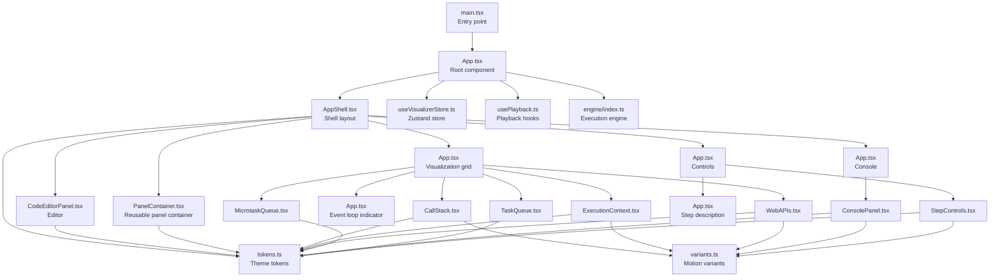

**Diagram sources**
- [main.tsx:1-11](file://src/main.tsx#L1-L11)
- [App.tsx:125-137](file://src/App.tsx#L125-L137)
- [AppShell.tsx:11-121](file://src/components/layout/AppShell.tsx#L11-L121)
- [useVisualizerStore.ts:27-98](file://src/store/useVisualizerStore.ts#L27-L98)
- [usePlayback.ts:4-28](file://src/hooks/usePlayback.ts#L4-L28)
- [engine/index.ts:1-17](file://src/engine/index.ts#L1-L17)
- [PanelContainer.tsx:12-73](file://src/components/layout/PanelContainer.tsx#L12-L73)
- [CallStack.tsx:12-78](file://src/components/visualizer/CallStack.tsx#L12-L78)
- [ExecutionContext.tsx:33-127](file://src/components/visualizer/ExecutionContext.tsx#L33-L127)
- [WebAPIs.tsx:13-153](file://src/components/visualizer/WebAPIs.tsx#L13-L153)
- [MicrotaskQueue.tsx:12-40](file://src/components/visualizer/MicrotaskQueue.tsx#L12-L40)
- [TaskQueue.tsx:12-40](file://src/components/visualizer/TaskQueue.tsx#L12-L40)
- [ConsolePanel.tsx:17-122](file://src/components/console/ConsolePanel.tsx#L17-L122)
- [StepControls.tsx:13-165](file://src/components/controls/StepControls.tsx#L13-L165)
- [variants.ts:1-39](file://src/animations/variants.ts#L1-L39)
- [tokens.ts:1-49](file://src/theme/tokens.ts#L1-L49)

**Section sources**
- [main.tsx:1-11](file://src/main.tsx#L1-L11)
- [App.tsx:125-137](file://src/App.tsx#L125-L137)

## Core Components
- AppShell: Provides the global shell layout with header, editor column, visualization area, controls, and console panel. It consumes design tokens for consistent theming.
- PanelContainer: A reusable panel wrapper that standardizes panel headers, accents, counts, and scrolling behavior.
- CodeEditorPanel: Integrates Monaco editor, example selection, live editing, and run/reset controls. It reads and writes to the Zustand store and highlights the current executing line.
- Visualization Grid: A grid layout rendering the runtime visualization panels (Call Stack, Execution Context, Web APIs, Event Loop Indicator, Microtask Queue, Task Queue).
- Controls Section: Renders step description and step controls (playback, stepping, progress, speed).
- Console Panel: Displays console output with animated entries and type-specific styling.
- Zustand Store: Centralized state for code, execution trace, current step, playback state, speed, and errors, with selectors for efficient re-renders.
- Playback Hooks: Manage playback loop and keyboard shortcuts for stepping and toggling playback.
- Animation Variants and Transitions: Provide reusable Motion variants and transitions for smooth UI updates.
- Theme Tokens: Define color palettes, spacing, radii, and fonts for consistent styling.

**Section sources**
- [AppShell.tsx:11-121](file://src/components/layout/AppShell.tsx#L11-L121)
- [PanelContainer.tsx:12-73](file://src/components/layout/PanelContainer.tsx#L12-L73)
- [CodeEditorPanel.tsx:9-161](file://src/components/editor/CodeEditorPanel.tsx#L9-L161)
- [App.tsx:17-123](file://src/App.tsx#L17-L123)
- [ConsolePanel.tsx:17-122](file://src/components/console/ConsolePanel.tsx#L17-L122)
- [useVisualizerStore.ts:5-98](file://src/store/useVisualizerStore.ts#L5-L98)
- [usePlayback.ts:4-78](file://src/hooks/usePlayback.ts#L4-L78)
- [variants.ts:1-39](file://src/animations/variants.ts#L1-L39)
- [transitions.ts:1-26](file://src/animations/transitions.ts#L1-L26)
- [tokens.ts:1-49](file://src/theme/tokens.ts#L1-L49)

## Architecture Overview
The application is structured around a shell-driven composition pattern:
- App composes AppShell and passes feature sections as props.
- AppShell defines the grid layout and applies theme tokens.
- Feature sections subscribe to the Zustand store for state and actions.
- Animation variants are composed with Motion components for fluid transitions.
- The execution engine is integrated via the store’s run action, which produces snapshots consumed by visualization components.

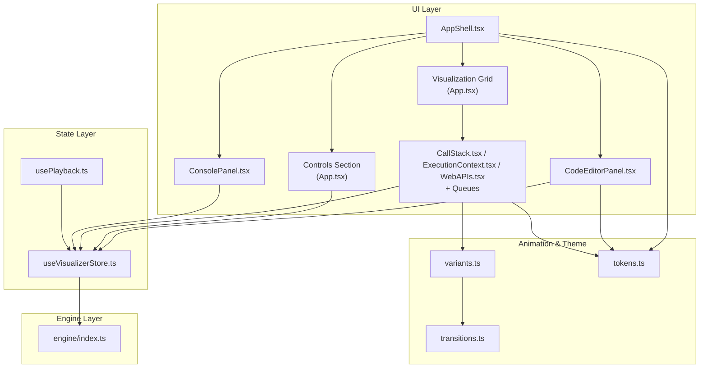

**Diagram sources**
- [AppShell.tsx:11-121](file://src/components/layout/AppShell.tsx#L11-L121)
- [CodeEditorPanel.tsx:9-161](file://src/components/editor/CodeEditorPanel.tsx#L9-L161)
- [App.tsx:17-123](file://src/App.tsx#L17-L123)
- [ConsolePanel.tsx:17-122](file://src/components/console/ConsolePanel.tsx#L17-L122)
- [useVisualizerStore.ts:27-98](file://src/store/useVisualizerStore.ts#L27-L98)
- [usePlayback.ts:4-28](file://src/hooks/usePlayback.ts#L4-L28)
- [engine/index.ts:1-17](file://src/engine/index.ts#L1-L17)
- [variants.ts:1-39](file://src/animations/variants.ts#L1-L39)
- [transitions.ts:1-26](file://src/animations/transitions.ts#L1-L26)
- [tokens.ts:1-49](file://src/theme/tokens.ts#L1-L49)

## Detailed Component Analysis

### AppShell and Layout Composition
- AppShell defines the global layout with a fixed header, a two-column grid (editor and visualization), a controls region, and a collapsible console panel.
- It consumes theme tokens for backgrounds, borders, and typography.
- Child components are passed as React nodes, enabling flexible composition.

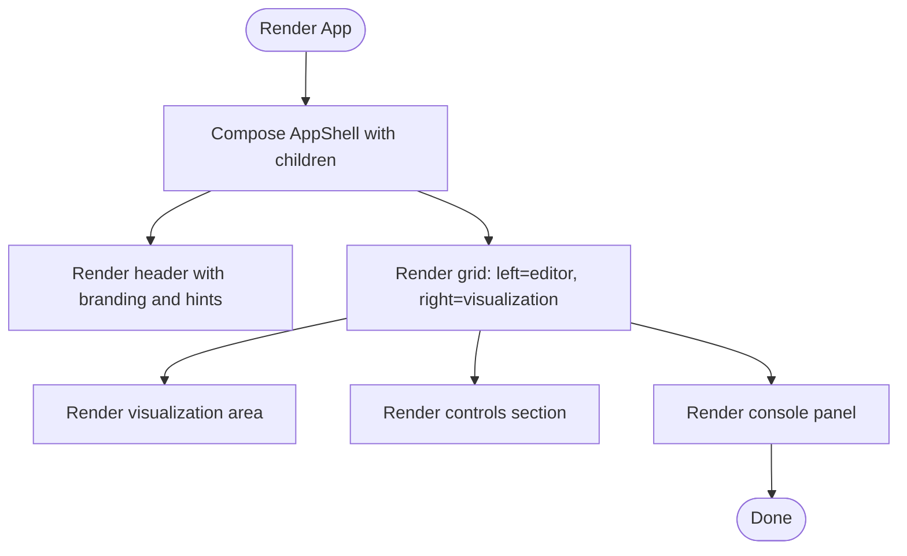

**Diagram sources**
- [AppShell.tsx:11-121](file://src/components/layout/AppShell.tsx#L11-L121)

**Section sources**
- [AppShell.tsx:11-121](file://src/components/layout/AppShell.tsx#L11-L121)

### Zustand Store: State Slices, Actions, and Selectors
- State slice includes code, trace, currentStep, isPlaying, playbackSpeed, and error.
- Actions encapsulate editing code, running code, stepping, playing/pausing, jumping, resetting, setting speed, and loading examples.
- Selectors provide primitive values to minimize re-renders and avoid unnecessary object churn.
- The store integrates with the execution engine to produce snapshots consumed by visualization components.

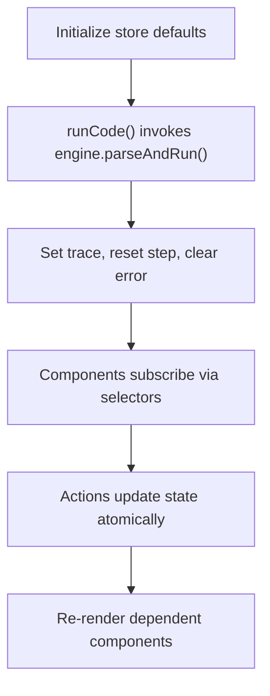

**Diagram sources**
- [useVisualizerStore.ts:27-98](file://src/store/useVisualizerStore.ts#L27-L98)
- [engine/index.ts:1-17](file://src/engine/index.ts#L1-L17)

**Section sources**
- [useVisualizerStore.ts:5-98](file://src/store/useVisualizerStore.ts#L5-L98)
- [engine/index.ts:1-17](file://src/engine/index.ts#L1-L17)

### Animation System with Motion Library
- Variants define initial, animate, and exit states with transitions for stack frames, queue items, Web APIs, console lines, and general fades.
- Transitions provide spring and tween configurations for natural motion.
- Components use AnimatePresence and layout animations to smoothly reflect runtime changes.

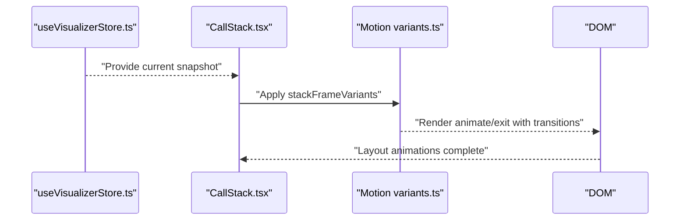

**Diagram sources**
- [CallStack.tsx:33-39](file://src/components/visualizer/CallStack.tsx#L33-L39)
- [variants.ts:3-7](file://src/animations/variants.ts#L3-L7)

**Section sources**
- [variants.ts:1-39](file://src/animations/variants.ts#L1-L39)
- [transitions.ts:1-26](file://src/animations/transitions.ts#L1-L26)
- [CallStack.tsx:12-78](file://src/components/visualizer/CallStack.tsx#L12-L78)
- [ExecutionContext.tsx:33-127](file://src/components/visualizer/ExecutionContext.tsx#L33-L127)
- [WebAPIs.tsx:13-153](file://src/components/visualizer/WebAPIs.tsx#L13-L153)
- [ConsolePanel.tsx:17-122](file://src/components/console/ConsolePanel.tsx#L17-L122)

### Theme System and Design Tokens
- Tokens centralize colors (backgrounds, accents, text, borders), spacing, radii, and fonts.
- Components consume tokens for consistent theming across panels, buttons, and typography.
- Editor theme integrates with Monaco using a custom theme derived from tokens.

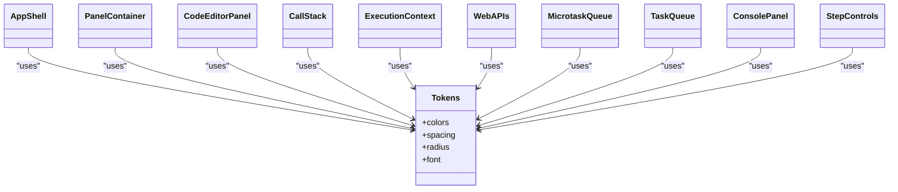

**Diagram sources**
- [tokens.ts:1-49](file://src/theme/tokens.ts#L1-L49)
- [AppShell.tsx:18-21](file://src/components/layout/AppShell.tsx#L18-L21)
- [PanelContainer.tsx:14-22](file://src/components/layout/PanelContainer.tsx#L14-L22)
- [CodeEditorPanel.tsx:103-118](file://src/components/editor/CodeEditorPanel.tsx#L103-L118)
- [CallStack.tsx:40-52](file://src/components/visualizer/CallStack.tsx#L40-L52)
- [ExecutionContext.tsx:96-100](file://src/components/visualizer/ExecutionContext.tsx#L96-L100)
- [WebAPIs.tsx:47-51](file://src/components/visualizer/WebAPIs.tsx#L47-L51)
- [ConsolePanel.tsx:101-108](file://src/components/console/ConsolePanel.tsx#L101-L108)
- [StepControls.tsx:183-202](file://src/components/controls/StepControls.tsx#L183-L202)

**Section sources**
- [tokens.ts:1-49](file://src/theme/tokens.ts#L1-L49)
- [CodeEditorPanel.tsx:20-24](file://src/components/editor/CodeEditorPanel.tsx#L20-L24)

### Component Composition Patterns and Prop Drilling Solutions
- Composition via props: AppShell accepts children for editor, visualization, controls, and console, eliminating deep prop drilling.
- Localized state: Each feature module manages its own UI state (e.g., editor options, console scroll) while subscribing to global state via the store.
- Reusable containers: PanelContainer standardizes panel headers, accents, and counts, promoting reuse across panels.

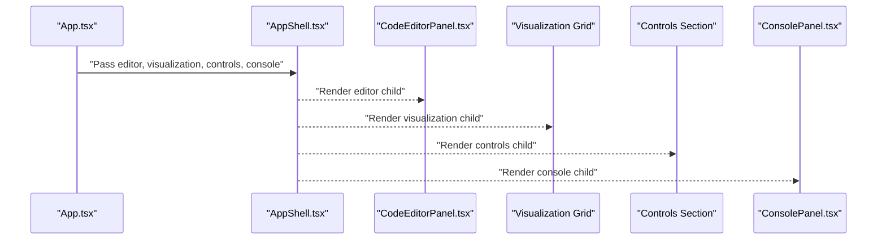

**Diagram sources**
- [App.tsx:125-137](file://src/App.tsx#L125-L137)
- [AppShell.tsx:11-121](file://src/components/layout/AppShell.tsx#L11-L121)

**Section sources**
- [App.tsx:125-137](file://src/App.tsx#L125-L137)
- [PanelContainer.tsx:12-73](file://src/components/layout/PanelContainer.tsx#L12-L73)

### Visualization Grid and Runtime Panels
- Visualization grid uses CSS Grid to arrange Call Stack, Execution Context, Web APIs, Event Loop Indicator, Microtask Queue, and Task Queue.
- Each panel is wrapped in PanelContainer and themed with distinct accent colors.
- Panels consume snapshots from the store via selectors to render runtime state.

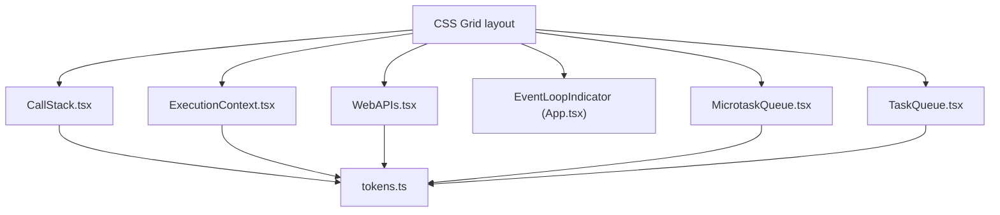

**Diagram sources**
- [App.tsx:68-106](file://src/App.tsx#L68-L106)
- [CallStack.tsx:12-78](file://src/components/visualizer/CallStack.tsx#L12-L78)
- [ExecutionContext.tsx:33-127](file://src/components/visualizer/ExecutionContext.tsx#L33-L127)
- [WebAPIs.tsx:13-153](file://src/components/visualizer/WebAPIs.tsx#L13-L153)
- [MicrotaskQueue.tsx:12-40](file://src/components/visualizer/MicrotaskQueue.tsx#L12-L40)
- [TaskQueue.tsx:12-40](file://src/components/visualizer/TaskQueue.tsx#L12-L40)
- [tokens.ts:1-49](file://src/theme/tokens.ts#L1-L49)

**Section sources**
- [App.tsx:17-123](file://src/App.tsx#L17-L123)

### Controls and Playback Integration
- StepControls provides stepping, play/pause, reset, progress bar, and speed controls.
- usePlayback sets up an interval to advance steps when playing and cleans up on unmount.
- useKeyboardShortcuts captures global key events to control playback and stepping, ignoring editor input contexts.

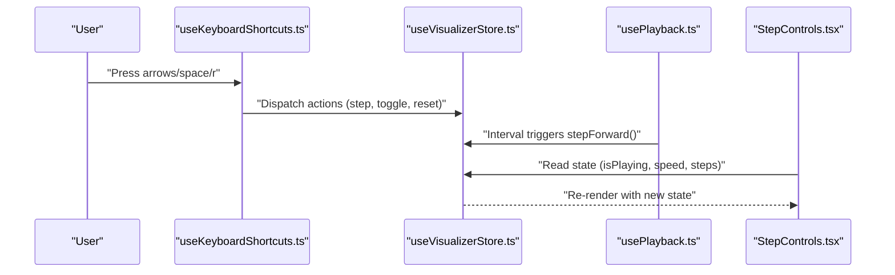

**Diagram sources**
- [usePlayback.ts:4-28](file://src/hooks/usePlayback.ts#L4-L28)
- [usePlayback.ts:30-78](file://src/hooks/usePlayback.ts#L30-L78)
- [StepControls.tsx:13-165](file://src/components/controls/StepControls.tsx#L13-L165)
- [useVisualizerStore.ts:27-98](file://src/store/useVisualizerStore.ts#L27-L98)

**Section sources**
- [usePlayback.ts:4-78](file://src/hooks/usePlayback.ts#L4-L78)
- [StepControls.tsx:13-165](file://src/components/controls/StepControls.tsx#L13-L165)

### Editor Integration and Execution Engine
- CodeEditorPanel integrates Monaco editor, applies a custom theme, and highlights the current executing line based on the snapshot.
- Running code triggers parseAndRun from the engine, which produces an ExecutionTrace stored in the Zustand store.
- The editor disables editing during execution and switches to a reset option.

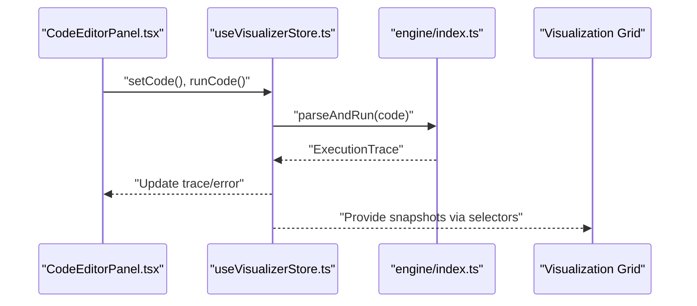

**Diagram sources**
- [CodeEditorPanel.tsx:9-161](file://src/components/editor/CodeEditorPanel.tsx#L9-L161)
- [useVisualizerStore.ts:37-50](file://src/store/useVisualizerStore.ts#L37-L50)
- [engine/index.ts:1-17](file://src/engine/index.ts#L1-L17)
- [App.tsx:17-107](file://src/App.tsx#L17-L107)

**Section sources**
- [CodeEditorPanel.tsx:9-161](file://src/components/editor/CodeEditorPanel.tsx#L9-L161)
- [useVisualizerStore.ts:37-50](file://src/store/useVisualizerStore.ts#L37-L50)
- [engine/index.ts:1-17](file://src/engine/index.ts#L1-L17)

## Dependency Analysis
- UI depends on Zustand store for state and actions.
- Animation variants depend on transitions for motion configuration.
- Theme tokens are consumed by all UI components for consistent styling.
- Editor depends on Monaco and the store for code and execution state.
- Visualization panels depend on the store’s selectors and engine types.
- Playback hooks depend on store state and actions.

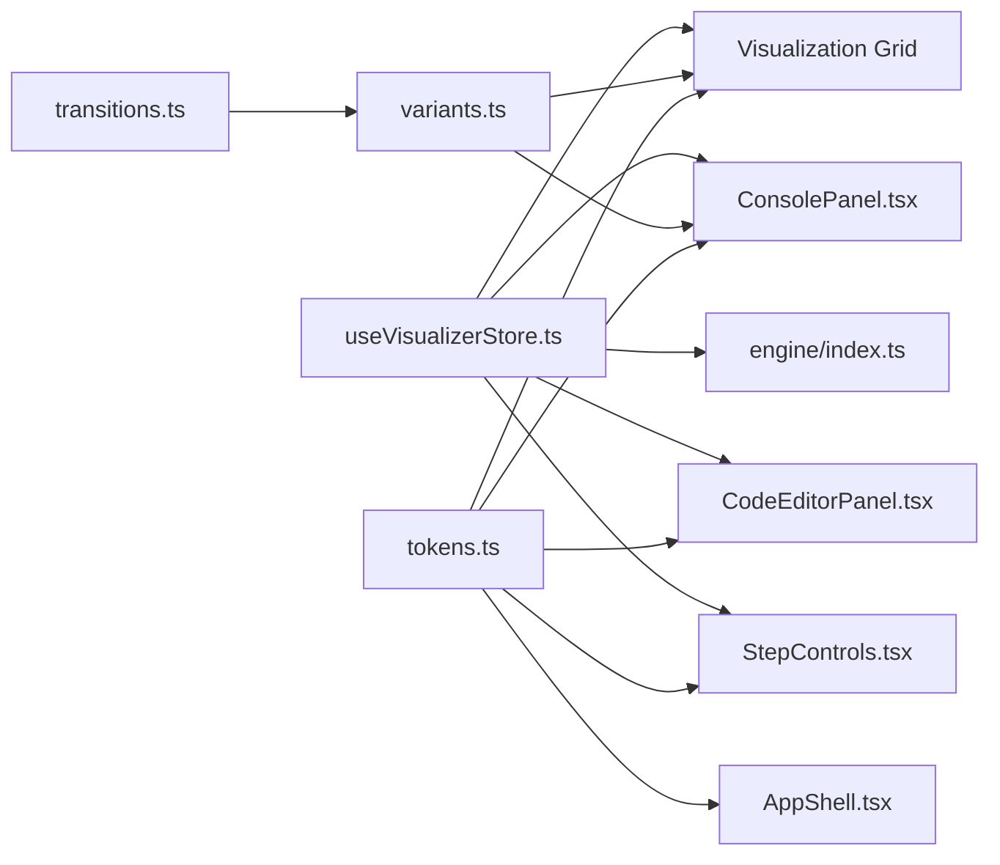

**Diagram sources**
- [useVisualizerStore.ts:27-98](file://src/store/useVisualizerStore.ts#L27-L98)
- [engine/index.ts:1-17](file://src/engine/index.ts#L1-L17)
- [CodeEditorPanel.tsx:9-161](file://src/components/editor/CodeEditorPanel.tsx#L9-L161)
- [App.tsx:17-123](file://src/App.tsx#L17-L123)
- [StepControls.tsx:13-165](file://src/components/controls/StepControls.tsx#L13-L165)
- [ConsolePanel.tsx:17-122](file://src/components/console/ConsolePanel.tsx#L17-L122)
- [variants.ts:1-39](file://src/animations/variants.ts#L1-L39)
- [transitions.ts:1-26](file://src/animations/transitions.ts#L1-L26)
- [tokens.ts:1-49](file://src/theme/tokens.ts#L1-L49)

**Section sources**
- [useVisualizerStore.ts:27-98](file://src/store/useVisualizerStore.ts#L27-L98)
- [engine/index.ts:1-17](file://src/engine/index.ts#L1-L17)
- [variants.ts:1-39](file://src/animations/variants.ts#L1-L39)
- [transitions.ts:1-26](file://src/animations/transitions.ts#L1-L26)
- [tokens.ts:1-49](file://src/theme/tokens.ts#L1-L49)

## Performance Considerations
- Primitive selectors: Using selectors that return primitive values avoids unnecessary re-renders and object churn.
- Minimal re-renders: Components subscribe only to the slices they need, reducing render overhead.
- Layout animations: AnimatePresence with popLayout and layout transitions ensure smooth DOM updates without heavy computations.
- Interval management: Playback hook clears intervals on unmount and when playback stops, preventing memory leaks.
- Editor responsiveness: Monaco options are tuned for performance (minimap off, automatic layout, reduced decorations).
- Scroll optimization: Console auto-scrolls only on new entries to avoid frequent recalculations.

[No sources needed since this section provides general guidance]

## Troubleshooting Guide
- Playback not advancing:
  - Verify isPlaying flag and playbackSpeed are set correctly in the store.
  - Confirm usePlayback hook is mounted and intervals are active.
- Keyboard shortcuts not working:
  - Ensure focus is not inside editor inputs; shortcuts ignore Monaco and input elements.
  - Check that trace exists before allowing controls.
- Editor not updating:
  - Confirm code is not locked during execution; reset to edit after running.
  - Validate Monaco mount and theme application.
- Visualizations not rendering:
  - Ensure trace exists and snapshots are available via selectors.
  - Verify panel components receive non-empty arrays for queues and stacks.

**Section sources**
- [usePlayback.ts:4-28](file://src/hooks/usePlayback.ts#L4-L28)
- [usePlayback.ts:30-78](file://src/hooks/usePlayback.ts#L30-L78)
- [CodeEditorPanel.tsx:52-50](file://src/components/editor/CodeEditorPanel.tsx#L52-L50)
- [useVisualizerStore.ts:101-109](file://src/store/useVisualizerStore.ts#L101-L109)

## Conclusion
The application employs a clean, modular architecture centered on a shell-driven composition pattern, a single-source-of-truth Zustand store, and a cohesive theme and animation system. Components are highly reusable through shared containers and tokens, while selectors and hooks minimize prop drilling and optimize performance. The integration with the execution engine is seamless, enabling real-time visualization of JavaScript runtime behavior with smooth, delightful animations.