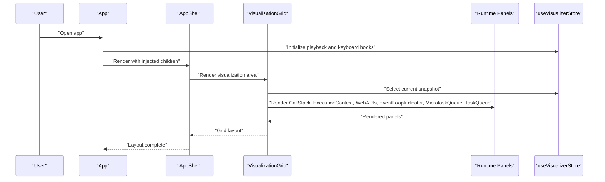
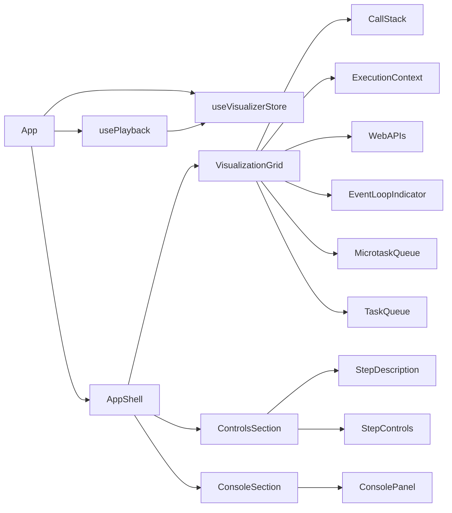

# Component Hierarchy and Relationships

<cite>
**Referenced Files in This Document**
- [App.tsx](file://src/App.tsx)
- [AppShell.tsx](file://src/components/layout/AppShell.tsx)
- [ConsolePanel.tsx](file://src/components/console/ConsolePanel.tsx)
- [StepControls.tsx](file://src/components/controls/StepControls.tsx)
- [StepDescription.tsx](file://src/components/controls/StepDescription.tsx)
- [CallStack.tsx](file://src/components/visualizer/CallStack.tsx)
- [ExecutionContext.tsx](file://src/components/visualizer/ExecutionContext.tsx)
- [WebAPIs.tsx](file://src/components/visualizer/WebAPIs.tsx)
- [MicrotaskQueue.tsx](file://src/components/visualizer/MicrotaskQueue.tsx)
- [TaskQueue.tsx](file://src/components/visualizer/TaskQueue.tsx)
- [EventLoopIndicator.tsx](file://src/components/visualizer/EventLoopIndicator.tsx)
- [PanelContainer.tsx](file://src/components/layout/PanelContainer.tsx)
- [useVisualizerStore.ts](file://src/store/useVisualizerStore.ts)
- [usePlayback.ts](file://src/hooks/usePlayback.ts)
</cite>

## Table of Contents
1. [Introduction](#introduction)
2. [Project Structure](#project-structure)
3. [Core Components](#core-components)
4. [Architecture Overview](#architecture-overview)
5. [Detailed Component Analysis](#detailed-component-analysis)
6. [Dependency Analysis](#dependency-analysis)
7. [Performance Considerations](#performance-considerations)
8. [Troubleshooting Guide](#troubleshooting-guide)
9. [Conclusion](#conclusion)

## Introduction
This document explains the React component hierarchy and relationships in the JS Visualizer application. It focuses on how the main App orchestrates major sections (editor, visualization grid, controls, and console), how AppShell serves as the primary layout container, and how the VisualizationGrid composes the runtime visualization panels. It also covers component composition patterns, prop passing, lifecycle management via hooks, conditional rendering based on execution state, and responsive layout behavior.

## Project Structure
The application follows a feature-based organization:
- Top-level App composes four primary regions: editor, visualization grid, controls, and console.
- AppShell defines the global layout grid and hosts the regions.
- VisualizationGrid renders the runtime panels using CSS Grid with named areas.
- Functional components (ControlsSection and ConsoleSection) wrap presentation components and pass derived props from the store.
- Shared layout wrapper PanelContainer standardizes panel headers and content areas.

```mermaid
graph TB
App["App<br/>src/App.tsx"] --> AppShell["AppShell<br/>src/components/layout/AppShell.tsx"]
AppShell --> Editor["CodeEditorPanel<br/>(injected)"]
AppShell --> Visualization["VisualizationGrid<br/>(injected)"]
AppShell --> Controls["ControlsSection<br/>(injected)"]
AppShell --> Console["ConsoleSection<br/>(injected)"]
Visualization --> CallStack["CallStack<br/>src/components/visualizer/CallStack.tsx"]
Visualization --> ExecutionContext["ExecutionContext<br/>src/components/visualizer/ExecutionContext.tsx"]
Visualization --> WebAPIs["WebAPIs<br/>src/components/visualizer/WebAPIs.tsx"]
Visualization --> EventLoopIndicator["EventLoopIndicator<br/>src/components/visualizer/EventLoopIndicator.tsx"]
Visualization --> MicrotaskQueue["MicrotaskQueue<br/>src/components/visualizer/MicrotaskQueue.tsx"]
Visualization --> TaskQueue["TaskQueue<br/>src/components/visualizer/TaskQueue.tsx"]
Controls --> StepDescription["StepDescription<br/>src/components/controls/StepDescription.tsx"]
Controls --> StepControls["StepControls<br/>src/components/controls/StepControls.tsx"]
Console --> ConsolePanel["ConsolePanel<br/>src/components/console/ConsolePanel.tsx"]
App --> Store["useVisualizerStore<br/>src/store/useVisualizerStore.ts"]
App --> Playback["usePlayback<br/>src/hooks/usePlayback.ts"]
```

**Diagram sources**
- [App.tsx:125-137](file://src/App.tsx#L125-L137)
- [AppShell.tsx:11-121](file://src/components/layout/AppShell.tsx#L11-L121)
- [CallStack.tsx:12-78](file://src/components/visualizer/CallStack.tsx#L12-L78)
- [ExecutionContext.tsx:33-127](file://src/components/visualizer/ExecutionContext.tsx#L33-L127)
- [WebAPIs.tsx:13-153](file://src/components/visualizer/WebAPIs.tsx#L13-L153)
- [EventLoopIndicator.tsx:30-142](file://src/components/visualizer/EventLoopIndicator.tsx#L30-L142)
- [MicrotaskQueue.tsx:12-40](file://src/components/visualizer/MicrotaskQueue.tsx#L12-L40)
- [TaskQueue.tsx:12-40](file://src/components/visualizer/TaskQueue.tsx#L12-L40)
- [StepDescription.tsx:37-86](file://src/components/controls/StepDescription.tsx#L37-L86)
- [StepControls.tsx:13-164](file://src/components/controls/StepControls.tsx#L13-L164)
- [ConsolePanel.tsx:17-122](file://src/components/console/ConsolePanel.tsx#L17-L122)
- [useVisualizerStore.ts:27-98](file://src/store/useVisualizerStore.ts#L27-L98)
- [usePlayback.ts:4-28](file://src/hooks/usePlayback.ts#L4-L28)

**Section sources**
- [App.tsx:125-137](file://src/App.tsx#L125-L137)
- [AppShell.tsx:11-121](file://src/components/layout/AppShell.tsx#L11-L121)

## Core Components
- App: Orchestrates the entire UI by injecting editor, visualization grid, controls, and console into AppShell. It initializes playback and keyboard shortcuts and derives props from the store for child sections.
- AppShell: Provides the main layout grid with two columns (editor at 400px wide, visualization area taking the rest) and three rows within the right column: visualization content, controls, and console.
- VisualizationGrid: Renders the runtime visualization using CSS Grid with named areas and conditionally renders a placeholder when there is no trace/snapshot.
- ControlsSection and ConsoleSection: Thin functional wrappers that read the current snapshot from the store and pass relevant props to StepDescription, StepControls, and ConsolePanel.
- PanelContainer: A shared layout wrapper that standardizes panel headers, counts, and content areas.

**Section sources**
- [App.tsx:125-137](file://src/App.tsx#L125-L137)
- [AppShell.tsx:72-118](file://src/components/layout/AppShell.tsx#L72-L118)
- [App.tsx:17-107](file://src/App.tsx#L17-L107)
- [App.tsx:109-123](file://src/App.tsx#L109-L123)
- [PanelContainer.tsx:12-73](file://src/components/layout/PanelContainer.tsx#L12-L73)

## Architecture Overview
The application uses a unidirectional data flow:
- App reads from the Zustand store and passes derived props to child components.
- AppShell acts as the layout coordinator, delegating region rendering to injected children.
- VisualizationGrid dynamically composes runtime panels based on the current snapshot.
- ControlsSection and ConsoleSection are pure presentational wrappers around their respective components.

**Diagram sources**
- [App.tsx:125-137](file://src/App.tsx#L125-L137)
- [AppShell.tsx:72-118](file://src/components/layout/AppShell.tsx#L72-L118)
- [App.tsx:17-107](file://src/App.tsx#L17-L107)
- [useVisualizerStore.ts:101-108](file://src/store/useVisualizerStore.ts#L101-L108)

## Detailed Component Analysis

### AppShell: Main Layout Container
Responsibilities:
- Defines the global layout with a header, a two-column grid (editor and visualization), and a bottom console region.
- Manages spacing, borders, and responsive overflow behavior.
- Receives children via props for editor, visualization, controls, and console.

Key behaviors:
- Uses CSS Grid for the main content area and Flexbox for regions.
- Ensures the visualization area scrolls independently while keeping controls and console fixed-height regions.

**Section sources**
- [AppShell.tsx:11-121](file://src/components/layout/AppShell.tsx#L11-L121)

### VisualizationGrid: Grid-Based Runtime Visualization
Responsibilities:
- Conditionally renders a placeholder when there is no trace or snapshot.
- Renders six runtime panels arranged in a 3-row, 2-column CSS Grid with named areas:
  - callstack, context
  - webapis, eventloop
  - microtasks, tasks
- Computes the current environment ID from the call stack to pass to ExecutionContext.

Prop passing:
- Passes call stack to CallStack.
- Passes environments and currentEnvId to ExecutionContext.
- Passes timers and fetches to WebAPIs.
- Passes event loop phase to EventLoopIndicator.
- Passes microtask and task queues to their respective queues.

Conditional rendering:
- Returns a centered placeholder when trace or snapshot is missing.

Responsive behavior:
- Uses flex and grid to adapt to available space; nested PanelContainers manage inner scrolling.

**Section sources**
- [App.tsx:17-107](file://src/App.tsx#L17-L107)

### ControlsSection and ConsoleSection: Functional Wrappers
ControlsSection:
- Reads the current snapshot from the store and renders StepDescription followed by StepControls.

ConsoleSection:
- Reads the current snapshot and passes console entries to ConsolePanel.

Composition pattern:
- Both are thin wrappers that derive props from the store and delegate rendering to presentation components.

**Section sources**
- [App.tsx:109-123](file://src/App.tsx#L109-L123)
- [ConsolePanel.tsx:17-122](file://src/components/console/ConsolePanel.tsx#L17-L122)
- [StepControls.tsx:13-164](file://src/components/controls/StepControls.tsx#L13-L164)
- [StepDescription.tsx:37-86](file://src/components/controls/StepDescription.tsx#L37-L86)

### Runtime Panels: PanelContainer Composition
Each runtime panel is wrapped by PanelContainer, which:
- Provides a standardized header with title, accent color, and optional count.
- Adds a consistent border, background, and inner content area with overflow handling.

Individual panels:
- CallStack: Displays stack frames with animated transitions and highlights the current frame.
- ExecutionContext: Walks the scope chain and displays bindings with colored values.
- WebAPIs: Shows timers and fetches with animated indicators.
- MicrotaskQueue and TaskQueue: Render queued tasks with shared QueueItem component.
- EventLoopIndicator: Visualizes the current phase with animated arcs and labels.

**Section sources**
- [PanelContainer.tsx:12-73](file://src/components/layout/PanelContainer.tsx#L12-L73)
- [CallStack.tsx:12-78](file://src/components/visualizer/CallStack.tsx#L12-L78)
- [ExecutionContext.tsx:33-127](file://src/components/visualizer/ExecutionContext.tsx#L33-L127)
- [WebAPIs.tsx:13-153](file://src/components/visualizer/WebAPIs.tsx#L13-L153)
- [MicrotaskQueue.tsx:12-40](file://src/components/visualizer/MicrotaskQueue.tsx#L12-L40)
- [TaskQueue.tsx:12-40](file://src/components/visualizer/TaskQueue.tsx#L12-L40)
- [EventLoopIndicator.tsx:30-142](file://src/components/visualizer/EventLoopIndicator.tsx#L30-L142)

### Component Lifecycle Management and Interactions
Playback and keyboard:
- usePlayback sets up an interval that advances steps when playback is active, respecting the configured speed.
- useKeyboardShortcuts captures global key events (arrow keys, space, r) and dispatches actions to the store, excluding editor input contexts.

Store-driven updates:
- App subscribes to playback and keyboard hooks and re-renders when store state changes.
- VisualizationGrid recomputes currentEnvId and re-renders panels when snapshots change.

Conditional rendering:
- VisualizationGrid hides panels when their collections are empty.
- ConsolePanel shows a placeholder when there are no entries and auto-scrolls on new entries.

**Section sources**
- [usePlayback.ts:4-28](file://src/hooks/usePlayback.ts#L4-L28)
- [usePlayback.ts:30-78](file://src/hooks/usePlayback.ts#L30-L78)
- [useVisualizerStore.ts:27-98](file://src/store/useVisualizerStore.ts#L27-L98)
- [App.tsx:125-137](file://src/App.tsx#L125-L137)

### Grid Layout Adaptation
- AppShell uses a two-column grid: editor (fixed width) and visualization (flexible).
- VisualizationGrid uses CSS Grid with named areas and flex children to ensure panels fill available space while maintaining scrollable content.
- PanelContainer ensures inner content remains scrollable when panels exceed available height.

**Section sources**
- [AppShell.tsx:72-118](file://src/components/layout/AppShell.tsx#L72-L118)
- [App.tsx:61-106](file://src/App.tsx#L61-L106)
- [PanelContainer.tsx:12-73](file://src/components/layout/PanelContainer.tsx#L12-L73)

## Dependency Analysis
High-level dependencies:
- App depends on AppShell and injects children.
- AppShell depends on PanelContainer indirectly through the panels it hosts.
- VisualizationGrid depends on runtime panel components and the store for snapshots.
- ControlsSection depends on StepDescription and StepControls.
- ConsoleSection depends on ConsolePanel.
- All interactive controls depend on useVisualizerStore for state and actions.
- Playback and keyboard shortcuts depend on usePlayback and the store.

**Diagram sources**
- [App.tsx:125-137](file://src/App.tsx#L125-L137)
- [AppShell.tsx:72-118](file://src/components/layout/AppShell.tsx#L72-L118)
- [useVisualizerStore.ts:27-98](file://src/store/useVisualizerStore.ts#L27-L98)
- [usePlayback.ts:4-28](file://src/hooks/usePlayback.ts#L4-L28)

**Section sources**
- [App.tsx:125-137](file://src/App.tsx#L125-L137)
- [useVisualizerStore.ts:27-98](file://src/store/useVisualizerStore.ts#L27-L98)

## Performance Considerations
- Prefer selector-based reads to minimize re-renders (as seen with snapshot selection).
- Use AnimatePresence and layout animations judiciously; they are used in panels but should remain lightweight.
- Keep grid layouts declarative and rely on flex and grid for responsiveness rather than complex calculations.
- Avoid unnecessary object creation in selectors to maintain stable references.

## Troubleshooting Guide
Common issues and checks:
- No visualization appears: Verify that a trace exists and a snapshot is selected; VisualizationGrid renders a placeholder when trace or snapshot is missing.
- Console not updating: Ensure entries are passed from the snapshot to ConsolePanel and that the component auto-scrolls on new entries.
- Controls disabled: Confirm that the trace exists and that step boundaries are respected (first/last step disables backward/forward buttons).
- Playback not advancing: Check that playback is toggled on and that the interval is active; verify playback speed setting.

**Section sources**
- [App.tsx:17-54](file://src/App.tsx#L17-L54)
- [ConsolePanel.tsx:17-24](file://src/components/console/ConsolePanel.tsx#L17-L24)
- [StepControls.tsx:13-25](file://src/components/controls/StepControls.tsx#L13-L25)
- [usePlayback.ts:4-28](file://src/hooks/usePlayback.ts#L4-L28)

## Conclusion
The JS Visualizer employs a clean separation of concerns: AppShell manages layout, App composes regions and orchestrates playback and keyboard interactions, VisualizationGrid renders runtime panels conditionally based on store state, and functional wrappers keep Controls and Console decoupled from store internals. The grid-based visualization system and shared PanelContainer provide consistent, responsive layouts across panels, while selectors and hooks ensure efficient updates and smooth user interactions.