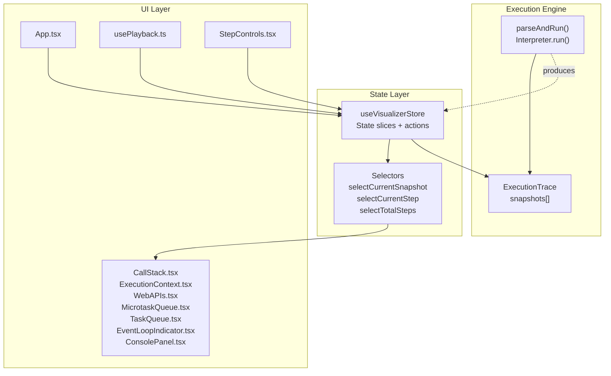
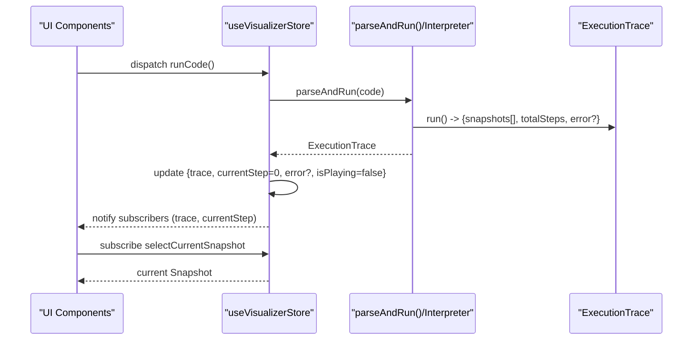
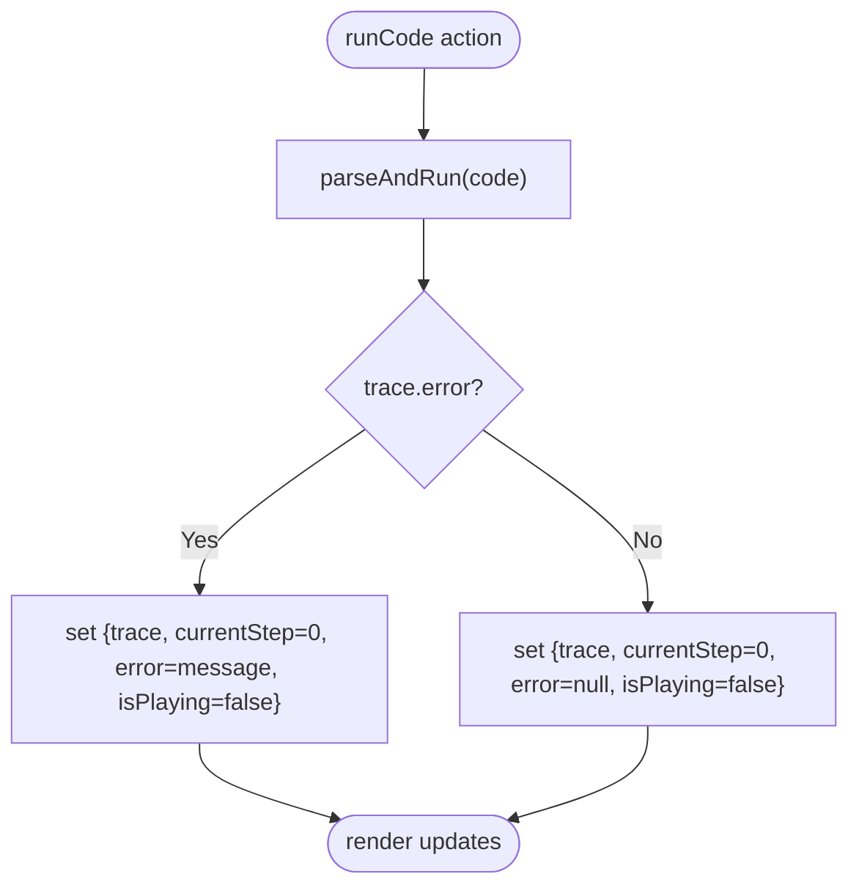
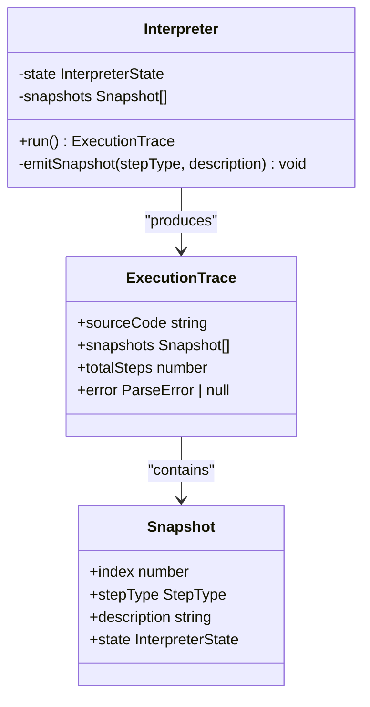
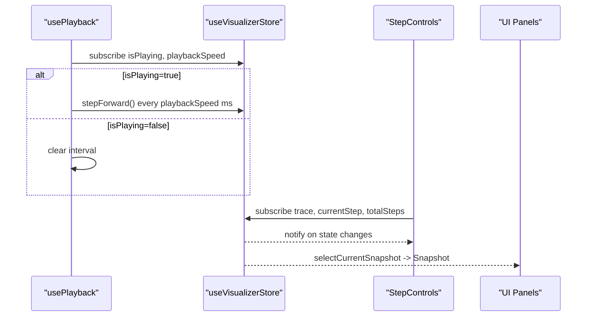
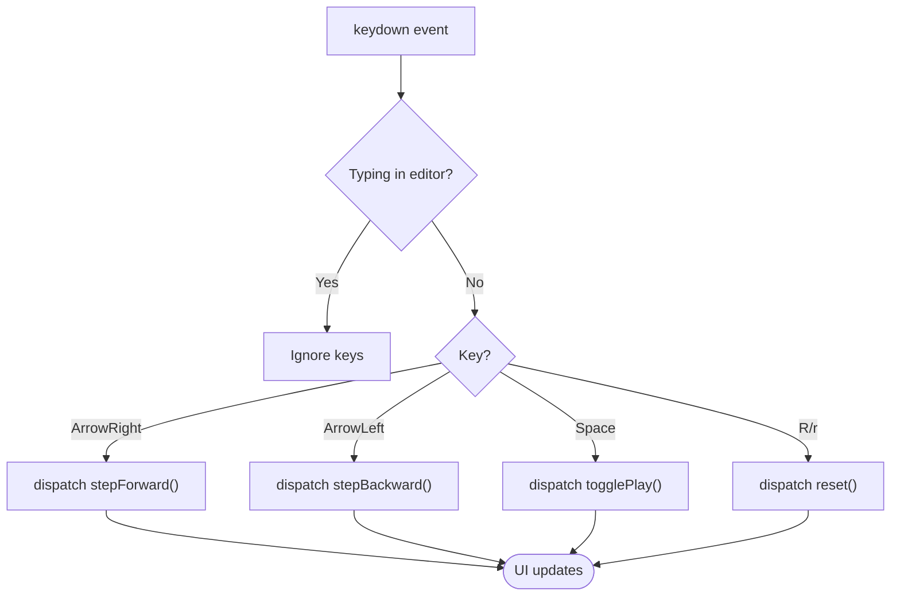
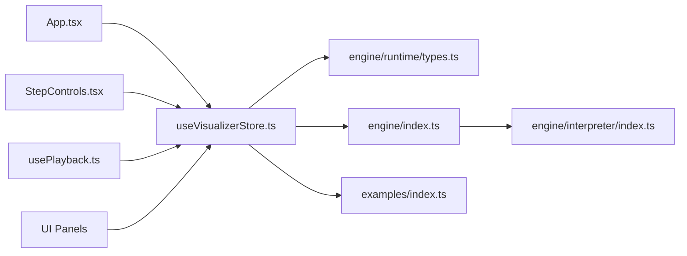

# State Management with Zustand

<cite>
**Referenced Files in This Document**
- [useVisualizerStore.ts](file://src/store/useVisualizerStore.ts)
- [index.ts](file://src/engine/interpreter/index.ts)
- [types.ts](file://src/engine/runtime/types.ts)
- [index.ts](file://src/engine/index.ts)
- [App.tsx](file://src/App.tsx)
- [usePlayback.ts](file://src/hooks/usePlayback.ts)
- [CallStack.tsx](file://src/components/visualizer/CallStack.tsx)
- [ExecutionContext.tsx](file://src/components/visualizer/ExecutionContext.tsx)
- [WebAPIs.tsx](file://src/components/visualizer/WebAPIs.tsx)
- [MicrotaskQueue.tsx](file://src/components/visualizer/MicrotaskQueue.tsx)
- [TaskQueue.tsx](file://src/components/visualizer/TaskQueue.tsx)
- [EventLoopIndicator.tsx](file://src/components/visualizer/EventLoopIndicator.tsx)
- [ConsolePanel.tsx](file://src/components/console/ConsolePanel.tsx)
- [StepControls.tsx](file://src/components/controls/StepControls.tsx)
- [index.ts](file://src/examples/index.ts)
</cite>

## Table of Contents
1. [Introduction](#introduction)
2. [Project Structure](#project-structure)
3. [Core Components](#core-components)
4. [Architecture Overview](#architecture-overview)
5. [Detailed Component Analysis](#detailed-component-analysis)
6. [Dependency Analysis](#dependency-analysis)
7. [Performance Considerations](#performance-considerations)
8. [Troubleshooting Guide](#troubleshooting-guide)
9. [Conclusion](#conclusion)

## Introduction
This document explains the Zustand-based state management system used by the JS Visualizer application. It focuses on the visualizer store that orchestrates code execution, playback control, and UI state. It also details how the store integrates with the execution engine to produce and consume execution traces and snapshots, and how UI components subscribe to specific parts of the state for efficient rendering.

## Project Structure
The state management lives in a single Zustand store module and is consumed by React components and hooks across the app. The execution engine produces a trace of snapshots that the store holds and exposes via selectors.

**Diagram sources**
- [useVisualizerStore.ts:27-98](file://src/store/useVisualizerStore.ts#L27-L98)
- [index.ts:1361-1365](file://src/engine/interpreter/index.ts#L1361-L1365)
- [types.ts:235-240](file://src/engine/runtime/types.ts#L235-L240)
- [App.tsx:125-137](file://src/App.tsx#L125-L137)
- [usePlayback.ts:4-28](file://src/hooks/usePlayback.ts#L4-L28)
- [StepControls.tsx:13-24](file://src/components/controls/StepControls.tsx#L13-L24)

**Section sources**
- [useVisualizerStore.ts:1-109](file://src/store/useVisualizerStore.ts#L1-L109)
- [index.ts:1-17](file://src/engine/index.ts#L1-L17)
- [App.tsx:1-138](file://src/App.tsx#L1-L138)

## Core Components
- Visualizer store: Holds code, execution trace, current step, playback state, playback speed, and error. Provides actions to run code, step forward/backward, jump to step, play/pause, toggle, reset, change speed, and load examples. Exposes selectors for efficient re-renders.
- Execution engine: Produces an ExecutionTrace containing snapshots at each step of execution. Snapshots include a step type, description, and a deep-cloned InterpreterState snapshot.
- UI integration: Components subscribe to specific slices via primitive selectors to minimize re-renders. Hooks coordinate playback and keyboard shortcuts.

Key store selectors:
- selectCurrentSnapshot: Returns the current Snapshot from the trace at currentStep.
- selectCurrentStep: Primitive selector for current step index.
- selectTotalSteps: Primitive selector for total steps in the trace.

Actions:
- setCode, runCode, stepForward, stepBackward, jumpToStep, play, pause, togglePlay, reset, setSpeed, loadExample.

**Section sources**
- [useVisualizerStore.ts:5-25](file://src/store/useVisualizerStore.ts#L5-L25)
- [useVisualizerStore.ts:27-98](file://src/store/useVisualizerStore.ts#L27-L98)
- [useVisualizerStore.ts:100-109](file://src/store/useVisualizerStore.ts#L100-L109)
- [types.ts:226-240](file://src/engine/runtime/types.ts#L226-L240)

## Architecture Overview
The store coordinates between the UI and the execution engine. The engine generates snapshots during execution, which the store persists and exposes to components. Components subscribe to only the parts they need, enabling fine-grained reactivity.

**Diagram sources**
- [useVisualizerStore.ts:37-50](file://src/store/useVisualizerStore.ts#L37-L50)
- [index.ts:1361-1365](file://src/engine/interpreter/index.ts#L1361-L1365)
- [types.ts:235-240](file://src/engine/runtime/types.ts#L235-L240)

## Detailed Component Analysis

### Store: useVisualizerStore
Responsibilities:
- Manage code, trace, currentStep, isPlaying, playbackSpeed, error.
- Actions to drive execution and playback lifecycle.
- Selectors for efficient subscription patterns.

State slices and actions:
- State: code, trace, currentStep, isPlaying, playbackSpeed, error.
- Actions: setCode, runCode, stepForward, stepBackward, jumpToStep, play, pause, togglePlay, reset, setSpeed, loadExample.

Playback integration:
- usePlayback hook reads isPlaying and playbackSpeed from the store and invokes stepForward on intervals.

Selectors:
- selectCurrentSnapshot: returns the current Snapshot from trace.snapshots[currentStep].
- selectCurrentStep: returns currentStep.
- selectTotalSteps: returns trace.totalSteps or 0.

**Diagram sources**
- [useVisualizerStore.ts:37-50](file://src/store/useVisualizerStore.ts#L37-L50)
- [index.ts:1361-1365](file://src/engine/interpreter/index.ts#L1361-L1365)

**Section sources**
- [useVisualizerStore.ts:27-98](file://src/store/useVisualizerStore.ts#L27-L98)
- [usePlayback.ts:4-28](file://src/hooks/usePlayback.ts#L4-L28)

### Execution Engine: parseAndRun and Interpreter
The engine builds an ExecutionTrace with snapshots at each significant step. Each Snapshot contains:
- index: snapshot index
- stepType: semantic step type
- description: human-readable description
- state: a deep clone of the interpreter’s runtime state at that moment

Key behaviors:
- emitSnapshot is called around major events (declarations, assignments, function calls/returns, promise operations, timers, fetches, await, program start/end, errors).
- run() parses the AST, executes statements, drains the event loop, and returns the trace.
- The interpreter enforces a maximum step count to prevent infinite loops.

**Diagram sources**
- [index.ts:75-135](file://src/engine/interpreter/index.ts#L75-L135)
- [index.ts:139-150](file://src/engine/interpreter/index.ts#L139-L150)
- [types.ts:235-240](file://src/engine/runtime/types.ts#L235-L240)
- [types.ts:226-231](file://src/engine/runtime/types.ts#L226-L231)

**Section sources**
- [index.ts:75-135](file://src/engine/interpreter/index.ts#L75-L135)
- [index.ts:139-150](file://src/engine/interpreter/index.ts#L139-L150)
- [types.ts:183-195](file://src/engine/runtime/types.ts#L183-L195)

### UI Integration: Components and Hooks
- App.tsx composes panels and subscribes to selectCurrentSnapshot to render the visualization grid.
- StepControls.tsx subscribes to trace, playback state, and selectors for current step and total steps to render controls and progress.
- usePlayback.ts reads isPlaying and playbackSpeed and triggers stepForward on intervals.
- useKeyboardShortcuts.ts listens to keydown events and dispatches actions based on trace presence and focus context.
- Visualizer panels (CallStack, ExecutionContext, WebAPIs, MicrotaskQueue, TaskQueue, EventLoopIndicator) receive data from the current snapshot’s state.

**Diagram sources**
- [usePlayback.ts:4-28](file://src/hooks/usePlayback.ts#L4-L28)
- [StepControls.tsx:13-24](file://src/components/controls/StepControls.tsx#L13-L24)
- [App.tsx:17-107](file://src/App.tsx#L17-L107)

**Section sources**
- [App.tsx:17-107](file://src/App.tsx#L17-L107)
- [StepControls.tsx:13-24](file://src/components/controls/StepControls.tsx#L13-L24)
- [usePlayback.ts:4-28](file://src/hooks/usePlayback.ts#L4-L28)
- [usePlayback.ts:30-79](file://src/hooks/usePlayback.ts#L30-L79)

### Selectors and Subscriptions
- selectCurrentSnapshot: Efficiently returns the current Snapshot without forcing re-renders of unrelated UI parts.
- selectCurrentStep and selectTotalSteps: Primitive selectors ensure minimal re-renders because they return scalar values.

Examples of subscriptions:
- App.tsx: Uses selectCurrentSnapshot to render CallStack, ExecutionContext, WebAPIs, EventLoopIndicator, MicrotaskQueue, TaskQueue.
- StepControls.tsx: Uses selectCurrentStep and selectTotalSteps to render step counter and progress bar.

Best practices:
- Prefer primitive selectors for scalars.
- Use object-returning selectors only when you need a cohesive object and want coarse-grained re-renders.

**Section sources**
- [useVisualizerStore.ts:100-109](file://src/store/useVisualizerStore.ts#L100-L109)
- [App.tsx:17-107](file://src/App.tsx#L17-L107)
- [StepControls.tsx:13-24](file://src/components/controls/StepControls.tsx#L13-L24)

### Playback and Keyboard Shortcuts
- usePlayback: Starts/stops an interval based on isPlaying and playbackSpeed, invoking stepForward each tick.
- useKeyboardShortcuts: Dispatches stepForward, stepBackward, togglePlay, reset depending on key presses and focus context.

**Diagram sources**
- [usePlayback.ts:30-79](file://src/hooks/usePlayback.ts#L30-L79)

**Section sources**
- [usePlayback.ts:4-28](file://src/hooks/usePlayback.ts#L4-L28)
- [usePlayback.ts:30-79](file://src/hooks/usePlayback.ts#L30-L79)

## Dependency Analysis
- Store depends on:
  - Engine types and parseAndRun to produce ExecutionTrace.
  - Examples to populate initial code.
- UI components depend on:
  - Store selectors for data.
  - Hooks for playback and keyboard control.
- Engine depends on:
  - Parser to convert code to AST.
  - Runtime types for state modeling.

**Diagram sources**
- [useVisualizerStore.ts:1-4](file://src/store/useVisualizerStore.ts#L1-L4)
- [index.ts:1-17](file://src/engine/index.ts#L1-L17)
- [App.tsx:125-137](file://src/App.tsx#L125-L137)
- [StepControls.tsx:13-24](file://src/components/controls/StepControls.tsx#L13-L24)
- [usePlayback.ts:4-28](file://src/hooks/usePlayback.ts#L4-L28)

**Section sources**
- [useVisualizerStore.ts:1-4](file://src/store/useVisualizerStore.ts#L1-L4)
- [index.ts:1-17](file://src/engine/index.ts#L1-L17)
- [App.tsx:125-137](file://src/App.tsx#L125-L137)

## Performance Considerations
- Selective re-rendering:
  - Use primitive selectors (e.g., selectCurrentStep, selectTotalSteps) to avoid unnecessary renders when only scalar state changes.
  - Use object-returning selectors (e.g., selectCurrentSnapshot) when you need a cohesive snapshot object and accept coarser re-renders.
- Snapshot cloning:
  - Snapshots are deep-cloned at each step to ensure immutability and safe UI rendering. This adds memory overhead proportional to the size of InterpreterState at each step.
- Playback interval:
  - Playback speed is controlled by playbackSpeed; keep reasonable values to avoid excessive re-renders.
- Maximum steps:
  - The interpreter enforces a maximum step count to prevent infinite loops and runaway memory usage.

[No sources needed since this section provides general guidance]

## Troubleshooting Guide
Common issues and resolutions:
- No visualization after running:
  - Ensure runCode was dispatched and trace is populated. Verify error is null.
  - Confirm selectCurrentSnapshot returns a non-null snapshot.
- Playback does not advance:
  - Check isPlaying is true and playbackSpeed is set. Verify usePlayback hook clears intervals properly on unmount.
- Keyboard shortcuts not working:
  - Ensure the editor is not focused. The shortcut handler ignores events inside editor elements.
- Infinite loop or slow execution:
  - The interpreter throws if maximum steps are exceeded. Reduce complexity of example code or increase maxSteps if appropriate.

**Section sources**
- [useVisualizerStore.ts:37-50](file://src/store/useVisualizerStore.ts#L37-L50)
- [usePlayback.ts:4-28](file://src/hooks/usePlayback.ts#L4-L28)
- [usePlayback.ts:30-79](file://src/hooks/usePlayback.ts#L30-L79)
- [index.ts:139-150](file://src/engine/interpreter/index.ts#L139-L150)

## Conclusion
The Zustand store centralizes execution state and playback control, integrating tightly with the execution engine to expose immutable snapshots to the UI. Primitive selectors enable efficient re-renders, while hooks coordinate interactive playback and keyboard-driven stepping. The system balances clarity, performance, and maintainability for a complex visualization domain.