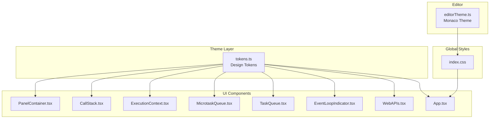
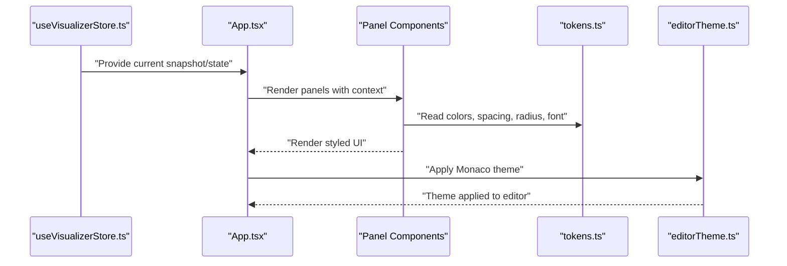
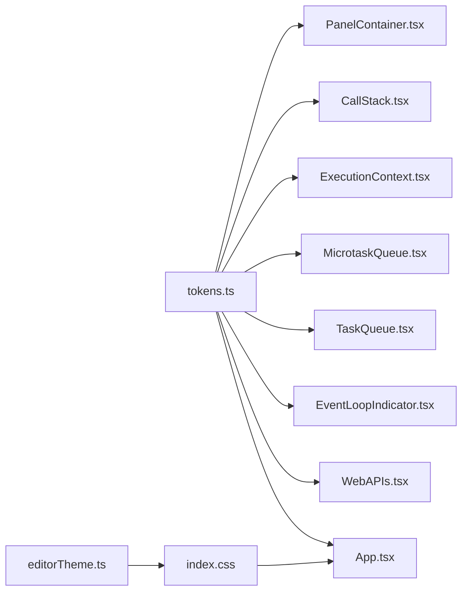

# Theming and Design Tokens

<cite>
**Referenced Files in This Document**
- [tokens.ts](file://src/theme/tokens.ts)
- [editorTheme.ts](file://src/components/editor/editorTheme.ts)
- [index.css](file://src/index.css)
- [App.tsx](file://src/App.tsx)
- [PanelContainer.tsx](file://src/components/layout/PanelContainer.tsx)
- [CallStack.tsx](file://src/components/visualizer/CallStack.tsx)
- [ExecutionContext.tsx](file://src/components/visualizer/ExecutionContext.tsx)
- [MicrotaskQueue.tsx](file://src/components/visualizer/MicrotaskQueue.tsx)
- [TaskQueue.tsx](file://src/components/visualizer/TaskQueue.tsx)
- [EventLoopIndicator.tsx](file://src/components/visualizer/EventLoopIndicator.tsx)
- [WebAPIs.tsx](file://src/components/visualizer/WebAPIs.tsx)
- [useVisualizerStore.ts](file://src/store/useVisualizerStore.ts)
- [variants.ts](file://src/animations/variants.ts)
</cite>

## Table of Contents
1. [Introduction](#introduction)
2. [Project Structure](#project-structure)
3. [Core Components](#core-components)
4. [Architecture Overview](#architecture-overview)
5. [Detailed Component Analysis](#detailed-component-analysis)
6. [Dependency Analysis](#dependency-analysis)
7. [Performance Considerations](#performance-considerations)
8. [Troubleshooting Guide](#troubleshooting-guide)
9. [Conclusion](#conclusion)
10. [Appendices](#appendices)

## Introduction
This document explains the design system and theming architecture of the JS Visualizer application. It focuses on the centralized design tokens that define colors, typography, spacing, and radii, and how these tokens are organized by semantic meaning to represent JavaScript execution contexts. It also documents how the theme system integrates with component styling and custom editor themes, and how visual metaphors (such as distinct accent colors for call stack, microtask, and context) support learning. Finally, it provides guidelines for extending the theme system, adding new tokens, and maintaining design consistency, along with accessibility considerations for color and contrast.

## Project Structure
The theming system is centered around a single source of truth for design tokens and is consumed across components and the editor theme. The key files are:
- Design tokens: [tokens.ts](file://src/theme/tokens.ts)
- Editor theme: [editorTheme.ts](file://src/components/editor/editorTheme.ts)
- Global styles and base colors: [index.css](file://src/index.css)
- Component consumers: [PanelContainer.tsx](file://src/components/layout/PanelContainer.tsx), [CallStack.tsx](file://src/components/visualizer/CallStack.tsx), [ExecutionContext.tsx](file://src/components/visualizer/ExecutionContext.tsx), [MicrotaskQueue.tsx](file://src/components/visualizer/MicrotaskQueue.tsx), [TaskQueue.tsx](file://src/components/visualizer/TaskQueue.tsx), [EventLoopIndicator.tsx](file://src/components/visualizer/EventLoopIndicator.tsx), [WebAPIs.tsx](file://src/components/visualizer/WebAPIs.tsx)
- Application shell and token usage: [App.tsx](file://src/App.tsx)
- Store and snapshots: [useVisualizerStore.ts](file://src/store/useVisualizerStore.ts)
- Animation variants: [variants.ts](file://src/animations/variants.ts)

**Diagram sources**
- [tokens.ts](file://src/theme/tokens.ts)
- [PanelContainer.tsx](file://src/components/layout/PanelContainer.tsx)
- [CallStack.tsx](file://src/components/visualizer/CallStack.tsx)
- [ExecutionContext.tsx](file://src/components/visualizer/ExecutionContext.tsx)
- [MicrotaskQueue.tsx](file://src/components/visualizer/MicrotaskQueue.tsx)
- [TaskQueue.tsx](file://src/components/visualizer/TaskQueue.tsx)
- [EventLoopIndicator.tsx](file://src/components/visualizer/EventLoopIndicator.tsx)
- [WebAPIs.tsx](file://src/components/visualizer/WebAPIs.tsx)
- [App.tsx](file://src/App.tsx)
- [editorTheme.ts](file://src/components/editor/editorTheme.ts)
- [index.css](file://src/index.css)

**Section sources**
- [tokens.ts](file://src/theme/tokens.ts)
- [editorTheme.ts](file://src/components/editor/editorTheme.ts)
- [index.css](file://src/index.css)
- [App.tsx](file://src/App.tsx)

## Core Components
- Design tokens: Centralized definitions for colors, spacing, radii, and fonts. Organized by semantic categories (background, accent, text, border) and grouped by functional meaning (e.g., call stack, microtask, context).
- PanelContainer: A reusable panel wrapper that applies consistent spacing, borders, and typography using tokens, and accepts an accent color for contextual highlighting.
- Component panels: Each major panel (CallStack, ExecutionContext, MicrotaskQueue, TaskQueue, WebAPIs, EventLoopIndicator) consumes tokens to maintain a unified look-and-feel and to align with execution context metaphors.
- Editor theme: A Monaco theme definition that harmonizes with the app’s dark palette and uses tokens for consistent backgrounds and highlights.

Key token categories:
- colors.bg: app, panel, panelHeader, editor, surface, surfaceHover
- colors.accent: callStack, context, webAPI, microtask, taskQueue, eventLoop, console
- colors.text: primary, secondary, muted
- colors.border: panel, active
- spacing: xs, sm, md, lg, xl, xxl, xxxl
- radius: sm, md, lg
- font: code, ui

How tokens ensure consistency:
- All components import tokens and apply them directly in inline styles or via shared wrappers like PanelContainer.
- The editor theme mirrors the dark palette and uses consistent background and foreground values aligned with tokens.

**Section sources**
- [tokens.ts](file://src/theme/tokens.ts)
- [PanelContainer.tsx](file://src/components/layout/PanelContainer.tsx)
- [CallStack.tsx](file://src/components/visualizer/CallStack.tsx)
- [ExecutionContext.tsx](file://src/components/visualizer/ExecutionContext.tsx)
- [MicrotaskQueue.tsx](file://src/components/visualizer/MicrotaskQueue.tsx)
- [TaskQueue.tsx](file://src/components/visualizer/TaskQueue.tsx)
- [EventLoopIndicator.tsx](file://src/components/visualizer/EventLoopIndicator.tsx)
- [WebAPIs.tsx](file://src/components/visualizer/WebAPIs.tsx)
- [editorTheme.ts](file://src/components/editor/editorTheme.ts)
- [index.css](file://src/index.css)

## Architecture Overview
The theming architecture follows a unidirectional data flow:
- Tokens define the visual language.
- Components consume tokens to render UI consistently.
- The editor theme consumes tokens to keep the code editor visually coherent.
- Global CSS provides baseline styles and ensures accessibility-friendly defaults.

**Diagram sources**
- [useVisualizerStore.ts](file://src/store/useVisualizerStore.ts)
- [App.tsx](file://src/App.tsx)
- [tokens.ts](file://src/theme/tokens.ts)
- [editorTheme.ts](file://src/components/editor/editorTheme.ts)

## Detailed Component Analysis

### Design Tokens Organization and Semantics
The tokens are organized by semantic meaning to reflect JavaScript execution contexts:
- Accent colors:
  - callStack: Reddish tone for synchronous call frames
  - context: Teal-like color for scope/variables
  - webAPI: Blue tone for timers and fetches
  - microtask: Yellow/gold tone for microtasks
  - taskQueue: Pink tone for macrotasks
  - eventLoop: Green tone for loop activity
  - console: Light teal for console output
- Backgrounds and surfaces:
  - Dark app background, panel backgrounds, editor background, and hover states
- Typography:
  - UI font for labels and controls
  - Monospace font for code and values
- Spacing and radii:
  - Consistent spacing scale and border radii across components

These choices create a visual metaphor that helps learners associate UI elements with runtime concepts.

**Section sources**
- [tokens.ts](file://src/theme/tokens.ts)

### PanelContainer Integration
PanelContainer applies tokens to:
- Panel background and header background
- Borders and hover states
- Typography and uppercase labeling
- Dynamic count badges using accent colors

This wrapper ensures all panels share a consistent look and allows accent colors to be injected per panel.

**Section sources**
- [PanelContainer.tsx](file://src/components/layout/PanelContainer.tsx)
- [tokens.ts](file://src/theme/tokens.ts)

### Call Stack Panel
- Uses the call stack accent color for active frame highlighting and borders.
- Applies muted text for empty states and monospace font for labels.
- Leverages PanelContainer for consistent borders and spacing.

**Section sources**
- [CallStack.tsx](file://src/components/visualizer/CallStack.tsx)
- [PanelContainer.tsx](file://src/components/layout/PanelContainer.tsx)
- [tokens.ts](file://src/theme/tokens.ts)

### Execution Context Panel
- Uses the context accent color for scope headers.
- Dynamically colors variable values by type using a dedicated color mapping.
- Applies surface backgrounds and muted text for readability.

**Section sources**
- [ExecutionContext.tsx](file://src/components/visualizer/ExecutionContext.tsx)
- [tokens.ts](file://src/theme/tokens.ts)

### Microtask Queue Panel
- Uses the microtask accent color for panel identity and queue items.
- Applies surface backgrounds and consistent spacing.

**Section sources**
- [MicrotaskQueue.tsx](file://src/components/visualizer/MicrotaskQueue.tsx)
- [tokens.ts](file://src/theme/tokens.ts)

### Task Queue Panel
- Uses the taskQueue accent color for panel identity.
- Mirrors queue item rendering patterns.

**Section sources**
- [TaskQueue.tsx](file://src/components/visualizer/TaskQueue.tsx)
- [tokens.ts](file://src/theme/tokens.ts)

### Web APIs Panel
- Uses the webAPI accent color for timers and fetch indicators.
- Renders animated progress indicators and loading states with consistent spacing and borders.

**Section sources**
- [WebAPIs.tsx](file://src/components/visualizer/WebAPIs.tsx)
- [tokens.ts](file://src/theme/tokens.ts)

### Event Loop Indicator
- Maps phases to colors using tokens for visual clarity.
- Renders a circular indicator with motion and phase badges using accent colors and translucent overlays.

**Section sources**
- [EventLoopIndicator.tsx](file://src/components/visualizer/EventLoopIndicator.tsx)
- [tokens.ts](file://src/theme/tokens.ts)

### Editor Theme Integration
- The Monaco theme aligns with the app’s dark palette and uses consistent background and foreground values.
- Line highlights, selection, and gutter colors are tuned for readability and contrast.

**Section sources**
- [editorTheme.ts](file://src/components/editor/editorTheme.ts)
- [index.css](file://src/index.css)

### Application Shell and Token Usage
- The main App renders a grid of panels and uses tokens for gradient accents and muted text.
- Tokens are imported centrally to ensure consistency across the shell and panels.

**Section sources**
- [App.tsx](file://src/App.tsx)
- [tokens.ts](file://src/theme/tokens.ts)

### Animations and Motion
- Animation variants define transitions and motion behavior for lists and panels.
- While not directly styling, they complement the theming by animating between token-driven states.

**Section sources**
- [variants.ts](file://src/animations/variants.ts)

## Dependency Analysis
The dependency graph shows how components depend on tokens and how the editor theme depends on global styles.

**Diagram sources**
- [tokens.ts](file://src/theme/tokens.ts)
- [PanelContainer.tsx](file://src/components/layout/PanelContainer.tsx)
- [CallStack.tsx](file://src/components/visualizer/CallStack.tsx)
- [ExecutionContext.tsx](file://src/components/visualizer/ExecutionContext.tsx)
- [MicrotaskQueue.tsx](file://src/components/visualizer/MicrotaskQueue.tsx)
- [TaskQueue.tsx](file://src/components/visualizer/TaskQueue.tsx)
- [EventLoopIndicator.tsx](file://src/components/visualizer/EventLoopIndicator.tsx)
- [WebAPIs.tsx](file://src/components/visualizer/WebAPIs.tsx)
- [App.tsx](file://src/App.tsx)
- [editorTheme.ts](file://src/components/editor/editorTheme.ts)
- [index.css](file://src/index.css)

**Section sources**
- [tokens.ts](file://src/theme/tokens.ts)
- [PanelContainer.tsx](file://src/components/layout/PanelContainer.tsx)
- [CallStack.tsx](file://src/components/visualizer/CallStack.tsx)
- [ExecutionContext.tsx](file://src/components/visualizer/ExecutionContext.tsx)
- [MicrotaskQueue.tsx](file://src/components/visualizer/MicrotaskQueue.tsx)
- [TaskQueue.tsx](file://src/components/visualizer/TaskQueue.tsx)
- [EventLoopIndicator.tsx](file://src/components/visualizer/EventLoopIndicator.tsx)
- [WebAPIs.tsx](file://src/components/visualizer/WebAPIs.tsx)
- [App.tsx](file://src/App.tsx)
- [editorTheme.ts](file://src/components/editor/editorTheme.ts)
- [index.css](file://src/index.css)

## Performance Considerations
- Centralized tokens reduce duplication and improve render performance by avoiding repeated inline color calculations.
- Using tokens in a single module enables efficient caching and minimizes re-renders when theme updates are scoped.
- Keep token additions minimal and focused to prevent unnecessary style churn.

## Troubleshooting Guide
Common issues and resolutions:
- Mismatched accent colors: Verify that each panel passes the correct accent token to PanelContainer.
- Low contrast text: Ensure text colors (primary, secondary, muted) are used appropriately against backgrounds.
- Editor theme inconsistencies: Confirm editor theme values align with tokens.bg.editor and tokens.text.*.
- Global style overrides: Check index.css for unintended resets or overrides affecting panels or the editor.

**Section sources**
- [PanelContainer.tsx](file://src/components/layout/PanelContainer.tsx)
- [tokens.ts](file://src/theme/tokens.ts)
- [editorTheme.ts](file://src/components/editor/editorTheme.ts)
- [index.css](file://src/index.css)

## Conclusion
The JS Visualizer employs a clean, centralized design token system that organizes visual properties by semantic meaning and execution context. Components consistently consume tokens through a shared panel wrapper and direct inline styles, ensuring a cohesive look-and-feel. The editor theme complements the UI by mirroring the dark palette and enhancing readability. Visual metaphors—such as distinct accent colors for call stack, microtask, and context—support learning and mental models of JavaScript execution. Following the extension guidelines below will help maintain design consistency and accessibility.

## Appendices

### Color Scheme Strategy for Execution Contexts
- callStack: Reddish accent for synchronous frames
- context: Teal-like accent for scope/variables
- webAPI: Blue accent for timers and fetches
- microtask: Yellow/gold accent for microtasks
- taskQueue: Pink accent for macrotasks
- eventLoop: Green accent for loop activity
- console: Light teal accent for console output

These associations reinforce conceptual understanding by linking UI colors to runtime mechanisms.

**Section sources**
- [tokens.ts](file://src/theme/tokens.ts)
- [CallStack.tsx](file://src/components/visualizer/CallStack.tsx)
- [ExecutionContext.tsx](file://src/components/visualizer/ExecutionContext.tsx)
- [WebAPIs.tsx](file://src/components/visualizer/WebAPIs.tsx)
- [MicrotaskQueue.tsx](file://src/components/visualizer/MicrotaskQueue.tsx)
- [TaskQueue.tsx](file://src/components/visualizer/TaskQueue.tsx)
- [EventLoopIndicator.tsx](file://src/components/visualizer/EventLoopIndicator.tsx)

### Guidelines for Extending the Theme System
- Add new tokens to tokens.ts under the appropriate category (colors.bg, colors.accent, colors.text, colors.border, spacing, radius, font).
- Import tokens in components and apply them consistently (e.g., backgrounds, borders, accents).
- For new panels, wrap content with PanelContainer to inherit consistent spacing and typography.
- When updating the editor theme, mirror token values to maintain harmony between editor and UI.
- Maintain a consistent spacing scale and radii to preserve visual rhythm.

**Section sources**
- [tokens.ts](file://src/theme/tokens.ts)
- [PanelContainer.tsx](file://src/components/layout/PanelContainer.tsx)
- [editorTheme.ts](file://src/components/editor/editorTheme.ts)

### Accessibility Considerations
- Contrast ratios: Ensure sufficient contrast between text and backgrounds (e.g., primary text on panelHeader/surface).
- Color reliance: Avoid conveying critical information using color alone; pair colors with labels or icons.
- Focus indicators: Use tokens for focus outlines to maintain visibility and consistency.
- Readability: Prefer tokens for monospace fonts in code areas and UI fonts for labels.

**Section sources**
- [index.css](file://src/index.css)
- [tokens.ts](file://src/theme/tokens.ts)