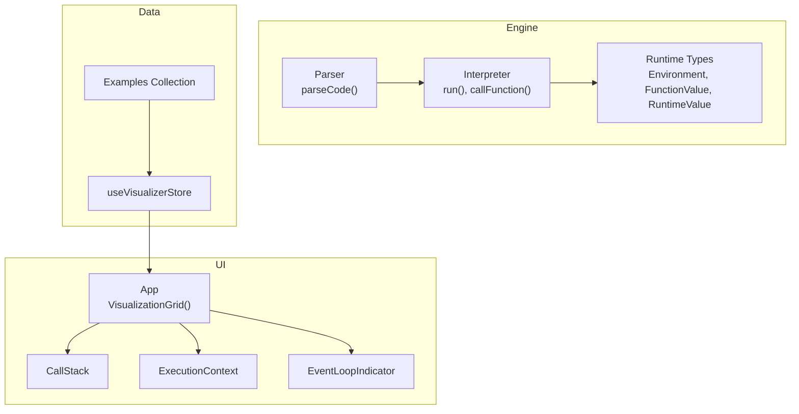
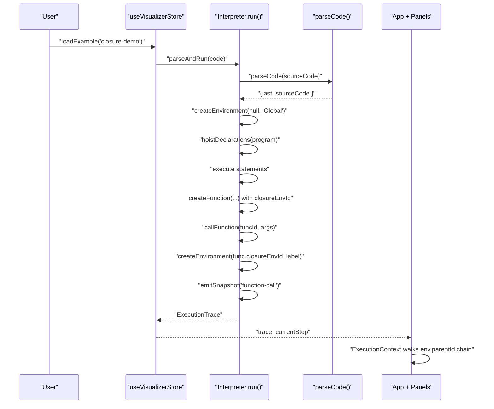
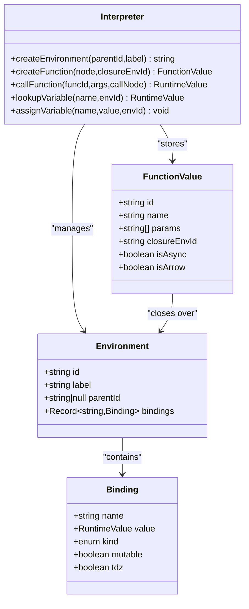
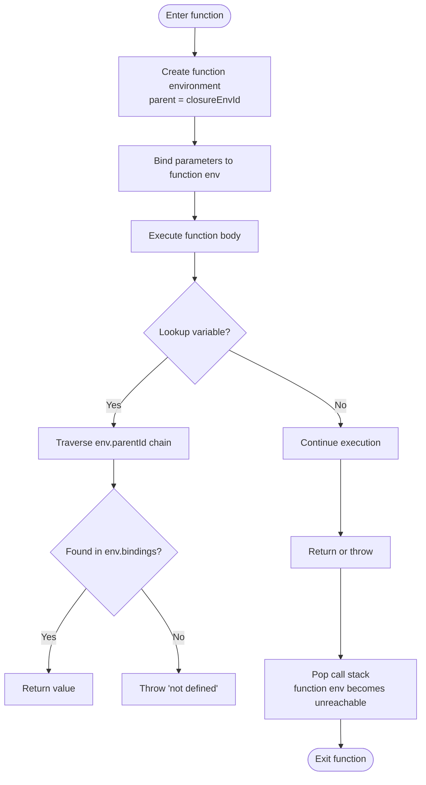
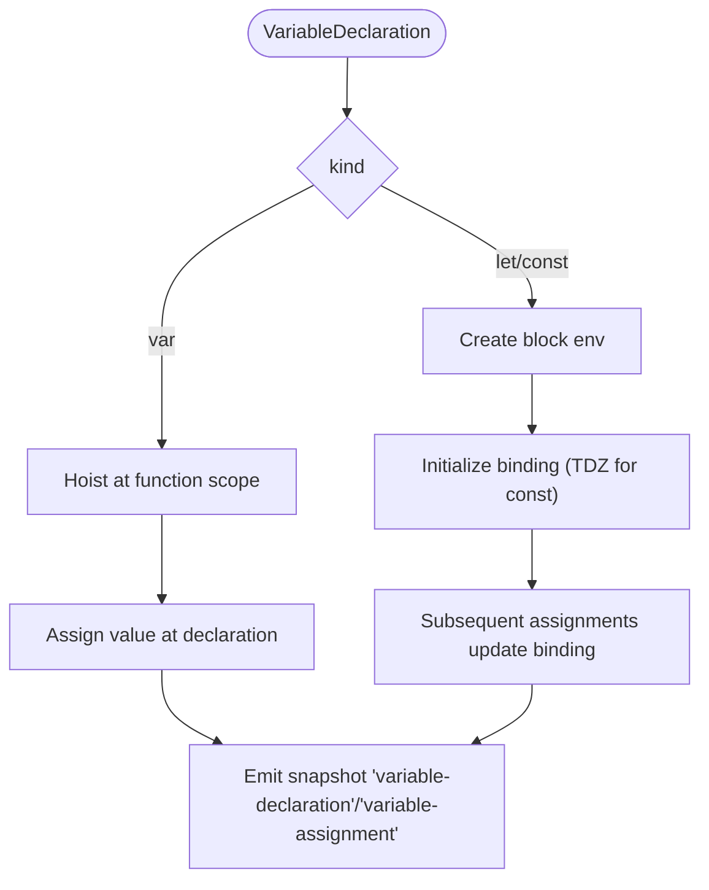
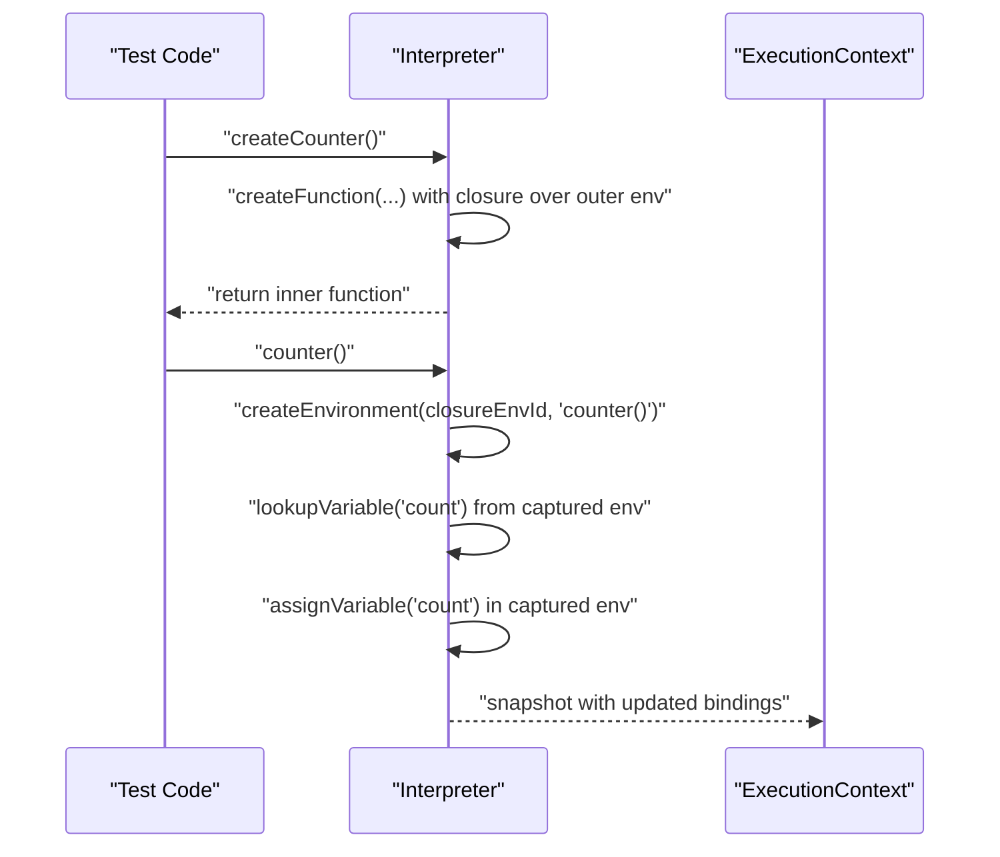
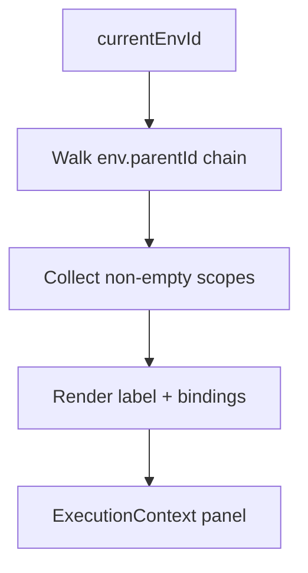
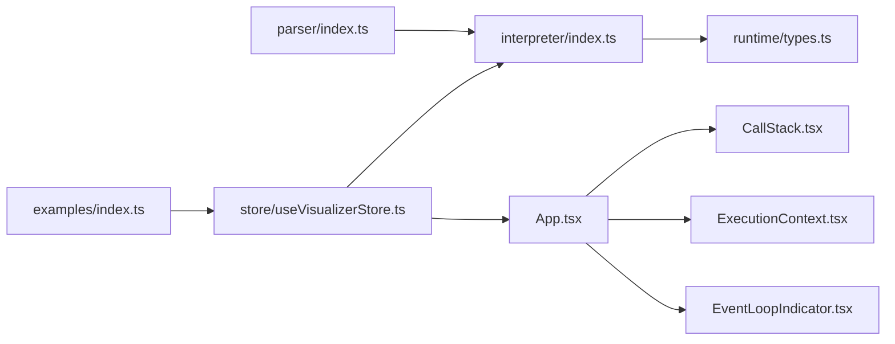

# Closures and Variable Scoping

<cite>
**Referenced Files in This Document**
- [index.ts](file://src/engine/interpreter/index.ts)
- [types.ts](file://src/engine/runtime/types.ts)
- [index.ts](file://src/examples/index.ts)
- [ExecutionContext.tsx](file://src/components/visualizer/ExecutionContext.tsx)
- [CallStack.tsx](file://src/components/visualizer/CallStack.tsx)
- [EventLoopIndicator.tsx](file://src/components/visualizer/EventLoopIndicator.tsx)
- [App.tsx](file://src/App.tsx)
- [useVisualizerStore.ts](file://src/store/useVisualizerStore.ts)
- [index.ts](file://src/engine/parser/index.ts)
</cite>

## Table of Contents
1. [Introduction](#introduction)
2. [Project Structure](#project-structure)
3. [Core Components](#core-components)
4. [Architecture Overview](#architecture-overview)
5. [Detailed Component Analysis](#detailed-component-analysis)
6. [Dependency Analysis](#dependency-analysis)
7. [Performance Considerations](#performance-considerations)
8. [Troubleshooting Guide](#troubleshooting-guide)
9. [Conclusion](#conclusion)

## Introduction
This document explains JavaScript closures, lexical scoping, and variable lifetime management using the JS Visualizer codebase. It demonstrates how closures capture variables from outer function scopes and retain access even after the outer function returns. It also covers differences between global, local, and block scoping with var, let, and const, and how scope chain resolution works. Practical examples show closure creation, scope inheritance, and common patterns like module patterns and function factories. The visualizer renders variable environments and scope chains during execution, enabling learners to observe how closures maintain references to captured variables across asynchronous boundaries.

## Project Structure
The visualizer is organized around an interpreter that simulates JavaScript execution, a runtime model for environments and values, and React components that visualize execution state. Examples are bundled to demonstrate real-world scenarios, including closures.

**Diagram sources**
- [index.ts:75-135](file://src/engine/interpreter/index.ts#L75-L135)
- [types.ts:80-195](file://src/engine/runtime/types.ts#L80-L195)
- [index.ts:5-24](file://src/engine/parser/index.ts#L5-L24)
- [App.tsx:17-106](file://src/App.tsx#L17-L106)
- [useVisualizerStore.ts:27-98](file://src/store/useVisualizerStore.ts#L27-L98)

**Section sources**
- [index.ts:75-135](file://src/engine/interpreter/index.ts#L75-L135)
- [types.ts:80-195](file://src/engine/runtime/types.ts#L80-L195)
- [index.ts:5-24](file://src/engine/parser/index.ts#L5-L24)
- [App.tsx:17-106](file://src/App.tsx#L17-L106)
- [useVisualizerStore.ts:27-98](file://src/store/useVisualizerStore.ts#L27-L98)

## Core Components
- Interpreter: Executes parsed AST, manages environments, handles function calls, and captures closures.
- Runtime Types: Defines environments, bindings, function values, and runtime values.
- Examples: Provides curated code samples, including a closure demo.
- UI Panels: Visualize call stack, current scope/variables, and event loop phase.

Key capabilities:
- Lexical scoping via environment parent links and scope chain traversal.
- Closure creation by storing the outer function’s environment ID in FunctionValue.
- Variable lifetime management through environment creation and destruction.
- Scope chain resolution using lookupVariable and assignVariable.

**Section sources**
- [index.ts:154-220](file://src/engine/interpreter/index.ts#L154-L220)
- [types.ts:70-108](file://src/engine/runtime/types.ts#L70-L108)
- [index.ts:98-114](file://src/examples/index.ts#L98-L114)
- [ExecutionContext.tsx:33-46](file://src/components/visualizer/ExecutionContext.tsx#L33-L46)

## Architecture Overview
The interpreter builds a global environment, hoists declarations, executes statements, and creates nested environments for blocks and function calls. During function invocation, a new environment is created whose parent is the captured closure environment. The UI reads the current snapshot to render the call stack and the current scope chain.

**Diagram sources**
- [useVisualizerStore.ts:92-97](file://src/store/useVisualizerStore.ts#L92-L97)
- [index.ts:75-135](file://src/engine/interpreter/index.ts#L75-L135)
- [index.ts:245-264](file://src/engine/interpreter/index.ts#L245-L264)
- [index.ts:831-895](file://src/engine/interpreter/index.ts#L831-L895)
- [index.ts:5-24](file://src/engine/parser/index.ts#L5-L24)
- [App.tsx:17-106](file://src/App.tsx#L17-L106)
- [ExecutionContext.tsx:33-46](file://src/components/visualizer/ExecutionContext.tsx#L33-L46)

## Detailed Component Analysis

### Closures and Scope Chains
Closures form when a function references variables from an enclosing lexical scope. The interpreter captures the environment ID at function creation and reuses it during invocation to establish a new inner environment linked to the captured outer environment. The UI displays the current scope chain by walking up the environment parent pointers.

**Diagram sources**
- [types.ts:80-108](file://src/engine/runtime/types.ts#L80-L108)
- [types.ts:70-85](file://src/engine/runtime/types.ts#L70-L85)
- [index.ts:154-163](file://src/engine/interpreter/index.ts#L154-L163)
- [index.ts:245-264](file://src/engine/interpreter/index.ts#L245-L264)
- [index.ts:831-895](file://src/engine/interpreter/index.ts#L831-L895)

**Section sources**
- [index.ts:176-210](file://src/engine/interpreter/index.ts#L176-L210)
- [index.ts:245-264](file://src/engine/interpreter/index.ts#L245-L264)
- [index.ts:831-895](file://src/engine/interpreter/index.ts#L831-L895)
- [types.ts:70-108](file://src/engine/runtime/types.ts#L70-L108)

### Variable Lifetime and Scope Resolution
- Global scope: Created at program start with a sentinel parent ID of null.
- Local scope: Created for function invocations; destroyed when the function returns.
- Block scope: Created for block statements and loops; destroyed when the block exits.
- Scope chain resolution: lookupVariable traverses environment parents until it finds a binding or throws.

**Diagram sources**
- [index.ts:831-895](file://src/engine/interpreter/index.ts#L831-L895)
- [index.ts:176-210](file://src/engine/interpreter/index.ts#L176-L210)
- [index.ts:351-358](file://src/engine/interpreter/index.ts#L351-L358)

**Section sources**
- [index.ts:176-210](file://src/engine/interpreter/index.ts#L176-L210)
- [index.ts:351-358](file://src/engine/interpreter/index.ts#L351-L358)
- [index.ts:831-895](file://src/engine/interpreter/index.ts#L831-L895)

### Variable Declaration and Assignment Behavior (var vs let/const)
- var: Hoisted at function scope; assignment occurs at declaration site; lookup finds nearest enclosing function scope binding.
- let/const: Block-scoped; TDZ enforced; assignment updates the binding in the current block environment.

**Diagram sources**
- [index.ts:308-331](file://src/engine/interpreter/index.ts#L308-L331)
- [index.ts:165-174](file://src/engine/interpreter/index.ts#L165-L174)
- [index.ts:192-210](file://src/engine/interpreter/index.ts#L192-L210)

**Section sources**
- [index.ts:308-331](file://src/engine/interpreter/index.ts#L308-L331)
- [index.ts:165-174](file://src/engine/interpreter/index.ts#L165-L174)
- [index.ts:192-210](file://src/engine/interpreter/index.ts#L192-L210)

### Practical Examples: Closures, Module Patterns, and Factories
The examples collection includes a closure demo that illustrates:
- Outer function creates a variable in its local scope.
- Inner function closes over the outer variable.
- Even after the outer function returns, the inner function retains access to the captured variable.

**Diagram sources**
- [index.ts:98-114](file://src/examples/index.ts#L98-L114)
- [index.ts:245-264](file://src/engine/interpreter/index.ts#L245-L264)
- [index.ts:831-895](file://src/engine/interpreter/index.ts#L831-L895)
- [index.ts:176-210](file://src/engine/interpreter/index.ts#L176-L210)
- [ExecutionContext.tsx:33-46](file://src/components/visualizer/ExecutionContext.tsx#L33-L46)

**Section sources**
- [index.ts:98-114](file://src/examples/index.ts#L98-L114)
- [index.ts:245-264](file://src/engine/interpreter/index.ts#L245-L264)
- [index.ts:831-895](file://src/engine/interpreter/index.ts#L831-L895)
- [index.ts:176-210](file://src/engine/interpreter/index.ts#L176-L210)

### Visualizing Scope Chains and Environments
The ExecutionContext panel walks up the environment parent chain from the current environment to display visible scopes and their bindings. This enables learners to see how closures preserve access to variables from outer scopes.

**Diagram sources**
- [ExecutionContext.tsx:33-46](file://src/components/visualizer/ExecutionContext.tsx#L33-L46)
- [types.ts:80-85](file://src/engine/runtime/types.ts#L80-L85)

**Section sources**
- [ExecutionContext.tsx:33-46](file://src/components/visualizer/ExecutionContext.tsx#L33-L46)
- [types.ts:80-85](file://src/engine/runtime/types.ts#L80-L85)

## Dependency Analysis
The interpreter depends on the runtime types to represent environments and values. The UI depends on the interpreter’s snapshots to render call stacks and scope chains. The store orchestrates parsing, execution, and playback.

**Diagram sources**
- [index.ts:5-24](file://src/engine/parser/index.ts#L5-L24)
- [index.ts:75-135](file://src/engine/interpreter/index.ts#L75-L135)
- [types.ts:80-195](file://src/engine/runtime/types.ts#L80-L195)
- [useVisualizerStore.ts:27-98](file://src/store/useVisualizerStore.ts#L27-L98)
- [App.tsx:17-106](file://src/App.tsx#L17-L106)
- [CallStack.tsx:12-78](file://src/components/visualizer/CallStack.tsx#L12-L78)
- [ExecutionContext.tsx:33-46](file://src/components/visualizer/ExecutionContext.tsx#L33-L46)
- [EventLoopIndicator.tsx:30-142](file://src/components/visualizer/EventLoopIndicator.tsx#L30-L142)
- [index.ts:8-152](file://src/examples/index.ts#L8-L152)

**Section sources**
- [index.ts:5-24](file://src/engine/parser/index.ts#L5-L24)
- [index.ts:75-135](file://src/engine/interpreter/index.ts#L75-L135)
- [types.ts:80-195](file://src/engine/runtime/types.ts#L80-L195)
- [useVisualizerStore.ts:27-98](file://src/store/useVisualizerStore.ts#L27-L98)
- [App.tsx:17-106](file://src/App.tsx#L17-L106)
- [CallStack.tsx:12-78](file://src/components/visualizer/CallStack.tsx#L12-L78)
- [ExecutionContext.tsx:33-46](file://src/components/visualizer/ExecutionContext.tsx#L33-L46)
- [EventLoopIndicator.tsx:30-142](file://src/components/visualizer/EventLoopIndicator.tsx#L30-L142)
- [index.ts:8-152](file://src/examples/index.ts#L8-L152)

## Performance Considerations
- Maximum execution steps: The interpreter enforces a cap to prevent infinite loops.
- Snapshot cloning: Each snapshot duplicates the interpreter state; keep maxSteps reasonable for long traces.
- Environment growth: Deeply nested closures and long call stacks increase memory usage.
- Recommendations:
  - Prefer concise examples for complex scenarios.
  - Use the playback controls to step through long executions.
  - Limit the number of microtasks and timers to reduce UI rendering overhead.

[No sources needed since this section provides general guidance]

## Troubleshooting Guide
Common issues and remedies:
- “Not defined” errors: Occur when lookupVariable cannot find a binding in the scope chain.
- TDZ errors: Accessing let/const before initialization triggers a runtime error.
- Assignment to const: Attempting to reassign a const binding raises an error.
- Infinite loops: The interpreter detects excessive iterations and throws an error.

**Section sources**
- [index.ts:176-210](file://src/engine/interpreter/index.ts#L176-L210)
- [index.ts:192-210](file://src/engine/interpreter/index.ts#L192-L210)
- [index.ts:397-408](file://src/engine/interpreter/index.ts#L397-L408)

## Conclusion
The JS Visualizer demonstrates how closures capture outer scope environments and maintain access to variables across function returns and asynchronous boundaries. By modeling environments, bindings, and function values, it enables learners to visualize scope chains, variable lifetimes, and the mechanics behind closures. The included examples and UI panels provide practical insights into lexical scoping, variable lifetime management, and common closure patterns such as module patterns and function factories.