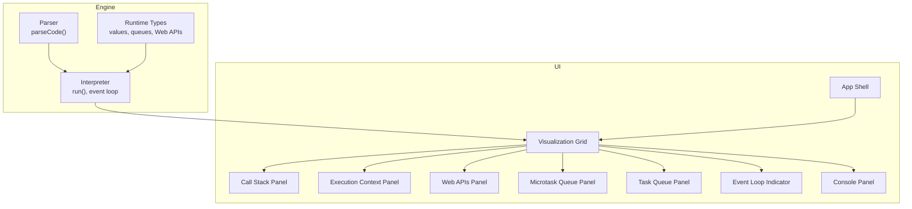
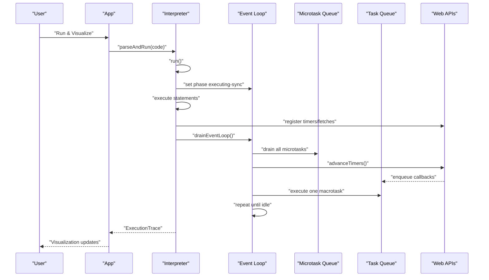
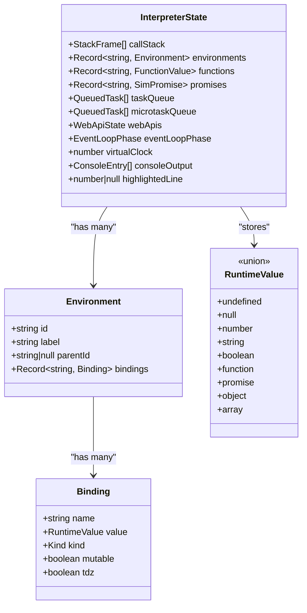
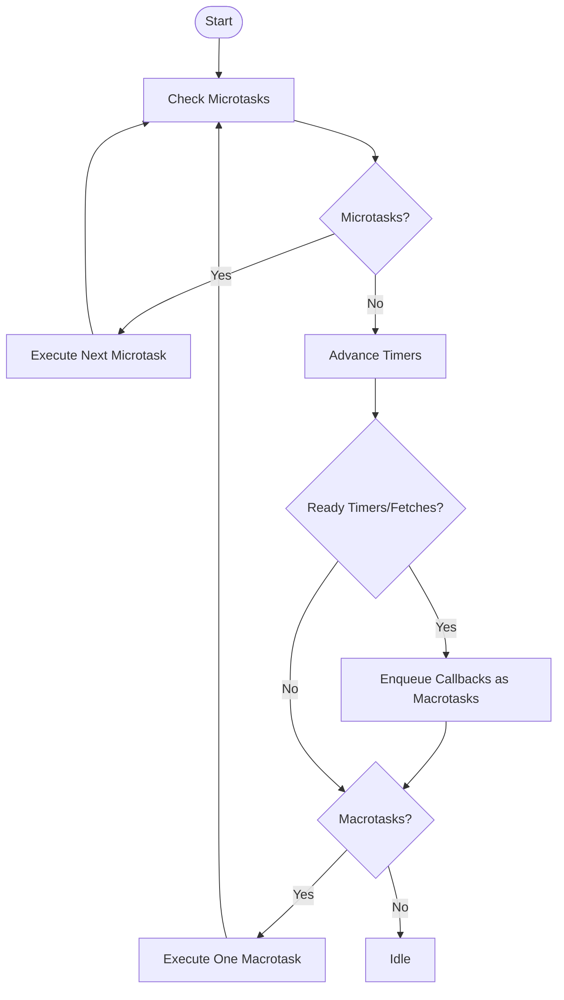
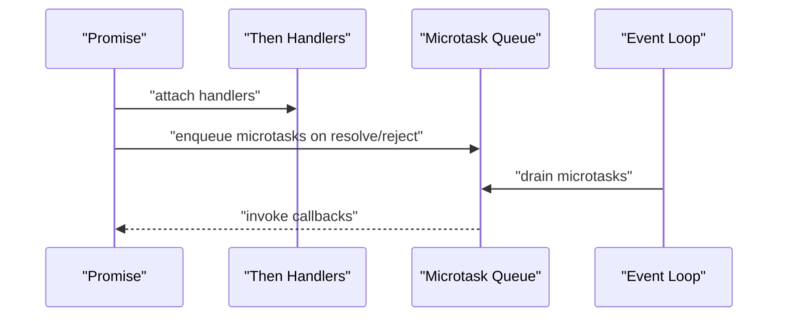
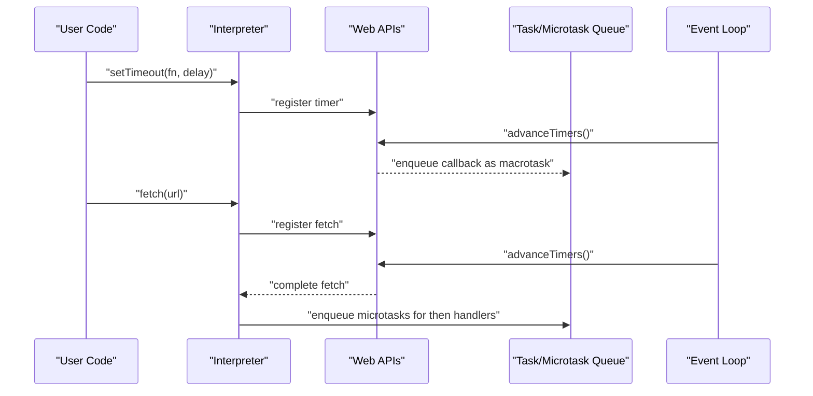
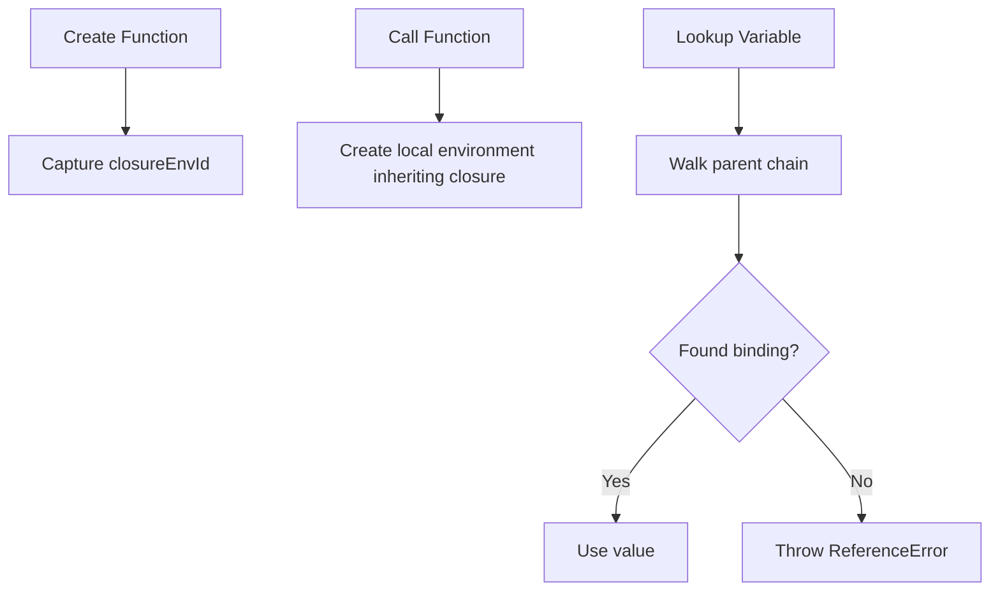
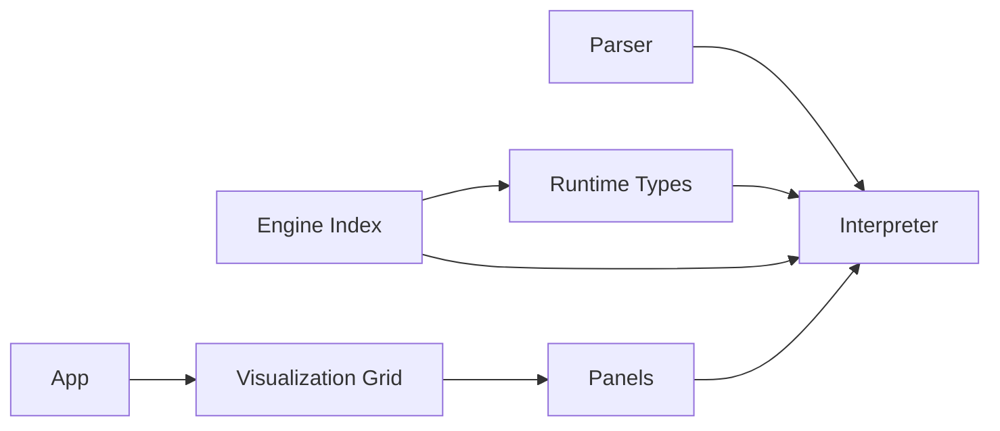

# Core JavaScript Concepts

<cite>
**Referenced Files in This Document**
- [index.ts](file://src/engine/index.ts)
- [index.ts](file://src/engine/interpreter/index.ts)
- [types.ts](file://src/engine/runtime/types.ts)
- [CallStack.tsx](file://src/components/visualizer/CallStack.tsx)
- [MicrotaskQueue.tsx](file://src/components/visualizer/MicrotaskQueue.tsx)
- [TaskQueue.tsx](file://src/components/visualizer/TaskQueue.tsx)
- [WebAPIs.tsx](file://src/components/visualizer/WebAPIs.tsx)
- [EventLoopIndicator.tsx](file://src/components/visualizer/EventLoopIndicator.tsx)
- [index.ts](file://src/examples/index.ts)
- [index.ts](file://src/engine/parser/index.ts)
- [variants.ts](file://src/animations/variants.ts)
- [App.tsx](file://src/App.tsx)
</cite>

## Table of Contents
1. [Introduction](#introduction)
2. [Project Structure](#project-structure)
3. [Core Components](#core-components)
4. [Architecture Overview](#architecture-overview)
5. [Detailed Component Analysis](#detailed-component-analysis)
6. [Dependency Analysis](#dependency-analysis)
7. [Performance Considerations](#performance-considerations)
8. [Troubleshooting Guide](#troubleshooting-guide)
9. [Conclusion](#conclusion)
10. [Appendices](#appendices)

## Introduction
This document explains the fundamental JavaScript execution model as demonstrated by the visualizer. It covers how the interpreter simulates the call stack, heap, and primitive vs object storage; how the event loop distinguishes macrotasks and microtasks; how asynchronous operations like setTimeout, setInterval, and fetch integrate with the event loop; and how promises enqueue microtasks. It also clarifies closures, lexical scoping, and variable lifetime management. The explanations are grounded in the codebase and reinforced by concrete examples from the repository.

## Project Structure
The visualizer is a React application that renders a live simulation of JavaScript execution. The engine interprets JavaScript code and produces execution traces with snapshots. The UI components visualize the call stack, execution context, Web APIs, microtask queue, task queue, and the event loop phase.

**Diagram sources**
- [index.ts:5-24](file://src/engine/parser/index.ts#L5-L24)
- [index.ts:75-135](file://src/engine/interpreter/index.ts#L75-L135)
- [types.ts:183-195](file://src/engine/runtime/types.ts#L183-L195)
- [App.tsx:61-106](file://src/App.tsx#L61-L106)
- [CallStack.tsx:12-78](file://src/components/visualizer/CallStack.tsx#L12-L78)
- [WebAPIs.tsx:13-153](file://src/components/visualizer/WebAPIs.tsx#L13-L153)
- [MicrotaskQueue.tsx:12-40](file://src/components/visualizer/MicrotaskQueue.tsx#L12-L40)
- [TaskQueue.tsx:12-40](file://src/components/visualizer/TaskQueue.tsx#L12-L40)
- [EventLoopIndicator.tsx:30-142](file://src/components/visualizer/EventLoopIndicator.tsx#L30-L142)

**Section sources**
- [App.tsx:61-106](file://src/App.tsx#L61-L106)
- [index.ts:1-17](file://src/engine/index.ts#L1-L17)

## Core Components
- Engine: Parses and executes JavaScript, maintaining interpreter state, call stack, environments, functions, promises, queues, and Web API registrations.
- UI Panels: Visualize the call stack, execution context, Web APIs, microtask queue, task queue, and event loop phase.
- Examples: Provide runnable scenarios demonstrating core concepts.

Key runtime types define the execution model:
- RuntimeValue: Primitives, objects, arrays, functions, and promises.
- Environment and Binding: Lexical scoping and variable lifetime.
- QueuedTask: Microtasks/macrotasks scheduled by the event loop.
- WebApiTimer/WebApiFetch: Timers and fetch requests tracked by the interpreter.
- EventLoopPhase: Phases of the event loop (idle, executing sync, checking microtasks, executing microtask, checking macrotasks, executing macrotask, advancing timers).

**Section sources**
- [types.ts:3-12](file://src/engine/runtime/types.ts#L3-L12)
- [types.ts:70-195](file://src/engine/runtime/types.ts#L70-L195)
- [index.ts:2-16](file://src/engine/index.ts#L2-L16)

## Architecture Overview
The interpreter runs a program, executes statements, evaluates expressions, and manages asynchronous operations. It advances a virtual clock and drains the event loop in a deterministic order: drain microtasks, advance timers, then execute one macrotask, repeating until idle.

**Diagram sources**
- [index.ts:75-135](file://src/engine/interpreter/index.ts#L75-L135)
- [index.ts:1198-1254](file://src/engine/interpreter/index.ts#L1198-L1254)
- [index.ts:1256-1312](file://src/engine/interpreter/index.ts#L1256-L1312)

## Detailed Component Analysis

### JavaScript Execution Model: Call Stack, Heap, and Values
- Call Stack: Frames represent function invocations. Each frame holds a label, function id, environment id, and line number. The top frame is the active function.
- Environments and Bindings: Each function has a closure environment that captures lexically scoped variables. Bindings track name, value, kind (var/let/const/param/function), mutability, and temporal dead zone state.
- Heap and Values: Objects and arrays are stored in the interpreter’s value store; primitives are embedded in RuntimeValue. Functions and promises are represented by ids that reference stored objects.

**Diagram sources**
- [types.ts:183-195](file://src/engine/runtime/types.ts#L183-L195)
- [types.ts:80-85](file://src/engine/runtime/types.ts#L80-L85)
- [types.ts:72-78](file://src/engine/runtime/types.ts#L72-L78)
- [types.ts:3-12](file://src/engine/runtime/types.ts#L3-L12)

**Section sources**
- [index.ts:60-73](file://src/engine/interpreter/index.ts#L60-L73)
- [types.ts:80-85](file://src/engine/runtime/types.ts#L80-L85)
- [types.ts:72-78](file://src/engine/runtime/types.ts#L72-L78)

### Event Loop: Microtasks vs Macrotasks
The interpreter models the event loop phases and enforces ordering:
- Microtasks: Drained completely before any macrotask.
- Macrotasks: Executed one at a time, then microtasks are drained again.
- Timers: Advance virtual clock to fire ready timers and re-enqueue intervals.

**Diagram sources**
- [index.ts:1198-1254](file://src/engine/interpreter/index.ts#L1198-L1254)
- [index.ts:1256-1312](file://src/engine/interpreter/index.ts#L1256-L1312)

**Section sources**
- [types.ts:164-171](file://src/engine/runtime/types.ts#L164-L171)
- [EventLoopIndicator.tsx:10-28](file://src/components/visualizer/EventLoopIndicator.tsx#L10-L28)

### Promise Resolution and Microtask Queue
Promises are modeled as SimPromise with state and then handlers. When resolved or rejected, then handlers are enqueued as microtasks. The interpreter drains microtasks before macrotasks.

**Diagram sources**
- [index.ts:1124-1194](file://src/engine/interpreter/index.ts#L1124-L1194)
- [index.ts:1100-1122](file://src/engine/interpreter/index.ts#L1100-L1122)

**Section sources**
- [types.ts:153-160](file://src/engine/runtime/types.ts#L153-L160)
- [types.ts:147-151](file://src/engine/runtime/types.ts#L147-L151)
- [MicrotaskQueue.tsx:12-40](file://src/components/visualizer/MicrotaskQueue.tsx#L12-L40)

### Web API Integration: setTimeout, setInterval, fetch
- setTimeout/setInterval: Registered as WebApiTimer entries with a callback function id, delay, and fire time. Ready timers are enqueued as macrotasks.
- fetch: Registered as WebApiFetch entries with a promise id and completion time. Completed fetches resolve their associated promise and enqueue microtasks for then handlers.

**Diagram sources**
- [index.ts:899-950](file://src/engine/interpreter/index.ts#L899-L950)
- [index.ts:1256-1312](file://src/engine/interpreter/index.ts#L1256-L1312)
- [types.ts:121-143](file://src/engine/runtime/types.ts#L121-L143)

**Section sources**
- [WebAPIs.tsx:13-153](file://src/components/visualizer/WebAPIs.tsx#L13-L153)
- [TaskQueue.tsx:12-40](file://src/components/visualizer/TaskQueue.tsx#L12-L40)

### Closures, Lexical Scoping, and Variable Lifetime
- Closure: When a function is created, it stores a reference to its creation environment (closureEnvId). Calls create a new local environment that inherits from the closure environment.
- Lexical scoping: Variable lookup walks up the environment chain until a binding is found or an error is thrown.
- Lifetime: Variables are bound in environments; blocks create new environments. let/const bindings are TDZ until initialized.

**Diagram sources**
- [index.ts:245-264](file://src/engine/interpreter/index.ts#L245-L264)
- [index.ts:831-895](file://src/engine/interpreter/index.ts#L831-L895)
- [index.ts:176-220](file://src/engine/interpreter/index.ts#L176-L220)

**Section sources**
- [types.ts:89-98](file://src/engine/runtime/types.ts#L89-L98)
- [types.ts:70-85](file://src/engine/runtime/types.ts#L70-L85)
- [CallStack.tsx:12-78](file://src/components/visualizer/CallStack.tsx#L12-L78)

### Practical Examples Demonstrated by the Visualizer
The examples illustrate core patterns:
- setTimeout basics: Demonstrates task queue scheduling.
- Promise chain: Demonstrates microtask queue scheduling.
- Event loop order: Shows microtasks run before macrotasks.
- Mixed async: Interleaves setTimeout and Promise to show event loop sequencing.
- new Promise(): Shows executor runs synchronously, then .then enqueues microtasks.
- Closure demo: Demonstrates lexical scoping and captured variables.
- Nested setTimeout: Shows cascading task scheduling.
- Call stack growth: Demonstrates stack frames building and unwinding.

**Section sources**
- [index.ts:8-152](file://src/examples/index.ts#L8-L152)

## Dependency Analysis
The engine exports types and the public API. The interpreter depends on the parser and runtime types. The UI composes panels that consume the interpreter state.

**Diagram sources**
- [index.ts:1-17](file://src/engine/index.ts#L1-L17)
- [index.ts:5-24](file://src/engine/parser/index.ts#L5-L24)
- [index.ts:75-135](file://src/engine/interpreter/index.ts#L75-L135)
- [App.tsx:61-106](file://src/App.tsx#L61-L106)

**Section sources**
- [index.ts:1-17](file://src/engine/index.ts#L1-L17)
- [index.ts:5-24](file://src/engine/parser/index.ts#L5-L24)
- [App.tsx:61-106](file://src/App.tsx#L61-L106)

## Performance Considerations
- Maximum steps: The interpreter limits execution steps to prevent infinite loops.
- Virtual clock: Timers and fetches are advanced deterministically to avoid blocking the UI thread.
- Snapshotting: Snapshots capture state at key moments to drive the UI efficiently.
- Animations: Motion animations are lightweight and driven by state changes.

[No sources needed since this section provides general guidance]

## Troubleshooting Guide
Common issues and where they surface:
- Maximum execution steps exceeded: Indicates potential infinite loops or heavy computation.
- Variable access before initialization: TDZ errors when accessing let/const before declaration.
- Assignment to constant: Attempting to reassign const triggers an error.
- Function not found: Calling a non-function value as a function.
- Runtime errors: Errors thrown during execution are captured and surfaced in snapshots.

Where to look:
- Error handling in run() and catch blocks.
- TDZ checks and assignment guards in environment helpers.
- Function call validation and return signal handling.

**Section sources**
- [index.ts:120-127](file://src/engine/interpreter/index.ts#L120-L127)
- [index.ts:182-210](file://src/engine/interpreter/index.ts#L182-L210)
- [index.ts:643-645](file://src/engine/interpreter/index.ts#L643-L645)

## Conclusion
The visualizer demonstrates JavaScript’s execution model end-to-end: synchronous execution, closures and lexical scoping, heap/primitive storage, and the event loop’s microtask-first policy. By observing the call stack, execution context, Web APIs, and queues, learners can connect theory to concrete behavior. The examples provide a practical foundation for understanding asynchronous patterns and the modern JavaScript runtime.

[No sources needed since this section summarizes without analyzing specific files]

## Appendices

### How the Visualizer Reinforces Concepts
- Call Stack Panel: Shows frames and line numbers during execution.
- Execution Context Panel: Displays current environment bindings.
- Web APIs Panel: Visualizes timers and fetches with animated progress.
- Microtask Queue and Task Queue Panels: Show pending callbacks.
- Event Loop Indicator: Highlights the current phase and animates active phases.
- Examples: Provide runnable scenarios to observe behavior in real-time.

**Section sources**
- [CallStack.tsx:12-78](file://src/components/visualizer/CallStack.tsx#L12-L78)
- [WebAPIs.tsx:13-153](file://src/components/visualizer/WebAPIs.tsx#L13-L153)
- [MicrotaskQueue.tsx:12-40](file://src/components/visualizer/MicrotaskQueue.tsx#L12-L40)
- [TaskQueue.tsx:12-40](file://src/components/visualizer/TaskQueue.tsx#L12-L40)
- [EventLoopIndicator.tsx:30-142](file://src/components/visualizer/EventLoopIndicator.tsx#L30-L142)
- [index.ts:8-152](file://src/examples/index.ts#L8-L152)