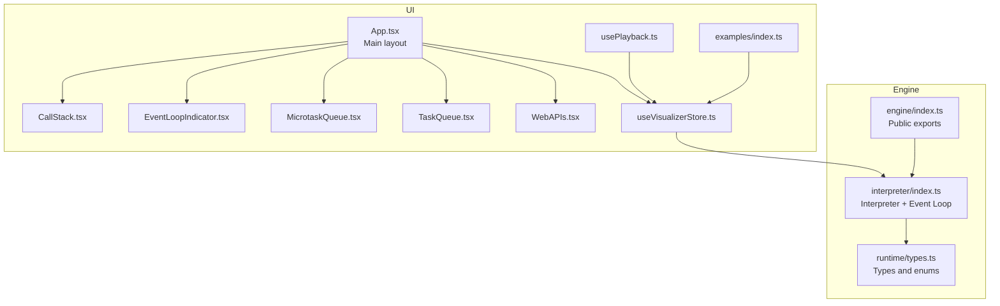
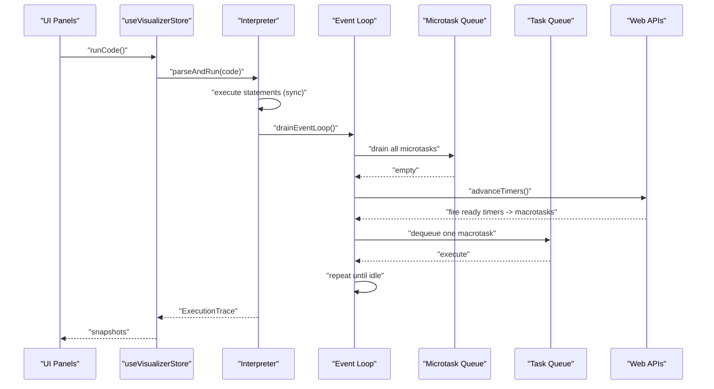
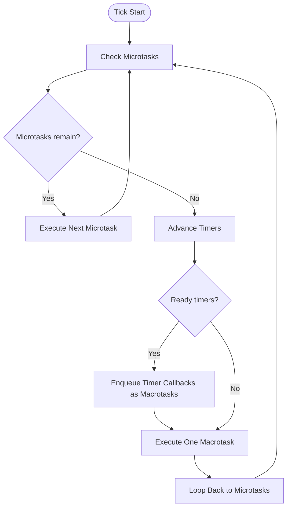
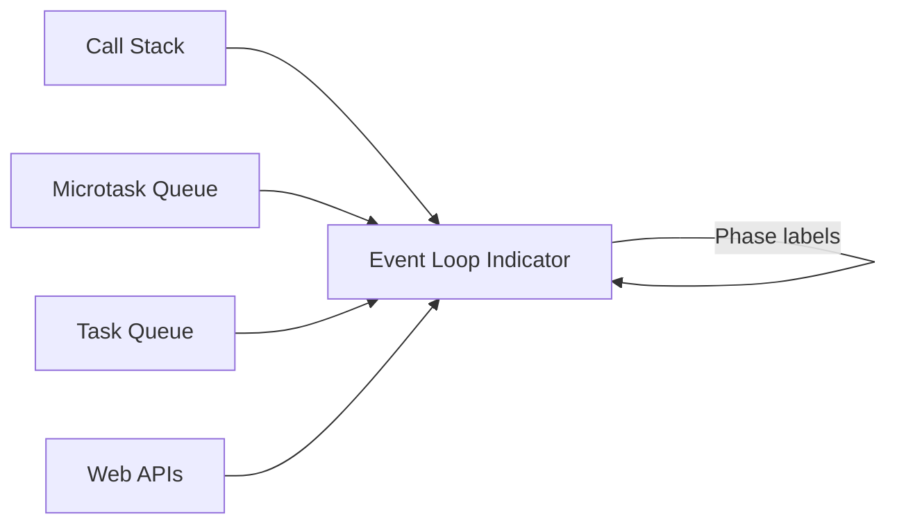
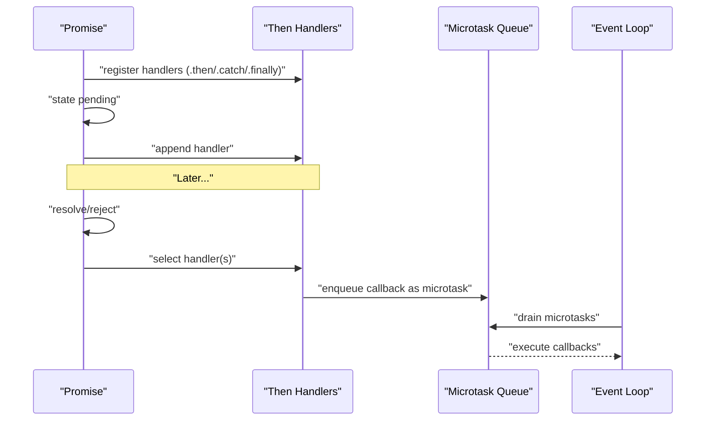
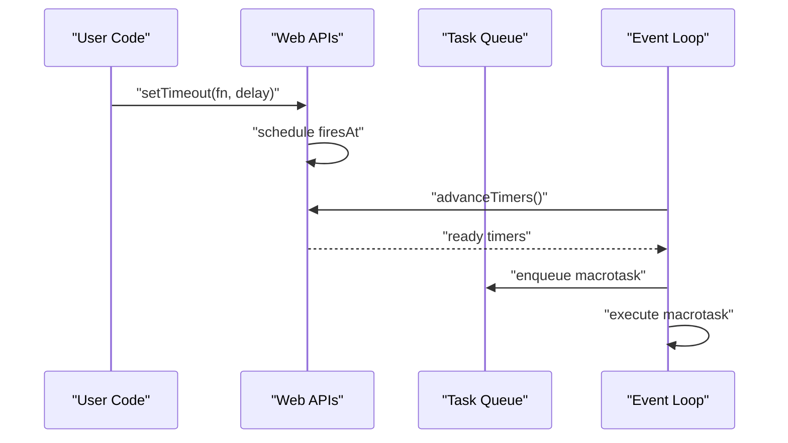
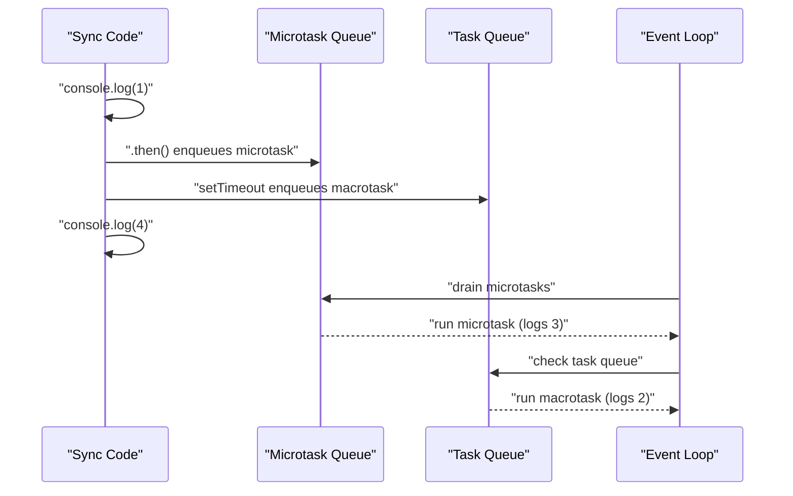
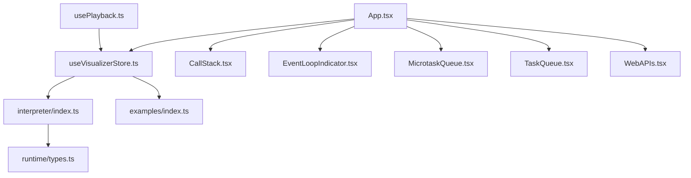

# Event Loop and Asynchronous Processing

<cite>
**Referenced Files in This Document**
- [src/engine/index.ts](file://src/engine/index.ts)
- [src/engine/runtime/types.ts](file://src/engine/runtime/types.ts)
- [src/engine/interpreter/index.ts](file://src/engine/interpreter/index.ts)
- [src/components/visualizer/EventLoopIndicator.tsx](file://src/components/visualizer/EventLoopIndicator.tsx)
- [src/components/visualizer/MicrotaskQueue.tsx](file://src/components/visualizer/MicrotaskQueue.tsx)
- [src/components/visualizer/TaskQueue.tsx](file://src/components/visualizer/TaskQueue.tsx)
- [src/components/visualizer/CallStack.tsx](file://src/components/visualizer/CallStack.tsx)
- [src/components/visualizer/WebAPIs.tsx](file://src/components/visualizer/WebAPIs.tsx)
- [src/examples/index.ts](file://src/examples/index.ts)
- [src/store/useVisualizerStore.ts](file://src/store/useVisualizerStore.ts)
- [src/hooks/usePlayback.ts](file://src/hooks/usePlayback.ts)
- [src/App.tsx](file://src/App.tsx)
</cite>

## Table of Contents
1. [Introduction](#introduction)
2. [Project Structure](#project-structure)
3. [Core Components](#core-components)
4. [Architecture Overview](#architecture-overview)
5. [Detailed Component Analysis](#detailed-component-analysis)
6. [Dependency Analysis](#dependency-analysis)
7. [Performance Considerations](#performance-considerations)
8. [Troubleshooting Guide](#troubleshooting-guide)
9. [Conclusion](#conclusion)
10. [Appendices](#appendices)

## Introduction
This document explains how the JavaScript event loop is modeled and visualized in the JS Visualizer. It focuses on the distinction between macrotasks and microtasks, how the event loop coordinates the call stack, callback queues, and microtask queue, and how the visualizer represents event loop ticks and task scheduling. Practical examples from the examples collection demonstrate common asynchronous patterns such as Promise chains, async/await, and callback-based APIs.

## Project Structure
The visualizer is organized around a runtime interpreter that simulates JavaScript execution, including the event loop, timers, and Promise microtasks. The UI components visualize the interpreter’s state at each step of execution.

**Diagram sources**
- [src/App.tsx:17-107](file://src/App.tsx#L17-L107)
- [src/engine/runtime/types.ts:164-195](file://src/engine/runtime/types.ts#L164-L195)
- [src/engine/interpreter/index.ts:1198-1254](file://src/engine/interpreter/index.ts#L1198-L1254)
- [src/engine/index.ts:1-17](file://src/engine/index.ts#L1-L17)
- [src/components/visualizer/CallStack.tsx:12-79](file://src/components/visualizer/CallStack.tsx#L12-L79)
- [src/components/visualizer/EventLoopIndicator.tsx:30-142](file://src/components/visualizer/EventLoopIndicator.tsx#L30-L142)
- [src/components/visualizer/MicrotaskQueue.tsx:12-40](file://src/components/visualizer/MicrotaskQueue.tsx#L12-L40)
- [src/components/visualizer/TaskQueue.tsx:12-40](file://src/components/visualizer/TaskQueue.tsx#L12-L40)
- [src/components/visualizer/WebAPIs.tsx:13-153](file://src/components/visualizer/WebAPIs.tsx#L13-L153)
- [src/store/useVisualizerStore.ts:27-98](file://src/store/useVisualizerStore.ts#L27-L98)
- [src/hooks/usePlayback.ts:4-28](file://src/hooks/usePlayback.ts#L4-L28)
- [src/examples/index.ts:8-152](file://src/examples/index.ts#L8-L152)

**Section sources**
- [src/App.tsx:17-107](file://src/App.tsx#L17-L107)
- [src/engine/index.ts:1-17](file://src/engine/index.ts#L1-L17)

## Core Components
- Event loop phases and queues: The interpreter defines the event loop phases and maintains separate queues for macrotasks and microtasks, plus Web APIs timers and fetches.
- Promise simulation: Promises are modeled with state, handlers, and microtask enqueue semantics.
- Web APIs: Timers and fetch are simulated with virtual clocks and completion events.
- UI visualization: Panels show the call stack, event loop phase, microtask and task queues, and Web APIs.

**Section sources**
- [src/engine/runtime/types.ts:164-195](file://src/engine/runtime/types.ts#L164-L195)
- [src/engine/interpreter/index.ts:967-1194](file://src/engine/interpreter/index.ts#L967-L1194)
- [src/engine/interpreter/index.ts:1196-1312](file://src/engine/interpreter/index.ts#L1196-L1312)
- [src/components/visualizer/EventLoopIndicator.tsx:10-28](file://src/components/visualizer/EventLoopIndicator.tsx#L10-L28)
- [src/components/visualizer/MicrotaskQueue.tsx:12-40](file://src/components/visualizer/MicrotaskQueue.tsx#L12-L40)
- [src/components/visualizer/TaskQueue.tsx:12-40](file://src/components/visualizer/TaskQueue.tsx#L12-L40)
- [src/components/visualizer/CallStack.tsx:12-79](file://src/components/visualizer/CallStack.tsx#L12-L79)
- [src/components/visualizer/WebAPIs.tsx:13-153](file://src/components/visualizer/WebAPIs.tsx#L13-L153)

## Architecture Overview
The interpreter executes synchronous code, then drains microtasks, advances timers, and executes one macrotask per tick, repeating until all queues are empty. The UI renders the current state at each step.

**Diagram sources**
- [src/engine/interpreter/index.ts:1198-1254](file://src/engine/interpreter/index.ts#L1198-L1254)
- [src/engine/interpreter/index.ts:1256-1312](file://src/engine/interpreter/index.ts#L1256-L1312)
- [src/store/useVisualizerStore.ts:37-50](file://src/store/useVisualizerStore.ts#L37-L50)

## Detailed Component Analysis

### Event Loop Phases and Tick Model
The interpreter models seven phases:
- idle
- executing-sync
- checking-microtasks
- executing-microtask
- checking-macrotasks
- executing-macrotask
- advancing-timers

Each tick follows this order:
1. Drain all microtasks (process all queued microtasks).
2. Advance timers (fire ready timers and enqueue their callbacks as macrotasks).
3. Execute one macrotask from the task queue.
4. Repeat until all queues are empty.

**Diagram sources**
- [src/engine/interpreter/index.ts:1198-1254](file://src/engine/interpreter/index.ts#L1198-L1254)
- [src/engine/interpreter/index.ts:1256-1312](file://src/engine/interpreter/index.ts#L1256-L1312)
- [src/engine/runtime/types.ts:164-171](file://src/engine/runtime/types.ts#L164-L171)

**Section sources**
- [src/engine/runtime/types.ts:164-171](file://src/engine/runtime/types.ts#L164-L171)
- [src/engine/interpreter/index.ts:1198-1254](file://src/engine/interpreter/index.ts#L1198-L1254)
- [src/engine/interpreter/index.ts:1256-1312](file://src/engine/interpreter/index.ts#L1256-L1312)

### Call Stack, Microtask Queue, Task Queue, and Web APIs
- Call Stack: Shows current stack frames and highlights the active frame.
- Microtask Queue: Lists pending microtasks (e.g., Promise reactions).
- Task Queue: Lists pending macrotasks (e.g., setTimeout callbacks).
- Web APIs: Shows active timers and fetches with animated progress.

**Diagram sources**
- [src/components/visualizer/CallStack.tsx:12-79](file://src/components/visualizer/CallStack.tsx#L12-L79)
- [src/components/visualizer/EventLoopIndicator.tsx:10-28](file://src/components/visualizer/EventLoopIndicator.tsx#L10-L28)
- [src/components/visualizer/MicrotaskQueue.tsx:12-40](file://src/components/visualizer/MicrotaskQueue.tsx#L12-L40)
- [src/components/visualizer/TaskQueue.tsx:12-40](file://src/components/visualizer/TaskQueue.tsx#L12-L40)
- [src/components/visualizer/WebAPIs.tsx:13-153](file://src/components/visualizer/WebAPIs.tsx#L13-L153)

**Section sources**
- [src/components/visualizer/CallStack.tsx:12-79](file://src/components/visualizer/CallStack.tsx#L12-L79)
- [src/components/visualizer/MicrotaskQueue.tsx:12-40](file://src/components/visualizer/MicrotaskQueue.tsx#L12-L40)
- [src/components/visualizer/TaskQueue.tsx:12-40](file://src/components/visualizer/TaskQueue.tsx#L12-L40)
- [src/components/visualizer/EventLoopIndicator.tsx:10-28](file://src/components/visualizer/EventLoopIndicator.tsx#L10-L28)
- [src/components/visualizer/WebAPIs.tsx:13-153](file://src/components/visualizer/WebAPIs.tsx#L13-L153)

### Promise Microtasks and Handler Registration
- When a Promise resolves or rejects, its then/catch/finally handlers are scheduled as microtasks.
- If a Promise is already settled, the handler is enqueued immediately.
- Microtasks are executed in FIFO order during each tick.

**Diagram sources**
- [src/engine/interpreter/index.ts:1124-1194](file://src/engine/interpreter/index.ts#L1124-L1194)
- [src/engine/interpreter/index.ts:1100-1122](file://src/engine/interpreter/index.ts#L1100-L1122)

**Section sources**
- [src/engine/interpreter/index.ts:1124-1194](file://src/engine/interpreter/index.ts#L1124-L1194)
- [src/engine/interpreter/index.ts:1100-1122](file://src/engine/interpreter/index.ts#L1100-L1122)

### Timers and Macrotasks
- setTimeout/setInterval register timers with a virtual clock and fire at a future time.
- When fired, their callbacks are enqueued as macrotasks.
- setInterval re-registers itself after firing.

**Diagram sources**
- [src/engine/interpreter/index.ts:899-950](file://src/engine/interpreter/index.ts#L899-L950)
- [src/engine/interpreter/index.ts:1256-1312](file://src/engine/interpreter/index.ts#L1256-L1312)
- [src/engine/interpreter/index.ts:1314-1356](file://src/engine/interpreter/index.ts#L1314-L1356)

**Section sources**
- [src/engine/interpreter/index.ts:899-950](file://src/engine/interpreter/index.ts#L899-L950)
- [src/engine/interpreter/index.ts:1256-1312](file://src/engine/interpreter/index.ts#L1256-L1312)
- [src/engine/interpreter/index.ts:1314-1356](file://src/engine/interpreter/index.ts#L1314-L1356)

### Execution Order: Microtasks vs Macrotasks
- Microtasks are processed before macrotasks in each tick.
- The classic interview example demonstrates: sync code, then microtasks, then macrotasks.

**Diagram sources**
- [src/examples/index.ts:39-54](file://src/examples/index.ts#L39-L54)
- [src/engine/interpreter/index.ts:1198-1254](file://src/engine/interpreter/index.ts#L1198-L1254)

**Section sources**
- [src/examples/index.ts:39-54](file://src/examples/index.ts#L39-L54)
- [src/engine/interpreter/index.ts:1198-1254](file://src/engine/interpreter/index.ts#L1198-L1254)

### Practical Examples from the Examples Collection
- setTimeout Basics: Demonstrates timer registration and task queue scheduling.
- Promise Chain: Shows microtask enqueueing and chaining behavior.
- Event Loop Order: Classic microtasks before macrotasks example.
- Mixed Async: Interleaving setTimeout and Promise to observe tick behavior.
- new Promise(): Executor runs synchronously; then handlers become microtasks.
- Nested setTimeout: Demonstrates recursive scheduling.

**Section sources**
- [src/examples/index.ts:8-152](file://src/examples/index.ts#L8-L152)

## Dependency Analysis
The visualizer depends on the interpreter to compute the execution trace. The store orchestrates parsing, running, and playback. The UI components subscribe to the store and render the current snapshot.

**Diagram sources**
- [src/store/useVisualizerStore.ts:27-98](file://src/store/useVisualizerStore.ts#L27-L98)
- [src/engine/interpreter/index.ts:1361-1365](file://src/engine/interpreter/index.ts#L1361-L1365)
- [src/engine/runtime/types.ts:183-195](file://src/engine/runtime/types.ts#L183-L195)
- [src/App.tsx:17-107](file://src/App.tsx#L17-L107)
- [src/hooks/usePlayback.ts:4-28](file://src/hooks/usePlayback.ts#L4-L28)

**Section sources**
- [src/store/useVisualizerStore.ts:27-98](file://src/store/useVisualizerStore.ts#L27-L98)
- [src/engine/interpreter/index.ts:1361-1365](file://src/engine/interpreter/index.ts#L1361-L1365)
- [src/App.tsx:17-107](file://src/App.tsx#L17-L107)

## Performance Considerations
- The interpreter limits steps to prevent infinite loops and long-running simulations.
- The event loop tick repeats until queues are empty, with safeguards against excessive iterations.
- UI rendering uses animations; keep playback speed reasonable for smooth visualization.

[No sources needed since this section provides general guidance]

## Troubleshooting Guide
- If the visualizer does not update, ensure the code compiles and produces an ExecutionTrace.
- Playback stops at the end; use Reset or toggle Play to restart.
- Keyboard shortcuts: Arrow keys step forward/backward; Space toggles playback; R resets.

**Section sources**
- [src/store/useVisualizerStore.ts:52-88](file://src/store/useVisualizerStore.ts#L52-L88)
- [src/hooks/usePlayback.ts:30-78](file://src/hooks/usePlayback.ts#L30-L78)

## Conclusion
The JS Visualizer models the JavaScript event loop with precise phases and queues, enabling learners to observe how microtasks and macrotasks interleave. The examples demonstrate real-world patterns, and the UI clearly shows the call stack, queues, and Web APIs at each tick.

[No sources needed since this section summarizes without analyzing specific files]

## Appendices

### Event Loop Phases Reference
- idle: No activity.
- executing-sync: Synchronous code execution.
- checking-microtasks: Checking microtask queue.
- executing-microtask: Running a microtask.
- checking-macrotasks: Checking task queue.
- executing-macrotask: Running a macrotask.
- advancing-timers: Advancing timers and scheduling callbacks.

**Section sources**
- [src/engine/runtime/types.ts:164-171](file://src/engine/runtime/types.ts#L164-L171)

### Example Index
- setTimeout Basics
- Promise Chain
- Event Loop Order
- Mixed Async
- new Promise()
- Closure Demo
- Nested setTimeout
- Call Stack Growth

**Section sources**
- [src/examples/index.ts:8-152](file://src/examples/index.ts#L8-L152)