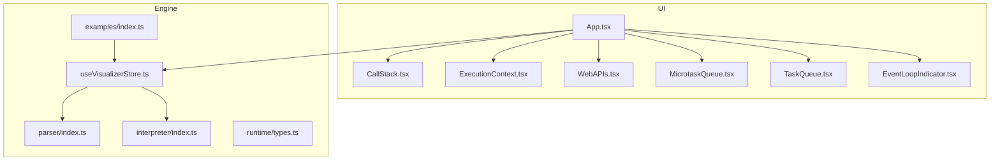
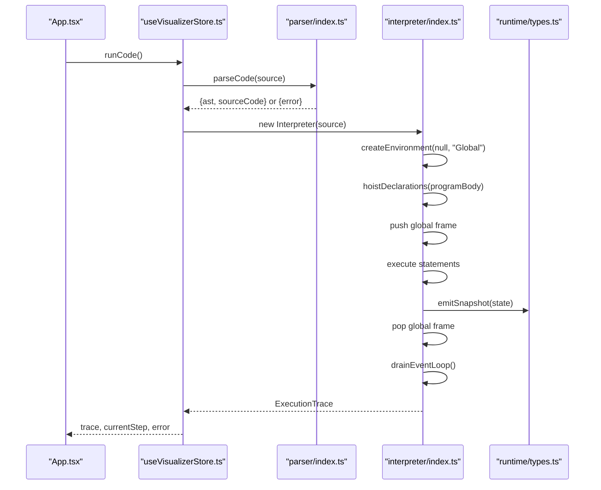
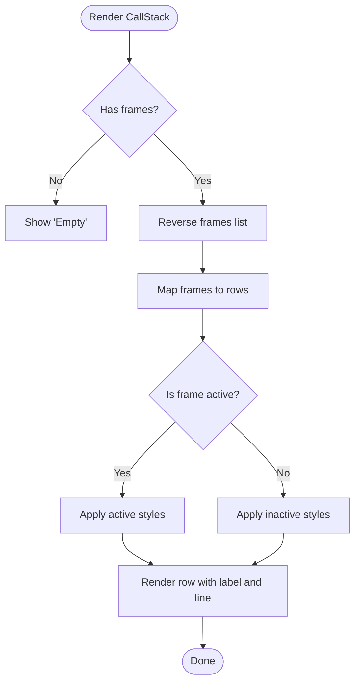
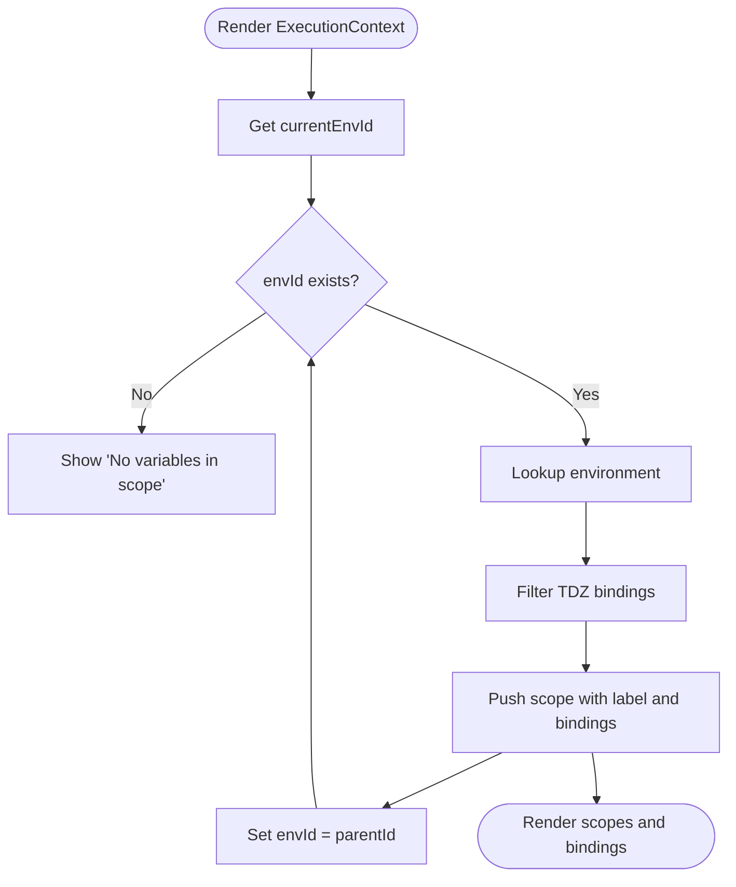
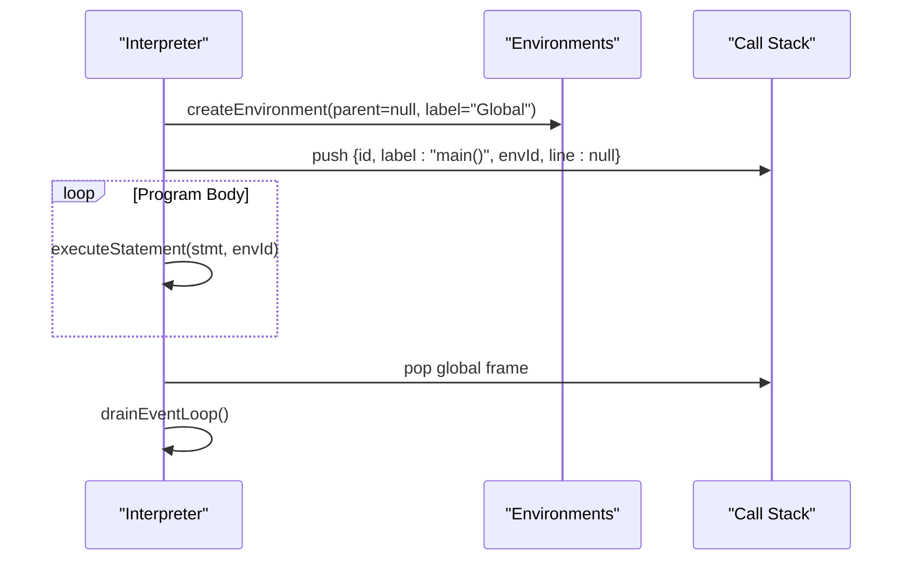
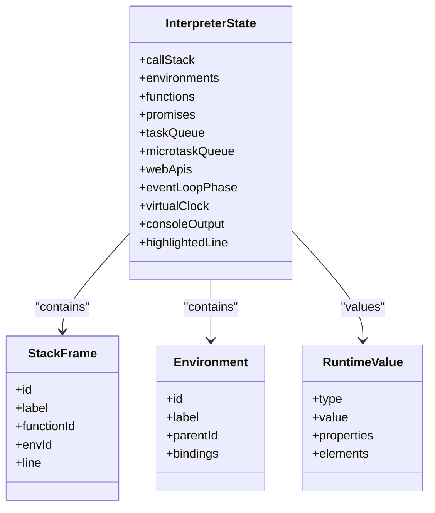
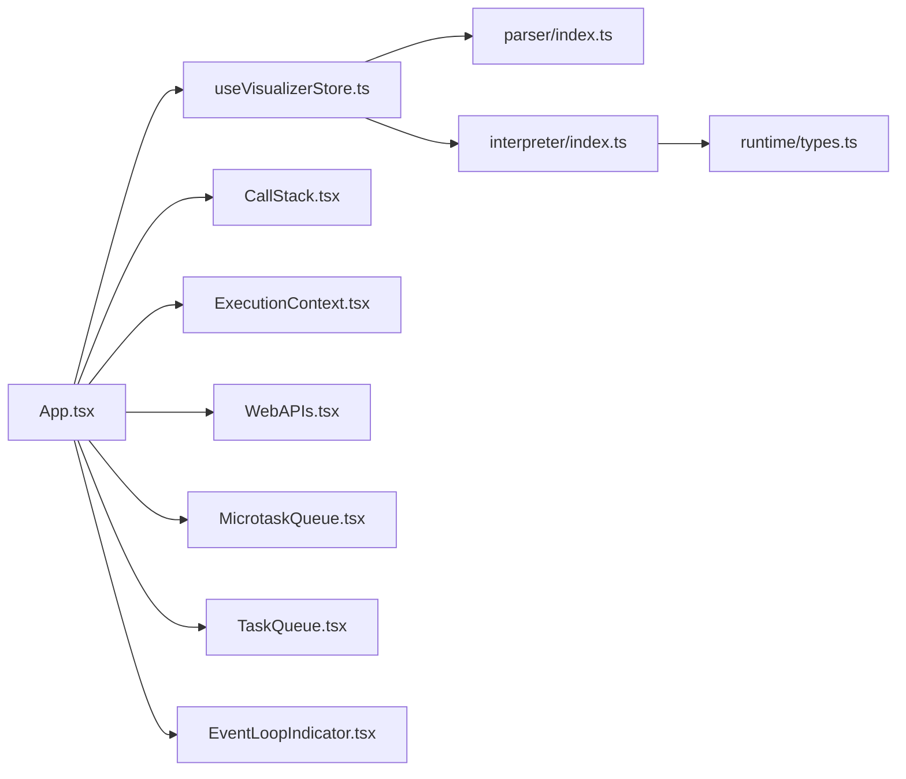

# JavaScript Execution Model

<cite>
**Referenced Files in This Document**
- [CallStack.tsx](file://src/components/visualizer/CallStack.tsx)
- [ExecutionContext.tsx](file://src/components/visualizer/ExecutionContext.tsx)
- [interpreter/index.ts](file://src/engine/interpreter/index.ts)
- [types.ts](file://src/engine/runtime/types.ts)
- [useVisualizerStore.ts](file://src/store/useVisualizerStore.ts)
- [App.tsx](file://src/App.tsx)
- [index.ts](file://src/examples/index.ts)
- [WebAPIs.tsx](file://src/components/visualizer/WebAPIs.tsx)
- [MicrotaskQueue.tsx](file://src/components/visualizer/MicrotaskQueue.tsx)
- [TaskQueue.tsx](file://src/components/visualizer/TaskQueue.tsx)
- [EventLoopIndicator.tsx](file://src/components/visualizer/EventLoopIndicator.tsx)
- [parser/index.ts](file://src/engine/parser/index.ts)
</cite>

## Table of Contents
1. [Introduction](#introduction)
2. [Project Structure](#project-structure)
3. [Core Components](#core-components)
4. [Architecture Overview](#architecture-overview)
5. [Detailed Component Analysis](#detailed-component-analysis)
6. [Dependency Analysis](#dependency-analysis)
7. [Performance Considerations](#performance-considerations)
8. [Troubleshooting Guide](#troubleshooting-guide)
9. [Conclusion](#conclusion)

## Introduction
This document explains the JavaScript execution model as implemented in the visualizer. It covers how the call stack manages function invocations, how environments and scopes track variables, and how primitives versus objects are stored and referenced. It also demonstrates synchronous execution, hoisting behavior, and memory cleanup through the visualizer’s call stack representation.

## Project Structure
The visualizer is organized around a runtime interpreter that simulates JavaScript execution and a React UI that renders the call stack, execution context, queues, and event loop. The interpreter maintains the call stack, environments, functions, promises, and queues, emitting snapshots at each step for visualization.

**Diagram sources**
- [App.tsx:17-107](file://src/App.tsx#L17-L107)
- [CallStack.tsx:12-78](file://src/components/visualizer/CallStack.tsx#L12-L78)
- [ExecutionContext.tsx:33-127](file://src/components/visualizer/ExecutionContext.tsx#L33-L127)
- [WebAPIs.tsx:13-153](file://src/components/visualizer/WebAPIs.tsx#L13-L153)
- [MicrotaskQueue.tsx:12-40](file://src/components/visualizer/MicrotaskQueue.tsx#L12-L40)
- [TaskQueue.tsx:12-40](file://src/components/visualizer/TaskQueue.tsx#L12-L40)
- [EventLoopIndicator.tsx:30-142](file://src/components/visualizer/EventLoopIndicator.tsx#L30-L142)
- [parser/index.ts:5-24](file://src/engine/parser/index.ts#L5-L24)
- [interpreter/index.ts:75-135](file://src/engine/interpreter/index.ts#L75-L135)
- [types.ts:183-195](file://src/engine/runtime/types.ts#L183-L195)
- [useVisualizerStore.ts:27-98](file://src/store/useVisualizerStore.ts#L27-L98)
- [index.ts:8-152](file://src/examples/index.ts#L8-L152)

**Section sources**
- [App.tsx:17-107](file://src/App.tsx#L17-L107)
- [useVisualizerStore.ts:27-98](file://src/store/useVisualizerStore.ts#L27-L98)
- [interpreter/index.ts:75-135](file://src/engine/interpreter/index.ts#L75-L135)

## Core Components
- Call Stack: Visualizes the stack frames representing active function calls.
- Execution Context: Shows the current environment(s) and variables in scope, walking up the scope chain.
- Interpreter: Drives synchronous execution, manages call stack and environments, and emits snapshots.
- Runtime Types: Defines the internal representation of values, environments, stack frames, and queues.
- Store: Manages code, execution trace, and playback state.
- Examples: Provides runnable code snippets demonstrating execution patterns.

**Section sources**
- [CallStack.tsx:12-78](file://src/components/visualizer/CallStack.tsx#L12-L78)
- [ExecutionContext.tsx:33-127](file://src/components/visualizer/ExecutionContext.tsx#L33-L127)
- [interpreter/index.ts:40-135](file://src/engine/interpreter/index.ts#L40-L135)
- [types.ts:3-108](file://src/engine/runtime/types.ts#L3-L108)
- [useVisualizerStore.ts:27-98](file://src/store/useVisualizerStore.ts#L27-L98)
- [index.ts:8-152](file://src/examples/index.ts#L8-L152)

## Architecture Overview
The interpreter parses source code into an AST, creates a global environment, hoists declarations, and executes statements. Each function call pushes a new stack frame and environment onto the interpreter state. Variable lookups traverse parent environments until a binding is found. Primitives are stored directly in runtime values; objects and arrays are stored as references in the interpreter’s stores.

**Diagram sources**
- [App.tsx:125-137](file://src/App.tsx#L125-L137)
- [useVisualizerStore.ts:37-50](file://src/store/useVisualizerStore.ts#L37-L50)
- [parser/index.ts:5-24](file://src/engine/parser/index.ts#L5-L24)
- [interpreter/index.ts:75-135](file://src/engine/interpreter/index.ts#L75-L135)
- [types.ts:226-240](file://src/engine/runtime/types.ts#L226-L240)

## Detailed Component Analysis

### Call Stack Visualization
The call stack panel displays frames in reverse order (most recent at the top). Each frame shows the function label and line number. The active frame is visually emphasized.

**Diagram sources**
- [CallStack.tsx:12-78](file://src/components/visualizer/CallStack.tsx#L12-L78)

**Section sources**
- [CallStack.tsx:12-78](file://src/components/visualizer/CallStack.tsx#L12-L78)

### Execution Context and Scope Chain
The execution context panel walks up the scope chain from the current environment to the global environment, collecting bindings. It filters out temporal dead zones and displays variable kinds (var, let, const, param, function) and values.

**Diagram sources**
- [ExecutionContext.tsx:33-127](file://src/components/visualizer/ExecutionContext.tsx#L33-L127)

**Section sources**
- [ExecutionContext.tsx:33-127](file://src/components/visualizer/ExecutionContext.tsx#L33-L127)

### Synchronous Execution and Stack Frame Management
The interpreter’s run method:
- Creates a global environment and hoists declarations.
- Pushes a global frame onto the call stack.
- Executes each statement in the program body.
- Pops the global frame and drains the event loop.

Function calls:
- Create a new environment with the function’s closure environment as parent.
- Bind parameters and push a new stack frame.
- Execute function body (hoisting declarations inside function bodies).
- On return, pop the frame and emit a snapshot.

**Diagram sources**
- [interpreter/index.ts:95-114](file://src/engine/interpreter/index.ts#L95-L114)
- [interpreter/index.ts:831-895](file://src/engine/interpreter/index.ts#L831-L895)

**Section sources**
- [interpreter/index.ts:95-114](file://src/engine/interpreter/index.ts#L95-L114)
- [interpreter/index.ts:831-895](file://src/engine/interpreter/index.ts#L831-L895)

### Variable Declaration and Assignment
VariableDeclaration:
- For var: hoisted and assigned in the nearest enclosing environment.
- For let/const: bound in the current environment.
- Emits snapshots for declaration and assignment.

AssignmentExpression:
- Resolves identifier to a binding and updates its value.
- Supports compound assignments (+, -, *, /, etc.).

**Section sources**
- [interpreter/index.ts:308-331](file://src/engine/interpreter/index.ts#L308-L331)
- [interpreter/index.ts:572-622](file://src/engine/interpreter/index.ts#L572-L622)

### Primitive vs Object Storage
Runtime values distinguish between primitives and references:
- Primitives: number, string, boolean, undefined, null are stored directly.
- Objects and arrays: stored as references in the interpreter’s stores; values are stored there and accessed via property/member expressions.

**Diagram sources**
- [types.ts:3-108](file://src/engine/runtime/types.ts#L3-L108)
- [types.ts:183-195](file://src/engine/runtime/types.ts#L183-L195)

**Section sources**
- [types.ts:3-108](file://src/engine/runtime/types.ts#L3-L108)

### Hoisting Behavior
Hoisting occurs at two levels:
- Program level: var and function declarations are hoisted into the global environment.
- Function level: var and function declarations are hoisted into the function’s environment before execution.

**Section sources**
- [interpreter/index.ts:92-94](file://src/engine/interpreter/index.ts#L92-L94)
- [interpreter/index.ts:224-241](file://src/engine/interpreter/index.ts#L224-L241)
- [interpreter/index.ts:864-873](file://src/engine/interpreter/index.ts#L864-L873)

### Memory Allocation and Cleanup
- Primitives are stored inline in runtime values; no separate heap allocation is modeled.
- Objects and arrays are stored in the interpreter’s stores; property access resolves to stored values.
- Stack frames and environments are created per function call and popped on return.
- The visualizer does not model garbage collection; references persist until environments are removed by popping frames.

**Section sources**
- [interpreter/index.ts:831-895](file://src/engine/interpreter/index.ts#L831-L895)
- [types.ts:183-195](file://src/engine/runtime/types.ts#L183-L195)

### Practical Examples Demonstrating Concepts
- Call Stack Growth: The “Call Stack Growth” example shows nested function calls stacking frames and unwinding on return.
- Event Loop Order: Demonstrates microtasks running before macrotasks.
- Promise Chain: Shows how .then() handlers are enqueued as microtasks.
- new Promise(): Demonstrates synchronous executor execution followed by asynchronous .then() scheduling.

**Section sources**
- [index.ts:134-151](file://src/examples/index.ts#L134-L151)
- [index.ts:38-54](file://src/examples/index.ts#L38-L54)
- [index.ts:21-37](file://src/examples/index.ts#L21-L37)
- [index.ts:80-96](file://src/examples/index.ts#L80-L96)

## Dependency Analysis
The visualizer composes UI panels with the interpreter state. The store orchestrates parsing, execution, and playback. The interpreter depends on runtime types for value representation and on the parser for AST construction.

**Diagram sources**
- [useVisualizerStore.ts:27-98](file://src/store/useVisualizerStore.ts#L27-L98)
- [parser/index.ts:5-24](file://src/engine/parser/index.ts#L5-L24)
- [interpreter/index.ts:75-135](file://src/engine/interpreter/index.ts#L75-L135)
- [types.ts:183-195](file://src/engine/runtime/types.ts#L183-L195)
- [App.tsx:17-107](file://src/App.tsx#L17-L107)

**Section sources**
- [useVisualizerStore.ts:27-98](file://src/store/useVisualizerStore.ts#L27-L98)
- [App.tsx:17-107](file://src/App.tsx#L17-L107)

## Performance Considerations
- Maximum steps: The interpreter enforces a maximum step count to prevent infinite loops.
- Snapshot cloning: Snapshots use structured clone; frequent snapshots can increase memory usage.
- Event loop safety: The event loop has a maximum iteration cap to avoid starvation.

**Section sources**
- [interpreter/index.ts:140-142](file://src/engine/interpreter/index.ts#L140-L142)
- [interpreter/index.ts:1198-1254](file://src/engine/interpreter/index.ts#L1198-L1254)

## Troubleshooting Guide
- Parsing errors: The parser returns structured parse errors with line and column information.
- Runtime errors: The interpreter captures errors and emits snapshots with error step types.
- Playback issues: The store resets playback state and clears errors when loading new examples.

**Section sources**
- [parser/index.ts:14-24](file://src/engine/parser/index.ts#L14-L24)
- [interpreter/index.ts:120-127](file://src/engine/interpreter/index.ts#L120-L127)
- [useVisualizerStore.ts:37-50](file://src/store/useVisualizerStore.ts#L37-L50)

## Conclusion
The visualizer models JavaScript’s execution model by maintaining a call stack and environments, executing statements synchronously, and emitting snapshots for each step. The UI surfaces the call stack, execution context, queues, and event loop phase, enabling learners to observe how function calls grow and shrink, how variables are scoped and resolved, and how primitives differ from object references in storage.