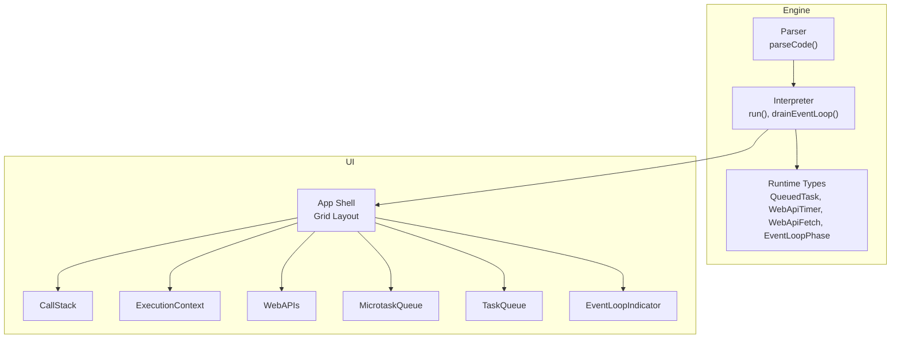
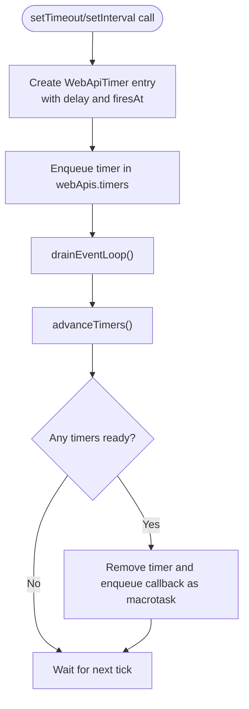
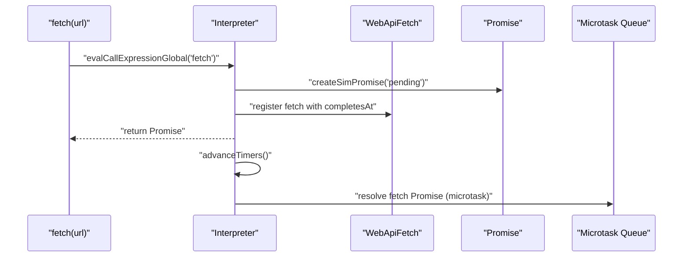
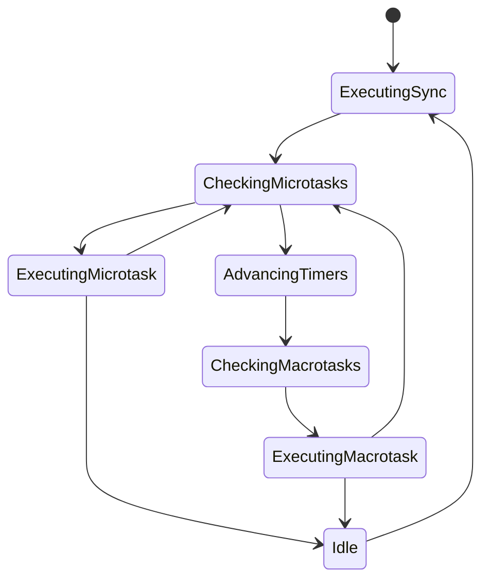
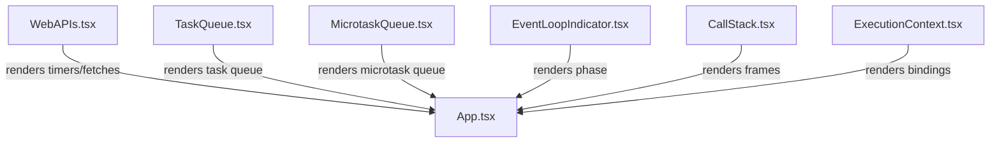
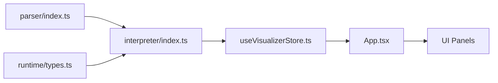

# Web APIs and Browser Integration

<cite>
**Referenced Files in This Document**
- [App.tsx](file://src/App.tsx)
- [index.ts](file://src/engine/index.ts)
- [types.ts](file://src/engine/runtime/types.ts)
- [interpreter/index.ts](file://src/engine/interpreter/index.ts)
- [parser/index.ts](file://src/engine/parser/index.ts)
- [useVisualizerStore.ts](file://src/store/useVisualizerStore.ts)
- [WebAPIs.tsx](file://src/components/visualizer/WebAPIs.tsx)
- [TaskQueue.tsx](file://src/components/visualizer/TaskQueue.tsx)
- [MicrotaskQueue.tsx](file://src/components/visualizer/MicrotaskQueue.tsx)
- [EventLoopIndicator.tsx](file://src/components/visualizer/EventLoopIndicator.tsx)
- [CallStack.tsx](file://src/components/visualizer/CallStack.tsx)
- [ExecutionContext.tsx](file://src/components/visualizer/ExecutionContext.tsx)
- [examples/index.ts](file://src/examples/index.ts)
</cite>

## Table of Contents
1. [Introduction](#introduction)
2. [Project Structure](#project-structure)
3. [Core Components](#core-components)
4. [Architecture Overview](#architecture-overview)
5. [Detailed Component Analysis](#detailed-component-analysis)
6. [Dependency Analysis](#dependency-analysis)
7. [Performance Considerations](#performance-considerations)
8. [Troubleshooting Guide](#troubleshooting-guide)
9. [Conclusion](#conclusion)
10. [Appendices](#appendices)

## Introduction
This document explains how JavaScript interacts with browser Web APIs and how these integrations affect the event loop. It focuses on how the visualizer simulates browser behaviors for setTimeout, setInterval, fetch, and DOM-related operations (as represented by console logging and DOM manipulation patterns). It also clarifies the differences between browser-specific APIs and Node.js APIs, and demonstrates how the visualizer tracks API interactions and shows their impact on the execution timeline.

## Project Structure
The visualizer is organized around a runtime interpreter that simulates JavaScript execution, including the event loop, queues, and Web API interactions. The UI components visualize the interpreter state, including the call stack, scope/variables, Web APIs, microtask and task queues, and the event loop phase.



**Diagram sources**
- [App.tsx:61-106](file://src/App.tsx#L61-L106)
- [interpreter/index.ts:75-135](file://src/engine/interpreter/index.ts#L75-L135)
- [parser/index.ts:5-24](file://src/engine/parser/index.ts#L5-L24)
- [types.ts:110-195](file://src/engine/runtime/types.ts#L110-L195)

**Section sources**
- [App.tsx:17-107](file://src/App.tsx#L17-L107)
- [index.ts:1-17](file://src/engine/index.ts#L1-L17)

## Core Components
- Runtime types define the shapes of interpreter state, including queues, Web API entries, and event loop phases.
- The interpreter parses code, executes statements, and simulates the event loop with microtasks and macrotasks.
- UI panels visualize the call stack, scope/variables, Web APIs, microtask/task queues, and the event loop phase.

Key runtime types:
- QueuedTask: a scheduled callback with arguments.
- WebApiTimer: a scheduled setTimeout/setInterval entry with timing metadata.
- WebApiFetch: a pending fetch entry with completion timing and associated promise ID.
- EventLoopPhase: the current phase of the event loop (idle, executing sync, checking microtasks, executing microtask, checking macrotasks, executing macrotask, advancing timers).

**Section sources**
- [types.ts:112-195](file://src/engine/runtime/types.ts#L112-L195)
- [interpreter/index.ts:40-73](file://src/engine/interpreter/index.ts#L40-L73)

## Architecture Overview
The visualizer simulates browser Web APIs and the event loop by:
- Registering timers and fetches in the interpreter state.
- Advancing a virtual clock and moving ready timers into the task queue.
- Resolving fetch promises and enqueuing then handlers as microtasks.
- Draining microtasks before macrotasks, and re-checking microtasks after each macrotask.

```mermaid
sequenceDiagram
participant User as "User"
participant Store as "useVisualizerStore"
participant Engine as "Interpreter"
participant Loop as "drainEventLoop()"
participant Timer as "advanceTimers()"
participant Q as "Queues"
User->>Store : "runCode()"
Store->>Engine : "parseAndRun(code)"
Engine->>Engine : "execute statements"
Engine->>Loop : "drainEventLoop()"
Loop->>Q : "drain microtasks"
alt timers ready
Loop->>Timer : "advanceTimers()"
Timer->>Q : "enqueue macrotasks"
end
alt task queue not empty
Loop->>Q : "dequeue macrotask"
Loop->>Engine : "executeQueuedTask()"
end
Loop-->>Engine : "repeat until idle"
```

**Diagram sources**
- [useVisualizerStore.ts:37-50](file://src/store/useVisualizerStore.ts#L37-L50)
- [interpreter/index.ts:1198-1254](file://src/engine/interpreter/index.ts#L1198-L1254)
- [interpreter/index.ts:1256-1312](file://src/engine/interpreter/index.ts#L1256-L1312)

## Detailed Component Analysis

### Web API Simulation: setTimeout, setInterval, clearTimeout, clearInterval
- The interpreter recognizes global function calls for setTimeout, setInterval, clearTimeout, and clearInterval.
- It registers timers with a virtual clock timestamp and stores them in the Web API timers list.
- On each event loop cycle, the interpreter advances timers to the earliest ready time and enqueues their callbacks as macrotasks.
- setInterval re-registers itself after firing to simulate periodic execution.



**Diagram sources**
- [interpreter/index.ts:899-950](file://src/engine/interpreter/index.ts#L899-L950)
- [interpreter/index.ts:1256-1312](file://src/engine/interpreter/index.ts#L1256-L1312)

**Section sources**
- [interpreter/index.ts:900-929](file://src/engine/interpreter/index.ts#L900-L929)
- [interpreter/index.ts:1274-1293](file://src/engine/interpreter/index.ts#L1274-L1293)

### Web API Simulation: fetch
- The interpreter creates a pending Promise and registers a WebApiFetch entry with a completion timestamp.
- When the virtual clock reaches the completion time, the fetch promise is resolved with a minimal response object.
- Then handlers attached to the fetch promise are enqueued as microtasks.



**Diagram sources**
- [interpreter/index.ts:931-947](file://src/engine/interpreter/index.ts#L931-L947)
- [interpreter/index.ts:1295-1311](file://src/engine/interpreter/index.ts#L1295-L1311)
- [interpreter/index.ts:1100-1122](file://src/engine/interpreter/index.ts#L1100-L1122)

**Section sources**
- [interpreter/index.ts:931-947](file://src/engine/interpreter/index.ts#L931-L947)
- [interpreter/index.ts:1295-1311](file://src/engine/interpreter/index.ts#L1295-L1311)

### Event Loop Phases and Queue Behavior
- The interpreter maintains an event loop phase and two queues: microtask and task.
- The loop drains microtasks first, then advances timers, then executes one macrotask, and repeats.
- The UI displays the current phase and highlights the active phase.



**Diagram sources**
- [types.ts:164-171](file://src/engine/runtime/types.ts#L164-L171)
- [interpreter/index.ts:1198-1254](file://src/engine/interpreter/index.ts#L1198-L1254)

**Section sources**
- [types.ts:164-171](file://src/engine/runtime/types.ts#L164-L171)
- [EventLoopIndicator.tsx:10-28](file://src/components/visualizer/EventLoopIndicator.tsx#L10-L28)

### Visualization Panels
- WebAPIs panel shows active timers and inflight fetches with animated progress indicators.
- TaskQueue and MicrotaskQueue panels show queued callbacks with labels and counts.
- EventLoopIndicator shows the current phase and animates the active phase.
- CallStack and ExecutionContext panels visualize the call stack and current scope/variables.



**Diagram sources**
- [WebAPIs.tsx:13-153](file://src/components/visualizer/WebAPIs.tsx#L13-L153)
- [TaskQueue.tsx:12-40](file://src/components/visualizer/TaskQueue.tsx#L12-L40)
- [MicrotaskQueue.tsx:12-40](file://src/components/visualizer/MicrotaskQueue.tsx#L12-L40)
- [EventLoopIndicator.tsx:30-142](file://src/components/visualizer/EventLoopIndicator.tsx#L30-L142)
- [CallStack.tsx:12-78](file://src/components/visualizer/CallStack.tsx#L12-L78)
- [ExecutionContext.tsx:33-127](file://src/components/visualizer/ExecutionContext.tsx#L33-L127)
- [App.tsx:61-106](file://src/App.tsx#L61-L106)

**Section sources**
- [WebAPIs.tsx:13-153](file://src/components/visualizer/WebAPIs.tsx#L13-L153)
- [TaskQueue.tsx:12-40](file://src/components/visualizer/TaskQueue.tsx#L12-L40)
- [MicrotaskQueue.tsx:12-40](file://src/components/visualizer/MicrotaskQueue.tsx#L12-L40)
- [EventLoopIndicator.tsx:30-142](file://src/components/visualizer/EventLoopIndicator.tsx#L30-L142)
- [CallStack.tsx:12-78](file://src/components/visualizer/CallStack.tsx#L12-L78)
- [ExecutionContext.tsx:33-127](file://src/components/visualizer/ExecutionContext.tsx#L33-L127)

### Browser vs Node.js APIs
- Browser-specific APIs (e.g., setTimeout, setInterval, fetch) are simulated in the interpreter by registering timers and fetches and advancing a virtual clock.
- Node.js APIs (e.g., process.nextTick, setImmediate, require) are not part of this simulation and would require separate modeling if added.
- DOM manipulation is represented here by console logging and object property access patterns; DOM mutations are not modeled.

[No sources needed since this section provides conceptual comparison without analyzing specific files]

### Practical Usage Patterns and Timing Considerations
Common patterns demonstrated by the examples:
- setTimeout basics: timers enqueue callbacks after the synchronous execution completes.
- Promise chains: then handlers enqueue as microtasks and run before the next macrotask.
- Event loop order: microtasks run before macrotasks.
- Mixed async: interleaving setTimeout and Promise leads to alternating microtask and macrotask execution.
- new Promise(): executor runs synchronously; then handlers run asynchronously as microtasks.
- Nested setTimeout: each callback schedules the next one, demonstrating callback chaining.

**Section sources**
- [examples/index.ts:8-152](file://src/examples/index.ts#L8-L152)

### Potential Pitfalls
- Callback accumulation: repeated setTimeout or setInterval can lead to many queued callbacks, increasing memory and CPU usage.
- Long-running microtasks: can starve macrotasks and make the UI feel unresponsive.
- Fetch promise resolution: ensure then handlers are attached promptly to avoid missing microtasks.

[No sources needed since this section provides general guidance]

## Dependency Analysis
The interpreter depends on runtime types and the parser. The UI depends on the interpreter state exposed via the store and snapshot selection.



**Diagram sources**
- [parser/index.ts:5-24](file://src/engine/parser/index.ts#L5-L24)
- [interpreter/index.ts:75-135](file://src/engine/interpreter/index.ts#L75-L135)
- [useVisualizerStore.ts:101-109](file://src/store/useVisualizerStore.ts#L101-L109)
- [App.tsx:17-107](file://src/App.tsx#L17-L107)

**Section sources**
- [index.ts:1-17](file://src/engine/index.ts#L1-L17)
- [useVisualizerStore.ts:27-98](file://src/store/useVisualizerStore.ts#L27-L98)

## Performance Considerations
- The interpreter limits maximum steps to prevent infinite loops.
- Virtual clock advancement ensures deterministic scheduling of timers and fetches.
- Microtasks are drained before macrotasks to keep the UI responsive.

[No sources needed since this section provides general guidance]

## Troubleshooting Guide
- If the visualizer does not update, ensure the code compiles and the interpreter emits snapshots.
- If timers do not fire, verify the delay and virtual clock progression.
- If fetch promises do not resolve, confirm the fetch entry’s completion timestamp and that microtasks are being executed.

**Section sources**
- [interpreter/index.ts:139-150](file://src/engine/interpreter/index.ts#L139-L150)
- [interpreter/index.ts:1256-1312](file://src/engine/interpreter/index.ts#L1256-L1312)

## Conclusion
The visualizer simulates browser Web APIs and the event loop by modeling timers, fetches, and queues with a virtual clock. It demonstrates how microtasks run before macrotasks, how timers enqueue callbacks, and how fetch promises resolve to drive then handlers as microtasks. The UI panels provide a clear view of the call stack, scope/variables, Web APIs, queues, and event loop phase, enabling learners to understand asynchronous execution and timing behavior.

## Appendices

### API Reference: Web API Entries and Queues
- WebApiTimer: fields include id, type, callbackFunctionId, delay, registeredAt, firesAt, label.
- WebApiFetch: fields include id, url, promiseId, registeredAt, completesAt, label.
- QueuedTask: fields include id, label, callbackFunctionId, args.
- EventLoopPhase: idle, executing-sync, checking-microtasks, executing-microtask, checking-macrotasks, executing-macrotask, advancing-timers.

**Section sources**
- [types.ts:121-143](file://src/engine/runtime/types.ts#L121-L143)
- [types.ts:112-117](file://src/engine/runtime/types.ts#L112-L117)
- [types.ts:164-171](file://src/engine/runtime/types.ts#L164-L171)