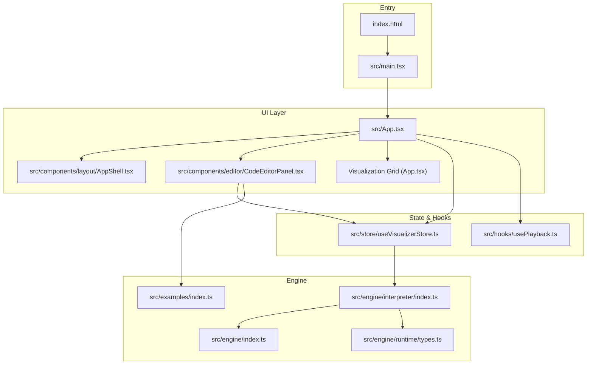
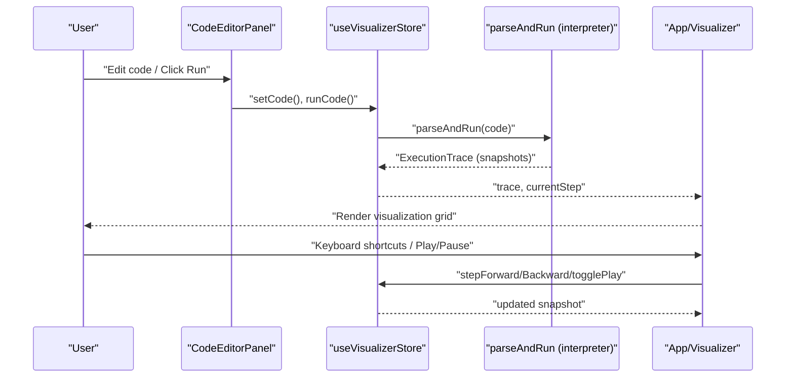
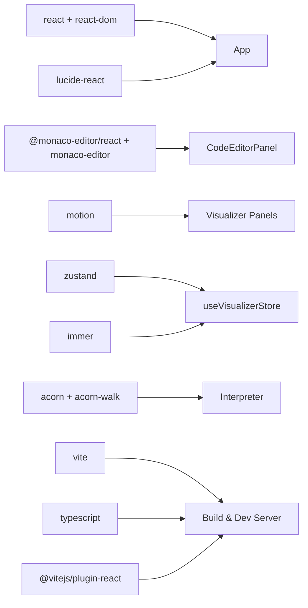

# Development Guide

<cite>
**Referenced Files in This Document**
- [package.json](file://package.json)
- [vite.config.ts](file://vite.config.ts)
- [tsconfig.json](file://tsconfig.json)
- [index.html](file://index.html)
- [src/main.tsx](file://src/main.tsx)
- [src/App.tsx](file://src/App.tsx)
- [src/engine/index.ts](file://src/engine/index.ts)
- [src/engine/interpreter/index.ts](file://src/engine/interpreter/index.ts)
- [src/store/useVisualizerStore.ts](file://src/store/useVisualizerStore.ts)
- [src/hooks/usePlayback.ts](file://src/hooks/usePlayback.ts)
- [src/examples/index.ts](file://src/examples/index.ts)
- [src/components/editor/CodeEditorPanel.tsx](file://src/components/editor/CodeEditorPanel.tsx)
- [src/components/layout/AppShell.tsx](file://src/components/layout/AppShell.tsx)
- [src/components/visualizer/CallStack.tsx](file://src/components/visualizer/CallStack.tsx)
- [src/theme/tokens.ts](file://src/theme/tokens.ts)
</cite>

## Table of Contents
1. [Introduction](#introduction)
2. [Project Structure](#project-structure)
3. [Core Components](#core-components)
4. [Architecture Overview](#architecture-overview)
5. [Detailed Component Analysis](#detailed-component-analysis)
6. [Dependency Analysis](#dependency-analysis)
7. [Performance Considerations](#performance-considerations)
8. [Troubleshooting Guide](#troubleshooting-guide)
9. [Contribution Guidelines](#contribution-guidelines)
10. [Extension Points and Customization](#extension-points-and-customization)
11. [Conclusion](#conclusion)

## Introduction
This document provides comprehensive development guidance for contributors and maintainers working on the JavaScript Visualizer project. It covers environment setup, build configuration, project structure conventions, coding standards, architectural principles, testing and debugging strategies, performance profiling, contribution workflows, and extension points. The goal is to enable efficient onboarding and consistent development across the codebase.

## Project Structure
The project follows a feature-based, React-centric architecture with a clear separation of concerns:
- Engine: A JavaScript interpreter and runtime simulator that generates execution traces with snapshots.
- Store: Centralized state management using Zustand for code, trace, playback, and UI state.
- Hooks: Playback and keyboard shortcuts for stepping and animation control.
- Components: Modular UI components for editor, visualization panels, and layout.
- Examples: Predefined code samples demonstrating core concepts.
- Theme: Design tokens for consistent theming across the UI.

**Diagram sources**
- [index.html](file://index.html)
- [src/main.tsx](file://src/main.tsx)
- [src/App.tsx](file://src/App.tsx)
- [src/components/layout/AppShell.tsx](file://src/components/layout/AppShell.tsx)
- [src/components/editor/CodeEditorPanel.tsx](file://src/components/editor/CodeEditorPanel.tsx)
- [src/store/useVisualizerStore.ts](file://src/store/useVisualizerStore.ts)
- [src/hooks/usePlayback.ts](file://src/hooks/usePlayback.ts)
- [src/engine/index.ts](file://src/engine/index.ts)
- [src/engine/interpreter/index.ts](file://src/engine/interpreter/index.ts)
- [src/examples/index.ts](file://src/examples/index.ts)

**Section sources**
- [index.html](file://index.html)
- [src/main.tsx](file://src/main.tsx)
- [src/App.tsx](file://src/App.tsx)
- [src/components/layout/AppShell.tsx](file://src/components/layout/AppShell.tsx)
- [src/components/editor/CodeEditorPanel.tsx](file://src/components/editor/CodeEditorPanel.tsx)
- [src/store/useVisualizerStore.ts](file://src/store/useVisualizerStore.ts)
- [src/hooks/usePlayback.ts](file://src/hooks/usePlayback.ts)
- [src/engine/index.ts](file://src/engine/index.ts)
- [src/engine/interpreter/index.ts](file://src/engine/interpreter/index.ts)
- [src/examples/index.ts](file://src/examples/index.ts)
- [src/theme/tokens.ts](file://src/theme/tokens.ts)

## Core Components
- Application shell and layout: Provides responsive grid layout and consistent theming.
- Code editor: Monaco-based editor with syntax highlighting, theming, and live feedback during execution.
- Visualizer grid: Renders runtime constructs (call stack, execution context, Web APIs, queues, event loop indicator).
- Playback and keyboard controls: Interval-driven stepping and keyboard shortcuts for navigation.
- Store: Central state for code, trace, playback, and UI state with selectors for efficient rendering.
- Engine: AST-based interpreter that simulates execution, produces snapshots, and handles asynchronous constructs.

Key responsibilities and interactions:
- App orchestrates UI composition and integrates store and hooks.
- Store coordinates parsing, execution, and playback actions.
- Engine produces snapshots consumed by visualizer components.
- Editor updates code and triggers re-execution via store.

**Section sources**
- [src/App.tsx](file://src/App.tsx)
- [src/components/layout/AppShell.tsx](file://src/components/layout/AppShell.tsx)
- [src/components/editor/CodeEditorPanel.tsx](file://src/components/editor/CodeEditorPanel.tsx)
- [src/components/visualizer/CallStack.tsx](file://src/components/visualizer/CallStack.tsx)
- [src/store/useVisualizerStore.ts](file://src/store/useVisualizerStore.ts)
- [src/hooks/usePlayback.ts](file://src/hooks/usePlayback.ts)
- [src/engine/index.ts](file://src/engine/index.ts)
- [src/engine/interpreter/index.ts](file://src/engine/interpreter/index.ts)

## Architecture Overview
The application is a single-page React application bundled with Vite and transpiled with TypeScript. The engine simulates JavaScript execution and emits snapshots that drive the visualizer. Zustand manages state, and React hooks coordinate playback and keyboard interactions.

**Diagram sources**
- [src/components/editor/CodeEditorPanel.tsx](file://src/components/editor/CodeEditorPanel.tsx)
- [src/store/useVisualizerStore.ts](file://src/store/useVisualizerStore.ts)
- [src/engine/index.ts](file://src/engine/index.ts)
- [src/engine/interpreter/index.ts](file://src/engine/interpreter/index.ts)
- [src/App.tsx](file://src/App.tsx)

## Detailed Component Analysis

### Build System and Toolchain
- Node.js and package manager: Install dependencies via the package manager configured in your environment.
- Scripts:
  - dev: Starts Vite dev server.
  - build: Runs TypeScript project references and builds with Vite.
  - preview: Serves the production build locally.
  - typecheck: Performs type checking without emitting.
- Vite configuration: React plugin enabled; minimal custom configuration.
- TypeScript compiler options emphasize strictness, ESNext module resolution, and JSX transform for React.

Recommended setup:
- Use Node.js LTS.
- Install dependencies with your package manager.
- Run scripts as defined in package.json.

**Section sources**
- [package.json](file://package.json)
- [vite.config.ts](file://vite.config.ts)
- [tsconfig.json](file://tsconfig.json)

### Entry Point and Bootstrapping
- index.html defines the root container and loads the module script.
- main.tsx mounts the React root and renders App inside StrictMode.
- App composes layout, editor, visualization grid, controls, and console.

Best practices:
- Keep index.html minimal and static.
- Ensure the root element exists and matches the mount target.

**Section sources**
- [index.html](file://index.html)
- [src/main.tsx](file://src/main.tsx)
- [src/App.tsx](file://src/App.tsx)

### State Management (Zustand)
- Store encapsulates code, trace, playback state, and actions.
- Actions include running code, stepping forward/backward, toggling playback, resetting, and loading examples.
- Selectors optimize rendering by avoiding unnecessary re-renders.

Design notes:
- Primitive selectors prevent object churn.
- Error handling stores runtime errors alongside trace metadata.

**Section sources**
- [src/store/useVisualizerStore.ts](file://src/store/useVisualizerStore.ts)

### Playback and Interactions (Hooks)
- usePlayback sets up an interval to advance steps at a configurable speed.
- useKeyboardShortcuts captures global key events, ignores editor inputs, and dispatches actions.

Guidelines:
- Clean up intervals and event listeners in effects.
- Scope keyboard handling to avoid interfering with editor input.

**Section sources**
- [src/hooks/usePlayback.ts](file://src/hooks/usePlayback.ts)

### Engine and Interpreter
- The interpreter parses code, initializes environments, executes statements, and maintains an event loop simulation.
- Snapshots capture the runtime state at each step, enabling stepwise visualization.
- Special handling for console, timers, fetch, promises, and await.

Key behaviors:
- Emits snapshots for program lifecycle, variable assignments, function calls, and async events.
- Limits maximum steps to prevent infinite loops.
- Highlights the currently executing line in the editor.

**Section sources**
- [src/engine/index.ts](file://src/engine/index.ts)
- [src/engine/interpreter/index.ts](file://src/engine/interpreter/index.ts)

### Editor and Examples
- CodeEditorPanel integrates Monaco Editor, applies a custom theme, and highlights the current line.
- ExampleSelector loads predefined examples into the editor.
- Supports read-only mode during execution and resets editing after completion.

Integration points:
- Editor updates store code; Run button triggers execution.
- Error messages are surfaced below the editor.

**Section sources**
- [src/components/editor/CodeEditorPanel.tsx](file://src/components/editor/CodeEditorPanel.tsx)
- [src/examples/index.ts](file://src/examples/index.ts)

### Visualization Panels
- App renders a grid layout with dedicated panels for call stack, execution context, Web APIs, microtask/task queues, and event loop indicator.
- Uses motion for smooth animations and layout transitions.
- Theme tokens unify colors and typography.

Rendering strategy:
- Panels adapt to empty states and highlight active items.
- Layout areas are defined via CSS Grid for responsiveness.

**Section sources**
- [src/App.tsx](file://src/App.tsx)
- [src/components/visualizer/CallStack.tsx](file://src/components/visualizer/CallStack.tsx)
- [src/theme/tokens.ts](file://src/theme/tokens.ts)

### Layout Shell
- AppShell provides the overall page structure, header, and grid-based content area.
- Ensures consistent spacing, borders, and typography using theme tokens.

**Section sources**
- [src/components/layout/AppShell.tsx](file://src/components/layout/AppShell.tsx)
- [src/theme/tokens.ts](file://src/theme/tokens.ts)

## Dependency Analysis
External libraries and their roles:
- React and ReactDOM: UI framework and DOM renderer.
- @monaco-editor/react and monaco-editor: Code editing and syntax highlighting.
- motion: Animation library for smooth transitions.
- zustand: Lightweight state management.
- immer: Immer support for immutable updates (via Zustand).
- acorn and acorn-walk: Parsing and AST walking for the interpreter.
- lucide-react: Icons.

Build-time dependencies:
- @vitejs/plugin-react: Fast React refresh and JSX transform.
- TypeScript and Vite: Type checking and bundling.

**Diagram sources**
- [package.json](file://package.json)
- [vite.config.ts](file://vite.config.ts)
- [src/App.tsx](file://src/App.tsx)
- [src/components/editor/CodeEditorPanel.tsx](file://src/components/editor/CodeEditorPanel.tsx)
- [src/components/visualizer/CallStack.tsx](file://src/components/visualizer/CallStack.tsx)
- [src/store/useVisualizerStore.ts](file://src/store/useVisualizerStore.ts)
- [src/engine/interpreter/index.ts](file://src/engine/interpreter/index.ts)

**Section sources**
- [package.json](file://package.json)
- [vite.config.ts](file://vite.config.ts)

## Performance Considerations
- Rendering:
  - Prefer selectors to avoid unnecessary re-renders.
  - Use layout animations judiciously; disable where not needed.
- Execution:
  - The interpreter limits maximum steps to prevent hangs.
  - Avoid overly complex examples that generate excessive snapshots.
- Bundling:
  - Keep dependencies lean; tree-shakeable modules reduce bundle size.
- Editor:
  - Disable minimap and expensive editor features in production builds if needed.
- Animations:
  - Use motion primitives efficiently; batch updates when stepping through many snapshots.

[No sources needed since this section provides general guidance]

## Troubleshooting Guide
Common issues and resolutions:
- Editor not editable:
  - During execution, the editor is read-only by design. Click Reset & Edit to unlock.
- No visualization appears:
  - Ensure code compiles and runs without fatal errors; check the error banner under the editor.
- Playback does not advance:
  - Verify playback state and speed; ensure the trace exists and current step is less than total steps.
- Infinite loop detected:
  - The interpreter stops after exceeding maximum steps; refactor the code to terminate loops.
- Keyboard shortcuts not working:
  - Shortcuts are ignored when focused inside the editor; press outside the editor or use mouse controls.

**Section sources**
- [src/components/editor/CodeEditorPanel.tsx](file://src/components/editor/CodeEditorPanel.tsx)
- [src/store/useVisualizerStore.ts](file://src/store/useVisualizerStore.ts)
- [src/hooks/usePlayback.ts](file://src/hooks/usePlayback.ts)
- [src/engine/interpreter/index.ts](file://src/engine/interpreter/index.ts)

## Contribution Guidelines
Workflow:
- Fork and branch from the default branch.
- Make atomic commits with clear messages.
- Run typecheck and build locally before opening a pull request.
- Add or update tests as appropriate.
- Reference related issues and update CHANGELOG entries if applicable.

Code review:
- Keep diffs small and focused.
- Ensure type safety and adherence to existing patterns.
- Verify UI correctness and accessibility.

Release procedure:
- Update version in package.json according to semantic versioning.
- Tag the release commit and publish artifacts as needed.

[No sources needed since this section summarizes process without analyzing specific files]

## Extension Points and Customization
Adding new examples:
- Extend the examples collection with new CodeExample entries.
- Provide concise titles, descriptions, and runnable code.

Adding new visualizer panels:
- Create a new component under components/visualizer.
- Integrate into the visualization grid in App.
- Use theme tokens for consistent styling.

Customizing the editor:
- Adjust Monaco options in the editor panel.
- Add new themes or modify existing ones.

Extending the interpreter:
- Add new AST nodes or runtime behaviors in the interpreter.
- Emit additional snapshot types to reflect changes in the UI.

[No sources needed since this section provides general guidance]

## Conclusion
This guide outlines the development environment, build system, architecture, and operational practices for contributing to the JavaScript Visualizer. By following the conventions and recommendations herein, contributors can efficiently implement features, maintain performance, and ensure a consistent user experience across browsers and deployment scenarios.