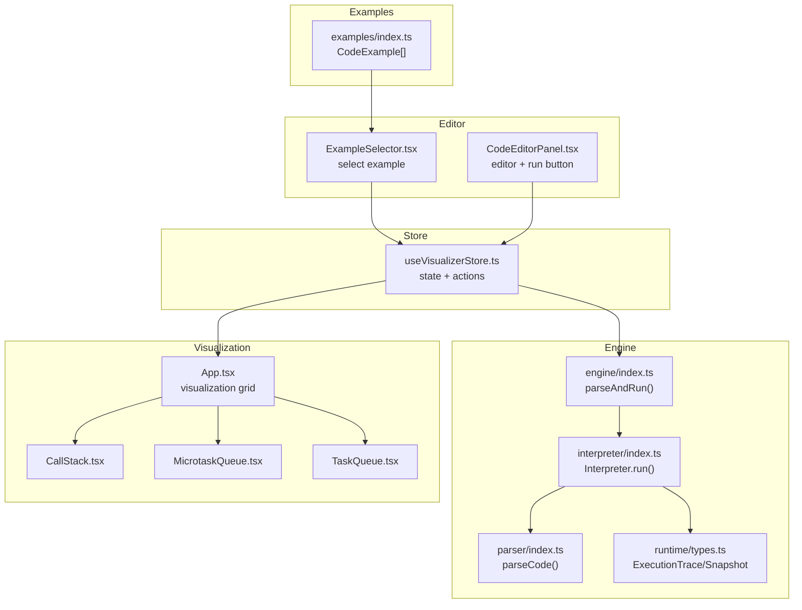
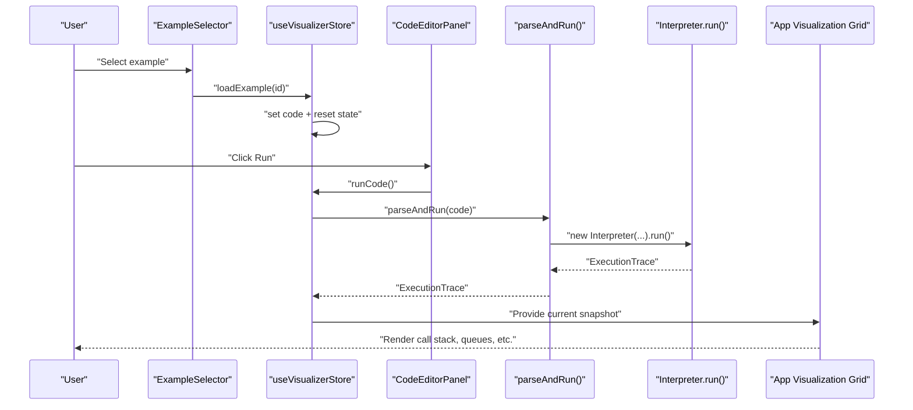
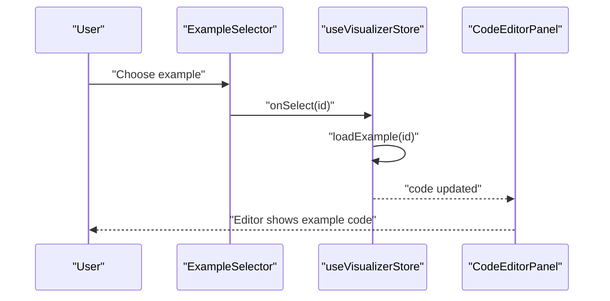
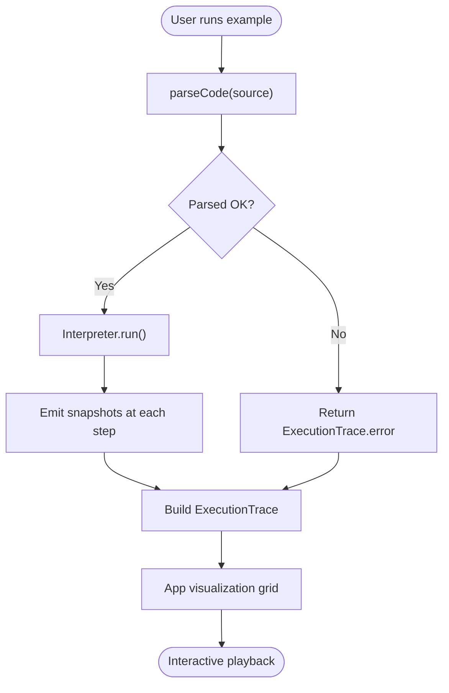
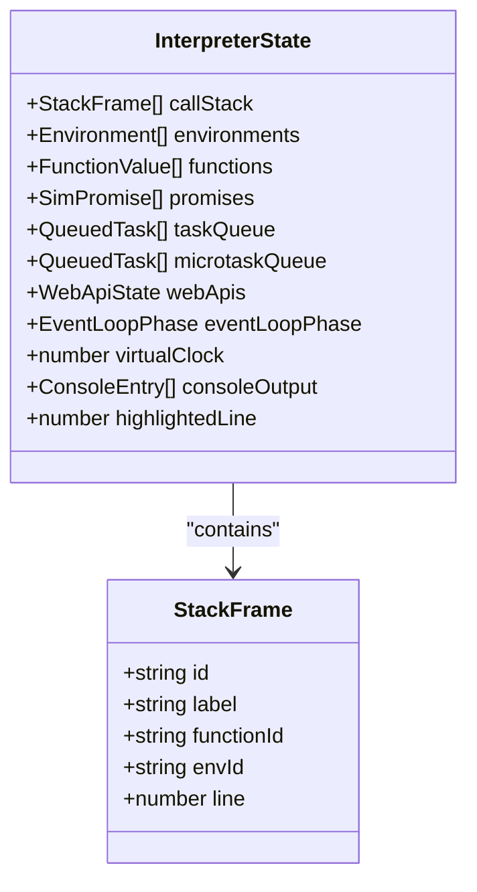
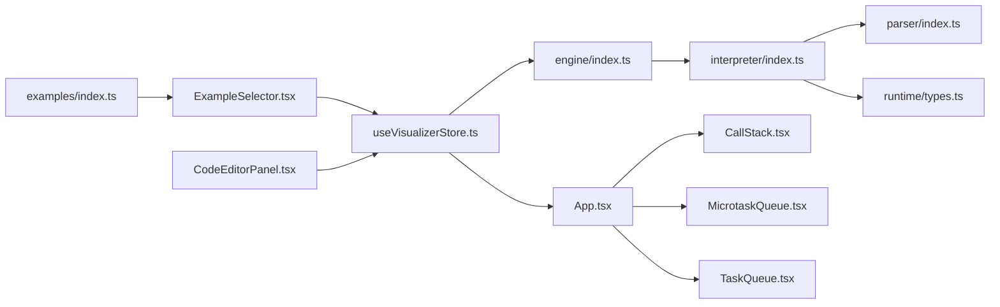

# Examples and Demonstrations

<cite>
**Referenced Files in This Document**
- [src/examples/index.ts](file://src/examples/index.ts)
- [src/components/editor/ExampleSelector.tsx](file://src/components/editor/ExampleSelector.tsx)
- [src/components/editor/CodeEditorPanel.tsx](file://src/components/editor/CodeEditorPanel.tsx)
- [src/store/useVisualizerStore.ts](file://src/store/useVisualizerStore.ts)
- [src/App.tsx](file://src/App.tsx)
- [src/engine/index.ts](file://src/engine/index.ts)
- [src/engine/runtime/types.ts](file://src/engine/runtime/types.ts)
- [src/engine/interpreter/index.ts](file://src/engine/interpreter/index.ts)
- [src/engine/parser/index.ts](file://src/engine/parser/index.ts)
- [src/components/visualizer/CallStack.tsx](file://src/components/visualizer/CallStack.tsx)
- [src/components/visualizer/MicrotaskQueue.tsx](file://src/components/visualizer/MicrotaskQueue.tsx)
- [src/components/visualizer/TaskQueue.tsx](file://src/components/visualizer/TaskQueue.tsx)
</cite>

## Table of Contents
1. [Introduction](#introduction)
2. [Project Structure](#project-structure)
3. [Core Components](#core-components)
4. [Architecture Overview](#architecture-overview)
5. [Detailed Component Analysis](#detailed-component-analysis)
6. [Dependency Analysis](#dependency-analysis)
7. [Performance Considerations](#performance-considerations)
8. [Troubleshooting Guide](#troubleshooting-guide)
9. [Conclusion](#conclusion)
10. [Appendices](#appendices)

## Introduction
This document explains the examples system and demonstration library used by the JavaScript Visualizer. It covers how examples are organized, loaded, selected, and executed; how they integrate with the visualization system to teach JavaScript concepts; and how to extend the examples library with new demonstrations. The examples illustrate core concepts such as synchronous execution, the event loop ordering of microtasks versus macrotasks, Promise chains, async/await semantics, closures, nested timers, and call stack growth.

## Project Structure
The examples system centers around a small TypeScript module that defines the example catalog and integrates with the editor, store, and visualization components. The engine simulates JavaScript execution and produces a step-by-step trace consumed by the UI.



**Diagram sources**
- [src/examples/index.ts:1-153](file://src/examples/index.ts#L1-L153)
- [src/components/editor/ExampleSelector.tsx:1-60](file://src/components/editor/ExampleSelector.tsx#L1-L60)
- [src/components/editor/CodeEditorPanel.tsx:1-162](file://src/components/editor/CodeEditorPanel.tsx#L1-L162)
- [src/store/useVisualizerStore.ts:1-109](file://src/store/useVisualizerStore.ts#L1-L109)
- [src/engine/index.ts:1-17](file://src/engine/index.ts#L1-L17)
- [src/engine/interpreter/index.ts:1-200](file://src/engine/interpreter/index.ts#L1-L200)
- [src/engine/parser/index.ts:1-25](file://src/engine/parser/index.ts#L1-L25)
- [src/engine/runtime/types.ts:1-249](file://src/engine/runtime/types.ts#L1-L249)
- [src/App.tsx:1-138](file://src/App.tsx#L1-L138)
- [src/components/visualizer/CallStack.tsx:1-79](file://src/components/visualizer/CallStack.tsx#L1-L79)
- [src/components/visualizer/MicrotaskQueue.tsx:1-41](file://src/components/visualizer/MicrotaskQueue.tsx#L1-L41)
- [src/components/visualizer/TaskQueue.tsx:1-41](file://src/components/visualizer/TaskQueue.tsx#L1-L41)

**Section sources**
- [src/examples/index.ts:1-153](file://src/examples/index.ts#L1-L153)
- [src/components/editor/ExampleSelector.tsx:1-60](file://src/components/editor/ExampleSelector.tsx#L1-L60)
- [src/components/editor/CodeEditorPanel.tsx:1-162](file://src/components/editor/CodeEditorPanel.tsx#L1-L162)
- [src/store/useVisualizerStore.ts:1-109](file://src/store/useVisualizerStore.ts#L1-L109)
- [src/engine/index.ts:1-17](file://src/engine/index.ts#L1-L17)
- [src/App.tsx:1-138](file://src/App.tsx#L1-L138)

## Core Components
- Example catalog: A typed array of example objects with id, title, description, and code. See [src/examples/index.ts:8-L152].
- Example selector: A dropdown UI that lets users pick an example and updates the editor content via the store. See [src/components/editor/ExampleSelector.tsx:10-L59].
- Store: Central state managing code, execution trace, playback, and example loading. Includes actions to load an example by id. See [src/store/useVisualizerStore.ts:27-L98].
- Engine: Parses and executes JavaScript code, producing an ExecutionTrace with Snapshots. See [src/engine/index.ts:1-L17] and [src/engine/interpreter/index.ts:1361-L1365].
- Visualization grid: Renders call stack, execution context, Web APIs, event loop indicator, microtask queue, and task queue. See [src/App.tsx:17-L107].

How examples are integrated:
- Users select an example from the dropdown. The selector invokes the store action to load the example code. See [src/components/editor/ExampleSelector.tsx:32-L35] and [src/store/useVisualizerStore.ts:92-L97].
- The editor panel displays the example code and allows running it. See [src/components/editor/CodeEditorPanel.tsx:56-L90].
- Running triggers the engine to parse and execute the code, generating a trace. See [src/store/useVisualizerStore.ts:37-L50] and [src/engine/interpreter/index.ts:75-L135].

**Section sources**
- [src/examples/index.ts:1-153](file://src/examples/index.ts#L1-L153)
- [src/components/editor/ExampleSelector.tsx:1-60](file://src/components/editor/ExampleSelector.tsx#L1-L60)
- [src/store/useVisualizerStore.ts:1-109](file://src/store/useVisualizerStore.ts#L1-L109)
- [src/engine/index.ts:1-17](file://src/engine/index.ts#L1-L17)
- [src/engine/interpreter/index.ts:75-135](file://src/engine/interpreter/index.ts#L75-L135)
- [src/App.tsx:17-107](file://src/App.tsx#L17-L107)

## Architecture Overview
The examples system follows a unidirectional data flow:
- UI selects an example → store loads example code → user clicks run → store parses and executes code → engine produces trace → UI renders visualization.



**Diagram sources**
- [src/components/editor/ExampleSelector.tsx:32-35](file://src/components/editor/ExampleSelector.tsx#L32-L35)
- [src/store/useVisualizerStore.ts:92-97](file://src/store/useVisualizerStore.ts#L92-L97)
- [src/store/useVisualizerStore.ts:37-50](file://src/store/useVisualizerStore.ts#L37-L50)
- [src/engine/index.ts:1-17](file://src/engine/index.ts#L1-L17)
- [src/engine/interpreter/index.ts:75-135](file://src/engine/interpreter/index.ts#L75-L135)
- [src/App.tsx:17-107](file://src/App.tsx#L17-L107)

## Detailed Component Analysis

### Example Catalog and Organization
- Structure: Each example is a CodeExample object with id, title, description, and code. See [src/examples/index.ts:1-L7].
- Organization: The examples array includes demonstrations spanning:
  - Synchronous execution and call stack growth
  - setTimeout basics and nested timers
  - Promise basics and chaining
  - Event loop ordering (microtasks vs macrotasks)
  - Mixed async patterns (interleaving setTimeout and Promise)
  - Closures
  - Executor timing with new Promise()
  See [src/examples/index.ts:8-L152].

Best practices for organizing examples:
- Progressive complexity: Start with simple synchronous code, then introduce timers, then Promises, then advanced patterns.
- Clear titles and descriptions: Help learners understand the concept being demonstrated.
- Minimal, focused code: Keep examples concise to highlight a single concept.
- Educational commentary: Use comments or descriptions to explain the observed behavior.

**Section sources**
- [src/examples/index.ts:1-153](file://src/examples/index.ts#L1-L153)

### Example Loading Mechanism
- Selector: The ExampleSelector component renders a dropdown populated from the examples catalog and calls onSelect with the chosen id. See [src/components/editor/ExampleSelector.tsx:51-L55].
- Store action: loadExample finds the example by id and replaces the current code in the store. See [src/store/useVisualizerStore.ts:92-L97].
- Editor integration: The CodeEditorPanel passes the store’s loadExample to the ExampleSelector and displays the current code. See [src/components/editor/CodeEditorPanel.tsx:56-L56] and [src/components/editor/CodeEditorPanel.tsx:10-L13].



**Diagram sources**
- [src/components/editor/ExampleSelector.tsx:32-35](file://src/components/editor/ExampleSelector.tsx#L32-L35)
- [src/store/useVisualizerStore.ts:92-97](file://src/store/useVisualizerStore.ts#L92-L97)
- [src/components/editor/CodeEditorPanel.tsx:56-56](file://src/components/editor/CodeEditorPanel.tsx#L56-L56)

**Section sources**
- [src/components/editor/ExampleSelector.tsx:1-60](file://src/components/editor/ExampleSelector.tsx#L1-L60)
- [src/store/useVisualizerStore.ts:92-97](file://src/store/useVisualizerStore.ts#L92-L97)
- [src/components/editor/CodeEditorPanel.tsx:1-162](file://src/components/editor/CodeEditorPanel.tsx#L1-L162)

### Execution and Visualization Pipeline
- Parsing: parseCode uses Acorn to produce an AST or a parse error. See [src/engine/parser/index.ts:5-L24].
- Execution: parseAndRun creates an Interpreter and runs it, capturing snapshots at each step. See [src/engine/interpreter/index.ts:75-L135] and [src/engine/index.ts:1361-L1365].
- Trace model: ExecutionTrace holds sourceCode, snapshots, totalSteps, and optional error. Snapshot includes stepType, description, and InterpreterState. See [src/engine/runtime/types.ts:235-L249] and [src/engine/runtime/types.ts:226-L231].
- Visualization: App.tsx composes panels for call stack, execution context, Web APIs, event loop, microtask queue, and task queue. See [src/App.tsx:61-L107].



**Diagram sources**
- [src/engine/parser/index.ts:5-24](file://src/engine/parser/index.ts#L5-L24)
- [src/engine/interpreter/index.ts:75-135](file://src/engine/interpreter/index.ts#L75-L135)
- [src/engine/runtime/types.ts:226-249](file://src/engine/runtime/types.ts#L226-L249)
- [src/App.tsx:61-107](file://src/App.tsx#L61-L107)

**Section sources**
- [src/engine/parser/index.ts:1-25](file://src/engine/parser/index.ts#L1-L25)
- [src/engine/interpreter/index.ts:75-135](file://src/engine/interpreter/index.ts#L75-L135)
- [src/engine/runtime/types.ts:226-249](file://src/engine/runtime/types.ts#L226-L249)
- [src/App.tsx:17-107](file://src/App.tsx#L17-L107)

### Event Loop and Queue Visualization
- Event loop phases: idle → executing-sync → checking-microtasks → executing-microtask → advancing-timers → checking-macrotasks → executing-macrotask → idle. See [src/engine/runtime/types.ts:164-L171].
- Draining order: Microtasks are drained completely before macrotasks. Timers and fetches are advanced, then one macrotask is executed, then microtasks again. See [src/engine/interpreter/index.ts:1200-L1254].
- Visualization: MicrotaskQueue and TaskQueue components render the respective queues. See [src/components/visualizer/MicrotaskQueue.tsx:1-L41] and [src/components/visualizer/TaskQueue.tsx:1-L41].

```mermaid
stateDiagram-v2
[*] --> idle
idle --> executing-sync : "enter program"
executing-sync --> checking-microtasks : "drain microtasks"
checking-microtasks --> executing-microtask : "has microtasks"
executing-microtask --> checking-microtasks : "microtask done"
checking-microtasks --> advancing-timers : "no microtasks"
advancing-timers --> checking-macrotasks : "timers/fetches ready"
checking-macrotasks --> executing-macrotask : "has macrotasks"
executing-macrotask --> checking-microtasks : "macrotask done"
checking-macrotasks --> idle : "queues empty"
```

**Diagram sources**
- [src/engine/runtime/types.ts:164-171](file://src/engine/runtime/types.ts#L164-L171)
- [src/engine/interpreter/index.ts:1200-1254](file://src/engine/interpreter/index.ts#L1200-L1254)
- [src/components/visualizer/MicrotaskQueue.tsx:1-41](file://src/components/visualizer/MicrotaskQueue.tsx#L1-L41)
- [src/components/visualizer/TaskQueue.tsx:1-41](file://src/components/visualizer/TaskQueue.tsx#L1-L41)

**Section sources**
- [src/engine/runtime/types.ts:164-171](file://src/engine/runtime/types.ts#L164-L171)
- [src/engine/interpreter/index.ts:1200-1254](file://src/engine/interpreter/index.ts#L1200-L1254)
- [src/components/visualizer/MicrotaskQueue.tsx:1-41](file://src/components/visualizer/MicrotaskQueue.tsx#L1-L41)
- [src/components/visualizer/TaskQueue.tsx:1-41](file://src/components/visualizer/TaskQueue.tsx#L1-L41)

### Call Stack Visualization
- The CallStack component renders the current stack frames and highlights the active frame. See [src/components/visualizer/CallStack.tsx:12-L78].
- The interpreter maintains a call stack and emits snapshots that include stack frames. See [src/engine/runtime/types.ts:102-L108] and [src/engine/interpreter/index.ts:139-L150].



**Diagram sources**
- [src/engine/runtime/types.ts:102-108](file://src/engine/runtime/types.ts#L102-L108)
- [src/engine/runtime/types.ts:183-195](file://src/engine/runtime/types.ts#L183-L195)

**Section sources**
- [src/components/visualizer/CallStack.tsx:1-79](file://src/components/visualizer/CallStack.tsx#L1-L79)
- [src/engine/runtime/types.ts:102-108](file://src/engine/runtime/types.ts#L102-L108)
- [src/engine/runtime/types.ts:183-195](file://src/engine/runtime/types.ts#L183-L195)

### Types of Examples Included
- Synchronous execution and call stack growth: Demonstrates function calls stacking and unwinding. See [src/examples/index.ts:134-L151].
- setTimeout basics and nested timers: Shows how timers schedule callbacks. See [src/examples/index.ts:9-L20] and [src/examples/index.ts:116-L131].
- Promise chain and executor timing: Illustrates Promise lifecycle and microtask scheduling. See [src/examples/index.ts:22-L37] and [src/examples/index.ts:80-L96].
- Event loop order: Microtasks run before macrotasks. See [src/examples/index.ts:39-L54].
- Mixed async patterns: Interleaving setTimeout and Promise to observe ordering. See [src/examples/index.ts:56-L78].
- Closures: Lexical scoping behavior. See [src/examples/index.ts:98-L114].
- new Promise(): Emphasizes synchronous executor vs asynchronous .then(). See [src/examples/index.ts:80-L96].

**Section sources**
- [src/examples/index.ts:8-152](file://src/examples/index.ts#L8-L152)

### Best Practices for Creating New Examples
- Educational clarity: Include concise, focused code that highlights a single concept. Use comments sparingly and clearly.
- Progressive complexity: Begin with synchronous code, then introduce timers, then Promises, then advanced patterns like async/await and closures.
- Code formatting: Maintain consistent indentation and spacing; keep lines readable.
- Predictable outputs: Prefer deterministic console logs so learners can anticipate and validate behavior.
- Concept alignment: Tie examples to the visualization panels (call stack, queues, event loop) to reinforce understanding.

[No sources needed since this section provides general guidance]

### Extending the Examples Library
- Add a new CodeExample to the examples array with a unique id, descriptive title, explanation, and code. See [src/examples/index.ts:8-L152].
- Ensure the example’s concept is covered by the visualization panels (call stack, microtask/task queues, event loop).
- Test the example end-to-end: select it in the UI, run it, and verify the trace and visualizations behave as expected.

**Section sources**
- [src/examples/index.ts:8-152](file://src/examples/index.ts#L8-L152)

## Dependency Analysis
The examples system exhibits low coupling and clear separation of concerns:
- UI depends on the store for state and actions.
- Store depends on the engine for parsing and execution.
- Engine depends on the parser and runtime types.
- Visualization depends on the store’s current snapshot.



**Diagram sources**
- [src/examples/index.ts:1-153](file://src/examples/index.ts#L1-L153)
- [src/components/editor/ExampleSelector.tsx:1-60](file://src/components/editor/ExampleSelector.tsx#L1-L60)
- [src/components/editor/CodeEditorPanel.tsx:1-162](file://src/components/editor/CodeEditorPanel.tsx#L1-L162)
- [src/store/useVisualizerStore.ts:1-109](file://src/store/useVisualizerStore.ts#L1-L109)
- [src/engine/index.ts:1-17](file://src/engine/index.ts#L1-L17)
- [src/engine/interpreter/index.ts:1-200](file://src/engine/interpreter/index.ts#L1-L200)
- [src/engine/parser/index.ts:1-25](file://src/engine/parser/index.ts#L1-L25)
- [src/engine/runtime/types.ts:1-249](file://src/engine/runtime/types.ts#L1-L249)
- [src/App.tsx:1-138](file://src/App.tsx#L1-L138)
- [src/components/visualizer/CallStack.tsx:1-79](file://src/components/visualizer/CallStack.tsx#L1-L79)
- [src/components/visualizer/MicrotaskQueue.tsx:1-41](file://src/components/visualizer/MicrotaskQueue.tsx#L1-L41)
- [src/components/visualizer/TaskQueue.tsx:1-41](file://src/components/visualizer/TaskQueue.tsx#L1-L41)

**Section sources**
- [src/examples/index.ts:1-153](file://src/examples/index.ts#L1-L153)
- [src/store/useVisualizerStore.ts:1-109](file://src/store/useVisualizerStore.ts#L1-L109)
- [src/engine/index.ts:1-17](file://src/engine/index.ts#L1-L17)
- [src/App.tsx:1-138](file://src/App.tsx#L1-L138)

## Performance Considerations
- Maximum steps: The interpreter enforces a maximum step count to prevent infinite loops. See [src/engine/interpreter/index.ts:140-L142].
- Rendering cost: The visualization grid updates frequently during playback; keep example traces concise for smooth stepping.
- Parser overhead: Parsing occurs once per run; avoid unnecessary re-parsing by caching or debouncing.

[No sources needed since this section provides general guidance]

## Troubleshooting Guide
Common issues and resolutions:
- Parse errors: If the code fails to parse, the engine returns an ExecutionTrace with an error field. The store captures and displays it in the editor. See [src/engine/interpreter/index.ts:77-L84] and [src/store/useVisualizerStore.ts:47-L49].
- No visualization: Ensure the code runs successfully and produces a trace; otherwise, the visualization grid shows a placeholder. See [src/App.tsx:21-L54].
- Editor read-only during execution: The editor disables editing while the interpreter is running to prevent concurrent state changes. See [src/components/editor/CodeEditorPanel.tsx:78-L79].

**Section sources**
- [src/engine/interpreter/index.ts:77-84](file://src/engine/interpreter/index.ts#L77-L84)
- [src/store/useVisualizerStore.ts:47-49](file://src/store/useVisualizerStore.ts#L47-L49)
- [src/App.tsx:21-54](file://src/App.tsx#L21-L54)
- [src/components/editor/CodeEditorPanel.tsx:78-79](file://src/components/editor/CodeEditorPanel.tsx#L78-L79)

## Conclusion
The examples system provides a structured, progressive way to explore JavaScript execution and the event loop. By organizing examples by concept and complexity, integrating them tightly with the editor and visualization components, and leveraging a robust interpreter pipeline, learners can experiment safely and observe how code behaves in real-time.

[No sources needed since this section summarizes without analyzing specific files]

## Appendices

### Example Catalog Reference
- Example ids and titles:
  - settimeout-basics: "setTimeout Basics"
  - promise-chain: "Promise Chain"
  - event-loop-order: "Event Loop Order"
  - mixed-async: "Mixed Async"
  - new-promise: "new Promise()"
  - closure-demo: "Closure Demo"
  - nested-settimeout: "Nested setTimeout"
  - call-stack-growth: "Call Stack Growth"

**Section sources**
- [src/examples/index.ts:8-152](file://src/examples/index.ts#L8-L152)