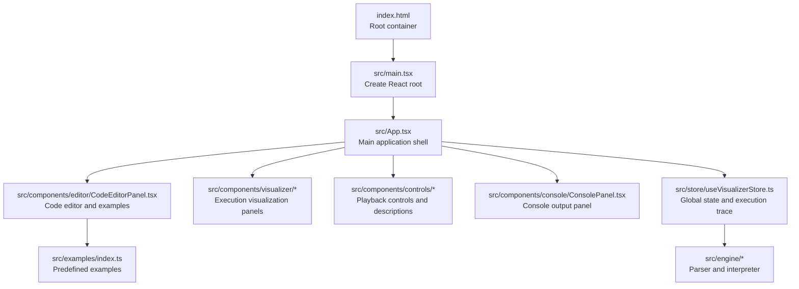
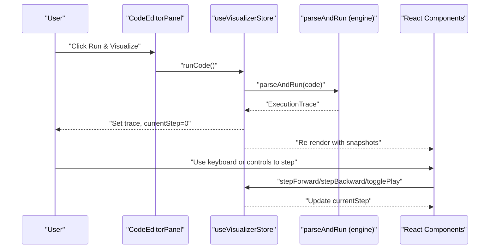
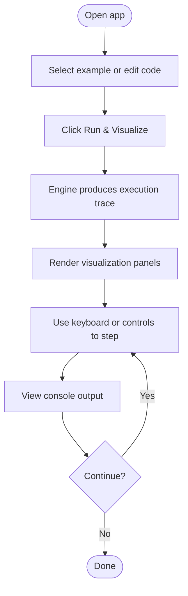

# Getting Started

<cite>
**Referenced Files in This Document**
- [package.json](file://package.json)
- [vite.config.ts](file://vite.config.ts)
- [tsconfig.json](file://tsconfig.json)
- [index.html](file://index.html)
- [src/main.tsx](file://src/main.tsx)
- [src/App.tsx](file://src/App.tsx)
- [src/store/useVisualizerStore.ts](file://src/store/useVisualizerStore.ts)
- [src/hooks/usePlayback.ts](file://src/hooks/usePlayback.ts)
- [src/components/editor/CodeEditorPanel.tsx](file://src/components/editor/CodeEditorPanel.tsx)
- [src/components/editor/ExampleSelector.tsx](file://src/components/editor/ExampleSelector.tsx)
- [src/examples/index.ts](file://src/examples/index.ts)
</cite>

## Table of Contents
1. [Introduction](#introduction)
2. [Project Structure](#project-structure)
3. [Core Components](#core-components)
4. [Architecture Overview](#architecture-overview)
5. [Installation and Setup](#installation-and-setup)
6. [Running Locally](#running-locally)
7. [Build Process](#build-process)
8. [First-Time User Experience](#first-time-user-experience)
9. [Troubleshooting](#troubleshooting)
10. [Browser Compatibility](#browser-compatibility)
11. [Conclusion](#conclusion)

## Introduction
JS-Visualizer is an interactive learning tool that visualizes JavaScript execution, including the call stack, execution contexts, Web APIs, microtask and task queues, and the event loop. It helps developers understand how asynchronous JavaScript behaves in real time.

## Project Structure
At a high level, the application is a React + TypeScript single-page application bundled with Vite. The entry point mounts the React root and renders the main App shell, which orchestrates the editor, visualization panels, controls, and console.

**Diagram sources**
- [index.html:1-14](file://index.html#L1-L14)
- [src/main.tsx:1-11](file://src/main.tsx#L1-L11)
- [src/App.tsx:1-138](file://src/App.tsx#L1-L138)
- [src/components/editor/CodeEditorPanel.tsx:1-162](file://src/components/editor/CodeEditorPanel.tsx#L1-L162)
- [src/store/useVisualizerStore.ts:1-109](file://src/store/useVisualizerStore.ts#L1-L109)
- [src/examples/index.ts:1-153](file://src/examples/index.ts#L1-L153)

**Section sources**
- [index.html:1-14](file://index.html#L1-L14)
- [src/main.tsx:1-11](file://src/main.tsx#L1-L11)
- [src/App.tsx:1-138](file://src/App.tsx#L1-L138)

## Core Components
- Editor and Examples: Users write or select example code to visualize. The editor integrates Monaco and supports highlighting the currently executing line during playback.
- Visualization Panels: Dedicated panels show the call stack, execution context, Web APIs, microtask queue, task queue, and event loop indicator.
- Playback Controls: Keyboard shortcuts and step controls enable forward/backward navigation and automatic playback.
- Console Panel: Displays console output generated during execution.
- Global Store: Manages code, execution trace, current step, playback state, and playback speed.

**Section sources**
- [src/components/editor/CodeEditorPanel.tsx:1-162](file://src/components/editor/CodeEditorPanel.tsx#L1-L162)
- [src/components/editor/ExampleSelector.tsx:1-60](file://src/components/editor/ExampleSelector.tsx#L1-L60)
- [src/App.tsx:17-137](file://src/App.tsx#L17-L137)
- [src/hooks/usePlayback.ts:1-79](file://src/hooks/usePlayback.ts#L1-L79)
- [src/store/useVisualizerStore.ts:1-109](file://src/store/useVisualizerStore.ts#L1-L109)

## Architecture Overview
The runtime pipeline converts user code into an execution trace, which is rendered step-by-step across the visualization panels. The store coordinates parsing, execution, and playback.

**Diagram sources**
- [src/components/editor/CodeEditorPanel.tsx:92-144](file://src/components/editor/CodeEditorPanel.tsx#L92-L144)
- [src/store/useVisualizerStore.ts:37-50](file://src/store/useVisualizerStore.ts#L37-L50)
- [src/engine/index.ts:1-17](file://src/engine/index.ts#L1-L17)
- [src/App.tsx:125-137](file://src/App.tsx#L125-L137)

## Installation and Setup
Follow these steps to prepare your environment and install dependencies.

- Prerequisites
  - Node.js: The project uses modern ES features and React 19. Ensure you have a compatible Node.js version installed. The repository does not specify a Node version; use the latest LTS recommended by the Node.js project.
  - Package manager: Either npm or Yarn works. The scripts in package.json are npm-style commands. If using Yarn, replace npm commands with yarn equivalents as appropriate.

- Clone the repository and navigate to the project directory
  - Use your preferred method to clone the repository, then open the terminal in the project folder.

- Install dependencies
  - With npm: Run the standard install command to install all dependencies and devDependencies.
  - With Yarn: Run the equivalent Yarn install command.

- Verify TypeScript configuration
  - The TypeScript compiler options target ES2022 and use module resolution suitable for bundlers. No manual configuration is required unless you customize tsconfig.json.

- Configure Vite
  - Vite is configured with the React plugin. No additional configuration is required to run the dev server.

**Section sources**
- [package.json:1-33](file://package.json#L1-L33)
- [vite.config.ts:1-7](file://vite.config.ts#L1-L7)
- [tsconfig.json:1-24](file://tsconfig.json#L1-L24)

## Running Locally
Start the development server and access the application in your browser.

- Start the development server
  - Run the dev script to launch Vite’s local server.
  - The server will output the local URL (typically http://localhost:5173). Open this URL in your browser.

- Access the web interface
  - The page loads with a dark-themed editor and visualization panels.
  - The editor displays a default example by default.

- First-run behavior
  - The store initializes with the first example code and no execution trace.
  - The visualization area shows placeholder content until you run the code.

**Section sources**
- [package.json:6-11](file://package.json#L6-L11)
- [index.html:1-14](file://index.html#L1-L14)
- [src/main.tsx:1-11](file://src/main.tsx#L1-L11)
- [src/store/useVisualizerStore.ts:27-34](file://src/store/useVisualizerStore.ts#L27-L34)

## Build Process
The project uses TypeScript for type checking and Vite for bundling.

- Scripts overview
  - dev: Starts the Vite dev server.
  - build: Runs TypeScript project references/build and then builds the Vite bundle.
  - preview: Serves the production build locally for testing.
  - typecheck: Performs TypeScript type checking without emitting output.

- TypeScript compilation
  - The TypeScript configuration targets ES2022, enables strict mode, and disables emitting JS (Vite handles bundling).
  - Use the typecheck script to validate types locally.

- Vite bundling
  - Vite compiles and bundles the React application for the browser.
  - The dev server provides hot module replacement during development.

**Section sources**
- [package.json:6-11](file://package.json#L6-L11)
- [tsconfig.json:1-24](file://tsconfig.json#L1-L24)
- [vite.config.ts:1-7](file://vite.config.ts#L1-L7)

## First-Time User Experience
Walkthrough the initial steps to run your first example.

- Step 1: Choose an example
  - Use the Examples dropdown to select a predefined example. The editor updates with example code.

- Step 2: Run the code
  - Click the “Run & Visualize” button to parse and execute the code. The store triggers the engine to produce an execution trace.

- Step 3: Observe the visualization
  - The visualization grid updates with panels for call stack, execution context, Web APIs, microtask queue, task queue, and the event loop indicator.
  - The current executing line is highlighted in the editor.

- Step 4: Navigate execution
  - Use keyboard shortcuts or the playback controls to step forward or backward through execution.
  - Press Space to toggle playback, Arrow Right to step forward, Arrow Left to step backward, and R to reset.

- Step 5: Explore console output
  - Console entries appear in the console panel as the code executes.

- Step 6: Try your own code
  - Edit the code in the editor and click “Run & Visualize” again. While executing, the editor is read-only to prevent mid-execution edits.

**Diagram sources**
- [src/components/editor/ExampleSelector.tsx:10-59](file://src/components/editor/ExampleSelector.tsx#L10-L59)
- [src/components/editor/CodeEditorPanel.tsx:92-144](file://src/components/editor/CodeEditorPanel.tsx#L92-L144)
- [src/store/useVisualizerStore.ts:37-50](file://src/store/useVisualizerStore.ts#L37-L50)
- [src/hooks/usePlayback.ts:30-78](file://src/hooks/usePlayback.ts#L30-L78)

**Section sources**
- [src/examples/index.ts:1-153](file://src/examples/index.ts#L1-L153)
- [src/components/editor/CodeEditorPanel.tsx:1-162](file://src/components/editor/CodeEditorPanel.tsx#L1-L162)
- [src/store/useVisualizerStore.ts:1-109](file://src/store/useVisualizerStore.ts#L1-L109)
- [src/hooks/usePlayback.ts:1-79](file://src/hooks/usePlayback.ts#L1-L79)

## Troubleshooting
Common issues and resolutions:

- Node.js version mismatch
  - Symptom: Build errors or runtime failures related to unsupported syntax.
  - Resolution: Use a recent LTS Node.js version compatible with ES2022 and React 19.

- Missing dependencies after clone
  - Symptom: Errors when starting dev server or building.
  - Resolution: Install dependencies using your package manager (npm or Yarn).

- Port already in use
  - Symptom: Dev server fails to start with a port conflict.
  - Resolution: Stop the conflicting process or configure Vite to use another port via environment variables.

- TypeScript errors blocking dev server
  - Symptom: Errors shown during dev or build.
  - Resolution: Fix reported type errors or run the typecheck script to review issues.

- Editor appears unresponsive during execution
  - Symptom: Cannot edit code while execution is running.
  - Explanation: The editor is intentionally read-only during execution to maintain consistency. Click “Reset & Edit” to return to editing mode.

- Unexpected behavior with keyboard shortcuts
  - Symptom: Shortcuts not working.
  - Resolution: Ensure the focus is not inside the editor’s input fields. The shortcuts are ignored while typing in the editor or Monaco.

- Build fails with module resolution
  - Symptom: Errors about module resolution or JSX.
  - Resolution: Confirm TypeScript and Vite configurations align with the project’s compiler options and plugin setup.

**Section sources**
- [package.json:1-33](file://package.json#L1-L33)
- [tsconfig.json:1-24](file://tsconfig.json#L1-L24)
- [vite.config.ts:1-7](file://vite.config.ts#L1-L7)
- [src/components/editor/CodeEditorPanel.tsx:52-79](file://src/components/editor/CodeEditorPanel.tsx#L52-L79)
- [src/hooks/usePlayback.ts:37-72](file://src/hooks/usePlayback.ts#L37-L72)

## Browser Compatibility
- The application targets modern browsers that support ES2022 features and React 19. Ensure your browser supports:
  - ES2022 APIs
  - Modern DOM APIs
  - React 19 runtime features

- If you encounter compatibility issues, update your browser to the latest version or test in a supported browser.

## Conclusion
You are now ready to explore JavaScript execution visually. Start with the built-in examples, run them, and use the playback controls to deepen your understanding of the event loop, call stack, and asynchronous behavior. For advanced usage, modify the code in the editor and observe how changes affect the visualization.