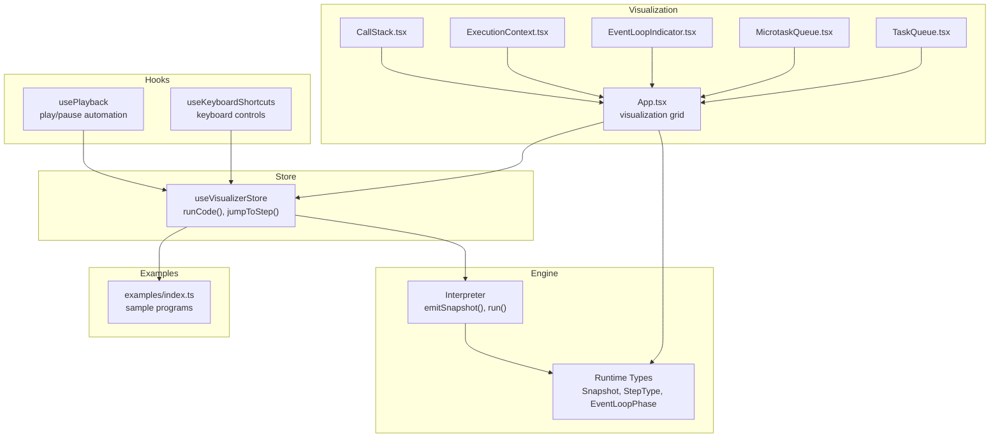
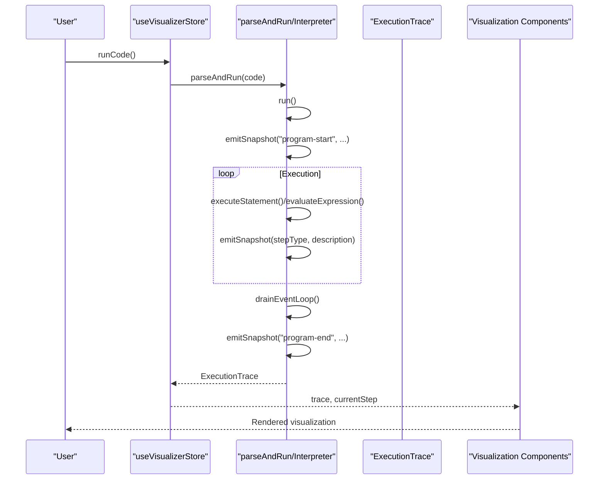
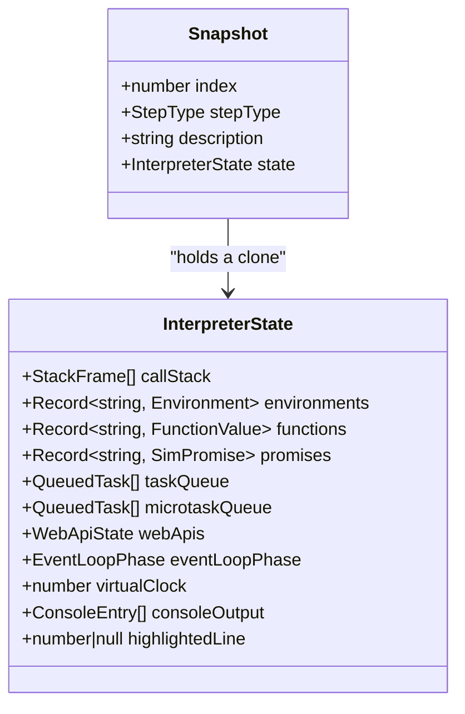
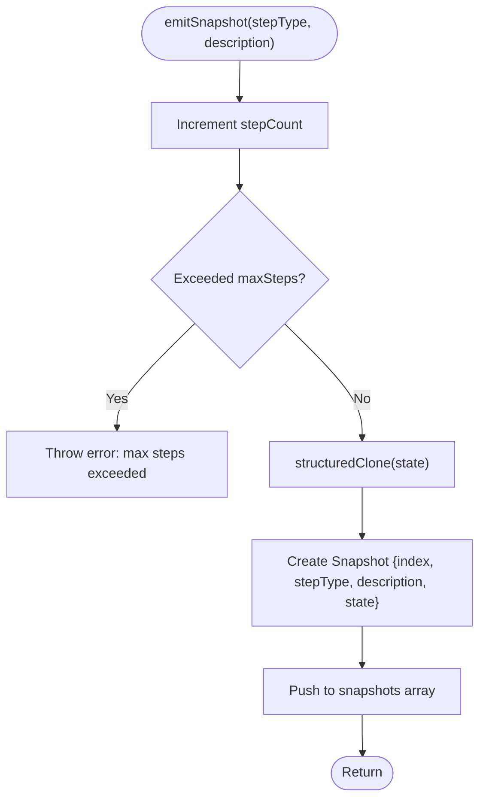
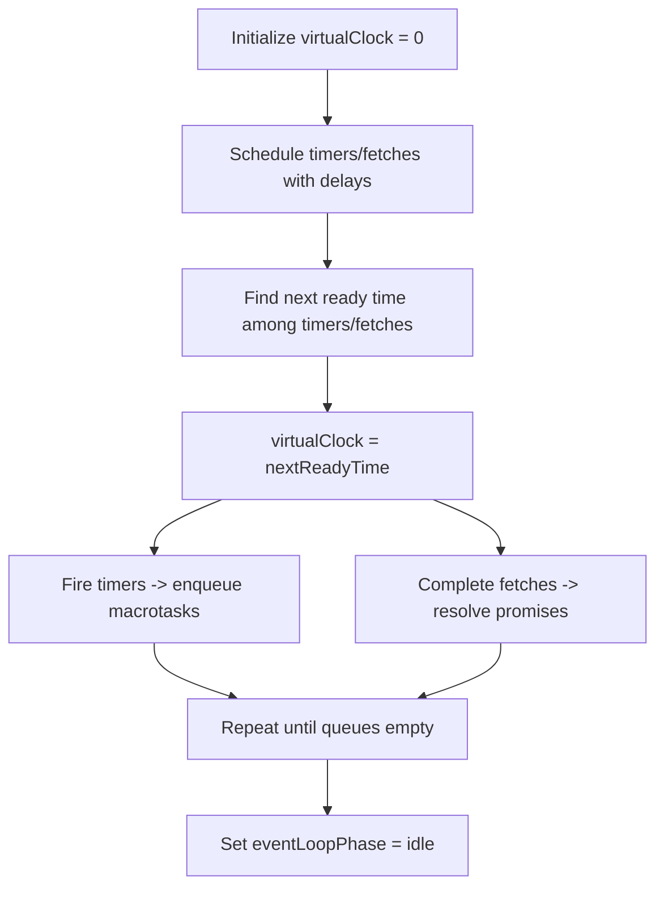
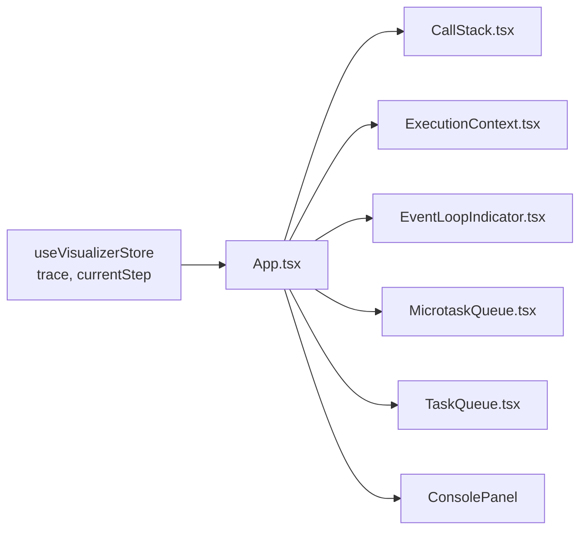
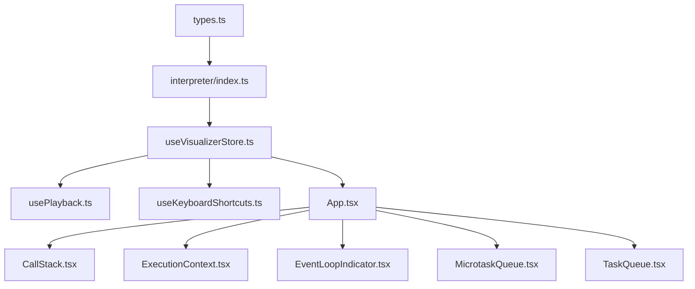

# Execution Tracing & Snapshots

<cite>
**Referenced Files in This Document**
- [index.ts](file://src/engine/index.ts)
- [types.ts](file://src/engine/runtime/types.ts)
- [index.ts](file://src/engine/interpreter/index.ts)
- [useVisualizerStore.ts](file://src/store/useVisualizerStore.ts)
- [usePlayback.ts](file://src/hooks/usePlayback.ts)
- [App.tsx](file://src/App.tsx)
- [ExecutionContext.tsx](file://src/components/visualizer/ExecutionContext.tsx)
- [CallStack.tsx](file://src/components/visualizer/CallStack.tsx)
- [EventLoopIndicator.tsx](file://src/components/visualizer/EventLoopIndicator.tsx)
- [MicrotaskQueue.tsx](file://src/components/visualizer/MicrotaskQueue.tsx)
- [TaskQueue.tsx](file://src/components/visualizer/TaskQueue.tsx)
- [index.ts](file://src/examples/index.ts)
</cite>

## Table of Contents
1. [Introduction](#introduction)
2. [Project Structure](#project-structure)
3. [Core Components](#core-components)
4. [Architecture Overview](#architecture-overview)
5. [Detailed Component Analysis](#detailed-component-analysis)
6. [Dependency Analysis](#dependency-analysis)
7. [Performance Considerations](#performance-considerations)
8. [Troubleshooting Guide](#troubleshooting-guide)
9. [Conclusion](#conclusion)
10. [Appendices](#appendices)

## Introduction
This document explains the execution tracing and snapshot generation system that powers the visualization of JavaScript program execution. It covers how the interpreter captures the complete interpreter state at each execution step, how snapshots are emitted and stored, how step types categorize execution events, and how the visualization components render the state for educational purposes. It also documents the virtual clock mechanism and event loop phases that model asynchronous operations.

## Project Structure
The tracing system spans several modules:
- Engine: interpreter and runtime types
- Store: state management for playback and selection of current step
- Hooks: playback automation and keyboard shortcuts
- Visualization components: rendering of call stack, scope, queues, event loop, and console
- Examples: runnable code samples demonstrating tracing scenarios

**Diagram sources**
- [index.ts:75-135](file://src/engine/interpreter/index.ts#L75-L135)
- [types.ts:199-240](file://src/engine/runtime/types.ts#L199-L240)
- [useVisualizerStore.ts:27-98](file://src/store/useVisualizerStore.ts#L27-L98)
- [usePlayback.ts:4-28](file://src/hooks/usePlayback.ts#L4-L28)
- [App.tsx:17-107](file://src/App.tsx#L17-L107)
- [CallStack.tsx:12-78](file://src/components/visualizer/CallStack.tsx#L12-L78)
- [ExecutionContext.tsx:33-127](file://src/components/visualizer/ExecutionContext.tsx#L33-L127)
- [EventLoopIndicator.tsx:30-142](file://src/components/visualizer/EventLoopIndicator.tsx#L30-L142)
- [MicrotaskQueue.tsx:12-40](file://src/components/visualizer/MicrotaskQueue.tsx#L12-L40)
- [TaskQueue.tsx:12-40](file://src/components/visualizer/TaskQueue.tsx#L12-L40)
- [index.ts:8-152](file://src/examples/index.ts#L8-L152)

**Section sources**
- [index.ts:1-17](file://src/engine/index.ts#L1-L17)
- [index.ts:75-135](file://src/engine/interpreter/index.ts#L75-L135)
- [types.ts:199-240](file://src/engine/runtime/types.ts#L199-L240)
- [useVisualizerStore.ts:27-98](file://src/store/useVisualizerStore.ts#L27-L98)
- [usePlayback.ts:4-28](file://src/hooks/usePlayback.ts#L4-L28)
- [App.tsx:17-107](file://src/App.tsx#L17-L107)
- [index.ts:8-152](file://src/examples/index.ts#L8-L152)

## Core Components
- Snapshot: immutable record capturing interpreter state at a specific step, including index, step type, human-readable description, and a deep clone of the interpreter state.
- StepType: enumeration of execution events (program-start, variable-declaration, function-call, await-suspend, promise-created, enqueue-microtask, etc.).
- ExecutionTrace: container holding source code, snapshots, total steps, and optional error metadata.
- Interpreter: orchestrates parsing, execution, and emits snapshots for each significant event.
- Store and Hooks: manage playback, stepping, and selection of the current snapshot.
- Visualization components: render call stack, scope/variables, queues, event loop phase, and console output.

**Section sources**
- [types.ts:199-240](file://src/engine/runtime/types.ts#L199-L240)
- [index.ts:139-150](file://src/engine/interpreter/index.ts#L139-L150)
- [useVisualizerStore.ts:27-98](file://src/store/useVisualizerStore.ts#L27-L98)
- [App.tsx:17-107](file://src/App.tsx#L17-L107)

## Architecture Overview
The tracing pipeline:
- parseAndRun creates an Interpreter and runs the code.
- The interpreter executes statements and expressions, emitting snapshots at key moments.
- ExecutionTrace aggregates snapshots and is consumed by the store.
- The store exposes the current snapshot to visualization components.
- Playback and keyboard controls navigate through snapshots.

**Diagram sources**
- [index.ts:75-135](file://src/engine/interpreter/index.ts#L75-L135)
- [index.ts:139-150](file://src/engine/interpreter/index.ts#L139-L150)
- [index.ts:1198-1254](file://src/engine/interpreter/index.ts#L1198-L1254)
- [useVisualizerStore.ts:37-50](file://src/store/useVisualizerStore.ts#L37-L50)
- [App.tsx:17-107](file://src/App.tsx#L17-L107)

## Detailed Component Analysis

### Snapshot Structure and Capture
- Snapshot.index: monotonically increasing step number.
- Snapshot.stepType: categorized event type from StepType.
- Snapshot.description: human-readable description of the event.
- Snapshot.state: a deep clone of the interpreter state at that moment, enabling deterministic playback without mutation interference.

The interpreter maintains a snapshots array and increments a step counter. Each call to emitSnapshot clones the current state to produce an immutable snapshot.

**Diagram sources**
- [types.ts:226-240](file://src/engine/runtime/types.ts#L226-L240)
- [types.ts:183-195](file://src/engine/runtime/types.ts#L183-L195)
- [index.ts:139-150](file://src/engine/interpreter/index.ts#L139-L150)

**Section sources**
- [types.ts:226-240](file://src/engine/runtime/types.ts#L226-L240)
- [index.ts:139-150](file://src/engine/interpreter/index.ts#L139-L150)

### emitSnapshot Method
- Purpose: capture the interpreter state at a given execution point.
- Behavior:
  - Increments internal step counter and enforces a maximum step limit to prevent infinite loops.
  - Creates a Snapshot with index, stepType, description, and a structured clone of the current state.
  - Appends the snapshot to the snapshots array.

**Diagram sources**
- [index.ts:139-150](file://src/engine/interpreter/index.ts#L139-L150)

**Section sources**
- [index.ts:139-150](file://src/engine/interpreter/index.ts#L139-L150)

### StepType Enumeration and Categorization
StepType enumerates all traced execution events. Categories include:
- Program lifecycle: program-start, program-end, runtime-error
- Variable operations: variable-declaration, variable-assignment
- Function lifecycle: function-declaration, function-call, function-return
- Expressions: expression-eval
- Console: console-log
- Web APIs: register-timer, register-fetch, timer-fires, fetch-completes
- Promises: promise-created, promise-resolved, promise-rejected, then-registered
- Microtasks/macrotasks: enqueue-microtask, dequeue-microtask, enqueue-macrotask, dequeue-macrotask
- Event loop: event-loop-check
- Await: await-suspend, await-resume

These categories are emitted at specific interpreter operations (e.g., variable declaration, function call, promise resolution, event loop phases).

**Section sources**
- [types.ts:199-224](file://src/engine/runtime/types.ts#L199-L224)
- [index.ts:308-331](file://src/engine/interpreter/index.ts#L308-L331)
- [index.ts:831-895](file://src/engine/interpreter/index.ts#L831-L895)
- [index.ts:969-1058](file://src/engine/interpreter/index.ts#L969-L1058)
- [index.ts:1124-1194](file://src/engine/interpreter/index.ts#L1124-L1194)
- [index.ts:1198-1254](file://src/engine/interpreter/index.ts#L1198-L1254)
- [index.ts:713-736](file://src/engine/interpreter/index.ts#L713-L736)

### ExecutionTrace Structure
ExecutionTrace holds:
- sourceCode: original program text
- snapshots: array of Snapshot instances
- totalSteps: length of snapshots
- error: optional error with message and line number

The interpreter constructs ExecutionTrace upon completion of run().

**Section sources**
- [types.ts:235-240](file://src/engine/runtime/types.ts#L235-L240)
- [index.ts:129-135](file://src/engine/interpreter/index.ts#L129-L135)

### Virtual Clock Mechanism
The virtual clock simulates time progression for asynchronous operations:
- virtualClock: number representing current time.
- Web API timers and fetches are scheduled with registeredAt and completion/firing times.
- advanceTimers moves virtualClock forward to the earliest ready operation and enqueues callbacks as macrotasks or resolves promises as microtasks.
- The event loop advances timers between microtask and macrotask phases.

**Diagram sources**
- [types.ts:192-192](file://src/engine/runtime/types.ts#L192-L192)
- [index.ts:1256-1312](file://src/engine/interpreter/index.ts#L1256-L1312)
- [index.ts:1198-1254](file://src/engine/interpreter/index.ts#L1198-L1254)

**Section sources**
- [types.ts:192-192](file://src/engine/runtime/types.ts#L192-L192)
- [index.ts:1256-1312](file://src/engine/interpreter/index.ts#L1256-L1312)
- [index.ts:1198-1254](file://src/engine/interpreter/index.ts#L1198-L1254)

### Event Loop Phase Tracking
The interpreter models the Node-style event loop phases:
- idle: no activity
- executing-sync: synchronous execution in the main thread
- checking-microtasks: scanning microtask queue
- executing-microtask: running a microtask
- checking-macrotasks: scanning task queue
- executing-macrotask: running a macrotask
- advancing-timers: moving virtualClock and firing ready timers/fetches

The interpreter updates eventLoopPhase and emits snapshots for each phase transition and queue operations.

**Section sources**
- [types.ts:164-171](file://src/engine/runtime/types.ts#L164-L171)
- [index.ts:1210-1254](file://src/engine/interpreter/index.ts#L1210-L1254)
- [index.ts:1256-1312](file://src/engine/interpreter/index.ts#L1256-L1312)

### Visualization Components and Trace Consumption
- App.tsx composes panels and reads the current snapshot from the store.
- CallStack.tsx renders the call stack frames.
- ExecutionContext.tsx walks the scope chain and displays bindings with colored values.
- EventLoopIndicator.tsx renders the current event loop phase with animated indicators.
- MicrotaskQueue.tsx and TaskQueue.tsx render the respective queues.
- ConsolePanel receives consoleOutput from the current snapshot.

**Diagram sources**
- [useVisualizerStore.ts:101-109](file://src/store/useVisualizerStore.ts#L101-L109)
- [App.tsx:17-107](file://src/App.tsx#L17-L107)
- [CallStack.tsx:12-78](file://src/components/visualizer/CallStack.tsx#L12-L78)
- [ExecutionContext.tsx:33-127](file://src/components/visualizer/ExecutionContext.tsx#L33-L127)
- [EventLoopIndicator.tsx:30-142](file://src/components/visualizer/EventLoopIndicator.tsx#L30-L142)
- [MicrotaskQueue.tsx:12-40](file://src/components/visualizer/MicrotaskQueue.tsx#L12-L40)
- [TaskQueue.tsx:12-40](file://src/components/visualizer/TaskQueue.tsx#L12-L40)

**Section sources**
- [useVisualizerStore.ts:101-109](file://src/store/useVisualizerStore.ts#L101-L109)
- [App.tsx:17-107](file://src/App.tsx#L17-L107)
- [CallStack.tsx:12-78](file://src/components/visualizer/CallStack.tsx#L12-L78)
- [ExecutionContext.tsx:33-127](file://src/components/visualizer/ExecutionContext.tsx#L33-L127)
- [EventLoopIndicator.tsx:30-142](file://src/components/visualizer/EventLoopIndicator.tsx#L30-L142)
- [MicrotaskQueue.tsx:12-40](file://src/components/visualizer/MicrotaskQueue.tsx#L12-L40)
- [TaskQueue.tsx:12-40](file://src/components/visualizer/TaskQueue.tsx#L12-L40)

### Examples of Snapshot Content
Below are representative snapshot contents for common JavaScript constructs, derived from emitted step types and interpreter logic:

- Program start/end
  - stepType: program-start, program-end
  - description: "Program execution starts", "Program execution complete"
  - state: initial interpreter state with eventLoopPhase set to executing-sync and idle respectively

- Variable declaration and assignment
  - stepType: variable-declaration, variable-assignment
  - description: "var x = 42", "y = 'hello'"
  - state: updated environments with new bindings

- Function call and return
  - stepType: function-call, function-return
  - description: "Call foo(42)", "Return 42 from foo"
  - state: callStack grows/shrinks, environments updated for parameters

- Promise lifecycle
  - stepType: promise-created, then-registered, enqueue-microtask, promise-resolved
  - description: "new Promise() created", ".then() registered", "Queued .then() callback", "Promise #1 resolved with 42"
  - state: promises map updated, microtaskQueue enqueued

- Await suspend/resume
  - stepType: await-suspend, await-resume
  - description: "await suspending...", "await resolved with 42"
  - state: depends on promise state

- Event loop phases and queue operations
  - stepType: event-loop-check, dequeue-microtask, dequeue-macrotask, timer-fires, fetch-completes
  - description: "Event loop: checking microtask queue", "Dequeued microtask: .then() callback", "fetch('...') completed"
  - state: queues drained/updated, timers removed, fetches resolved

These examples illustrate how snapshots capture the interpreter’s state at each step, enabling precise visualization of execution flow.

**Section sources**
- [index.ts:104-119](file://src/engine/interpreter/index.ts#L104-L119)
- [index.ts:308-331](file://src/engine/interpreter/index.ts#L308-L331)
- [index.ts:624-666](file://src/engine/interpreter/index.ts#L624-L666)
- [index.ts:969-1058](file://src/engine/interpreter/index.ts#L969-L1058)
- [index.ts:1124-1194](file://src/engine/interpreter/index.ts#L1124-L1194)
- [index.ts:1198-1254](file://src/engine/interpreter/index.ts#L1198-L1254)
- [index.ts:713-736](file://src/engine/interpreter/index.ts#L713-L736)
- [index.ts:8-152](file://src/examples/index.ts#L8-L152)

## Dependency Analysis
- Interpreter depends on runtime types for Snapshot, StepType, EventLoopPhase, and InterpreterState.
- Store depends on parseAndRun to produce ExecutionTrace and selects current snapshot for visualization.
- Hooks depend on store actions for playback and navigation.
- Visualization components depend on store-selected snapshot and runtime types for rendering.

**Diagram sources**
- [types.ts:199-240](file://src/engine/runtime/types.ts#L199-L240)
- [index.ts:75-135](file://src/engine/interpreter/index.ts#L75-L135)
- [useVisualizerStore.ts:27-98](file://src/store/useVisualizerStore.ts#L27-L98)
- [usePlayback.ts:4-28](file://src/hooks/usePlayback.ts#L4-L28)
- [App.tsx:17-107](file://src/App.tsx#L17-L107)
- [CallStack.tsx:12-78](file://src/components/visualizer/CallStack.tsx#L12-L78)
- [ExecutionContext.tsx:33-127](file://src/components/visualizer/ExecutionContext.tsx#L33-L127)
- [EventLoopIndicator.tsx:30-142](file://src/components/visualizer/EventLoopIndicator.tsx#L30-L142)
- [MicrotaskQueue.tsx:12-40](file://src/components/visualizer/MicrotaskQueue.tsx#L12-L40)
- [TaskQueue.tsx:12-40](file://src/components/visualizer/TaskQueue.tsx#L12-L40)

**Section sources**
- [types.ts:199-240](file://src/engine/runtime/types.ts#L199-L240)
- [index.ts:75-135](file://src/engine/interpreter/index.ts#L75-L135)
- [useVisualizerStore.ts:27-98](file://src/store/useVisualizerStore.ts#L27-L98)
- [usePlayback.ts:4-28](file://src/hooks/usePlayback.ts#L4-L28)
- [App.tsx:17-107](file://src/App.tsx#L17-L107)

## Performance Considerations
- Snapshot cloning: Each snapshot uses a deep clone of the interpreter state. While this ensures immutability and reliable playback, it can be memory-intensive for long executions. Consider limiting maxSteps and avoiding excessive snapshots for very large programs.
- Maximum steps: The interpreter enforces a maximum step count to prevent infinite loops and runaway execution.
- Event loop advancement: The interpreter advances timers and drains queues in bounded loops to avoid starvation.

[No sources needed since this section provides general guidance]

## Troubleshooting Guide
- Maximum steps exceeded: The interpreter throws an error when the step count exceeds the configured limit. Reduce code complexity or increase maxSteps cautiously.
- Runtime errors: Errors during execution are captured and emitted as snapshots with stepType runtime-error, including message and optional line number.
- Playback not advancing: Ensure playback is toggled on and the current step is less than totalSteps. Reset playback if at the end.

**Section sources**
- [index.ts:140-142](file://src/engine/interpreter/index.ts#L140-L142)
- [index.ts:120-127](file://src/engine/interpreter/index.ts#L120-L127)
- [useVisualizerStore.ts:77-86](file://src/store/useVisualizerStore.ts#L77-L86)

## Conclusion
The execution tracing system captures the interpreter state at each significant event, enabling precise visualization of JavaScript execution. Snapshots, categorized by StepType, provide a complete history of program execution, including synchronous and asynchronous phases. The virtual clock and event loop modeling accurately reflect real-world scheduling behavior. Visualization components consume snapshots to render call stacks, scopes, queues, and event loop phases, making complex execution flows accessible and educational.

## Appendices

### StepType Reference
- program-start, program-end, runtime-error
- variable-declaration, variable-assignment
- function-declaration, function-call, function-return
- expression-eval
- console-log
- register-timer, register-fetch, timer-fires, fetch-completes
- promise-created, promise-resolved, promise-rejected, then-registered
- enqueue-microtask, dequeue-microtask, enqueue-macrotask, dequeue-macrotask
- event-loop-check
- await-suspend, await-resume

**Section sources**
- [types.ts:199-224](file://src/engine/runtime/types.ts#L199-L224)