# Interpreter Core

<cite>
**Referenced Files in This Document**
- [index.ts](file://src/engine/index.ts)
- [interpreter/index.ts](file://src/engine/interpreter/index.ts)
- [parser/index.ts](file://src/engine/parser/index.ts)
- [runtime/types.ts](file://src/engine/runtime/types.ts)
- [useVisualizerStore.ts](file://src/store/useVisualizerStore.ts)
- [App.tsx](file://src/App.tsx)
- [CallStack.tsx](file://src/components/visualizer/CallStack.tsx)
- [MicrotaskQueue.tsx](file://src/components/visualizer/MicrotaskQueue.tsx)
- [TaskQueue.tsx](file://src/components/visualizer/TaskQueue.tsx)
- [usePlayback.ts](file://src/hooks/usePlayback.ts)
- [examples/index.ts](file://src/examples/index.ts)
</cite>

## Table of Contents
1. [Introduction](#introduction)
2. [Project Structure](#project-structure)
3. [Core Components](#core-components)
4. [Architecture Overview](#architecture-overview)
5. [Detailed Component Analysis](#detailed-component-analysis)
6. [Dependency Analysis](#dependency-analysis)
7. [Performance Considerations](#performance-considerations)
8. [Troubleshooting Guide](#troubleshooting-guide)
9. [Conclusion](#conclusion)
10. [Appendices](#appendices)

## Introduction
This document explains the core JavaScript interpreter that executes and traces program execution. It covers the Interpreter class architecture, state management, snapshot generation, and execution control. It documents the main execution flow from AST parsing through statement evaluation to completion, the event loop implementation that handles microtasks and macrotasks, and the step-by-step execution model with snapshot emission for visualization. It also details error handling strategies, maximum step limits, execution termination conditions, the ReturnSignal pattern for function returns, the suspended frames system for async/await handling, and the overall execution tracing mechanism. Examples demonstrate how complex JavaScript programs are processed and visualized step-by-step.

## Project Structure
The interpreter is part of a larger visualization application. The engine module contains the interpreter, parser, and runtime types. The UI integrates the interpreter output into panels for call stack, execution context, queues, and console.

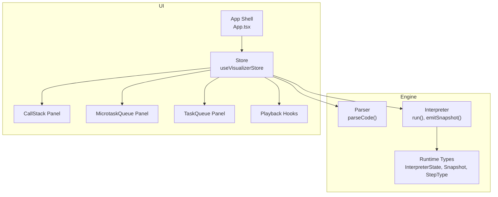

**Diagram sources**
- [parser/index.ts:1-25](file://src/engine/parser/index.ts#L1-L25)
- [interpreter/index.ts:75-135](file://src/engine/interpreter/index.ts#L75-L135)
- [runtime/types.ts:183-249](file://src/engine/runtime/types.ts#L183-L249)
- [useVisualizerStore.ts:27-98](file://src/store/useVisualizerStore.ts#L27-L98)
- [App.tsx:17-107](file://src/App.tsx#L17-L107)

**Section sources**
- [index.ts:1-17](file://src/engine/index.ts#L1-L17)
- [parser/index.ts:1-25](file://src/engine/parser/index.ts#L1-L25)
- [interpreter/index.ts:40-73](file://src/engine/interpreter/index.ts#L40-L73)
- [runtime/types.ts:183-249](file://src/engine/runtime/types.ts#L183-L249)

## Core Components
- Interpreter: orchestrates parsing, execution, and tracing. Manages state, emits snapshots, and drives the event loop.
- Parser: converts source code into an ESTree AST.
- Runtime Types: define the interpreter state, snapshots, queues, promises, and step types.
- Store and UI: consume the execution trace and render visualizations.

Key responsibilities:
- State management: call stack, environments, functions, promises, task queues, web APIs, event loop phase, virtual clock, console output, and highlighted line.
- Snapshot generation: captures a deep clone of the interpreter state at each step with a step type and description.
- Execution control: step counting with maximum steps, error handling, and termination conditions.
- Event loop: drains microtasks, advances timers, enqueues macrotasks, and manages phases.

**Section sources**
- [interpreter/index.ts:40-73](file://src/engine/interpreter/index.ts#L40-L73)
- [interpreter/index.ts:139-150](file://src/engine/interpreter/index.ts#L139-L150)
- [runtime/types.ts:183-249](file://src/engine/runtime/types.ts#L183-L249)

## Architecture Overview
The interpreter follows a step-by-step execution model:
- Parse source code to an AST.
- Initialize interpreter state and push a global frame.
- Execute statements in the global scope.
- Pop the global frame and run the event loop.
- Emit snapshots at each significant step.
- Terminate when the event loop is idle or an error occurs.

```mermaid
sequenceDiagram
participant User as "User"
participant Store as "useVisualizerStore"
participant Parser as "parseCode()"
participant Interp as "Interpreter.run()"
participant Snap as "emitSnapshot()"
participant Loop as "drainEventLoop()"
User->>Store : "runCode()"
Store->>Parser : "parseCode(source)"
Parser-->>Store : "{ ast }" or "{ error }"
alt "Parse OK"
Store->>Interp : "new Interpreter().run()"
Interp->>Interp : "initialize state"
Interp->>Interp : "hoistDeclarations()"
Interp->>Interp : "execute statements"
Interp->>Snap : "program-start"
Interp->>Loop : "drainEventLoop()"
Loop-->>Interp : "idle"
Interp->>Snap : "program-end"
Interp-->>Store : "ExecutionTrace"
else "Parse error"
Interp-->>Store : "ExecutionTrace(error)"
end
Store-->>User : "trace, snapshots, error"
```

**Diagram sources**
- [parser/index.ts:5-24](file://src/engine/parser/index.ts#L5-L24)
- [interpreter/index.ts:75-135](file://src/engine/interpreter/index.ts#L75-L135)
- [interpreter/index.ts:1198-1254](file://src/engine/interpreter/index.ts#L1198-L1254)

## Detailed Component Analysis

### Interpreter Class
The Interpreter class encapsulates the entire execution model:
- State: a comprehensive InterpreterState holding call stack, environments, functions, promises, queues, web APIs, event loop phase, virtual clock, console output, and highlighted line.
- Snapshots: emitted at each step with a step type and description; snapshots are stored for visualization.
- Execution control: tracks step count and enforces a maximum step limit to prevent infinite loops.
- Event loop: drains microtasks, advances timers, and executes macrotasks in a controlled order.

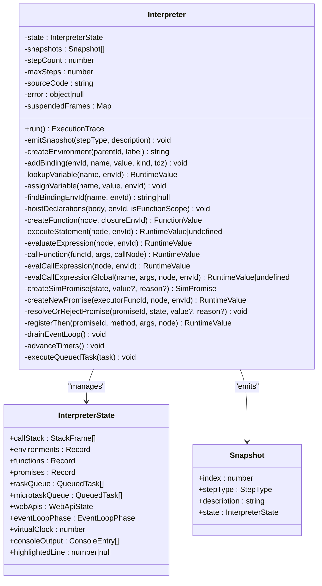

**Diagram sources**
- [interpreter/index.ts:40-135](file://src/engine/interpreter/index.ts#L40-L135)
- [runtime/types.ts:183-231](file://src/engine/runtime/types.ts#L183-L231)

**Section sources**
- [interpreter/index.ts:40-135](file://src/engine/interpreter/index.ts#L40-L135)
- [runtime/types.ts:183-231](file://src/engine/runtime/types.ts#L183-L231)

### Execution Flow: From AST to Completion
- Parsing: parseCode produces an ESTree Program or a parse error.
- Initialization: create global environment, hoist declarations, push global frame, set event loop phase to executing sync, and emit a program-start snapshot.
- Statement execution: iterate over program body and execute each statement.
- Event loop: after global execution, drain microtasks, advance timers, and execute macrotasks until idle.
- Finalization: emit a program-end snapshot and return the ExecutionTrace.

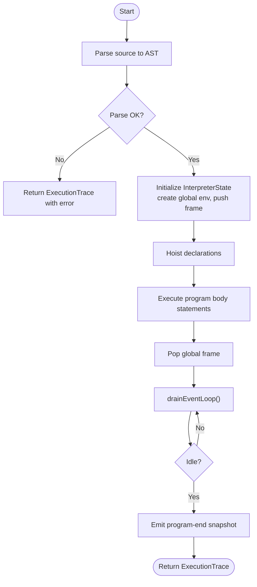

**Diagram sources**
- [parser/index.ts:5-24](file://src/engine/parser/index.ts#L5-L24)
- [interpreter/index.ts:75-135](file://src/engine/interpreter/index.ts#L75-L135)
- [interpreter/index.ts:1198-1254](file://src/engine/interpreter/index.ts#L1198-L1254)

**Section sources**
- [parser/index.ts:5-24](file://src/engine/parser/index.ts#L5-L24)
- [interpreter/index.ts:75-135](file://src/engine/interpreter/index.ts#L75-L135)

### Statement Execution Model
The interpreter evaluates statements and expressions with snapshot emission at each step:
- VariableDeclaration: creates bindings and emits snapshots for each declaration.
- IfStatement: evaluates condition and executes consequent or alternate branch.
- BlockStatement: creates a new environment and executes child statements.
- ForStatement and WhileStatement: manage loop environments and enforce iteration limits.
- TryStatement: executes block, catches errors, and executes finally.
- ReturnStatement: throws a ReturnSignal to return values from functions.

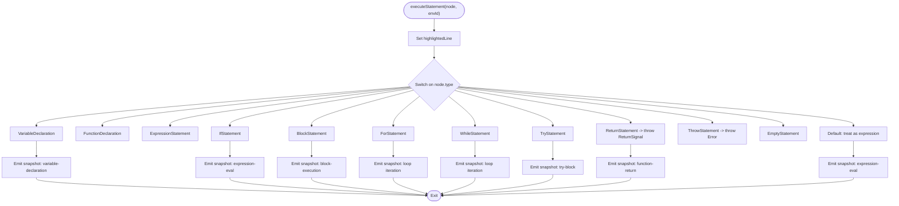

**Diagram sources**
- [interpreter/index.ts:268-306](file://src/engine/interpreter/index.ts#L268-L306)
- [interpreter/index.ts:308-429](file://src/engine/interpreter/index.ts#L308-L429)

**Section sources**
- [interpreter/index.ts:268-306](file://src/engine/interpreter/index.ts#L268-L306)
- [interpreter/index.ts:308-429](file://src/engine/interpreter/index.ts#L308-L429)

### Expression Evaluation Model
Expressions are evaluated with operator precedence and runtime semantics:
- Literals: return typed runtime values.
- Identifiers: resolve in the environment chain.
- Binary/Logical/Unary/Update/Assignment: compute values and update bindings.
- MemberExpression: access object/array/string properties.
- CallExpression: handle builtins (setTimeout, fetch), resolve function, and call.
- NewExpression: handle new Promise with executor.
- ConditionalExpression, TemplateLiteral, ArrayExpression, ObjectExpression, SequenceExpression.
- AwaitExpression: simplified await handling with suspend/resume logic.

```mermaid
flowchart TD
EvalEnter(["evaluateExpression(node, envId)"]) --> Type{"node.type"}
Type --> Literal["Literal -> evalLiteral()"]
Type --> Identifier["Identifier -> lookupVariable()"]
Type --> Binary["BinaryExpression -> evalBinaryExpression()"]
Type --> Logical["LogicalExpression -> evalLogicalExpression()"]
Type --> Unary["UnaryExpression -> evalUnaryExpression()"]
Type --> Update["UpdateExpression -> evalUpdateExpression()"]
Type --> Assign["AssignmentExpression -> evalAssignmentExpression()"]
Type --> Call["CallExpression -> evalCallExpression()"]
Type --> New["NewExpression -> evalNewExpression()"]
Type --> Member["MemberExpression -> evalMemberExpression()"]
Type --> Arrow["Arrow/FunctionExpression -> createFunction()"]
Type --> Cond["ConditionalExpression"]
Type --> Template["TemplateLiteral"]
Type --> ArrayExpr["ArrayExpression"]
Type --> ObjectExpr["ObjectExpression"]
Type --> Seq["SequenceExpression"]
Type --> Await["AwaitExpression -> evalAwaitExpression()"]
Literal --> EmitEval["Emit snapshot: expression-eval"]
Identifier --> EmitEval
Binary --> EmitEval
Logical --> EmitEval
Unary --> EmitEval
Update --> EmitEval
Assign --> EmitEval
Call --> EmitEval
New --> EmitEval
Member --> EmitEval
Arrow --> EmitEval
Cond --> EmitEval
Template --> EmitEval
ArrayExpr --> EmitEval
ObjectExpr --> EmitEval
Seq --> EmitEval
Await --> EmitEval
EmitEval --> EvalExit(["Exit"])
```

**Diagram sources**
- [interpreter/index.ts:433-500](file://src/engine/interpreter/index.ts#L433-L500)
- [interpreter/index.ts:502-736](file://src/engine/interpreter/index.ts#L502-L736)

**Section sources**
- [interpreter/index.ts:433-500](file://src/engine/interpreter/index.ts#L433-L500)
- [interpreter/index.ts:502-736](file://src/engine/interpreter/index.ts#L502-L736)

### Event Loop Implementation
The event loop ensures deterministic ordering of asynchronous operations:
- Phases: idle, executing-sync, checking-microtasks, executing-microtask, checking-macrotasks, executing-macrotask, advancing-timers.
- Drain microtasks: dequeue and execute all microtasks until empty.
- Advance timers: move virtual clock forward to the earliest timer/fetch and enqueue callbacks as macrotasks; re-register intervals.
- Execute one macrotask: pop from task queue and run; then loop back to drain microtasks.
- Idle: when all queues and timers are empty.

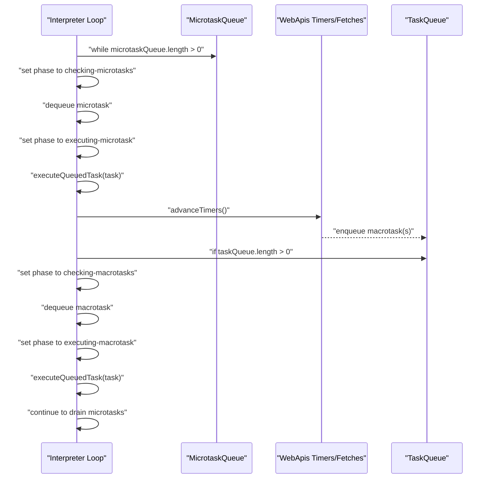

**Diagram sources**
- [interpreter/index.ts:1198-1254](file://src/engine/interpreter/index.ts#L1198-L1254)
- [interpreter/index.ts:1256-1312](file://src/engine/interpreter/index.ts#L1256-L1312)
- [interpreter/index.ts:1314-1356](file://src/engine/interpreter/index.ts#L1314-L1356)

**Section sources**
- [interpreter/index.ts:1198-1254](file://src/engine/interpreter/index.ts#L1198-L1254)
- [interpreter/index.ts:1256-1312](file://src/engine/interpreter/index.ts#L1256-L1312)
- [interpreter/index.ts:1314-1356](file://src/engine/interpreter/index.ts#L1314-L1356)

### ReturnSignal Pattern
The interpreter uses a sentinel ReturnSignal to return values from functions without unwinding the stack prematurely:
- ReturnStatement throws ReturnSignal with the computed value.
- Function execution catches ReturnSignal and sets the return value.
- Async functions wrap return values in a simulated promise.

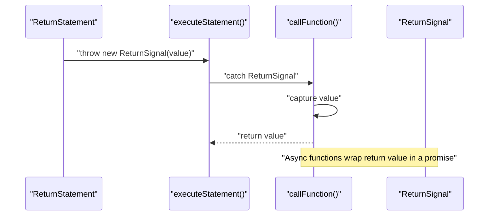

**Diagram sources**
- [interpreter/index.ts:279-282](file://src/engine/interpreter/index.ts#L279-L282)
- [interpreter/index.ts:874-881](file://src/engine/interpreter/index.ts#L874-L881)
- [interpreter/index.ts:889-892](file://src/engine/interpreter/index.ts#L889-L892)

**Section sources**
- [interpreter/index.ts:279-282](file://src/engine/interpreter/index.ts#L279-L282)
- [interpreter/index.ts:874-881](file://src/engine/interpreter/index.ts#L874-L881)
- [interpreter/index.ts:889-892](file://src/engine/interpreter/index.ts#L889-L892)

### Suspended Frames System for Async/Await
The interpreter simulates async/await by suspending execution and resuming when promises settle:
- AwaitExpression evaluates operand and checks promise state.
- If pending, emit await-suspend and return UNDEFINED to suspend.
- If fulfilled/rejected, resume with resolved value or throw error.
- Promises are represented as SimPromise with then handlers.

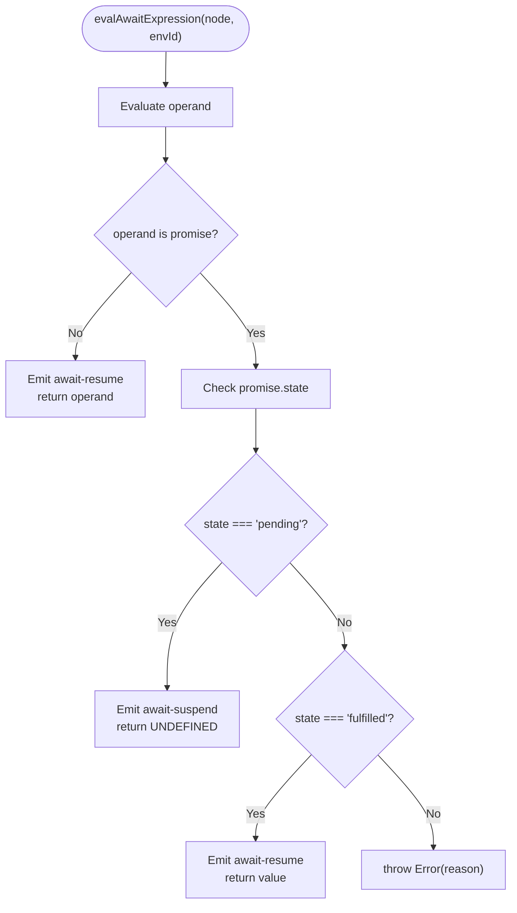

**Diagram sources**
- [interpreter/index.ts:713-736](file://src/engine/interpreter/index.ts#L713-L736)
- [runtime/types.ts:153-160](file://src/engine/runtime/types.ts#L153-L160)

**Section sources**
- [interpreter/index.ts:713-736](file://src/engine/interpreter/index.ts#L713-L736)
- [runtime/types.ts:153-160](file://src/engine/runtime/types.ts#L153-L160)

### Promise System
Promises are simulated with a state machine and then handlers:
- createSimPromise initializes a pending promise.
- createNewPromise executes the executor synchronously and registers resolve/reject functions.
- resolveOrRejectPromise updates state, emits snapshots, and enqueues then handlers as microtasks.
- registerThen attaches handlers to pending promises or immediately schedules callbacks for settled promises.

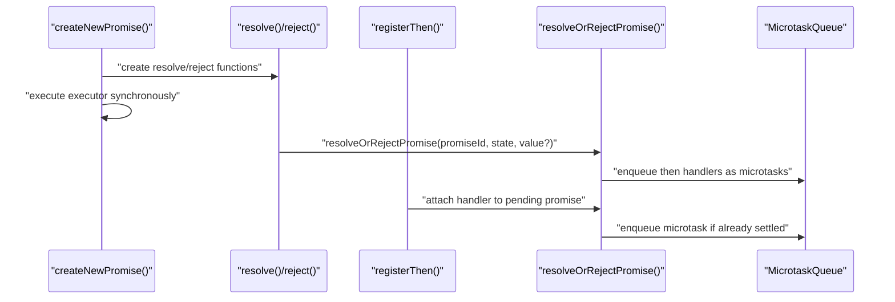

**Diagram sources**
- [interpreter/index.ts:987-1058](file://src/engine/interpreter/index.ts#L987-L1058)
- [interpreter/index.ts:1082-1122](file://src/engine/interpreter/index.ts#L1082-L1122)
- [interpreter/index.ts:1124-1194](file://src/engine/interpreter/index.ts#L1124-L1194)

**Section sources**
- [interpreter/index.ts:987-1058](file://src/engine/interpreter/index.ts#L987-L1058)
- [interpreter/index.ts:1082-1122](file://src/engine/interpreter/index.ts#L1082-L1122)
- [interpreter/index.ts:1124-1194](file://src/engine/interpreter/index.ts#L1124-L1194)

### Snapshot Emission and Tracing
Snapshots capture the interpreter state at each step:
- emitSnapshot increments step count, clones state, and appends to snapshots.
- Step types enumerate major events: program-start, variable-declaration, function-call, promise-created, enqueue-microtask, timer-fires, fetch-completes, program-end, runtime-error, etc.
- ExecutionTrace includes source code, snapshots, total steps, and error.

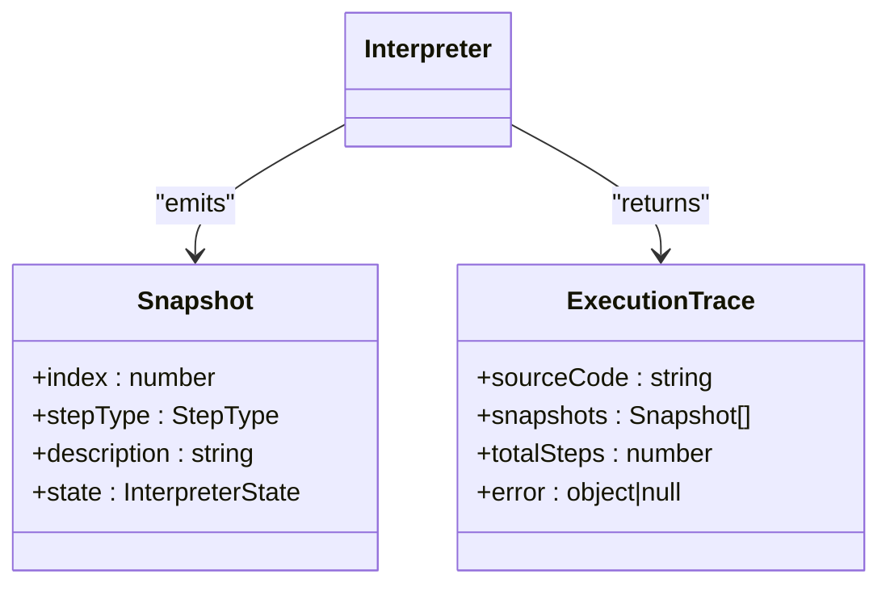

**Diagram sources**
- [interpreter/index.ts:139-150](file://src/engine/interpreter/index.ts#L139-L150)
- [runtime/types.ts:226-240](file://src/engine/runtime/types.ts#L226-L240)

**Section sources**
- [interpreter/index.ts:139-150](file://src/engine/interpreter/index.ts#L139-L150)
- [runtime/types.ts:226-240](file://src/engine/runtime/types.ts#L226-L240)

### UI Integration and Playback
The UI consumes the execution trace and renders visualizations:
- useVisualizerStore runs parseAndRun, stores trace, and manages current step and playback state.
- App.tsx renders panels for call stack, execution context, web APIs, event loop indicator, microtask queue, and task queue.
- Panels subscribe to the current snapshot and display interpreter state.
- usePlayback provides keyboard shortcuts and automatic stepping.

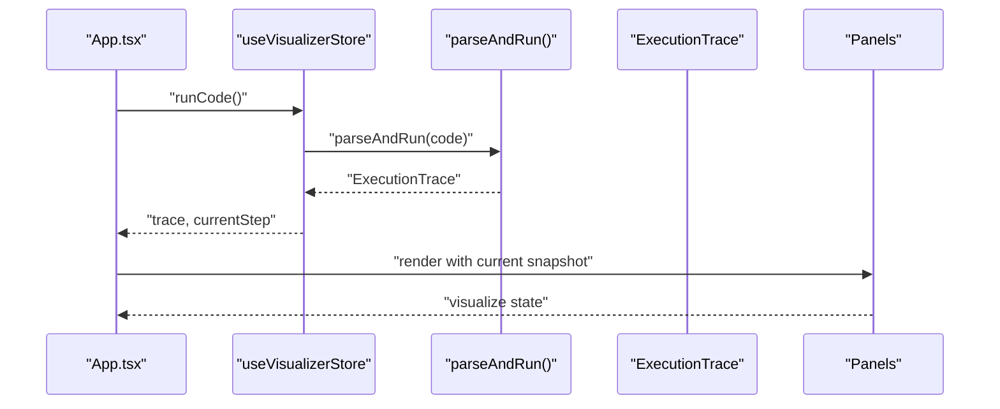

**Diagram sources**
- [useVisualizerStore.ts:37-50](file://src/store/useVisualizerStore.ts#L37-L50)
- [App.tsx:17-107](file://src/App.tsx#L17-L107)
- [CallStack.tsx:12-78](file://src/components/visualizer/CallStack.tsx#L12-L78)
- [MicrotaskQueue.tsx:12-40](file://src/components/visualizer/MicrotaskQueue.tsx#L12-L40)
- [TaskQueue.tsx:12-40](file://src/components/visualizer/TaskQueue.tsx#L12-L40)
- [usePlayback.ts:4-28](file://src/hooks/usePlayback.ts#L4-L28)

**Section sources**
- [useVisualizerStore.ts:37-50](file://src/store/useVisualizerStore.ts#L37-L50)
- [App.tsx:17-107](file://src/App.tsx#L17-L107)
- [CallStack.tsx:12-78](file://src/components/visualizer/CallStack.tsx#L12-L78)
- [MicrotaskQueue.tsx:12-40](file://src/components/visualizer/MicrotaskQueue.tsx#L12-L40)
- [TaskQueue.tsx:12-40](file://src/components/visualizer/TaskQueue.tsx#L12-L40)
- [usePlayback.ts:4-28](file://src/hooks/usePlayback.ts#L4-L28)

## Dependency Analysis
The interpreter depends on:
- Parser for AST construction.
- Runtime types for state, snapshots, queues, and step types.
- UI store and components for rendering and playback.

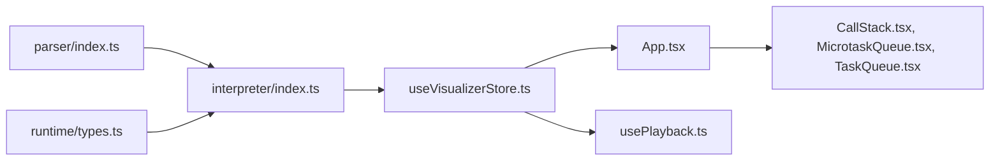

**Diagram sources**
- [parser/index.ts:5-24](file://src/engine/parser/index.ts#L5-L24)
- [interpreter/index.ts:19-28](file://src/engine/interpreter/index.ts#L19-L28)
- [runtime/types.ts:183-249](file://src/engine/runtime/types.ts#L183-L249)
- [useVisualizerStore.ts:27-98](file://src/store/useVisualizerStore.ts#L27-L98)
- [App.tsx:17-107](file://src/App.tsx#L17-L107)
- [CallStack.tsx:12-78](file://src/components/visualizer/CallStack.tsx#L12-L78)
- [MicrotaskQueue.tsx:12-40](file://src/components/visualizer/MicrotaskQueue.tsx#L12-L40)
- [TaskQueue.tsx:12-40](file://src/components/visualizer/TaskQueue.tsx#L12-L40)
- [usePlayback.ts:4-28](file://src/hooks/usePlayback.ts#L4-L28)

**Section sources**
- [parser/index.ts:5-24](file://src/engine/parser/index.ts#L5-L24)
- [interpreter/index.ts:19-28](file://src/engine/interpreter/index.ts#L19-L28)
- [runtime/types.ts:183-249](file://src/engine/runtime/types.ts#L183-L249)
- [useVisualizerStore.ts:27-98](file://src/store/useVisualizerStore.ts#L27-L98)
- [App.tsx:17-107](file://src/App.tsx#L17-L107)

## Performance Considerations
- Maximum steps: enforced to prevent infinite loops; exceeding triggers an error.
- Loop iteration limits: while and for loops enforce iteration caps to avoid stalls.
- Virtual clock advancement: timers and fetches are advanced efficiently by sorting and moving the clock to the next event.
- Snapshot cloning: state is deeply cloned for each snapshot; consider memory usage for long traces.
- Microtask prioritization: microtasks are drained before macrotasks to reflect real event loop semantics.

[No sources needed since this section provides general guidance]

## Troubleshooting Guide
Common issues and resolutions:
- Parse errors: caught during parsing and surfaced in ExecutionTrace.error.
- Runtime errors: thrown as Error instances; captured and emitted as runtime-error snapshots.
- Infinite loops: detected by step count and loop iteration counters; terminate with an error.
- Variable scoping: TDZ and assignment to constants are validated during lookup and assignment.
- Promise resolution: ensure resolve/reject are called appropriately; then handlers are scheduled as microtasks.

**Section sources**
- [parser/index.ts:14-23](file://src/engine/parser/index.ts#L14-L23)
- [interpreter/index.ts:120-127](file://src/engine/interpreter/index.ts#L120-L127)
- [interpreter/index.ts:372-374](file://src/engine/interpreter/index.ts#L372-L374)
- [interpreter/index.ts:399-402](file://src/engine/interpreter/index.ts#L399-L402)
- [interpreter/index.ts:182-210](file://src/engine/interpreter/index.ts#L182-L210)

## Conclusion
The interpreter provides a robust, step-by-step execution model for JavaScript with comprehensive tracing. It manages state, supports synchronous and asynchronous constructs, and faithfully simulates the event loop. The UI integrates execution traces into visual panels, enabling learners to observe call stacks, environments, queues, and console output. The design balances correctness, performance, and educational clarity.

[No sources needed since this section summarizes without analyzing specific files]

## Appendices

### Example Programs and Expected Behavior
The examples demonstrate key scenarios:
- setTimeout basics: timers enqueue callbacks to the task queue.
- Promise chain: .then() callbacks enqueue microtasks.
- Event loop order: microtasks run before macrotasks.
- Mixed async: interleaving setTimeout and Promise shows event loop sequencing.
- new Promise(): executor runs synchronously; then handlers are async.
- Closure demo: lexical scoping preserved across function invocations.
- Nested setTimeout: callbacks schedule further callbacks.
- Call stack growth: functions stack and unwind predictably.

These examples help visualize step-by-step execution and the interplay between microtasks and macrotasks.

**Section sources**
- [examples/index.ts:8-152](file://src/examples/index.ts#L8-L152)