# JavaScript Engine System

<cite>
**Referenced Files in This Document**
- [src/engine/index.ts](file://src/engine/index.ts)
- [src/engine/interpreter/index.ts](file://src/engine/interpreter/index.ts)
- [src/engine/parser/index.ts](file://src/engine/parser/index.ts)
- [src/engine/parser/preprocess.ts](file://src/engine/parser/preprocess.ts)
- [src/engine/runtime/types.ts](file://src/engine/runtime/types.ts)
- [src/App.tsx](file://src/App.tsx)
- [src/store/useVisualizerStore.ts](file://src/store/useVisualizerStore.ts)
- [src/components/visualizer/CallStack.tsx](file://src/components/visualizer/CallStack.tsx)
- [src/components/visualizer/ExecutionContext.tsx](file://src/components/visualizer/ExecutionContext.tsx)
- [src/components/visualizer/MicrotaskQueue.tsx](file://src/components/visualizer/MicrotaskQueue.tsx)
- [src/components/visualizer/EventLoopIndicator.tsx](file://src/components/visualizer/EventLoopIndicator.tsx)
- [src/examples/index.ts](file://src/examples/index.ts)
</cite>

## Table of Contents
1. [Introduction](#introduction)
2. [Project Structure](#project-structure)
3. [Core Components](#core-components)
4. [Architecture Overview](#architecture-overview)
5. [Detailed Component Analysis](#detailed-component-analysis)
6. [Dependency Analysis](#dependency-analysis)
7. [Performance Considerations](#performance-considerations)
8. [Troubleshooting Guide](#troubleshooting-guide)
9. [Conclusion](#conclusion)
10. [Appendices](#appendices)

## Introduction
This document explains the custom JavaScript interpreter engine that powers the visualization system. It covers the AST parsing pipeline using Acorn, the runtime type system, execution tracing, and how JavaScript constructs are translated into visualizable state changes. It also documents the handling of asynchronous operations, closures, and scope chains, along with performance characteristics, limitations, and practical examples.

## Project Structure
The engine is organized into three primary subsystems:
- Parser: Uses Acorn to produce ESTree-compatible ASTs with location metadata.
- Runtime: Defines the interpreter’s runtime types, execution state, and snapshot model.
- Interpreter: Executes statements and expressions, manages environments, call stacks, promises, and the event loop.

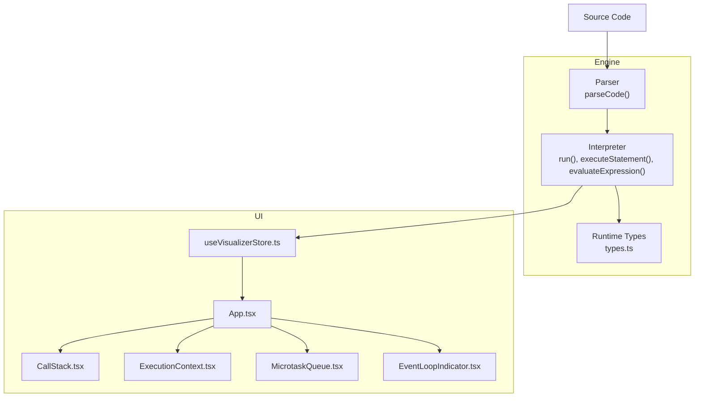

**Diagram sources**
- [src/engine/parser/index.ts:5-24](file://src/engine/parser/index.ts#L5-L24)
- [src/engine/runtime/types.ts:1-249](file://src/engine/runtime/types.ts#L1-L249)
- [src/engine/interpreter/index.ts:75-135](file://src/engine/interpreter/index.ts#L75-L135)
- [src/App.tsx:17-107](file://src/App.tsx#L17-L107)
- [src/store/useVisualizerStore.ts:27-98](file://src/store/useVisualizerStore.ts#L27-L98)
- [src/components/visualizer/CallStack.tsx:12-78](file://src/components/visualizer/CallStack.tsx#L12-L78)
- [src/components/visualizer/ExecutionContext.tsx:33-127](file://src/components/visualizer/ExecutionContext.tsx#L33-L127)
- [src/components/visualizer/MicrotaskQueue.tsx:12-40](file://src/components/visualizer/MicrotaskQueue.tsx#L12-L40)
- [src/components/visualizer/EventLoopIndicator.tsx:30-142](file://src/components/visualizer/EventLoopIndicator.tsx#L30-L142)

**Section sources**
- [src/engine/index.ts:1-17](file://src/engine/index.ts#L1-L17)
- [src/engine/parser/index.ts:1-25](file://src/engine/parser/index.ts#L1-L25)
- [src/engine/runtime/types.ts:1-249](file://src/engine/runtime/types.ts#L1-L249)
- [src/engine/interpreter/index.ts:1-1365](file://src/engine/interpreter/index.ts#L1-L1365)
- [src/App.tsx:1-138](file://src/App.tsx#L1-L138)
- [src/store/useVisualizerStore.ts:1-108](file://src/store/useVisualizerStore.ts#L1-L108)

## Core Components
- Parser: Parses source code into an ESTree Program with locations and returns either an AST or a parse error object.
- Runtime Types: Defines the interpreter’s value model (primitives, objects, arrays, functions, promises), environment and binding structures, queues, Web APIs, and snapshot/state models.
- Interpreter: Drives execution, maintains call stack and environments, handles statements and expressions, simulates Promise lifecycle, and orchestrates the event loop.

Key exports and types are re-exposed via the engine index for UI integration.

**Section sources**
- [src/engine/index.ts:1-17](file://src/engine/index.ts#L1-L17)
- [src/engine/parser/index.ts:5-24](file://src/engine/parser/index.ts#L5-L24)
- [src/engine/runtime/types.ts:3-249](file://src/engine/runtime/types.ts#L3-L249)
- [src/engine/interpreter/index.ts:40-1365](file://src/engine/interpreter/index.ts#L40-L1365)

## Architecture Overview
The interpreter follows a synchronous-first execution model with explicit simulation of asynchronous constructs:
- Parsing produces an ESTree AST with location info.
- The interpreter initializes a global environment, hoists declarations, executes statements, and emits snapshots for each step.
- Asynchronous constructs (Promises, setTimeout/setInterval, fetch) are modeled with synthetic timers and microtasks, advancing a virtual clock and draining queues accordingly.

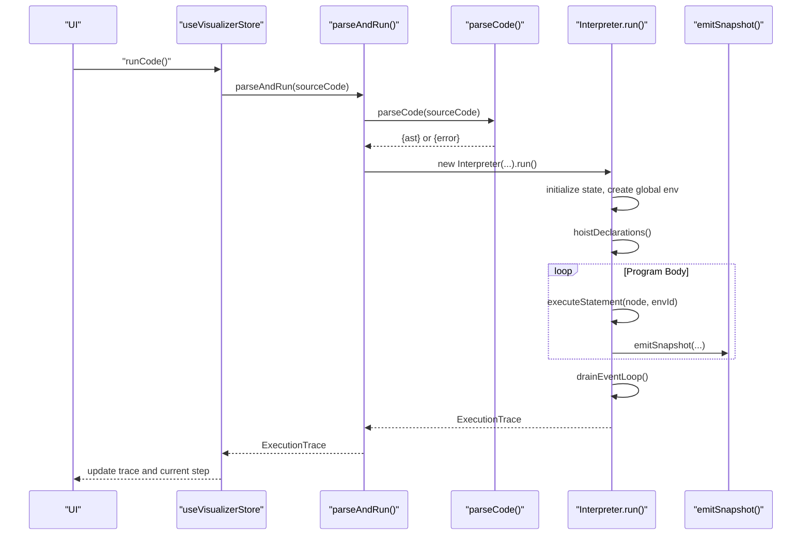

**Diagram sources**
- [src/engine/interpreter/index.ts:75-135](file://src/engine/interpreter/index.ts#L75-L135)
- [src/engine/parser/index.ts:5-24](file://src/engine/parser/index.ts#L5-L24)
- [src/store/useVisualizerStore.ts:37-49](file://src/store/useVisualizerStore.ts#L37-L49)

## Detailed Component Analysis

### Parser Implementation
- Uses Acorn to parse script-mode ECMAScript 2022 with location tracking.
- Returns either an object containing the AST and source code or a parse error with message and position.

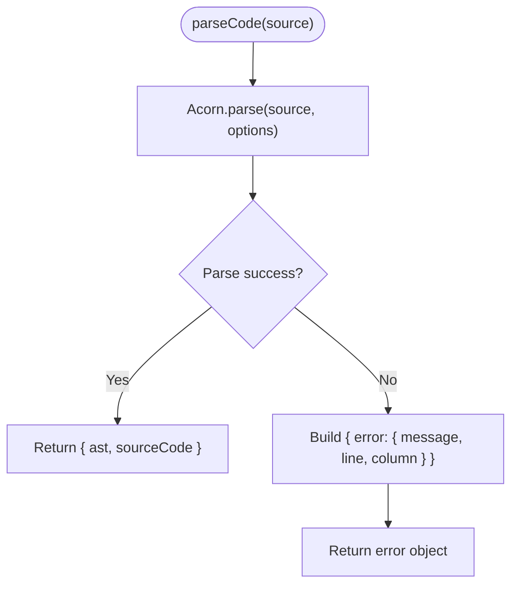

**Diagram sources**
- [src/engine/parser/index.ts:5-24](file://src/engine/parser/index.ts#L5-L24)

**Section sources**
- [src/engine/parser/index.ts:1-25](file://src/engine/parser/index.ts#L1-L25)

### Preprocessing and Scope Analysis
- A scope map is built by walking the AST to collect var/function/let/const declarations per scope.
- This supports accurate hoisting semantics and TDZ detection during execution.

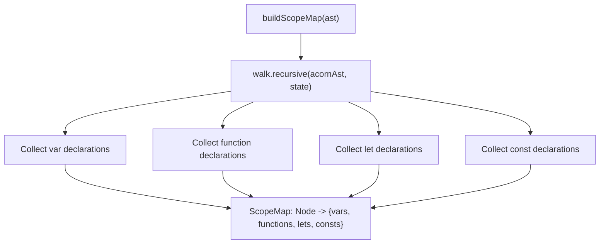

**Diagram sources**
- [src/engine/parser/preprocess.ts:13-102](file://src/engine/parser/preprocess.ts#L13-L102)

**Section sources**
- [src/engine/parser/preprocess.ts:1-103](file://src/engine/parser/preprocess.ts#L1-L103)

### Runtime Type System
- Runtime values include primitives (undefined, null, number, string, boolean), objects, arrays, functions, and promises.
- Utilities convert runtime values to strings and JS equivalents, and determine truthiness.
- Environments bind identifiers to values with mutability and TDZ flags.
- Function values carry closure environment, parameter names, and body references.
- Queues represent microtasks/macrotasks; Web API timers and fetches track scheduled work; SimPromise models pending/fulfilled/rejected state with then handlers.

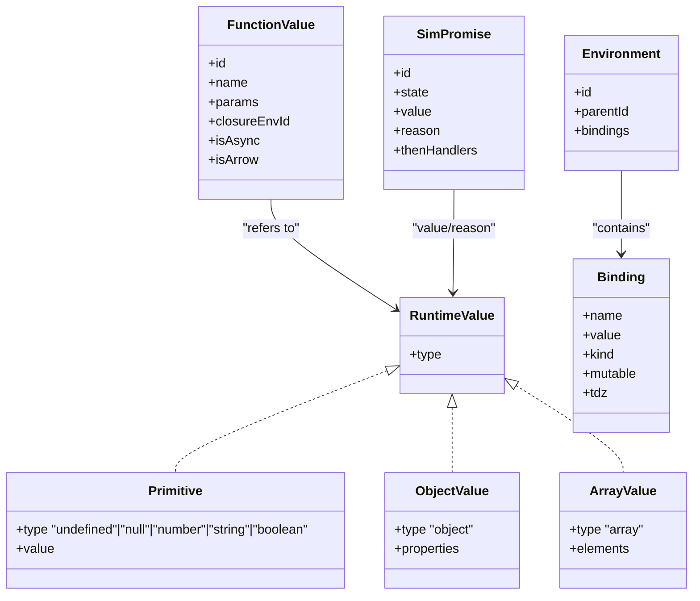

**Diagram sources**
- [src/engine/runtime/types.ts:3-195](file://src/engine/runtime/types.ts#L3-L195)

**Section sources**
- [src/engine/runtime/types.ts:1-249](file://src/engine/runtime/types.ts#L1-L249)

### Execution Tracing and Snapshots
- The interpreter emits snapshots for each significant step: program start/end, variable declarations/assignments, function calls/returns, console logs, promise lifecycle, timer registration/completion, microtask enqueue/dequeue, and event loop phases.
- Snapshots capture a deep-cloned copy of the interpreter state at each step, enabling stepwise visualization.

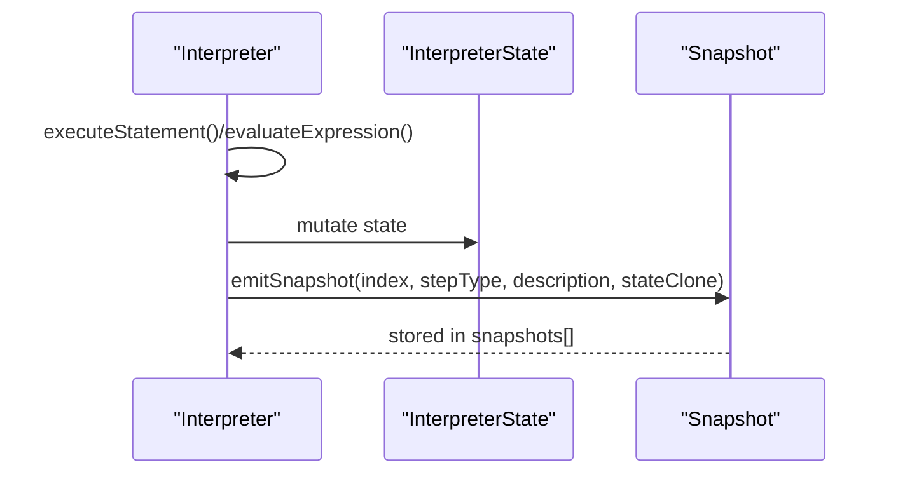

**Diagram sources**
- [src/engine/interpreter/index.ts:139-150](file://src/engine/interpreter/index.ts#L139-L150)
- [src/engine/runtime/types.ts:226-240](file://src/engine/runtime/types.ts#L226-L240)

**Section sources**
- [src/engine/interpreter/index.ts:137-150](file://src/engine/interpreter/index.ts#L137-L150)
- [src/engine/runtime/types.ts:197-240](file://src/engine/runtime/types.ts#L197-L240)

### Statement and Expression Execution
- Statements: variable declarations, function declarations, blocks, conditionals, loops, try/catch/finally, returns, throws, and empty statements.
- Expressions: literals, identifiers, binary/logical/unary/update/assignment, member access, calls, new, conditional (ternary), template literals, arrays, objects, sequences, await, spread.
- Special handling for built-in console logging, Promise static methods (.resolve/.reject), and Promise instance methods (.then/.catch/.finally).

```mermaid
flowchart TD
S["executeStatement(node, envId)"] --> SwitchStmt{"Switch on node.type"}
SwitchStmt --> VarDecl["VariableDeclaration"]
SwitchStmt --> FuncDecl["FunctionDeclaration"]
SwitchStmt --> Block["BlockStatement"]
SwitchStmt --> IfStmt["IfStatement"]
SwitchStmt --> ForStmt["ForStatement"]
SwitchStmt --> WhileStmt["WhileStatement"]
SwitchStmt --> TryStmt["TryStatement"]
SwitchStmt --> ThrowStmt["ThrowStatement"]
SwitchStmt --> OtherExpr["Else treat as expression"]
E["evaluateExpression(node, envId)"] --> SwitchExpr{"Switch on node.type"}
SwitchExpr --> Lit["Literal"]
SwitchExpr --> Id["Identifier"]
SwitchExpr --> Bin["BinaryExpression"]
SwitchExpr --> Log["LogicalExpression"]
SwitchExpr --> Un["UnaryExpression"]
SwitchExpr --> Upd["UpdateExpression"]
SwitchExpr --> Ass["AssignmentExpression"]
SwitchExpr --> Call["CallExpression"]
SwitchExpr --> NewP["NewExpression(Promise)"]
SwitchExpr --> Member["MemberExpression"]
SwitchExpr --> FuncExpr["FunctionExpression/Arrow"]
SwitchExpr --> Cond["ConditionalExpression"]
SwitchExpr --> Tpl["TemplateLiteral"]
SwitchExpr --> Arr["ArrayExpression"]
SwitchExpr --> Obj["ObjectExpression"]
SwitchExpr --> Seq["SequenceExpression"]
SwitchExpr --> Await["AwaitExpression"]
SwitchExpr --> Spread["SpreadElement"]
```

**Diagram sources**
- [src/engine/interpreter/index.ts:268-500](file://src/engine/interpreter/index.ts#L268-L500)

**Section sources**
- [src/engine/interpreter/index.ts:268-500](file://src/engine/interpreter/index.ts#L268-L500)

### Closures and Scope Chains
- Environments form a parent-linked chain; lookups traverse parents until a binding is found or an error is raised.
- Variable kinds (var/let/const/function/param) define mutability and TDZ behavior.
- Function calls create a new environment bound to the function’s closure environment, enabling lexical scoping.

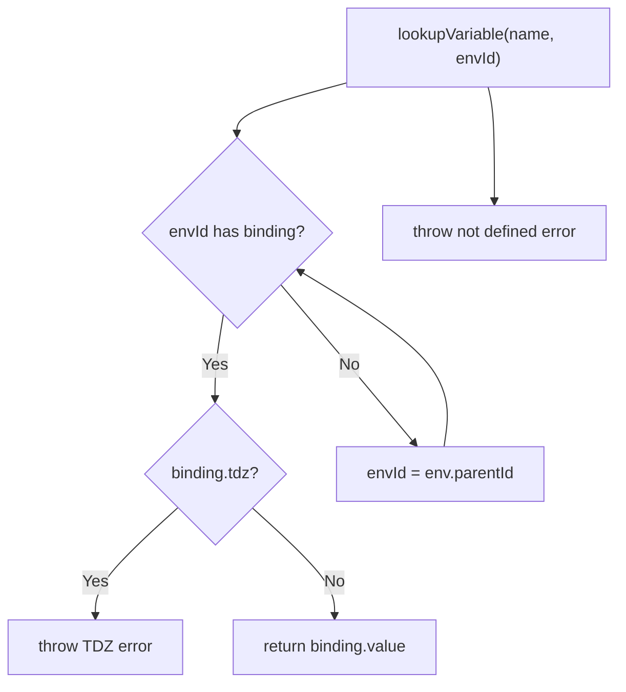

**Diagram sources**
- [src/engine/interpreter/index.ts:176-210](file://src/engine/interpreter/index.ts#L176-L210)
- [src/engine/runtime/types.ts:70-85](file://src/engine/runtime/types.ts#L70-L85)

**Section sources**
- [src/engine/interpreter/index.ts:154-221](file://src/engine/interpreter/index.ts#L154-L221)
- [src/engine/runtime/types.ts:70-85](file://src/engine/runtime/types.ts#L70-L85)

### Asynchronous Operations and Event Loop
- Promises are simulated with a dedicated state machine and then handlers; .then/.catch/.finally register callbacks that become microtasks when the promise settles.
- setTimeout/setInterval register timers with a virtual clock; when fired, callbacks are enqueued as macrotasks.
- fetch initiates a fetch entry with a simulated completion time; settled promises resolve with a minimal response object.
- The event loop drains microtasks first, advances timers, then executes one macrotask, repeating until idle.

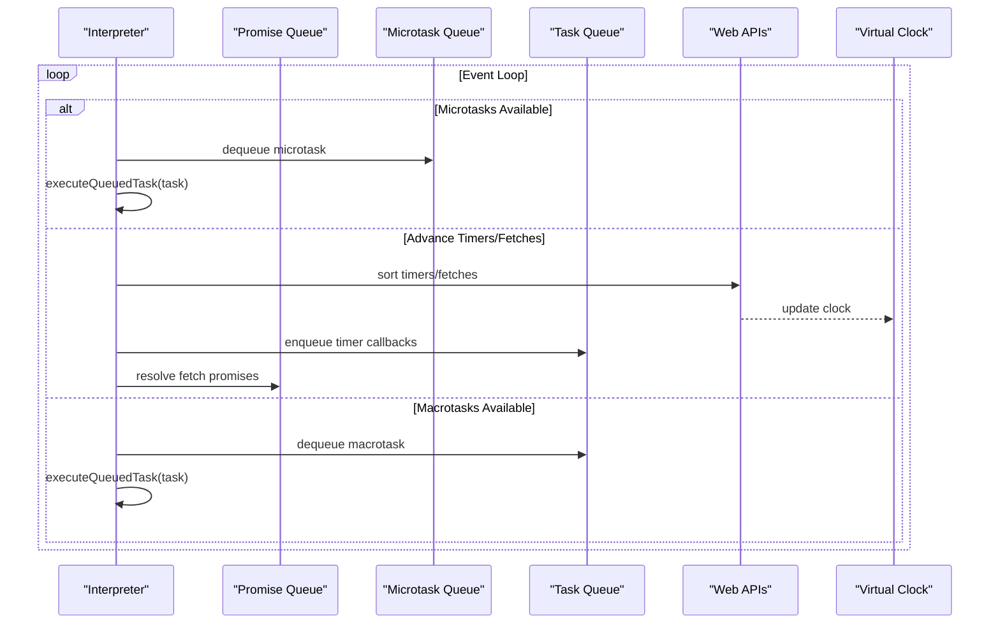

**Diagram sources**
- [src/engine/interpreter/index.ts:1198-1356](file://src/engine/interpreter/index.ts#L1198-L1356)
- [src/engine/runtime/types.ts:110-195](file://src/engine/runtime/types.ts#L110-L195)

**Section sources**
- [src/engine/interpreter/index.ts:897-1356](file://src/engine/interpreter/index.ts#L897-L1356)
- [src/engine/runtime/types.ts:110-195](file://src/engine/runtime/types.ts#L110-L195)

### Handling of JavaScript Constructs
- Primitives: literals, typeof, unary ops, binary ops, logical ops, comparisons, and equality.
- Objects and Arrays: property access, length, push/pop, forEach/map.
- Functions: creation, invocation, return signaling, async wrapping.
- Control flow: if/else, blocks, for/while, try/catch/finally, throw.
- Templates and sequences.

These constructs are mapped to interpreter actions and snapshots, enabling stepwise visualization.

**Section sources**
- [src/engine/interpreter/index.ts:502-827](file://src/engine/interpreter/index.ts#L502-L827)

### Visualization Pipeline
- The UI subscribes to the visualizer store, which invokes the interpreter and renders:
  - Call Stack: current stack frames with line numbers.
  - Scope/Variables: visible bindings across the scope chain.
  - Microtask Queue: pending microtasks awaiting execution.
  - Event Loop Indicator: current phase of the event loop.
- Examples demonstrate common patterns: setTimeout basics, Promise chains, event loop ordering, mixed async, new Promise, closures, nested timers, and call stack growth.

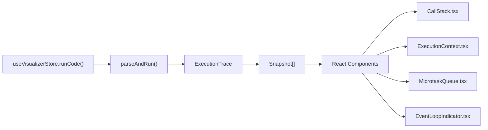

**Diagram sources**
- [src/store/useVisualizerStore.ts:37-49](file://src/store/useVisualizerStore.ts#L37-L49)
- [src/engine/interpreter/index.ts:1361-1365](file://src/engine/interpreter/index.ts#L1361-L1365)
- [src/App.tsx:17-107](file://src/App.tsx#L17-L107)
- [src/components/visualizer/CallStack.tsx:12-78](file://src/components/visualizer/CallStack.tsx#L12-L78)
- [src/components/visualizer/ExecutionContext.tsx:33-127](file://src/components/visualizer/ExecutionContext.tsx#L33-L127)
- [src/components/visualizer/MicrotaskQueue.tsx:12-40](file://src/components/visualizer/MicrotaskQueue.tsx#L12-L40)
- [src/components/visualizer/EventLoopIndicator.tsx:30-142](file://src/components/visualizer/EventLoopIndicator.tsx#L30-L142)
- [src/examples/index.ts:8-152](file://src/examples/index.ts#L8-L152)

**Section sources**
- [src/App.tsx:1-138](file://src/App.tsx#L1-L138)
- [src/store/useVisualizerStore.ts:1-108](file://src/store/useVisualizerStore.ts#L1-L108)
- [src/components/visualizer/CallStack.tsx:1-79](file://src/components/visualizer/CallStack.tsx#L1-L79)
- [src/components/visualizer/ExecutionContext.tsx:1-128](file://src/components/visualizer/ExecutionContext.tsx#L1-L128)
- [src/components/visualizer/MicrotaskQueue.tsx:1-41](file://src/components/visualizer/MicrotaskQueue.tsx#L1-L41)
- [src/components/visualizer/EventLoopIndicator.tsx:1-142](file://src/components/visualizer/EventLoopIndicator.tsx#L1-L142)
- [src/examples/index.ts:1-153](file://src/examples/index.ts#L1-L153)

## Dependency Analysis
- Parser depends on Acorn and returns ESTree nodes with locations.
- Interpreter depends on runtime types and parser output; it orchestrates execution and snapshots.
- UI depends on the store, which calls the interpreter and passes snapshots to visualization components.

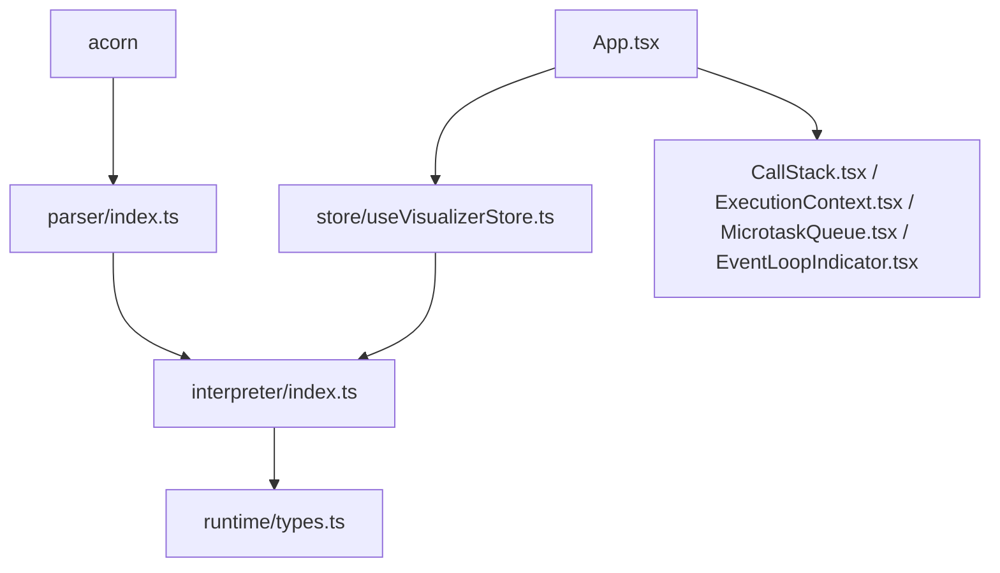

**Diagram sources**
- [src/engine/parser/index.ts:1-2](file://src/engine/parser/index.ts#L1-L2)
- [src/engine/interpreter/index.ts:1-28](file://src/engine/interpreter/index.ts#L1-L28)
- [src/engine/runtime/types.ts:1-249](file://src/engine/runtime/types.ts#L1-L249)
- [src/store/useVisualizerStore.ts:1-3](file://src/store/useVisualizerStore.ts#L1-L3)
- [src/App.tsx:1-16](file://src/App.tsx#L1-L16)

**Section sources**
- [src/engine/parser/index.ts:1-25](file://src/engine/parser/index.ts#L1-L25)
- [src/engine/interpreter/index.ts:1-28](file://src/engine/interpreter/index.ts#L1-L28)
- [src/engine/runtime/types.ts:1-249](file://src/engine/runtime/types.ts#L1-L249)
- [src/store/useVisualizerStore.ts:1-3](file://src/store/useVisualizerStore.ts#L1-L3)
- [src/App.tsx:1-16](file://src/App.tsx#L1-L16)

## Performance Considerations
- Execution limits: The interpreter enforces a maximum step count and maximum loop iterations to prevent infinite loops and excessive computation.
- Virtual clock and queue scheduling: Timers and fetches advance the virtual clock deterministically, avoiding real-time dependencies.
- Snapshot cloning: Each snapshot clones the interpreter state; frequent snapshots increase memory usage. Consider adjusting maxSteps or reducing granularity for very large traces.
- Complexity: Statement/Expression dispatch is linear in the number of nodes executed. Promise and queue operations are O(n log n) due to sorting timers and fetches by time.

[No sources needed since this section provides general guidance]

## Troubleshooting Guide
Common issues and diagnostics:
- Parse errors: The parser returns an error object with message and position; the interpreter surfaces this in the trace.
- Runtime errors: Caught during execution; a snapshot is emitted with a runtime error step type and the error message.
- Infinite loops: Detected by step count and loop iteration counters; the interpreter throws to halt execution.
- TDZ and assignment errors: Accessing uninitialized let/const or assigning to const triggers errors during variable lookup/assignment.
- Promise resolution: If a promise is not pending, resolve/reject is ignored; ensure proper chaining and registration of then handlers.

**Section sources**
- [src/engine/parser/index.ts:14-23](file://src/engine/parser/index.ts#L14-L23)
- [src/engine/interpreter/index.ts:140-142](file://src/engine/interpreter/index.ts#L140-L142)
- [src/engine/interpreter/index.ts:372-374](file://src/engine/interpreter/index.ts#L372-L374)
- [src/engine/interpreter/index.ts:182-209](file://src/engine/interpreter/index.ts#L182-L209)
- [src/engine/interpreter/index.ts:1089-1098](file://src/engine/interpreter/index.ts#L1089-L1098)

## Conclusion
This interpreter provides a deterministic, stepwise visualization of JavaScript execution, including closures, scope chains, and asynchronous constructs. Its design emphasizes clarity and educational value, with precise snapshots and a simplified event loop model. Developers can leverage the exported types and trace structure to build advanced visualizations and interactive learning tools.

[No sources needed since this section summarizes without analyzing specific files]

## Appendices

### Example Patterns and How They Are Visualized
- setTimeout Basics: Registers timers and demonstrates task queue behavior.
- Promise Chain: Registers then handlers as microtasks and resolves with chained values.
- Event Loop Order: Demonstrates microtasks running before macrotasks.
- Mixed Async: Interleaving timers and promises highlights queue dynamics.
- new Promise(): Executor runs synchronously; then handlers become microtasks.
- Closure Demo: Lexical scoping preserved across function invocations.
- Nested setTimeout: Each callback schedules the next, modeling recursive async scheduling.
- Call Stack Growth: Functions stack and unwind, visible in the call stack panel.

**Section sources**
- [src/examples/index.ts:8-152](file://src/examples/index.ts#L8-L152)