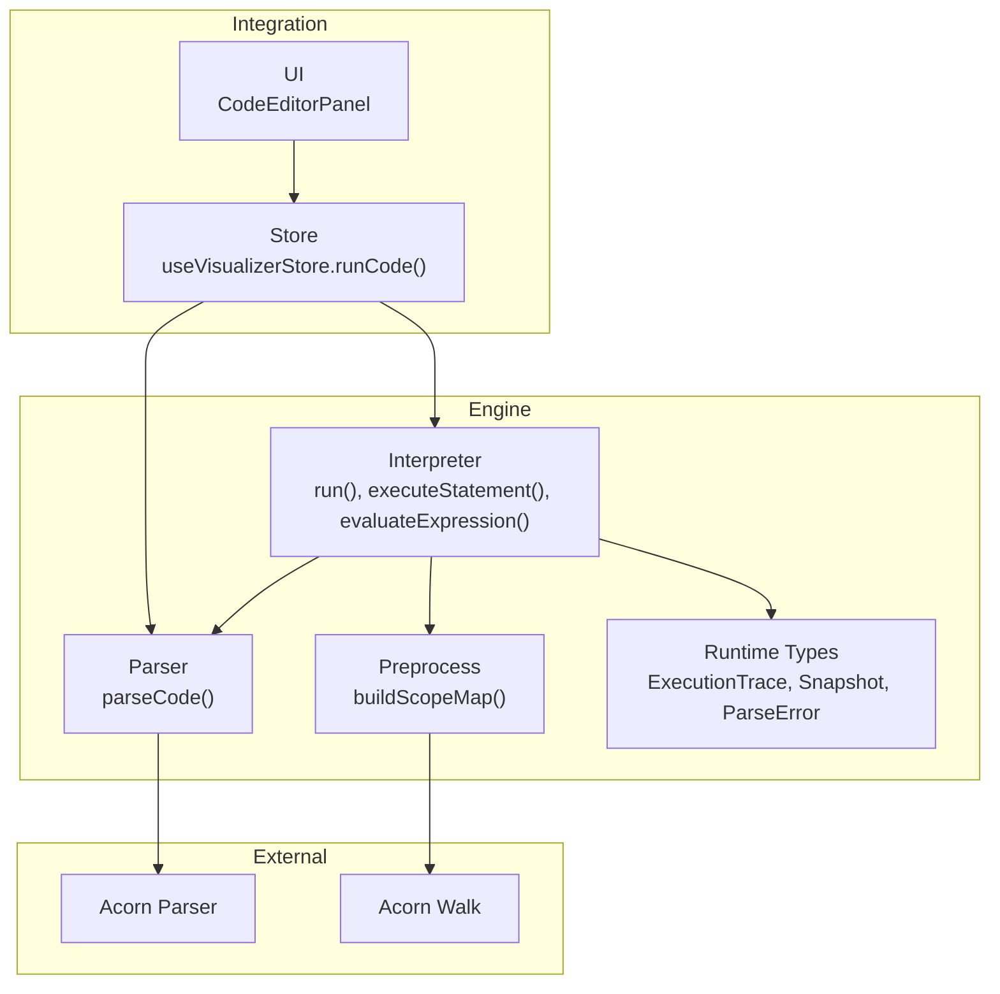
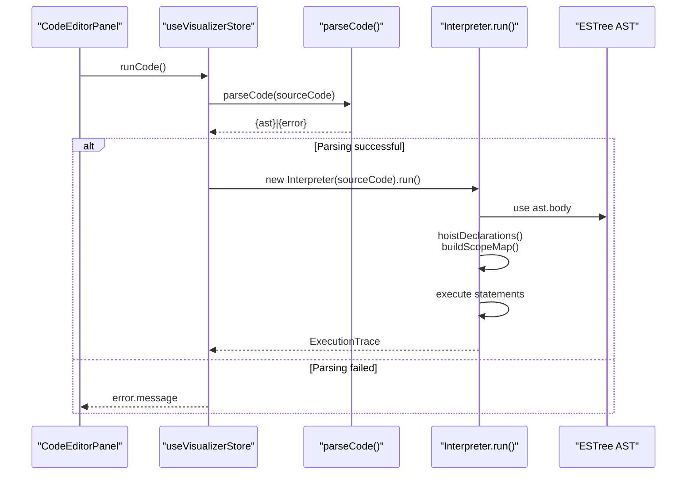
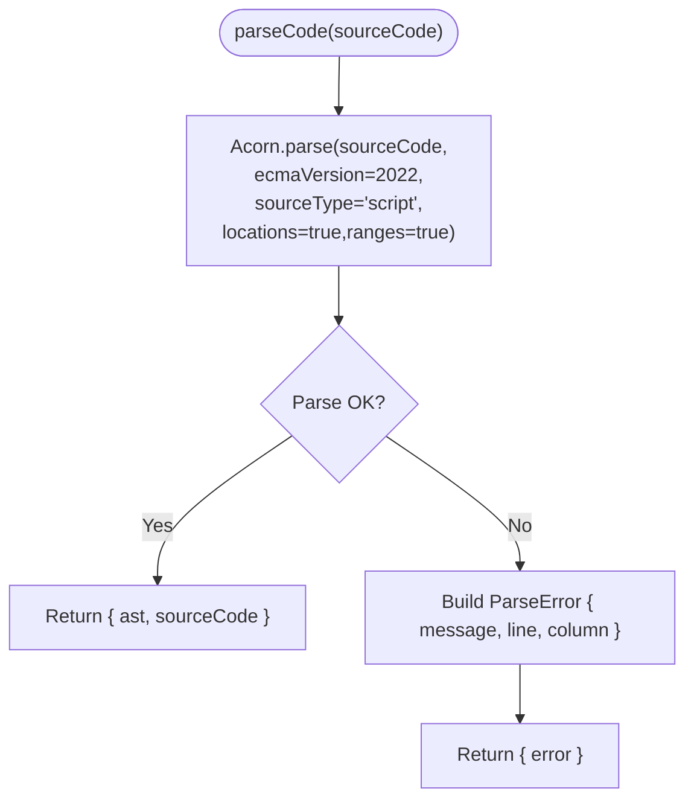
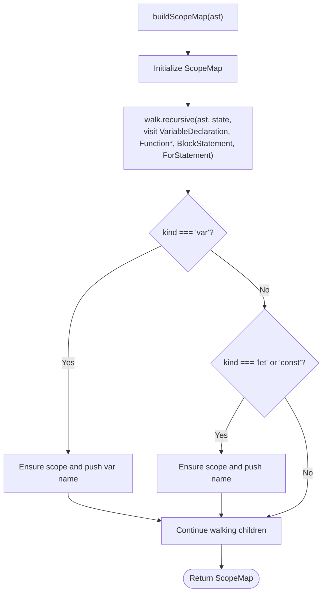
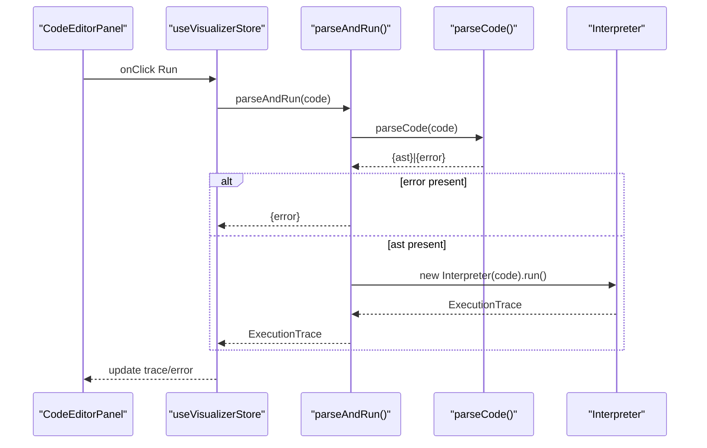
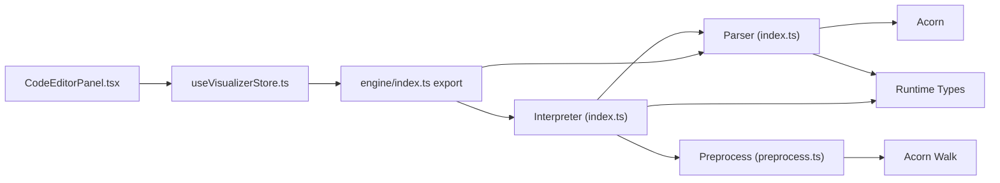

# Parser System

<cite>
**Referenced Files in This Document**
- [src/engine/parser/index.ts](file://src/engine/parser/index.ts)
- [src/engine/parser/preprocess.ts](file://src/engine/parser/preprocess.ts)
- [src/engine/interpreter/index.ts](file://src/engine/interpreter/index.ts)
- [src/engine/runtime/types.ts](file://src/engine/runtime/types.ts)
- [src/engine/index.ts](file://src/engine/index.ts)
- [src/store/useVisualizerStore.ts](file://src/store/useVisualizerStore.ts)
- [src/components/editor/CodeEditorPanel.tsx](file://src/components/editor/CodeEditorPanel.tsx)
- [package.json](file://package.json)
</cite>

## Table of Contents
1. [Introduction](#introduction)
2. [Project Structure](#project-structure)
3. [Core Components](#core-components)
4. [Architecture Overview](#architecture-overview)
5. [Detailed Component Analysis](#detailed-component-analysis)
6. [Dependency Analysis](#dependency-analysis)
7. [Performance Considerations](#performance-considerations)
8. [Troubleshooting Guide](#troubleshooting-guide)
9. [Conclusion](#conclusion)
10. [Appendices](#appendices)

## Introduction
This document explains the JavaScript parsing system that powers the visualizer. It covers how raw JavaScript source code is transformed into ESTree-compatible AST nodes via Acorn, how the code is prepared for execution, and how the resulting AST drives the interpreter. It also documents supported language features, error handling, and limitations of the current parser and interpreter.

## Project Structure
The parsing system resides under the engine module and integrates with the store and UI components to provide a visual execution experience.



**Diagram sources**
- [src/engine/parser/index.ts:1-25](file://src/engine/parser/index.ts#L1-L25)
- [src/engine/parser/preprocess.ts:1-103](file://src/engine/parser/preprocess.ts#L1-L103)
- [src/engine/interpreter/index.ts:1-1365](file://src/engine/interpreter/index.ts#L1-L1365)
- [src/engine/runtime/types.ts:1-249](file://src/engine/runtime/types.ts#L1-L249)
- [src/store/useVisualizerStore.ts:1-109](file://src/store/useVisualizerStore.ts#L1-L109)
- [package.json:20-22](file://package.json#L20-L22)

**Section sources**
- [src/engine/parser/index.ts:1-25](file://src/engine/parser/index.ts#L1-L25)
- [src/engine/parser/preprocess.ts:1-103](file://src/engine/parser/preprocess.ts#L1-L103)
- [src/engine/interpreter/index.ts:1-1365](file://src/engine/interpreter/index.ts#L1-L1365)
- [src/engine/runtime/types.ts:1-249](file://src/engine/runtime/types.ts#L1-L249)
- [src/engine/index.ts:1-17](file://src/engine/index.ts#L1-L17)
- [src/store/useVisualizerStore.ts:1-109](file://src/store/useVisualizerStore.ts#L1-L109)
- [src/components/editor/CodeEditorPanel.tsx:1-162](file://src/components/editor/CodeEditorPanel.tsx#L1-L162)
- [package.json:20-22](file://package.json#L20-L22)

## Core Components
- Parser: Converts JavaScript source into an ESTree Program AST using Acorn with location/range metadata enabled.
- Preprocess: Builds a scope map for declarations to support hoisting and TDZ semantics.
- Interpreter: Executes the AST, manages environments, call stacks, promises, and the event loop.
- Runtime Types: Defines the execution trace, snapshots, and parse error structures.
- Store/UI: Integrates parsing and execution into the interactive visualizer.

**Section sources**
- [src/engine/parser/index.ts:1-25](file://src/engine/parser/index.ts#L1-L25)
- [src/engine/parser/preprocess.ts:1-103](file://src/engine/parser/preprocess.ts#L1-L103)
- [src/engine/interpreter/index.ts:1-1365](file://src/engine/interpreter/index.ts#L1-L1365)
- [src/engine/runtime/types.ts:1-249](file://src/engine/runtime/types.ts#L1-L249)
- [src/engine/index.ts:1-17](file://src/engine/index.ts#L1-L17)
- [src/store/useVisualizerStore.ts:1-109](file://src/store/useVisualizerStore.ts#L1-L109)

## Architecture Overview
The parsing workflow is straightforward: the UI triggers execution, the store invokes the parser, and the interpreter executes the AST. The interpreter also builds a scope map to manage hoisting and TDZ.



**Diagram sources**
- [src/components/editor/CodeEditorPanel.tsx:100-144](file://src/components/editor/CodeEditorPanel.tsx#L100-L144)
- [src/store/useVisualizerStore.ts:37-50](file://src/store/useVisualizerStore.ts#L37-L50)
- [src/engine/parser/index.ts:5-24](file://src/engine/parser/index.ts#L5-L24)
- [src/engine/interpreter/index.ts:75-135](file://src/engine/interpreter/index.ts#L75-L135)

## Detailed Component Analysis

### Parser: Acorn Integration and ESTree AST Generation
- Uses Acorn to parse JavaScript into an ESTree Program with:
  - ECMAScript 2022 support
  - Script source type
  - Locations and ranges enabled for precise error reporting and UI highlighting
- Returns either:
  - An object containing the AST and original source code
  - A parse error object with message, line, and column
- The returned AST conforms to ESTree types and is consumed by the interpreter.



**Diagram sources**
- [src/engine/parser/index.ts:5-24](file://src/engine/parser/index.ts#L5-L24)

**Section sources**
- [src/engine/parser/index.ts:1-25](file://src/engine/parser/index.ts#L1-L25)
- [package.json:20-22](file://package.json#L20-L22)

### Preprocessing: Scope Map and Hoisting Semantics
- Builds a scope map by walking the AST with Acorn’s walker.
- Tracks four categories of identifiers per scope:
  - var declarations (hoisted with undefined)
  - function declarations (hoisted with value)
  - let declarations (TDZ)
  - const declarations (TDZ)
- Creates nested scopes for blocks, for-loops, and function bodies.
- Supports function expressions and arrow functions by walking into their bodies.



**Diagram sources**
- [src/engine/parser/preprocess.ts:13-102](file://src/engine/parser/preprocess.ts#L13-L102)

**Section sources**
- [src/engine/parser/preprocess.ts:1-103](file://src/engine/parser/preprocess.ts#L1-L103)

### Interpreter: From AST to Execution Trace
- Parses code via the parser, then:
  - Creates a global environment
  - Hoists var/function declarations in the program body
  - Executes statements in order
  - Drains the event loop (microtasks, timers, fetches)
- Emits snapshots for each significant step (variable declaration, function call, promise resolution, etc.).
- Supports:
  - Control flow (if/else, blocks, for/while)
  - Expressions (binary/logical/unary/update/assignment, member/array/object, template literals)
  - Functions (named, arrow, async), closures, and call stacks
  - Promises (resolve/reject, then/catch/finally), microtasks, and timers
  - Built-ins (console.* methods, setTimeout/setInterval/clearTimeout/clearInterval, fetch)

```mermaid
classDiagram
class Interpreter {
-state : InterpreterState
-snapshots : Snapshot[]
-stepCount : number
-maxSteps : number
-sourceCode : string
-error : {message,line?}
+run() ExecutionTrace
-emitSnapshot(stepType, description) void
-createEnvironment(parentId, label) string
-addBinding(envId, name, value, kind, tdz) void
-lookupVariable(name, envId) RuntimeValue
-assignVariable(name, value, envId) void
-hoistDeclarations(body, envId, isFunctionScope) void
-executeStatement(node, envId) RuntimeValue|undefined
-evaluateExpression(node, envId) RuntimeValue
}
class RuntimeTypes {
<<types>>
}
Interpreter --> RuntimeTypes : "uses"
```

**Diagram sources**
- [src/engine/interpreter/index.ts:40-135](file://src/engine/interpreter/index.ts#L40-L135)
- [src/engine/runtime/types.ts:1-249](file://src/engine/runtime/types.ts#L1-L249)

**Section sources**
- [src/engine/interpreter/index.ts:1-1365](file://src/engine/interpreter/index.ts#L1-L1365)
- [src/engine/runtime/types.ts:1-249](file://src/engine/runtime/types.ts#L1-L249)

### Integration: Store and UI
- The store’s run action calls the public parseAndRun function exported by the engine.
- On success, the store sets the trace and error; on failure, it surfaces the error message.
- The UI displays the current snapshot and highlights the executing line.



**Diagram sources**
- [src/store/useVisualizerStore.ts:37-50](file://src/store/useVisualizerStore.ts#L37-L50)
- [src/engine/index.ts:1-1](file://src/engine/index.ts#L1-L1)
- [src/engine/parser/index.ts:5-24](file://src/engine/parser/index.ts#L5-L24)
- [src/engine/interpreter/index.ts:75-135](file://src/engine/interpreter/index.ts#L75-L135)
- [src/components/editor/CodeEditorPanel.tsx:146-158](file://src/components/editor/CodeEditorPanel.tsx#L146-L158)

**Section sources**
- [src/store/useVisualizerStore.ts:1-109](file://src/store/useVisualizerStore.ts#L1-L109)
- [src/engine/index.ts:1-17](file://src/engine/index.ts#L1-L17)
- [src/components/editor/CodeEditorPanel.tsx:1-162](file://src/components/editor/CodeEditorPanel.tsx#L1-L162)

## Dependency Analysis
- Parser depends on Acorn for ESTree AST generation and Acorn Walker for scope traversal.
- Interpreter depends on the parser output and runtime types.
- Store depends on the engine’s public API to run code.
- UI depends on the store for state and error display.



**Diagram sources**
- [src/engine/parser/index.ts:1-3](file://src/engine/parser/index.ts#L1-L3)
- [src/engine/parser/preprocess.ts:1-2](file://src/engine/parser/preprocess.ts#L1-L2)
- [src/engine/interpreter/index.ts:1-28](file://src/engine/interpreter/index.ts#L1-L28)
- [src/engine/runtime/types.ts:1-249](file://src/engine/runtime/types.ts#L1-L249)
- [src/engine/index.ts:1-17](file://src/engine/index.ts#L1-L17)
- [src/store/useVisualizerStore.ts:1-3](file://src/store/useVisualizerStore.ts#L1-L3)
- [src/components/editor/CodeEditorPanel.tsx:1-8](file://src/components/editor/CodeEditorPanel.tsx#L1-L8)

**Section sources**
- [package.json:20-22](file://package.json#L20-L22)
- [src/engine/parser/index.ts:1-3](file://src/engine/parser/index.ts#L1-L3)
- [src/engine/parser/preprocess.ts:1-2](file://src/engine/parser/preprocess.ts#L1-L2)
- [src/engine/interpreter/index.ts:1-28](file://src/engine/interpreter/index.ts#L1-L28)
- [src/engine/runtime/types.ts:1-249](file://src/engine/runtime/types.ts#L1-L249)
- [src/engine/index.ts:1-17](file://src/engine/index.ts#L1-L17)
- [src/store/useVisualizerStore.ts:1-3](file://src/store/useVisualizerStore.ts#L1-L3)
- [src/components/editor/CodeEditorPanel.tsx:1-8](file://src/components/editor/CodeEditorPanel.tsx#L1-L8)

## Performance Considerations
- Parsing with locations and ranges adds overhead; keep input sizes reasonable for smooth UI updates.
- The interpreter enforces a maximum step count to prevent infinite loops.
- Scope building traverses the entire AST; avoid extremely large inputs to maintain responsiveness.
- Event loop draining iterates queues; limit heavy async workloads in examples.

[No sources needed since this section provides general guidance]

## Troubleshooting Guide
- Syntax errors:
  - The parser catches Acorn exceptions and reports a ParseError with message, line, and column.
  - The store surfaces the error message to the UI.
- Runtime errors:
  - The interpreter wraps uncaught exceptions and records them in the trace.
  - Snapshots capture runtime error events with descriptions.
- Line highlighting:
  - The interpreter sets the highlighted line during statement execution; the UI reflects it.

**Section sources**
- [src/engine/parser/index.ts:14-23](file://src/engine/parser/index.ts#L14-L23)
- [src/engine/interpreter/index.ts:120-127](file://src/engine/interpreter/index.ts#L120-L127)
- [src/store/useVisualizerStore.ts:40-46](file://src/store/useVisualizerStore.ts#L40-L46)
- [src/components/editor/CodeEditorPanel.tsx:26-50](file://src/components/editor/CodeEditorPanel.tsx#L26-L50)

## Conclusion
The parser system integrates Acorn to produce ESTree-compatible ASTs with location metadata, enabling precise error reporting and UI highlighting. The interpreter consumes these ASTs to drive a full JavaScript execution model, including hoisting, closures, promises, and the event loop. The store and UI provide a seamless experience for writing, running, and visualizing JavaScript code.

[No sources needed since this section summarizes without analyzing specific files]

## Appendices

### Supported JavaScript Features (as exercised by the interpreter)
- Declarations: var, let, const
- Functions: named, expression, arrow, async
- Control flow: if/else, blocks, for (var/let/const init), while
- Expressions: binary/logical/unary, update, assignment, member, array/object, template literal, sequence
- Calls: built-in console.*, setTimeout/setInterval/clearTimeout/clearInterval, fetch
- Promises: new Promise, resolve/reject, then/catch/finally, await (simplified)

**Section sources**
- [src/engine/interpreter/index.ts:224-241](file://src/engine/interpreter/index.ts#L224-L241)
- [src/engine/interpreter/index.ts:268-306](file://src/engine/interpreter/index.ts#L268-L306)
- [src/engine/interpreter/index.ts:433-500](file://src/engine/interpreter/index.ts#L433-L500)
- [src/engine/interpreter/index.ts:624-666](file://src/engine/interpreter/index.ts#L624-L666)
- [src/engine/interpreter/index.ts:899-950](file://src/engine/interpreter/index.ts#L899-L950)
- [src/engine/interpreter/index.ts:968-1194](file://src/engine/interpreter/index.ts#L968-L1194)

### Limitations and Unsupported Features
- The parser uses script source type and ECMAScript 2022, so module syntax and newer features beyond ES2022 are not enabled.
- Some advanced language features may not be fully represented in the interpreter’s execution model.
- The scope map focuses on hoisting and TDZ for var/let/const/functions; other scoping nuances are not modeled.

**Section sources**
- [src/engine/parser/index.ts:7-12](file://src/engine/parser/index.ts#L7-L12)
- [src/engine/parser/preprocess.ts:13-102](file://src/engine/parser/preprocess.ts#L13-L102)