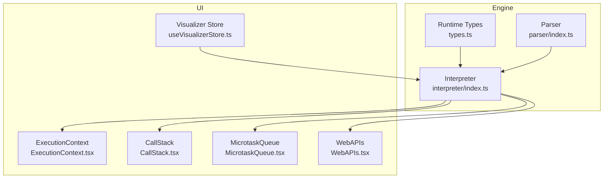
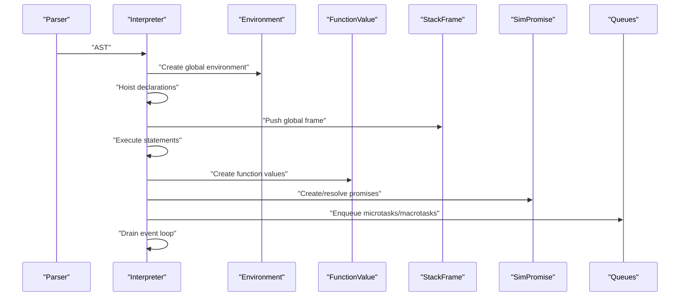
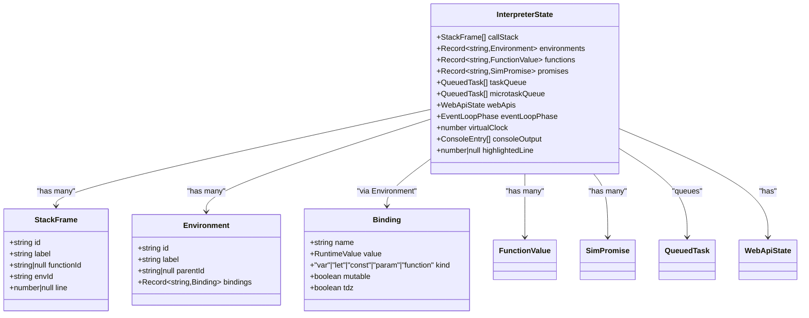
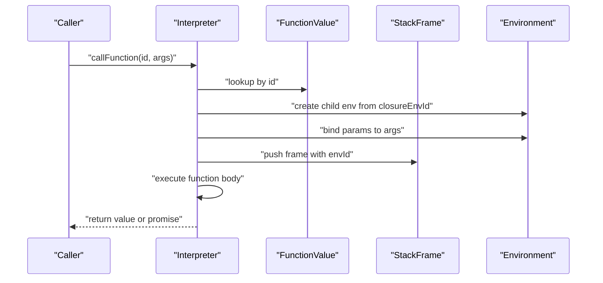
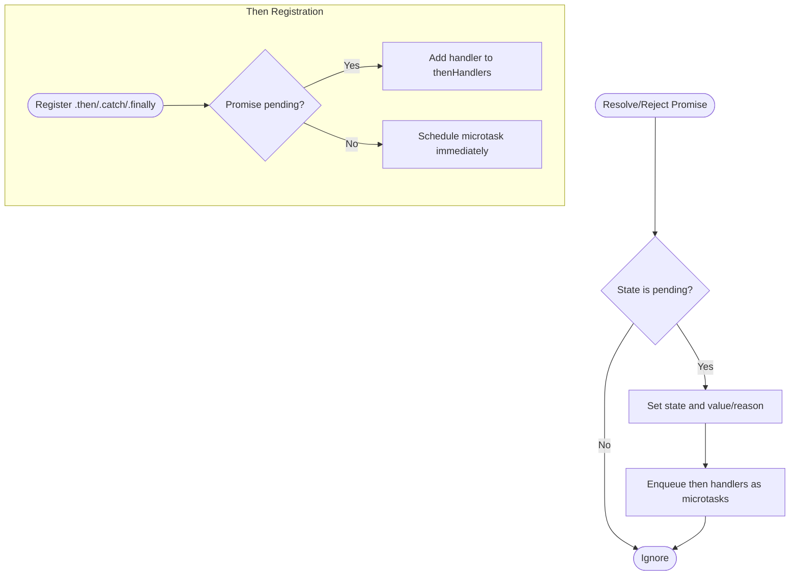
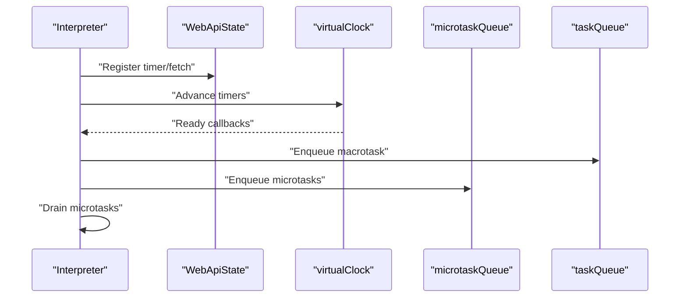
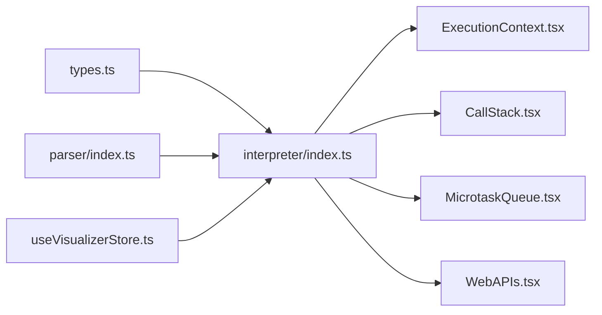

# Runtime Type System

<cite>
**Referenced Files in This Document**
- [types.ts](file://src/engine/runtime/types.ts)
- [index.ts](file://src/engine/interpreter/index.ts)
- [index.ts](file://src/engine/parser/index.ts)
- [ExecutionContext.tsx](file://src/components/visualizer/ExecutionContext.tsx)
- [CallStack.tsx](file://src/components/visualizer/CallStack.tsx)
- [MicrotaskQueue.tsx](file://src/components/visualizer/MicrotaskQueue.tsx)
- [WebAPIs.tsx](file://src/components/visualizer/WebAPIs.tsx)
- [useVisualizerStore.ts](file://src/store/useVisualizerStore.ts)
</cite>

## Table of Contents
1. [Introduction](#introduction)
2. [Project Structure](#project-structure)
3. [Core Components](#core-components)
4. [Architecture Overview](#architecture-overview)
5. [Detailed Component Analysis](#detailed-component-analysis)
6. [Dependency Analysis](#dependency-analysis)
7. [Performance Considerations](#performance-considerations)
8. [Troubleshooting Guide](#troubleshooting-guide)
9. [Conclusion](#conclusion)

## Introduction
This document explains the runtime type system that powers the JavaScript visualizer. It covers how JavaScript values are modeled internally, how execution state is captured, and how scoping, closures, promises, and Web APIs are simulated. The goal is to help both developers and learners understand how the interpreter represents and manipulates JavaScript values, environments, and asynchronous constructs.

## Project Structure
The runtime type system is defined in a single module and consumed by the interpreter and UI components:
- Runtime types and execution state are defined in a dedicated module.
- The interpreter consumes these types to model execution, manage environments, and simulate promises and Web APIs.
- UI components visualize the interpreter state for educational purposes.

**Diagram sources**
- [types.ts:1-249](file://src/engine/runtime/types.ts#L1-L249)
- [index.ts:1-1365](file://src/engine/interpreter/index.ts#L1-L1365)
- [index.ts:1-25](file://src/engine/parser/index.ts#L1-L25)
- [ExecutionContext.tsx:1-128](file://src/components/visualizer/ExecutionContext.tsx#L1-L128)
- [CallStack.tsx:1-79](file://src/components/visualizer/CallStack.tsx#L1-L79)
- [MicrotaskQueue.tsx:1-41](file://src/components/visualizer/MicrotaskQueue.tsx#L1-L41)
- [WebAPIs.tsx:1-130](file://src/components/visualizer/WebAPIs.tsx#L1-L130)
- [useVisualizerStore.ts:1-109](file://src/store/useVisualizerStore.ts#L1-L109)

**Section sources**
- [types.ts:1-249](file://src/engine/runtime/types.ts#L1-L249)
- [index.ts:1-1365](file://src/engine/interpreter/index.ts#L1-L1365)
- [index.ts:1-25](file://src/engine/parser/index.ts#L1-L25)
- [ExecutionContext.tsx:1-128](file://src/components/visualizer/ExecutionContext.tsx#L1-L128)
- [CallStack.tsx:1-79](file://src/components/visualizer/CallStack.tsx#L1-L79)
- [MicrotaskQueue.tsx:1-41](file://src/components/visualizer/MicrotaskQueue.tsx#L1-L41)
- [WebAPIs.tsx:1-130](file://src/components/visualizer/WebAPIs.tsx#L1-L130)
- [useVisualizerStore.ts:1-109](file://src/store/useVisualizerStore.ts#L1-L109)

## Core Components
This section introduces the central types and structures used to represent JavaScript values and execution state.

- RuntimeValue union type: Represents all JavaScript values internally, including primitives, objects, arrays, functions, and promises.
- InterpreterState: Captures the complete execution environment at any point, including call stack, environments, functions, promises, queues, Web APIs, event loop phase, and console output.
- StackFrame: Models a single activation record with function identity, environment, and source location.
- Environment and Binding: Implement lexical scoping with variable kinds, mutability, and temporal dead zone handling.
- FunctionValue: Encapsulates function metadata, including parameter lists, closure environment, and flags for async and arrow functions.
- Promise simulation: Simulated promises with fulfillment/rejection states, then handlers, and microtask scheduling.
- Web API simulation: Timers and fetch operations with virtual clocks and queueing.

**Section sources**
- [types.ts:3-12](file://src/engine/runtime/types.ts#L3-L12)
- [types.ts:72-85](file://src/engine/runtime/types.ts#L72-L85)
- [types.ts:89-98](file://src/engine/runtime/types.ts#L89-L98)
- [types.ts:102-108](file://src/engine/runtime/types.ts#L102-L108)
- [types.ts:147-160](file://src/engine/runtime/types.ts#L147-L160)
- [types.ts:183-195](file://src/engine/runtime/types.ts#L183-L195)

## Architecture Overview
The interpreter builds and manipulates the runtime type system during execution. It parses source code, creates environments and functions, evaluates expressions, manages the call stack, and simulates asynchronous operations via queues and a virtual clock.

**Diagram sources**
- [index.ts:75-135](file://src/engine/interpreter/index.ts#L75-L135)
- [index.ts:154-163](file://src/engine/interpreter/index.ts#L154-L163)
- [index.ts:224-241](file://src/engine/interpreter/index.ts#L224-L241)
- [index.ts:831-895](file://src/engine/interpreter/index.ts#L831-L895)
- [index.ts:967-1194](file://src/engine/interpreter/index.ts#L967-L1194)
- [index.ts:1198-1254](file://src/engine/interpreter/index.ts#L1198-L1254)

## Detailed Component Analysis

### RuntimeValue Union Type
The RuntimeValue union type models all JavaScript values:
- Primitives: undefined, null, boolean, number, string.
- Objects and arrays: objects with property maps and arrays with element lists.
- Functions and promises: represented by identifiers that reference FunctionValue and SimPromise respectively.

Representative mapping:
- undefined and null are singleton values.
- number, string, boolean wrap primitive values.
- function holds a function identifier.
- promise holds a promise identifier.
- object stores a property map of string keys to RuntimeValue.
- array stores a list of RuntimeValue.

Utility functions:
- runtimeToString converts values to human-readable strings.
- runtimeToJS converts values to JS-like structures for display.
- isTruthy implements JavaScript truthiness semantics.

Examples of internal representation:
- A number value wraps a numeric payload.
- An object value stores a dictionary keyed by strings.
- A function value references a FunctionValue by id.
- A promise value references a SimPromise by id.

Type safety:
- Exhaustive switch statements in converters enforce coverage of all union cases.
- Discriminated unions ensure safe pattern matching across value types.

**Section sources**
- [types.ts:3-12](file://src/engine/runtime/types.ts#L3-L12)
- [types.ts:14-15](file://src/engine/runtime/types.ts#L14-L15)
- [types.ts:17-25](file://src/engine/runtime/types.ts#L17-L25)
- [types.ts:27-43](file://src/engine/runtime/types.ts#L27-L43)
- [types.ts:45-57](file://src/engine/runtime/types.ts#L45-L57)
- [types.ts:59-68](file://src/engine/runtime/types.ts#L59-L68)

### InterpreterState: Complete Execution Environment
InterpreterState captures the entire runtime snapshot:
- callStack: ordered StackFrame entries representing active calls.
- environments: map of Environment records by id.
- functions: map of FunctionValue records by id.
- promises: map of SimPromise records by id.
- taskQueue and microtaskQueue: scheduled callbacks.
- webApis: timers and fetch operations.
- eventLoopPhase: current phase of the event loop.
- virtualClock: monotonic time for advancing timers/fetches.
- consoleOutput: log/warn/error entries.
- highlightedLine: current source line for visualization.

This structure enables deterministic stepping and visualization of execution progress.

**Section sources**
- [types.ts:183-195](file://src/engine/runtime/types.ts#L183-L195)

### StackFrame, Environment, and Binding: Scoping and Variable Binding
Scoping is implemented with nested environments:
- Environment: identified by id, labeled, with parent reference and a map of bindings.
- Binding: name, value, kind (var, let, const, param, function), mutability flag, and TDZ marker.
- StackFrame: identifies the current function and environment, plus optional source line.

Key behaviors:
- Variable lookup walks the environment chain until a binding is found or an error is thrown.
- Assignments check mutability and TDZ before updating values.
- Block, for-loop, and function bodies create child environments with hoisted declarations.

**Diagram sources**
- [types.ts:72-85](file://src/engine/runtime/types.ts#L72-L85)
- [types.ts:102-108](file://src/engine/runtime/types.ts#L102-L108)
- [types.ts:183-195](file://src/engine/runtime/types.ts#L183-L195)

**Section sources**
- [types.ts:72-85](file://src/engine/runtime/types.ts#L72-L85)
- [types.ts:102-108](file://src/engine/runtime/types.ts#L102-L108)
- [index.ts:154-163](file://src/engine/interpreter/index.ts#L154-L163)
- [index.ts:165-220](file://src/engine/interpreter/index.ts#L165-L220)

### Function Representation: Closures, Parameters, and Function Kinds
Functions are represented by FunctionValue:
- id, name, params, bodyNodeIndex, closureEnvId, isAsync, isArrow, node.

Behavior:
- Parameter binding occurs when invoking functions; arguments are bound to parameter names in a fresh environment derived from the closure environment.
- Arrow functions differ from block functions by expression bodies.
- Async functions return a promise wrapping the computed return value.

**Diagram sources**
- [types.ts:89-98](file://src/engine/runtime/types.ts#L89-L98)
- [index.ts:831-895](file://src/engine/interpreter/index.ts#L831-L895)

**Section sources**
- [types.ts:89-98](file://src/engine/runtime/types.ts#L89-L98)
- [index.ts:831-895](file://src/engine/interpreter/index.ts#L831-L895)

### Promise Simulation: Fulfillment, Rejection, and Then Handlers
Promises are simulated with SimPromise:
- id, state ('pending' | 'fulfilled' | 'rejected'), value/reason, thenHandlers, label.

Resolution and chaining:
- resolveOrRejectPromise updates state, emits snapshots, and enqueues then handlers as microtasks.
- registerThen adds handlers to pending promises or schedules immediate microtasks for already settled promises.
- createNewPromise synthesizes resolve/reject functions and executes the executor synchronously.

**Diagram sources**
- [types.ts:147-160](file://src/engine/runtime/types.ts#L147-L160)
- [index.ts:1082-1122](file://src/engine/interpreter/index.ts#L1082-L1122)
- [index.ts:1124-1194](file://src/engine/interpreter/index.ts#L1124-L1194)

**Section sources**
- [types.ts:147-160](file://src/engine/runtime/types.ts#L147-L160)
- [index.ts:967-1194](file://src/engine/interpreter/index.ts#L967-L1194)

### Web API Simulation: Timers and Fetch
Web APIs are simulated with virtual timers and fetch operations:
- Timers: setTimeout/setInterval tracked with callback ids, delays, and firing times; cleared via clearTimeout/clearInterval.
- Fetch: initiated with a URL, returns a pending promise; after a fixed delay, resolves with a minimal response object.

Event loop integration:
- advanceTimers moves the virtual clock forward and enqueues ready callbacks as macrotasks.
- fetch completion resolves the associated promise and emits snapshots.

**Diagram sources**
- [types.ts:121-143](file://src/engine/runtime/types.ts#L121-L143)
- [index.ts:899-950](file://src/engine/interpreter/index.ts#L899-L950)
- [index.ts:1256-1312](file://src/engine/interpreter/index.ts#L1256-L1312)

**Section sources**
- [types.ts:121-143](file://src/engine/runtime/types.ts#L121-L143)
- [index.ts:899-950](file://src/engine/interpreter/index.ts#L899-L950)
- [index.ts:1256-1312](file://src/engine/interpreter/index.ts#L1256-L1312)

### Type Conversion Utilities, Equality, and String Representation
- runtimeToString: Converts any RuntimeValue to a readable string, including objects and arrays.
- runtimeToJS: Produces a JS-like representation for display (e.g., objects as dictionaries, promises as placeholders).
- isTruthy: Implements JavaScript truthiness for control flow.

These utilities ensure consistent rendering and evaluation across the interpreter and UI.

**Section sources**
- [types.ts:27-43](file://src/engine/runtime/types.ts#L27-L43)
- [types.ts:45-57](file://src/engine/runtime/types.ts#L45-L57)
- [types.ts:59-68](file://src/engine/runtime/types.ts#L59-L68)

### Examples of Internal Representation and Type Safety
- A literal number is wrapped as a number RuntimeValue with a numeric payload.
- An object is stored as a map of string keys to RuntimeValue entries.
- A function call stores a function RuntimeValue referencing a FunctionValue id.
- A promise call stores a promise RuntimeValue referencing a SimPromise id.
- Type safety is enforced by exhaustive switch statements and discriminated unions.

**Section sources**
- [types.ts:3-12](file://src/engine/runtime/types.ts#L3-L12)
- [index.ts:502-508](file://src/engine/interpreter/index.ts#L502-L508)
- [index.ts:476-484](file://src/engine/interpreter/index.ts#L476-L484)
- [index.ts:457-461](file://src/engine/interpreter/index.ts#L457-L461)

## Dependency Analysis
The interpreter depends on the runtime types to model values and state. UI components depend on the interpreter state to render execution details.

**Diagram sources**
- [types.ts:1-249](file://src/engine/runtime/types.ts#L1-L249)
- [index.ts:1-1365](file://src/engine/interpreter/index.ts#L1-L1365)
- [index.ts:1-25](file://src/engine/parser/index.ts#L1-L25)
- [ExecutionContext.tsx:1-128](file://src/components/visualizer/ExecutionContext.tsx#L1-L128)
- [CallStack.tsx:1-79](file://src/components/visualizer/CallStack.tsx#L1-L79)
- [MicrotaskQueue.tsx:1-41](file://src/components/visualizer/MicrotaskQueue.tsx#L1-L41)
- [WebAPIs.tsx:1-130](file://src/components/visualizer/WebAPIs.tsx#L1-L130)
- [useVisualizerStore.ts:1-109](file://src/store/useVisualizerStore.ts#L1-L109)

**Section sources**
- [types.ts:1-249](file://src/engine/runtime/types.ts#L1-L249)
- [index.ts:1-1365](file://src/engine/interpreter/index.ts#L1-L1365)
- [index.ts:1-25](file://src/engine/parser/index.ts#L1-L25)
- [ExecutionContext.tsx:1-128](file://src/components/visualizer/ExecutionContext.tsx#L1-L128)
- [CallStack.tsx:1-79](file://src/components/visualizer/CallStack.tsx#L1-L79)
- [MicrotaskQueue.tsx:1-41](file://src/components/visualizer/MicrotaskQueue.tsx#L1-L41)
- [WebAPIs.tsx:1-130](file://src/components/visualizer/WebAPIs.tsx#L1-L130)
- [useVisualizerStore.ts:1-109](file://src/store/useVisualizerStore.ts#L1-L109)

## Performance Considerations
- Virtual clock advancement sorts timers and fetches; keep the number of active Web APIs reasonable to avoid excessive sorting overhead.
- Excessive snapshots can increase memory usage; consider limiting max steps or snapshot frequency for long-running programs.
- Object/array conversions traverse property maps and element lists; avoid deeply nested structures for real-time visualization.

## Troubleshooting Guide
Common issues and where they arise:
- Variable not defined or TDZ access: Thrown during lookup/assignment when a binding is missing or uninitialized.
- Assignment to const: Thrown when attempting to modify immutable bindings.
- Calling non-function: Thrown when evaluating a call against a non-function RuntimeValue.
- Promise resolution errors: Errors raised inside promise executors lead to rejection and console logging.
- Infinite loops: The interpreter guards against excessive iterations and steps.

Where to look:
- Environment and binding operations for scoping errors.
- Function invocation for invalid calls.
- Promise resolution for executor exceptions.
- Event loop draining for stalled timers or fetches.

**Section sources**
- [index.ts:176-220](file://src/engine/interpreter/index.ts#L176-L220)
- [index.ts:624-666](file://src/engine/interpreter/index.ts#L624-L666)
- [index.ts:1046-1053](file://src/engine/interpreter/index.ts#L1046-L1053)
- [index.ts:1198-1254](file://src/engine/interpreter/index.ts#L1198-L1254)

## Conclusion
The runtime type system provides a compact, typed foundation for modeling JavaScript values and execution state. Together with the interpreter’s environment and promise simulations, it enables accurate visualization of synchronous and asynchronous control flow. The UI components consume interpreter snapshots to render scope, call stack, queues, and Web APIs, making complex execution dynamics accessible and educational.