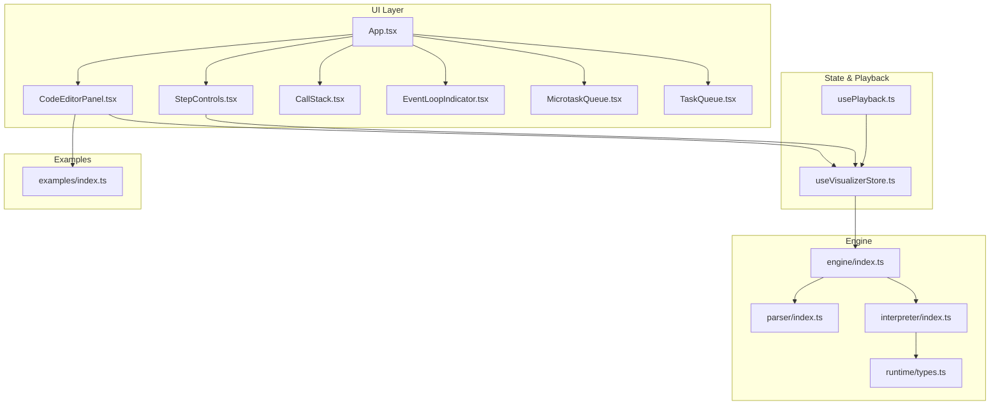
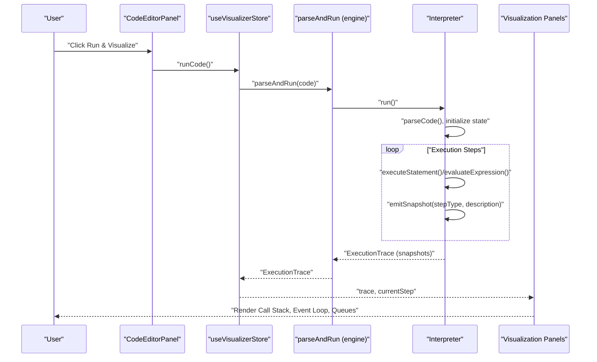
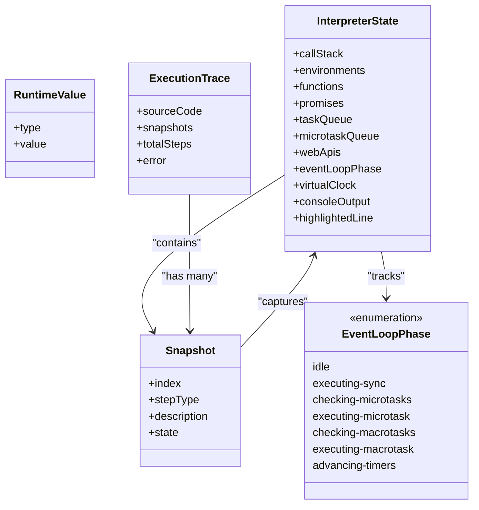
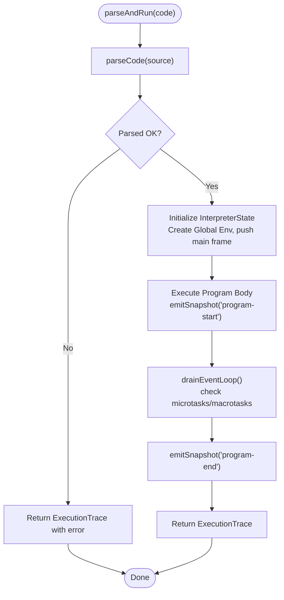
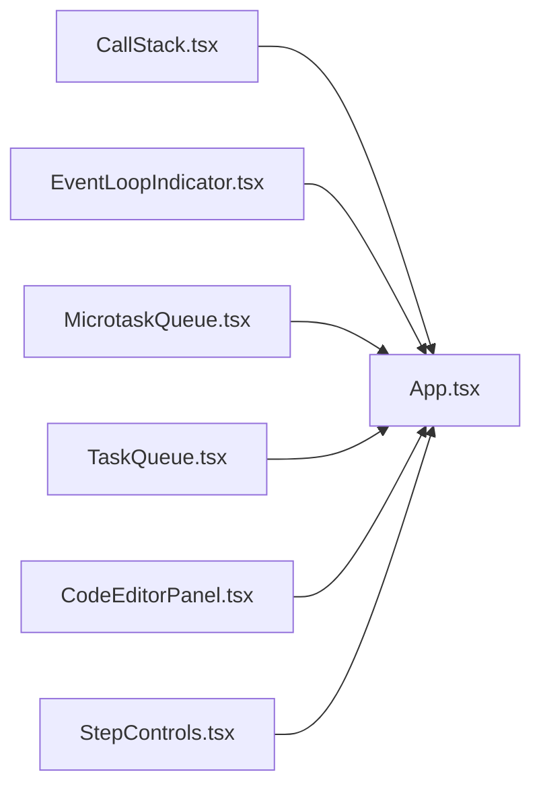
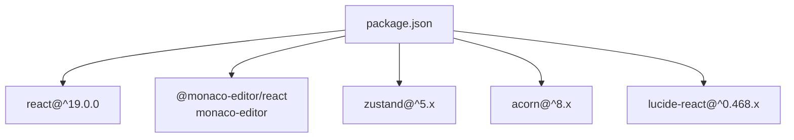

# Project Overview

<cite>
**Referenced Files in This Document**
- [package.json](file://package.json)
- [src/main.tsx](file://src/main.tsx)
- [src/App.tsx](file://src/App.tsx)
- [src/store/useVisualizerStore.ts](file://src/store/useVisualizerStore.ts)
- [src/hooks/usePlayback.ts](file://src/hooks/usePlayback.ts)
- [src/components/editor/CodeEditorPanel.tsx](file://src/components/editor/CodeEditorPanel.tsx)
- [src/components/controls/StepControls.tsx](file://src/components/controls/StepControls.tsx)
- [src/components/visualizer/CallStack.tsx](file://src/components/visualizer/CallStack.tsx)
- [src/components/visualizer/EventLoopIndicator.tsx](file://src/components/visualizer/EventLoopIndicator.tsx)
- [src/components/visualizer/MicrotaskQueue.tsx](file://src/components/visualizer/MicrotaskQueue.tsx)
- [src/components/visualizer/TaskQueue.tsx](file://src/components/visualizer/TaskQueue.tsx)
- [src/engine/index.ts](file://src/engine/index.ts)
- [src/engine/parser/index.ts](file://src/engine/parser/index.ts)
- [src/engine/interpreter/index.ts](file://src/engine/interpreter/index.ts)
- [src/engine/runtime/types.ts](file://src/engine/runtime/types.ts)
- [src/examples/index.ts](file://src/examples/index.ts)
</cite>

## Table of Contents
1. [Introduction](#introduction)
2. [Project Structure](#project-structure)
3. [Core Components](#core-components)
4. [Architecture Overview](#architecture-overview)
5. [Detailed Component Analysis](#detailed-component-analysis)
6. [Dependency Analysis](#dependency-analysis)
7. [Performance Considerations](#performance-considerations)
8. [Troubleshooting Guide](#troubleshooting-guide)
9. [Conclusion](#conclusion)

## Introduction
JS-Visualizer is an interactive JavaScript execution visualizer designed to help learners and practitioners understand how JavaScript executes, particularly focusing on the call stack, event loop, and asynchronous execution patterns. It transforms code into a step-by-step execution trace, enabling users to observe how synchronous statements, function calls, Promises, microtasks, timers, and the event loop interact in real time.

Educational goals:
- Teach JavaScript fundamentals: call stack, scoping, closures, and execution contexts.
- Clarify asynchronous concepts: microtasks vs. macrotasks, Promise resolution, and the event loop phases.
- Provide a safe, visual way to experiment with code and see immediate feedback without side effects.

Target audience:
- Beginners learning JavaScript fundamentals.
- Intermediate developers deepening their understanding of asynchronous execution.
- Educators and learners in interactive tutorials and workshops.

Core value proposition:
- Real-time visualization of execution state.
- Step-by-step control with keyboard shortcuts and playback.
- Interactive examples and a live code editor powered by Monaco Editor.
- Pedagogical clarity via color-coded queues, call stack frames, and event loop phases.

## Project Structure
The project follows a React 19 application structure with a clear separation between UI, state management, the visualization engine, and example content. The engine encapsulates parsing, interpretation, and snapshot generation to power the visualizer.

**Diagram sources**
- [src/App.tsx:125-137](file://src/App.tsx#L125-L137)
- [src/components/editor/CodeEditorPanel.tsx:9-161](file://src/components/editor/CodeEditorPanel.tsx#L9-L161)
- [src/components/controls/StepControls.tsx:13-207](file://src/components/controls/StepControls.tsx#L13-L207)
- [src/components/visualizer/CallStack.tsx:12-78](file://src/components/visualizer/CallStack.tsx#L12-L78)
- [src/components/visualizer/EventLoopIndicator.tsx:30-142](file://src/components/visualizer/EventLoopIndicator.tsx#L30-L142)
- [src/components/visualizer/MicrotaskQueue.tsx:12-40](file://src/components/visualizer/MicrotaskQueue.tsx#L12-L40)
- [src/components/visualizer/TaskQueue.tsx:12-40](file://src/components/visualizer/TaskQueue.tsx#L12-L40)
- [src/store/useVisualizerStore.ts:27-98](file://src/store/useVisualizerStore.ts#L27-L98)
- [src/hooks/usePlayback.ts:4-28](file://src/hooks/usePlayback.ts#L4-L28)
- [src/engine/index.ts:1-16](file://src/engine/index.ts#L1-L16)
- [src/engine/parser/index.ts:5-24](file://src/engine/parser/index.ts#L5-L24)
- [src/engine/interpreter/index.ts:75-135](file://src/engine/interpreter/index.ts#L75-L135)
- [src/engine/runtime/types.ts:183-248](file://src/engine/runtime/types.ts#L183-L248)
- [src/examples/index.ts:8-152](file://src/examples/index.ts#L8-L152)

**Section sources**
- [package.json:12-31](file://package.json#L12-L31)
- [src/App.tsx:125-137](file://src/App.tsx#L125-L137)
- [src/engine/index.ts:1-16](file://src/engine/index.ts#L1-L16)

## Core Components
- Engine and Tracing
  - The engine parses JavaScript using Acorn and simulates execution to produce an ExecutionTrace containing ordered Snapshots. Each Snapshot captures the complete interpreter state at a given step, including the call stack, environments, queues, and event loop phase.
  - Key exports define the public API surface for consumers of the engine.
  - Parser integrates Acorn to convert source code into an ESTree Program, handling parse errors gracefully.
  - The interpreter drives execution, manages environments and function calls, and records snapshots for each significant step.

- State Management and Playback
  - The Zustand store orchestrates code editing, execution, stepping, and playback. It triggers parseAndRun, stores the resulting trace, and exposes actions to step forward/backward, play/pause, jump to steps, and adjust playback speed.
  - Playback hook runs a periodic interval to advance steps automatically when playing, and keyboard shortcuts enable stepping and toggling playback.

- UI Panels and Visualizations
  - CodeEditorPanel integrates Monaco Editor, supports loading examples, highlighting the currently executing line, and disabling edits during execution.
  - StepControls provides step navigation, play/pause, reset, progress visualization, and speed selection.
  - Visualization panels include CallStack, EventLoopIndicator, MicrotaskQueue, and TaskQueue, each rendering their respective subsystems with animated transitions.

- Examples
  - A curated set of examples demonstrates common patterns: setTimeout basics, Promise chains, event loop ordering, mixed async constructs, Promise constructors, closures, nested timers, and call stack growth.

**Section sources**
- [src/engine/index.ts:1-16](file://src/engine/index.ts#L1-L16)
- [src/engine/parser/index.ts:5-24](file://src/engine/parser/index.ts#L5-L24)
- [src/engine/interpreter/index.ts:75-135](file://src/engine/interpreter/index.ts#L75-L135)
- [src/engine/runtime/types.ts:183-248](file://src/engine/runtime/types.ts#L183-L248)
- [src/store/useVisualizerStore.ts:27-98](file://src/store/useVisualizerStore.ts#L27-L98)
- [src/hooks/usePlayback.ts:4-28](file://src/hooks/usePlayback.ts#L4-L28)
- [src/components/editor/CodeEditorPanel.tsx:9-161](file://src/components/editor/CodeEditorPanel.tsx#L9-L161)
- [src/components/controls/StepControls.tsx:13-207](file://src/components/controls/StepControls.tsx#L13-L207)
- [src/components/visualizer/CallStack.tsx:12-78](file://src/components/visualizer/CallStack.tsx#L12-L78)
- [src/components/visualizer/EventLoopIndicator.tsx:30-142](file://src/components/visualizer/EventLoopIndicator.tsx#L30-L142)
- [src/components/visualizer/MicrotaskQueue.tsx:12-40](file://src/components/visualizer/MicrotaskQueue.tsx#L12-L40)
- [src/components/visualizer/TaskQueue.tsx:12-40](file://src/components/visualizer/TaskQueue.tsx#L12-L40)
- [src/examples/index.ts:8-152](file://src/examples/index.ts#L8-L152)

## Architecture Overview
JS-Visualizer separates concerns across UI, state, and a custom interpreter engine. The engine produces snapshots that drive the visualizer panels, while the store coordinates user interactions and playback.

**Diagram sources**
- [src/components/editor/CodeEditorPanel.tsx:100-143](file://src/components/editor/CodeEditorPanel.tsx#L100-L143)
- [src/store/useVisualizerStore.ts:37-50](file://src/store/useVisualizerStore.ts#L37-L50)
- [src/engine/index.ts:1](file://src/engine/index.ts#L1)
- [src/engine/interpreter/index.ts:75-135](file://src/engine/interpreter/index.ts#L75-L135)

## Detailed Component Analysis

### Engine and Runtime Types
The engine defines a complete runtime model for visualization:
- RuntimeValue types cover primitives, objects, arrays, functions, and promises.
- InterpreterState tracks the call stack, environments, functions, promises, queues, Web APIs, event loop phase, virtual clock, console output, and the highlighted line.
- Snapshots capture the interpreter state at each step, enabling precise visualization and replay.
- StepType enumerates meaningful events like variable declaration, function call, promise creation/resolution, timer registration/firing, and event loop phases.

**Diagram sources**
- [src/engine/runtime/types.ts:3-68](file://src/engine/runtime/types.ts#L3-L68)
- [src/engine/runtime/types.ts:183-195](file://src/engine/runtime/types.ts#L183-L195)
- [src/engine/runtime/types.ts:226-231](file://src/engine/runtime/types.ts#L226-L231)
- [src/engine/runtime/types.ts:235-240](file://src/engine/runtime/types.ts#L235-L240)
- [src/engine/runtime/types.ts:164-171](file://src/engine/runtime/types.ts#L164-L171)

**Section sources**
- [src/engine/runtime/types.ts:3-68](file://src/engine/runtime/types.ts#L3-L68)
- [src/engine/runtime/types.ts:183-195](file://src/engine/runtime/types.ts#L183-L195)
- [src/engine/runtime/types.ts:226-231](file://src/engine/runtime/types.ts#L226-L231)
- [src/engine/runtime/types.ts:235-240](file://src/engine/runtime/types.ts#L235-L240)
- [src/engine/runtime/types.ts:164-171](file://src/engine/runtime/types.ts#L164-L171)

### Parser and Interpreter Integration
- The parser wraps Acorn to produce an ESTree Program or a structured parse error.
- The interpreter initializes the global environment, hoists declarations, executes statements, and emits snapshots for each significant action.
- The interpreter handles built-ins like console, setTimeout/setInterval, and Promise methods, and simulates await semantics by suspending/resuming frames.

**Diagram sources**
- [src/engine/parser/index.ts:5-24](file://src/engine/parser/index.ts#L5-L24)
- [src/engine/interpreter/index.ts:75-135](file://src/engine/interpreter/index.ts#L75-L135)

**Section sources**
- [src/engine/parser/index.ts:5-24](file://src/engine/parser/index.ts#L5-L24)
- [src/engine/interpreter/index.ts:75-135](file://src/engine/interpreter/index.ts#L75-L135)

### Visualization Panels
- CallStack renders stack frames with animated transitions and highlights the active frame.
- EventLoopIndicator displays the current phase with a rotating indicator and phase badges.
- MicrotaskQueue and TaskQueue show queued callbacks with animated additions/removals.
- CodeEditorPanel integrates Monaco Editor, applies a custom theme, highlights the executing line, and disables editing during execution.
- StepControls provides keyboard shortcuts and playback controls.

**Diagram sources**
- [src/components/visualizer/CallStack.tsx:12-78](file://src/components/visualizer/CallStack.tsx#L12-L78)
- [src/components/visualizer/EventLoopIndicator.tsx:30-142](file://src/components/visualizer/EventLoopIndicator.tsx#L30-L142)
- [src/components/visualizer/MicrotaskQueue.tsx:12-40](file://src/components/visualizer/MicrotaskQueue.tsx#L12-L40)
- [src/components/visualizer/TaskQueue.tsx:12-40](file://src/components/visualizer/TaskQueue.tsx#L12-L40)
- [src/components/editor/CodeEditorPanel.tsx:9-161](file://src/components/editor/CodeEditorPanel.tsx#L9-L161)
- [src/components/controls/StepControls.tsx:13-207](file://src/components/controls/StepControls.tsx#L13-L207)
- [src/App.tsx:125-137](file://src/App.tsx#L125-L137)

**Section sources**
- [src/components/visualizer/CallStack.tsx:12-78](file://src/components/visualizer/CallStack.tsx#L12-L78)
- [src/components/visualizer/EventLoopIndicator.tsx:30-142](file://src/components/visualizer/EventLoopIndicator.tsx#L30-L142)
- [src/components/visualizer/MicrotaskQueue.tsx:12-40](file://src/components/visualizer/MicrotaskQueue.tsx#L12-L40)
- [src/components/visualizer/TaskQueue.tsx:12-40](file://src/components/visualizer/TaskQueue.tsx#L12-L40)
- [src/components/editor/CodeEditorPanel.tsx:9-161](file://src/components/editor/CodeEditorPanel.tsx#L9-L161)
- [src/components/controls/StepControls.tsx:13-207](file://src/components/controls/StepControls.tsx#L13-L207)

### Conceptual Overview
Unlike traditional debuggers that step through compiled bytecode or source maps, JS-Visualizer simulates JavaScript execution at the language level. It focuses on:
- Call stack growth/unwinding.
- Variable declarations and assignments across scopes.
- Promise lifecycle and microtask scheduling.
- Timer registration and firing.
- Event loop phases and queue processing order.

This approach emphasizes conceptual understanding over low-level mechanics, making it ideal for learners and educators.

[No sources needed since this section doesn't analyze specific source files]

## Dependency Analysis
The application relies on React 19 for UI, Monaco Editor for code editing, Zustand for state, and a custom interpreter engine. External libraries include Acorn for parsing and Lucide icons for controls.

**Diagram sources**
- [package.json:12-31](file://package.json#L12-L31)

**Section sources**
- [package.json:12-31](file://package.json#L12-L31)

## Performance Considerations
- Maximum steps and loop iteration limits prevent infinite loops and excessive computation during simulation.
- Snapshots are emitted per significant step; limiting step count ensures responsiveness.
- Rendering performance benefits from animated presence and minimal re-renders via selectors.
- Playback speed can be adjusted to balance learning pace and perceived performance.

[No sources needed since this section provides general guidance]

## Troubleshooting Guide
Common scenarios and remedies:
- Parse errors: The parser returns a structured error with line/column. The store captures and displays it in the editor panel.
- Runtime errors: The interpreter throws and captures errors into snapshots, surfaced to the UI.
- Execution halts unexpectedly: Verify the maximum step limit and loop guards are not triggering prematurely.
- Editor not editable: Editing is disabled during execution; use Reset & Edit to resume editing after stopping playback.

**Section sources**
- [src/engine/parser/index.ts:14-24](file://src/engine/parser/index.ts#L14-L24)
- [src/engine/interpreter/index.ts:120-127](file://src/engine/interpreter/index.ts#L120-L127)
- [src/components/editor/CodeEditorPanel.tsx:147-158](file://src/components/editor/CodeEditorPanel.tsx#L147-L158)

## Conclusion
JS-Visualizer offers a unique blend of pedagogy and interactivity, enabling users to visualize JavaScript execution in a controlled, stepwise manner. By combining a custom interpreter, a reactive UI, and curated examples, it bridges the gap between conceptual understanding and practical insight into asynchronous execution and the event loop.

[No sources needed since this section summarizes without analyzing specific files]