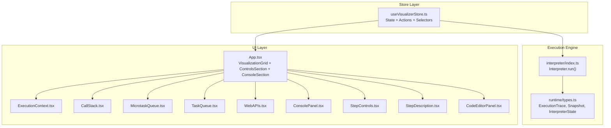
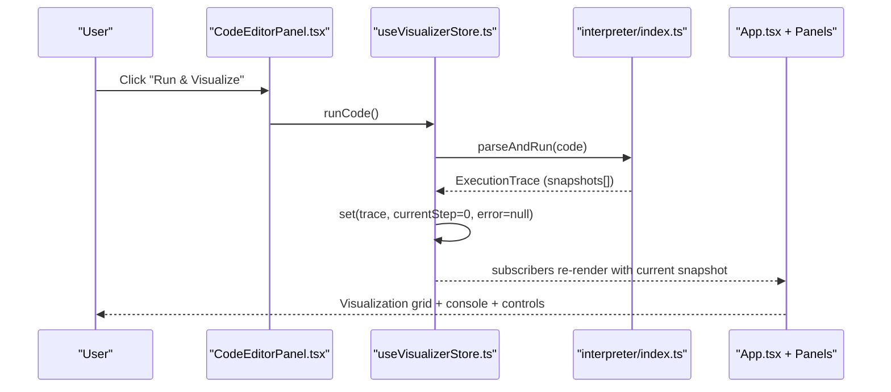
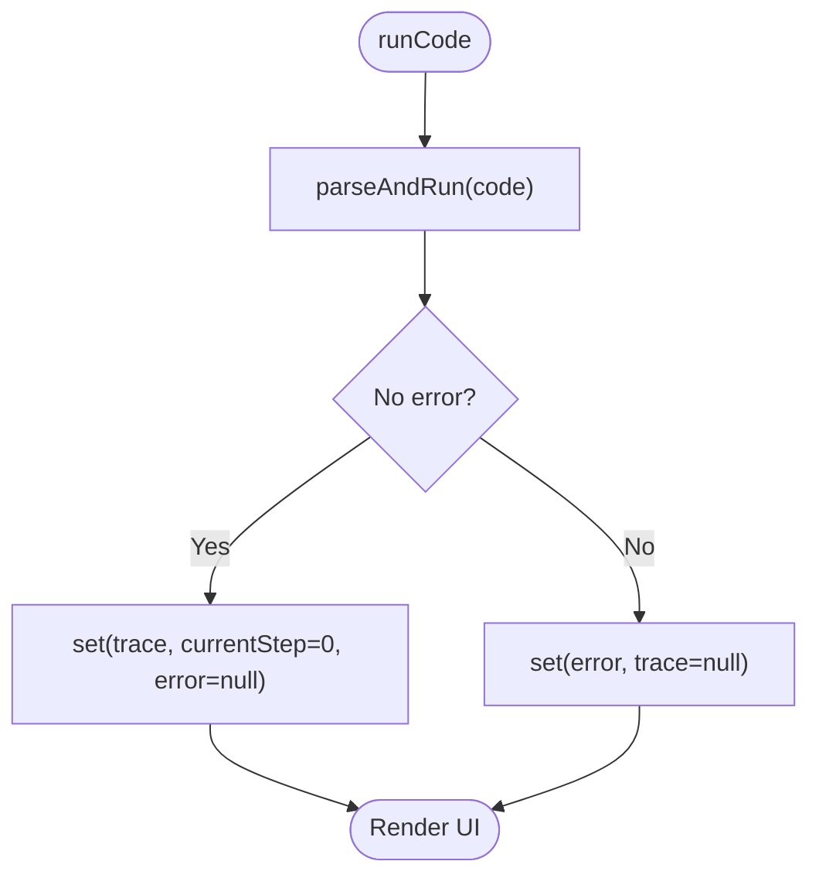
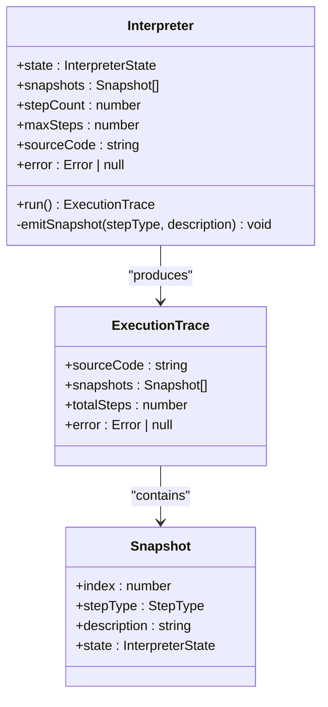
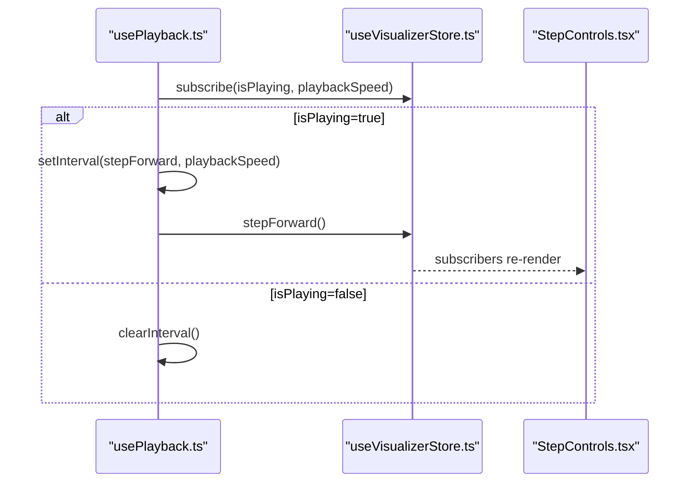
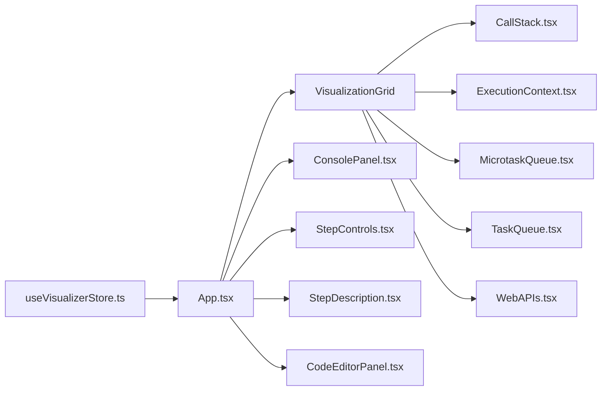
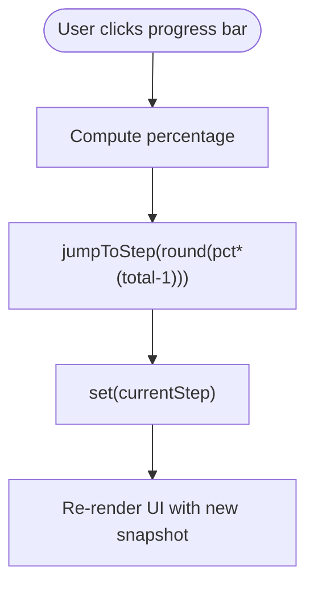
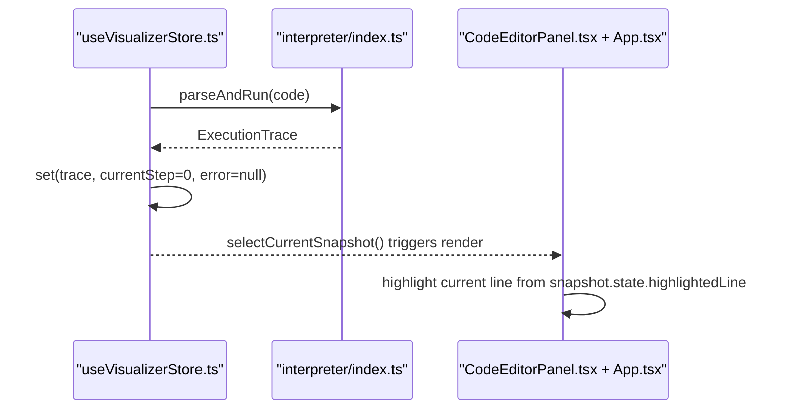
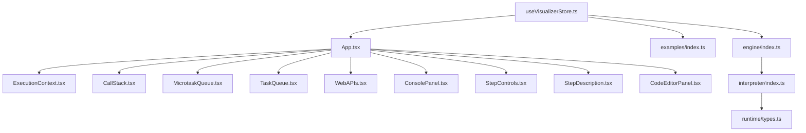

# State Management

<cite>
**Referenced Files in This Document**
- [useVisualizerStore.ts](file://src/store/useVisualizerStore.ts)
- [usePlayback.ts](file://src/hooks/usePlayback.ts)
- [index.ts](file://src/engine/index.ts)
- [types.ts](file://src/engine/runtime/types.ts)
- [interpreter/index.ts](file://src/engine/interpreter/index.ts)
- [App.tsx](file://src/App.tsx)
- [ExecutionContext.tsx](file://src/components/visualizer/ExecutionContext.tsx)
- [CallStack.tsx](file://src/components/visualizer/CallStack.tsx)
- [TaskQueue.tsx](file://src/components/visualizer/TaskQueue.tsx)
- [MicrotaskQueue.tsx](file://src/components/visualizer/MicrotaskQueue.tsx)
- [WebAPIs.tsx](file://src/components/visualizer/WebAPIs.tsx)
- [ConsolePanel.tsx](file://src/components/console/ConsolePanel.tsx)
- [StepControls.tsx](file://src/components/controls/StepControls.tsx)
- [StepDescription.tsx](file://src/components/controls/StepDescription.tsx)
- [CodeEditorPanel.tsx](file://src/components/editor/CodeEditorPanel.tsx)
- [examples/index.ts](file://src/examples/index.ts)
</cite>

## Table of Contents
1. [Introduction](#introduction)
2. [Project Structure](#project-structure)
3. [Core Components](#core-components)
4. [Architecture Overview](#architecture-overview)
5. [Detailed Component Analysis](#detailed-component-analysis)
6. [Dependency Analysis](#dependency-analysis)
7. [Performance Considerations](#performance-considerations)
8. [Troubleshooting Guide](#troubleshooting-guide)
9. [Conclusion](#conclusion)
10. [Appendices](#appendices)

## Introduction
This document explains the Zustand-based state management system used by the JavaScript Visualizer. It covers the store architecture, action creators, selectors, and how the store integrates with the execution engine to power step-by-step playback and visualization. It also documents the snapshot-based execution tracing approach, UI subscriptions, performance best practices, and debugging strategies.

## Project Structure
The state management is centered around a single Zustand store that orchestrates code execution, playback control, and UI state. The execution engine produces a full trace of snapshots that the UI consumes to render the runtime state at each step.

**Diagram sources**
- [useVisualizerStore.ts:1-109](file://src/store/useVisualizerStore.ts#L1-L109)
- [interpreter/index.ts:1-1365](file://src/engine/interpreter/index.ts#L1-L1365)
- [types.ts:1-249](file://src/engine/runtime/types.ts#L1-L249)
- [App.tsx:1-138](file://src/App.tsx#L1-L138)

**Section sources**
- [useVisualizerStore.ts:1-109](file://src/store/useVisualizerStore.ts#L1-L109)
- [interpreter/index.ts:1-1365](file://src/engine/interpreter/index.ts#L1-L1365)
- [types.ts:1-249](file://src/engine/runtime/types.ts#L1-L249)
- [App.tsx:1-138](file://src/App.tsx#L1-L138)

## Core Components
- Store: Centralized state slice for code, execution trace, current step, playback state, playback speed, and errors. Includes actions to run code, step forward/backward, jump to step, play/pause, reset, adjust speed, and load examples. Provides selectors for current snapshot, current step, and total steps.
- Execution Engine: Produces an ExecutionTrace containing snapshots at each step of execution. Each Snapshot captures a full InterpreterState snapshot plus metadata (index, stepType, description).
- UI: Components subscribe to the store via selectors and render the visualization grid, console, step controls, and editor panel.

Key responsibilities:
- Store: Manage lifecycle of execution traces, playback state, and user-driven actions.
- Engine: Build accurate runtime state and emit snapshots for each significant step.
- UI: Render the current snapshot and react to playback events.

**Section sources**
- [useVisualizerStore.ts:5-98](file://src/store/useVisualizerStore.ts#L5-L98)
- [types.ts:226-240](file://src/engine/runtime/types.ts#L226-L240)
- [interpreter/index.ts:1361-1365](file://src/engine/interpreter/index.ts#L1361-L1365)

## Architecture Overview
The store acts as the single source of truth. The execution engine is invoked by the store’s run action to produce a trace. Playback hooks and keyboard shortcuts update the current step. UI components subscribe to the store to render the current snapshot and related panels.

**Diagram sources**
- [CodeEditorPanel.tsx:92-144](file://src/components/editor/CodeEditorPanel.tsx#L92-L144)
- [useVisualizerStore.ts:37-50](file://src/store/useVisualizerStore.ts#L37-L50)
- [interpreter/index.ts:1361-1365](file://src/engine/interpreter/index.ts#L1361-L1365)
- [App.tsx:125-137](file://src/App.tsx#L125-L137)

## Detailed Component Analysis

### Store: State Slices and Actions
- State shape:
  - code: string
  - trace: ExecutionTrace | null
  - currentStep: number
  - isPlaying: boolean
  - playbackSpeed: number (ms per step)
  - error: string | null
- Actions:
  - setCode, runCode, stepForward, stepBackward, jumpToStep, play, pause, togglePlay, reset, setSpeed, loadExample
- Selectors:
  - selectCurrentSnapshot(state): Snapshot | null
  - selectCurrentStep(state): number
  - selectTotalSteps(state): number

Behavior highlights:
- runCode parses and executes code, sets trace and resets playback state.
- stepForward/stepBackward navigate snapshots; jumpToStep clamps to trace bounds.
- togglePlay handles end-of-trace behavior by resetting to start when toggled while at the end.
- loadExample replaces code and clears trace/playback state.

**Diagram sources**
- [useVisualizerStore.ts:37-50](file://src/store/useVisualizerStore.ts#L37-L50)
- [interpreter/index.ts:1361-1365](file://src/engine/interpreter/index.ts#L1361-L1365)

**Section sources**
- [useVisualizerStore.ts:5-98](file://src/store/useVisualizerStore.ts#L5-L98)
- [useVisualizerStore.ts:100-109](file://src/store/useVisualizerStore.ts#L100-L109)

### Execution Engine: Tracing and Snapshots
- The Interpreter constructs an ExecutionTrace by emitting snapshots at key moments (variable declaration/assignment, function call/return, promise resolution, timer fires, fetch completion, etc.).
- Each Snapshot captures the full InterpreterState at that moment, enabling deterministic playback and accurate UI rendering.
- The public parseAndRun function creates an Interpreter and returns the trace.

**Diagram sources**
- [interpreter/index.ts:40-135](file://src/engine/interpreter/index.ts#L40-L135)
- [types.ts:235-240](file://src/engine/runtime/types.ts#L235-L240)
- [types.ts:226-231](file://src/engine/runtime/types.ts#L226-L231)

**Section sources**
- [interpreter/index.ts:139-150](file://src/engine/interpreter/index.ts#L139-L150)
- [interpreter/index.ts:1361-1365](file://src/engine/interpreter/index.ts#L1361-L1365)
- [types.ts:183-195](file://src/engine/runtime/types.ts#L183-L195)

### Playback Integration: Hooks and Keyboard Shortcuts
- usePlayback: Starts/stops an interval based on isPlaying and playbackSpeed, stepping forward each tick.
- useKeyboardShortcuts: Captures global keyboard events (arrow keys, space, R) and dispatches store actions; ignores editor input contexts.

**Diagram sources**
- [usePlayback.ts:4-28](file://src/hooks/usePlayback.ts#L4-L28)
- [useVisualizerStore.ts:52-67](file://src/store/useVisualizerStore.ts#L52-L67)
- [StepControls.tsx:13-24](file://src/components/controls/StepControls.tsx#L13-L24)

**Section sources**
- [usePlayback.ts:4-79](file://src/hooks/usePlayback.ts#L4-L79)
- [StepControls.tsx:13-24](file://src/components/controls/StepControls.tsx#L13-L24)

### UI Subscriptions and Rendering
- App.tsx composes the visualization grid, controls, and console, subscribing to the current snapshot and trace.
- Panels subscribe to subsets of the snapshot’s InterpreterState (call stack, environments, queues, web APIs, console output).
- StepControls renders step counter, progress bar, and speed controls; StepDescription renders step metadata.

**Diagram sources**
- [App.tsx:17-123](file://src/App.tsx#L17-L123)
- [CallStack.tsx:12-79](file://src/components/visualizer/CallStack.tsx#L12-L79)
- [ExecutionContext.tsx:33-127](file://src/components/visualizer/ExecutionContext.tsx#L33-L127)
- [MicrotaskQueue.tsx:12-41](file://src/components/visualizer/MicrotaskQueue.tsx#L12-L41)
- [TaskQueue.tsx:12-41](file://src/components/visualizer/TaskQueue.tsx#L12-L41)
- [WebAPIs.tsx:13-154](file://src/components/visualizer/WebAPIs.tsx#L13-L154)
- [ConsolePanel.tsx:17-123](file://src/components/console/ConsolePanel.tsx#L17-L123)
- [StepControls.tsx:13-165](file://src/components/controls/StepControls.tsx#L13-L165)
- [StepDescription.tsx:37-87](file://src/components/controls/StepDescription.tsx#L37-L87)
- [CodeEditorPanel.tsx:9-162](file://src/components/editor/CodeEditorPanel.tsx#L9-L162)

**Section sources**
- [App.tsx:17-123](file://src/App.tsx#L17-L123)

### Snapshot-Based Playback Navigation
- jumpToStep clamps the requested step to [0, totalSteps-1].
- togglePlay resets to step 0 when reaching the end; otherwise flips isPlaying.
- The progress bar in StepControls triggers jumpToStep via getState() to avoid unnecessary re-renders.

**Diagram sources**
- [StepControls.tsx:105-122](file://src/components/controls/StepControls.tsx#L105-L122)
- [useVisualizerStore.ts:69-73](file://src/store/useVisualizerStore.ts#L69-L73)

**Section sources**
- [useVisualizerStore.ts:69-86](file://src/store/useVisualizerStore.ts#L69-L86)
- [StepControls.tsx:105-122](file://src/components/controls/StepControls.tsx#L105-L122)

### Integration Between Store and Engine
- The store invokes parseAndRun(code) to obtain an ExecutionTrace.
- The store sets trace, currentStep, and error; UI subscribes to snapshot and trace to render the visualization.
- The editor panel disables editing during execution and highlights the current line via snapshot.state.highlightedLine.

**Diagram sources**
- [useVisualizerStore.ts:37-50](file://src/store/useVisualizerStore.ts#L37-L50)
- [interpreter/index.ts:1361-1365](file://src/engine/interpreter/index.ts#L1361-L1365)
- [CodeEditorPanel.tsx:26-50](file://src/components/editor/CodeEditorPanel.tsx#L26-L50)
- [App.tsx:17-106](file://src/App.tsx#L17-L106)

**Section sources**
- [CodeEditorPanel.tsx:26-50](file://src/components/editor/CodeEditorPanel.tsx#L26-L50)
- [App.tsx:17-106](file://src/App.tsx#L17-L106)

## Dependency Analysis
- Store depends on:
  - Engine types (ExecutionTrace, Snapshot) for type safety.
  - Examples for preloaded code samples.
- UI depends on:
  - Store selectors for snapshot and step metadata.
  - Engine types for typing InterpreterState and related structures.
- Engine depends on:
  - Parser to convert code to AST.
  - Runtime types for state modeling.

**Diagram sources**
- [useVisualizerStore.ts:1-4](file://src/store/useVisualizerStore.ts#L1-L4)
- [engine/index.ts:1-17](file://src/engine/index.ts#L1-L17)
- [interpreter/index.ts:1-28](file://src/engine/interpreter/index.ts#L1-L28)
- [runtime/types.ts:1-249](file://src/engine/runtime/types.ts#L1-L249)

**Section sources**
- [useVisualizerStore.ts:1-4](file://src/store/useVisualizerStore.ts#L1-L4)
- [engine/index.ts:1-17](file://src/engine/index.ts#L1-L17)

## Performance Considerations
- Primitive selectors: Using primitive selectors (selectCurrentStep, selectTotalSteps) avoids object churn and reduces unnecessary re-renders.
- Structured cloning: Snapshots clone the interpreter state; consider limiting snapshot frequency or snapshot size if memory pressure arises.
- Playback interval: Keep playbackSpeed reasonable; very small intervals can cause UI jank.
- Rendering optimization: Panels use animation libraries and conditional rendering; ensure lists are keyed properly to minimize layout thrash.
- Max steps: The interpreter enforces a maximum step count to prevent infinite loops; tune this threshold based on typical examples.

[No sources needed since this section provides general guidance]

## Troubleshooting Guide
Common issues and remedies:
- No visualization after running: Ensure trace exists and currentStep is within bounds; check error field.
- Playback does not advance: Verify isPlaying and playbackSpeed; confirm usePlayback hook is mounted.
- Keyboard shortcuts not working: Confirm focus is outside editor inputs; useKeyboardShortcuts ignores editor contexts.
- Editor remains read-only: It is intentionally disabled during execution; click “Reset & Edit” to edit again.
- Console not updating: Ensure snapshot.state.consoleOutput is populated; panels render based on snapshot.

**Section sources**
- [useVisualizerStore.ts:37-50](file://src/store/useVisualizerStore.ts#L37-L50)
- [usePlayback.ts:30-79](file://src/hooks/usePlayback.ts#L30-L79)
- [CodeEditorPanel.tsx:52-162](file://src/components/editor/CodeEditorPanel.tsx#L52-L162)

## Conclusion
The Zustand store provides a clean, centralized model for code execution, playback control, and UI state. The snapshot-based execution trace enables precise, deterministic playback and rich visualizations. By leveraging primitive selectors, hooks for playback, and typed engine structures, the system balances simplicity and performance while remaining extensible for future features.

[No sources needed since this section summarizes without analyzing specific files]

## Appendices

### Best Practices for State Organization
- Keep state flat and normalized where possible; the current store is already minimal and cohesive.
- Use primitive selectors for frequently accessed scalars to avoid subscription churn.
- Group related actions (playback) close together for readability.
- Prefer immutable updates via set; avoid mutating shared objects.

[No sources needed since this section provides general guidance]

### Extending the State Architecture
- Add new slices for new UI areas (e.g., theme preferences, debug flags) as separate stores or by expanding the existing slice.
- Introduce derived selectors for computed UI metadata (e.g., step description categories).
- Add throttling or debouncing for heavy UI updates if needed.

[No sources needed since this section provides general guidance]