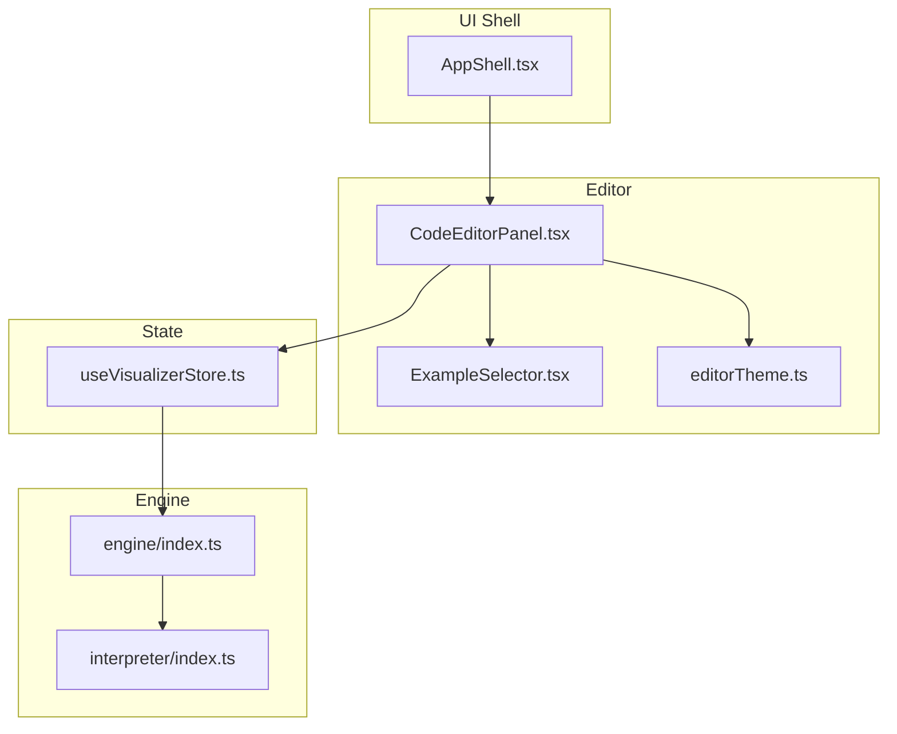
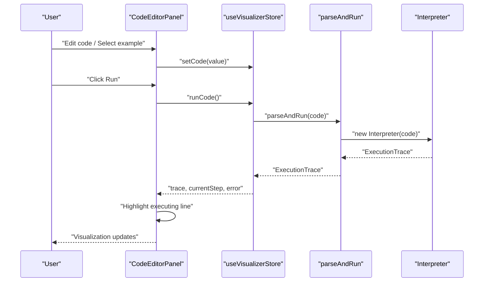
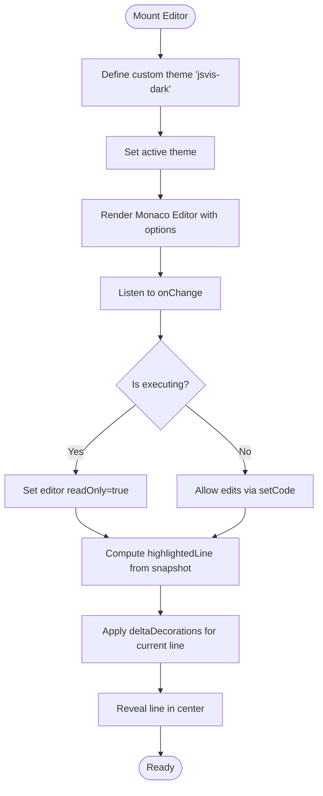
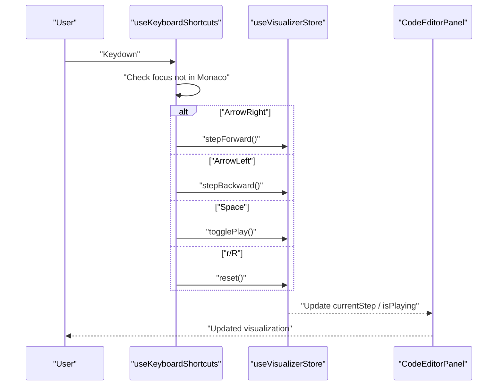
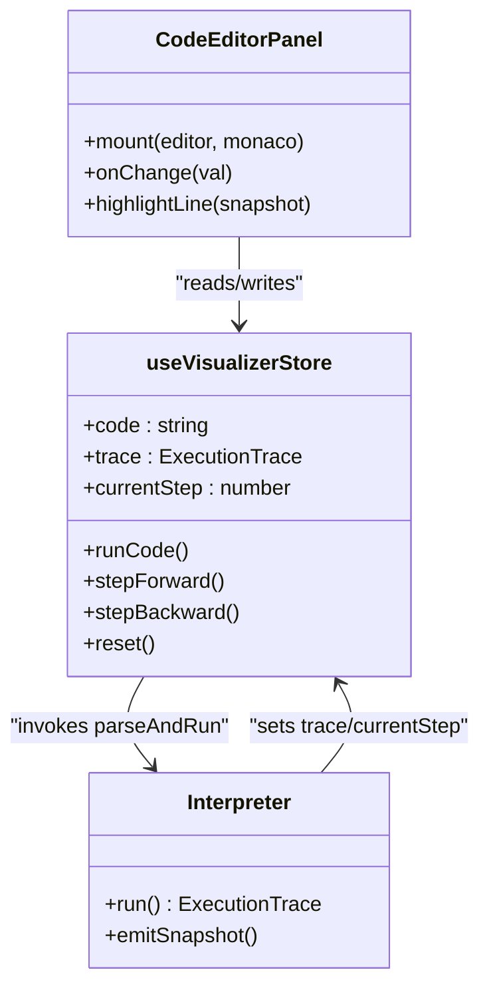
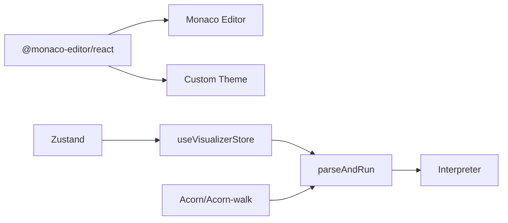

# Code Editor Interface

<cite>
**Referenced Files in This Document**
- [CodeEditorPanel.tsx](file://src/components/editor/CodeEditorPanel.tsx)
- [editorTheme.ts](file://src/components/editor/editorTheme.ts)
- [ExampleSelector.tsx](file://src/components/editor/ExampleSelector.tsx)
- [AppShell.tsx](file://src/components/layout/AppShell.tsx)
- [App.tsx](file://src/App.tsx)
- [usePlayback.ts](file://src/hooks/usePlayback.ts)
- [useVisualizerStore.ts](file://src/store/useVisualizerStore.ts)
- [index.css](file://src/index.css)
- [tokens.ts](file://src/theme/tokens.ts)
- [examples/index.ts](file://src/examples/index.ts)
- [engine/index.ts](file://src/engine/index.ts)
- [interpreter/index.ts](file://src/engine/interpreter/index.ts)
- [package.json](file://package.json)
</cite>

## Table of Contents
1. [Introduction](#introduction)
2. [Project Structure](#project-structure)
3. [Core Components](#core-components)
4. [Architecture Overview](#architecture-overview)
5. [Detailed Component Analysis](#detailed-component-analysis)
6. [Dependency Analysis](#dependency-analysis)
7. [Performance Considerations](#performance-considerations)
8. [Troubleshooting Guide](#troubleshooting-guide)
9. [Conclusion](#conclusion)
10. [Appendices](#appendices)

## Introduction
This document explains the code editor interface in JS-Visualizer, focusing on the Monaco Editor integration, syntax highlighting, line numbering, bracket matching, and the custom dark theme. It also covers editor configuration options, keyboard shortcuts for stepping through execution, and how the editor integrates with the visualization workflow. Practical examples demonstrate editing JavaScript code, navigating syntax errors, and leveraging built-in editor features effectively.

## Project Structure
The editor is implemented as a dedicated panel integrated into the application shell. It uses Monaco Editor via @monaco-editor/react, defines a custom theme, and connects to the global visualizer store for code editing, running, and stepping.

**Diagram sources**
- [AppShell.tsx:11-121](file://src/components/layout/AppShell.tsx#L11-L121)
- [CodeEditorPanel.tsx:9-162](file://src/components/editor/CodeEditorPanel.tsx#L9-L162)
- [editorTheme.ts:3-31](file://src/components/editor/editorTheme.ts#L3-L31)
- [ExampleSelector.tsx:10-60](file://src/components/editor/ExampleSelector.tsx#L10-L60)
- [useVisualizerStore.ts:27-98](file://src/store/useVisualizerStore.ts#L27-L98)
- [engine/index.ts:1-17](file://src/engine/index.ts#L1-L17)
- [interpreter/index.ts:1361-1365](file://src/engine/interpreter/index.ts#L1361-L1365)

**Section sources**
- [AppShell.tsx:11-121](file://src/components/layout/AppShell.tsx#L11-L121)
- [CodeEditorPanel.tsx:9-162](file://src/components/editor/CodeEditorPanel.tsx#L9-L162)
- [editorTheme.ts:3-31](file://src/components/editor/editorTheme.ts#L3-L31)
- [ExampleSelector.tsx:10-60](file://src/components/editor/ExampleSelector.tsx#L10-L60)
- [useVisualizerStore.ts:27-98](file://src/store/useVisualizerStore.ts#L27-L98)
- [engine/index.ts:1-17](file://src/engine/index.ts#L1-L17)
- [interpreter/index.ts:1361-1365](file://src/engine/interpreter/index.ts#L1361-L1365)

## Core Components
- CodeEditorPanel: Renders the Monaco Editor, applies the custom theme, manages editor options, and highlights the current executing line during visualization.
- editorTheme: Defines a custom dark theme for Monaco with precise token colors and editor UI colors.
- ExampleSelector: Provides a dropdown to load pre-defined JavaScript examples into the editor.
- AppShell: Hosts the editor panel alongside visualization panels and controls.
- useVisualizerStore: Central state for code, execution trace, current step, and actions like run, step forward/backward, and reset.
- usePlayback: Handles keyboard shortcuts for stepping and playback, while avoiding conflicts with editor input.

**Section sources**
- [CodeEditorPanel.tsx:9-162](file://src/components/editor/CodeEditorPanel.tsx#L9-L162)
- [editorTheme.ts:3-31](file://src/components/editor/editorTheme.ts#L3-L31)
- [ExampleSelector.tsx:10-60](file://src/components/editor/ExampleSelector.tsx#L10-L60)
- [AppShell.tsx:11-121](file://src/components/layout/AppShell.tsx#L11-L121)
- [useVisualizerStore.ts:27-98](file://src/store/useVisualizerStore.ts#L27-L98)
- [usePlayback.ts:30-78](file://src/hooks/usePlayback.ts#L30-L78)

## Architecture Overview
The editor participates in a dual-mode lifecycle:
- Editing mode: Users edit code, select examples, and run to generate an execution trace.
- Visualization mode: The interpreter produces snapshots; the editor highlights the current executing line and becomes read-only.

**Diagram sources**
- [CodeEditorPanel.tsx:63-67](file://src/components/editor/CodeEditorPanel.tsx#L63-L67)
- [useVisualizerStore.ts:37-50](file://src/store/useVisualizerStore.ts#L37-L50)
- [engine/index.ts:1-17](file://src/engine/index.ts#L1-L17)
- [interpreter/index.ts:1361-1365](file://src/engine/interpreter/index.ts#L1361-L1365)

## Detailed Component Analysis

### CodeEditorPanel
Responsibilities:
- Mounts Monaco Editor with a custom theme and options.
- Applies a line highlight decoration for the current executing line.
- Disables editing during execution to keep the trace deterministic.
- Integrates with the example selector and error display.

Key behaviors:
- Theme registration and activation occur on mount.
- Line highlighting uses deltaDecorations with a dedicated CSS class.
- Editor options include font family/size, line numbers, glyph margin, scrollbar sizing, and padding.
- Read-only mode is toggled based on whether a trace is active.

**Diagram sources**
- [CodeEditorPanel.tsx:20-50](file://src/components/editor/CodeEditorPanel.tsx#L20-L50)
- [CodeEditorPanel.tsx:59-89](file://src/components/editor/CodeEditorPanel.tsx#L59-L89)
- [index.css:42-53](file://src/index.css#L42-L53)

**Section sources**
- [CodeEditorPanel.tsx:9-162](file://src/components/editor/CodeEditorPanel.tsx#L9-L162)
- [index.css:42-53](file://src/index.css#L42-L53)

### Custom Dark Theme (editorTheme)
The theme extends the Monaco “vs-dark” base and customizes:
- Token colors for comments, keywords, strings, numbers, types, identifiers, delimiters, variables, predefined identifiers, and functions.
- Editor UI colors: background, foreground, line highlight, selection, inactive selection, cursor, line numbers, gutter, and widget background.

Integration:
- Defined as a standalone theme object and registered under the name “jsvis-dark” during editor mount.

**Section sources**
- [editorTheme.ts:3-31](file://src/components/editor/editorTheme.ts#L3-L31)
- [CodeEditorPanel.tsx:20-24](file://src/components/editor/CodeEditorPanel.tsx#L20-L24)

### Editor Configuration Options
Configured via Monaco’s options object:
- Language: JavaScript
- Minimap: Disabled
- Font size and family: JetBrains Mono/Fira Code stack
- Line numbers: Enabled
- Scroll behavior: Prevents scrolling past last line
- Automatic layout: Enabled for responsive resizing
- Padding: Top padding for visual comfort
- Read-only: Toggled based on execution state
- Line highlight: None during execution, line highlight otherwise
- Glyph margin: Enabled for visual indicators
- Folding: Disabled
- Line decorations width: Narrow margin for line highlight
- Overview ruler border: Hidden
- Scrollbar: Thin vertical and horizontal scrollbars

Responsive behavior:
- The parent layout uses flexbox and CSS Grid to adapt to viewport size.
- The editor container fills available height and width within the shell.

**Section sources**
- [CodeEditorPanel.tsx:59-89](file://src/components/editor/CodeEditorPanel.tsx#L59-L89)
- [AppShell.tsx:72-118](file://src/components/layout/AppShell.tsx#L72-L118)

### ExampleSelector
Provides a dropdown to load predefined examples into the editor. It reads the current code to pre-select the active example and triggers store updates when a selection changes.

**Section sources**
- [ExampleSelector.tsx:10-60](file://src/components/editor/ExampleSelector.tsx#L10-L60)
- [examples/index.ts:8-152](file://src/examples/index.ts#L8-L152)

### Keyboard Shortcuts and Playback
Shortcuts are captured globally when a trace exists and the focus is not inside the Monaco editor:
- Arrow keys: Step forward/backward
- Space: Toggle play/pause
- r/R: Reset (without Ctrl/Cmd modifier)

These actions are handled by the playback hook and update the store’s current step and playback state.

**Diagram sources**
- [usePlayback.ts:37-78](file://src/hooks/usePlayback.ts#L37-L78)
- [useVisualizerStore.ts:52-88](file://src/store/useVisualizerStore.ts#L52-L88)
- [CodeEditorPanel.tsx:52](file://src/components/editor/CodeEditorPanel.tsx#L52)

**Section sources**
- [usePlayback.ts:30-78](file://src/hooks/usePlayback.ts#L30-L78)
- [useVisualizerStore.ts:52-88](file://src/store/useVisualizerStore.ts#L52-L88)

### Integration with Visualization Workflow
- Running code triggers the interpreter to produce an ExecutionTrace with snapshots.
- The store holds the trace and current step; the editor highlights the current executing line using Monaco decorations.
- During execution, the editor is read-only to prevent concurrent edits that could invalidate the trace.

**Diagram sources**
- [CodeEditorPanel.tsx:9-162](file://src/components/editor/CodeEditorPanel.tsx#L9-L162)
- [useVisualizerStore.ts:27-98](file://src/store/useVisualizerStore.ts#L27-L98)
- [interpreter/index.ts:75-135](file://src/engine/interpreter/index.ts#L75-L135)

**Section sources**
- [useVisualizerStore.ts:37-50](file://src/store/useVisualizerStore.ts#L37-L50)
- [interpreter/index.ts:75-135](file://src/engine/interpreter/index.ts#L75-L135)
- [CodeEditorPanel.tsx:26-50](file://src/components/editor/CodeEditorPanel.tsx#L26-L50)

## Dependency Analysis
External libraries:
- @monaco-editor/react and monaco-editor provide the editor UI and runtime.
- Zustand manages global state for the visualizer.
- Acorn/Acorn-walk power parsing and AST traversal in the engine.

**Diagram sources**
- [package.json:12-22](file://package.json#L12-L22)
- [engine/index.ts:1-17](file://src/engine/index.ts#L1-L17)
- [interpreter/index.ts:28-28](file://src/engine/interpreter/index.ts#L28-L28)

**Section sources**
- [package.json:12-22](file://package.json#L12-L22)
- [engine/index.ts:1-17](file://src/engine/index.ts#L1-L17)

## Performance Considerations
- Minimap disabled to reduce rendering overhead.
- Automatic layout enabled to avoid manual reflows on resize.
- Read-only mode during execution prevents unnecessary change events and re-renders.
- Delta decorations are applied efficiently and cleared when not needed.

[No sources needed since this section provides general guidance]

## Troubleshooting Guide
Common issues and resolutions:
- Editor appears unresponsive during execution: The editor is intentionally read-only while a trace is active. Click “Reset & Edit” to return to editing mode.
- Syntax errors shown below the editor: The store captures and displays the error message returned by the interpreter. Fix the highlighted issue in the code and run again.
- Line highlighting not visible: Ensure a trace is active and the snapshot contains a highlighted line. The editor reveals the line in the center when a highlight is present.
- Keyboard shortcuts not working: They are ignored when typing in the editor (including Monaco). Press keys outside the editor to step or play.

**Section sources**
- [CodeEditorPanel.tsx:52](file://src/components/editor/CodeEditorPanel.tsx#L52)
- [CodeEditorPanel.tsx:147-158](file://src/components/editor/CodeEditorPanel.tsx#L147-L158)
- [usePlayback.ts:37-47](file://src/hooks/usePlayback.ts#L37-L47)
- [useVisualizerStore.ts:37-50](file://src/store/useVisualizerStore.ts#L37-L50)

## Conclusion
The editor integrates tightly with the visualization pipeline, offering a focused editing experience with a custom dark theme, precise syntax highlighting, and robust execution controls. Its configuration emphasizes readability and responsiveness, while safeguards ensure deterministic behavior during visualization.

[No sources needed since this section summarizes without analyzing specific files]

## Appendices

### Practical Examples and Tips
- Editing JavaScript code:
  - Use the editor’s built-in language features for syntax-aware editing.
  - Switch examples via the ExampleSelector to explore different scenarios.
- Navigating syntax errors:
  - The editor highlights the current executing line; errors are surfaced in the store and displayed below the editor.
  - Fix the reported issue and re-run to continue visualization.
- Using keyboard shortcuts:
  - While a trace is active, use arrow keys to step, space to play/pause, and r/R to reset.
  - Shortcuts are ignored when the Monaco editor has focus to avoid conflicts.

**Section sources**
- [ExampleSelector.tsx:10-60](file://src/components/editor/ExampleSelector.tsx#L10-L60)
- [usePlayback.ts:37-78](file://src/hooks/usePlayback.ts#L37-L78)
- [CodeEditorPanel.tsx:147-158](file://src/components/editor/CodeEditorPanel.tsx#L147-L158)