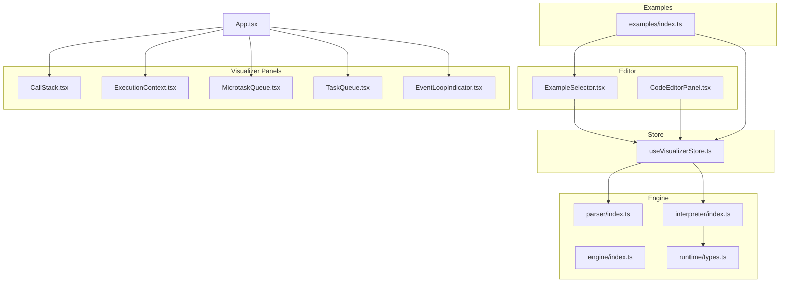
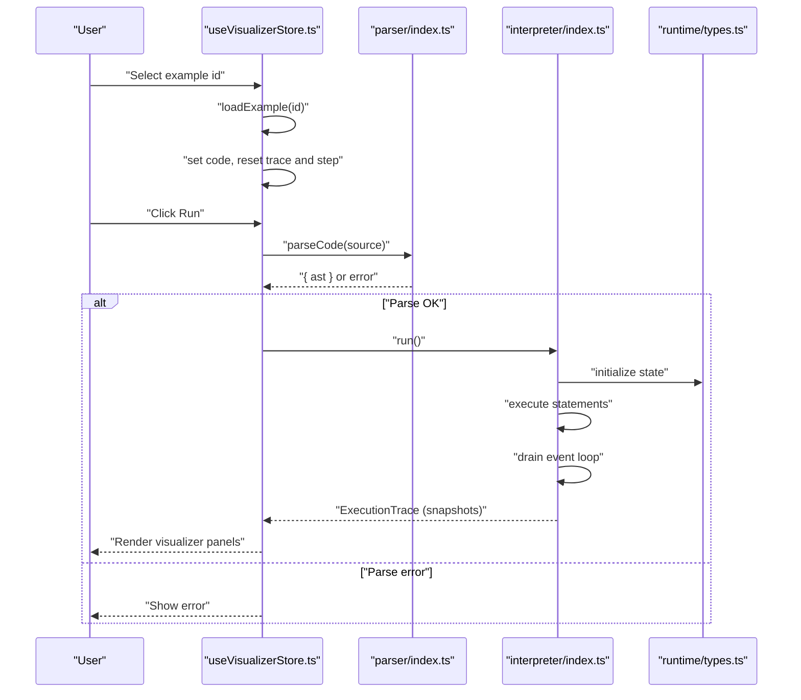
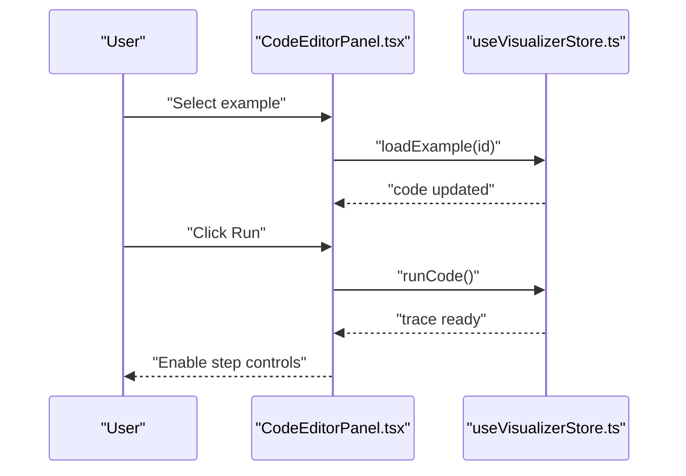
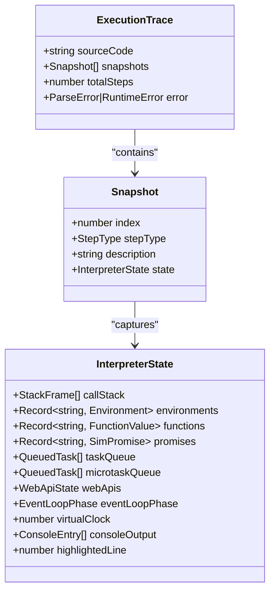
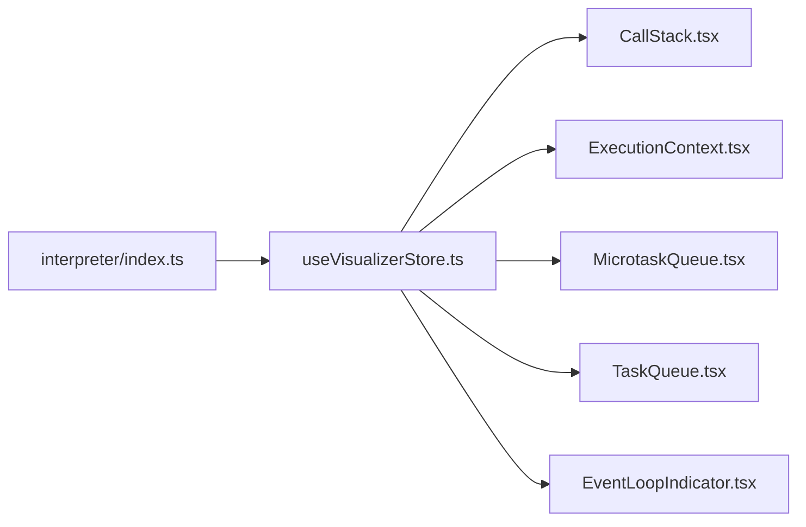
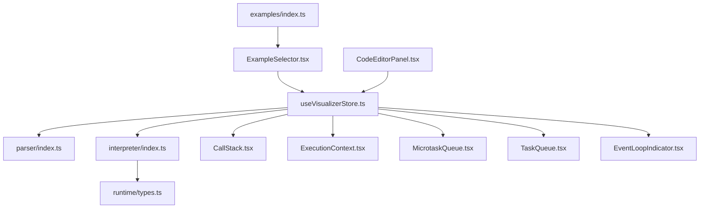

# Example Exploration

<cite>
**Referenced Files in This Document**
- [src/components/editor/ExampleSelector.tsx](file://src/components/editor/ExampleSelector.tsx)
- [src/components/editor/CodeEditorPanel.tsx](file://src/components/editor/CodeEditorPanel.tsx)
- [src/examples/index.ts](file://src/examples/index.ts)
- [src/store/useVisualizerStore.ts](file://src/store/useVisualizerStore.ts)
- [src/App.tsx](file://src/App.tsx)
- [src/engine/index.ts](file://src/engine/index.ts)
- [src/engine/interpreter/index.ts](file://src/engine/interpreter/index.ts)
- [src/engine/runtime/types.ts](file://src/engine/runtime/types.ts)
- [src/engine/parser/index.ts](file://src/engine/parser/index.ts)
- [src/components/visualizer/EventLoopIndicator.tsx](file://src/components/visualizer/EventLoopIndicator.tsx)
- [src/components/visualizer/TaskQueue.tsx](file://src/components/visualizer/TaskQueue.tsx)
- [src/components/visualizer/MicrotaskQueue.tsx](file://src/components/visualizer/MicrotaskQueue.tsx)
- [src/components/visualizer/CallStack.tsx](file://src/components/visualizer/CallStack.tsx)
- [src/components/visualizer/ExecutionContext.tsx](file://src/components/visualizer/ExecutionContext.tsx)
</cite>

## Table of Contents
1. [Introduction](#introduction)
2. [Project Structure](#project-structure)
3. [Core Components](#core-components)
4. [Architecture Overview](#architecture-overview)
5. [Detailed Component Analysis](#detailed-component-analysis)
6. [Dependency Analysis](#dependency-analysis)
7. [Performance Considerations](#performance-considerations)
8. [Troubleshooting Guide](#troubleshooting-guide)
9. [Conclusion](#conclusion)
10. [Appendices](#appendices)

## Introduction
This document explains how to explore and learn from curated JavaScript examples in the system. It covers browsing and selecting examples via the selector interface, understanding how examples are organized, loading them into the editor, modifying them for experimentation, and saving custom variations. It also describes the progressive complexity approach used in example selection and how examples build upon previous concepts. Practical workflows for learners and educators are included to maximize educational value.

## Project Structure
The example system centers around a small set of focused components:
- Example catalog: a typed list of curated examples
- Selector UI: a dropdown to choose and load examples
- Editor panel: Monaco editor with example loading and run/reset controls
- Store: state for code, execution trace, playback, and example loading
- Engine: parsing and execution engine that produces a step-by-step trace
- Visualizer panels: call stack, execution context, task/microtask queues, event loop indicator

**Diagram sources**
- [src/components/editor/ExampleSelector.tsx:1-60](file://src/components/editor/ExampleSelector.tsx#L1-L60)
- [src/components/editor/CodeEditorPanel.tsx:1-162](file://src/components/editor/CodeEditorPanel.tsx#L1-L162)
- [src/examples/index.ts:1-153](file://src/examples/index.ts#L1-L153)
- [src/store/useVisualizerStore.ts:1-109](file://src/store/useVisualizerStore.ts#L1-L109)
- [src/engine/parser/index.ts:1-25](file://src/engine/parser/index.ts#L1-L25)
- [src/engine/interpreter/index.ts:1-1365](file://src/engine/interpreter/index.ts#L1-L1365)
- [src/engine/index.ts:1-17](file://src/engine/index.ts#L1-L17)
- [src/engine/runtime/types.ts:1-249](file://src/engine/runtime/types.ts#L1-L249)
- [src/components/visualizer/CallStack.tsx:1-79](file://src/components/visualizer/CallStack.tsx#L1-L79)
- [src/components/visualizer/ExecutionContext.tsx:1-128](file://src/components/visualizer/ExecutionContext.tsx#L1-L128)
- [src/components/visualizer/MicrotaskQueue.tsx:1-41](file://src/components/visualizer/MicrotaskQueue.tsx#L1-L41)
- [src/components/visualizer/TaskQueue.tsx:1-41](file://src/components/visualizer/TaskQueue.tsx#L1-L41)
- [src/components/visualizer/EventLoopIndicator.tsx:1-143](file://src/components/visualizer/EventLoopIndicator.tsx#L1-L143)
- [src/App.tsx:1-138](file://src/App.tsx#L1-L138)

**Section sources**
- [src/components/editor/ExampleSelector.tsx:1-60](file://src/components/editor/ExampleSelector.tsx#L1-L60)
- [src/components/editor/CodeEditorPanel.tsx:1-162](file://src/components/editor/CodeEditorPanel.tsx#L1-L162)
- [src/examples/index.ts:1-153](file://src/examples/index.ts#L1-L153)
- [src/store/useVisualizerStore.ts:1-109](file://src/store/useVisualizerStore.ts#L1-L109)
- [src/App.tsx:1-138](file://src/App.tsx#L1-L138)

## Core Components
- Example catalog: a typed array of examples with id, title, description, and code. See [examples/index.ts:1-153](file://src/examples/index.ts#L1-L153).
- Example selector: a dropdown UI that maps the current code to the selected example and triggers loading via the store. See [ExampleSelector.tsx:1-60](file://src/components/editor/ExampleSelector.tsx#L1-L60).
- Editor panel: integrates the selector, Monaco editor, and run/reset controls; manages editing lock during execution and highlights the current line. See [CodeEditorPanel.tsx:1-162](file://src/components/editor/CodeEditorPanel.tsx#L1-L162).
- Store: holds code, execution trace, playback state, and exposes actions to run code, step through execution, and load examples. See [useVisualizerStore.ts:1-109](file://src/store/useVisualizerStore.ts#L1-L109).
- Engine: parses source code into an AST and executes it to produce a stepwise trace with snapshots. See [engine/index.ts:1-17](file://src/engine/index.ts#L1-L17), [interpreter/index.ts:1-1365](file://src/engine/interpreter/index.ts#L1-L1365), [runtime/types.ts:1-249](file://src/engine/runtime/types.ts#L1-L249), [parser/index.ts:1-25](file://src/engine/parser/index.ts#L1-L25).
- Visualizer panels: display call stack, execution context, task/microtask queues, and the event loop phase. See [CallStack.tsx:1-79](file://src/components/visualizer/CallStack.tsx#L1-L79), [ExecutionContext.tsx:1-128](file://src/components/visualizer/ExecutionContext.tsx#L1-L128), [TaskQueue.tsx:1-41](file://src/components/visualizer/TaskQueue.tsx#L1-L41), [MicrotaskQueue.tsx:1-41](file://src/components/visualizer/MicrotaskQueue.tsx#L1-L41), [EventLoopIndicator.tsx:1-143](file://src/components/visualizer/EventLoopIndicator.tsx#L1-L143).

How examples are organized:
- The example list is flat and curated for progressive learning. There is no explicit difficulty or concept taxonomy in the example list itself. See [examples/index.ts:8-152](file://src/examples/index.ts#L8-L152).

How to load examples into the editor:
- Select an example from the dropdown; the store loads the matching example code and resets playback state. See [ExampleSelector.tsx:10-58](file://src/components/editor/ExampleSelector.tsx#L10-L58) and [useVisualizerStore.ts:92-97](file://src/store/useVisualizerStore.ts#L92-L97).

How to modify examples for experimentation:
- While not executing, edit the code in the Monaco editor; changes are applied immediately. During execution, editing is disabled to maintain deterministic playback. See [CodeEditorPanel.tsx:52-89](file://src/components/editor/CodeEditorPanel.tsx#L52-L89).

How to save custom variations:
- The store does not persist custom edits. To keep your variation, copy the modified code from the editor and save it locally. See [useVisualizerStore.ts:35-35](file://src/store/useVisualizerStore.ts#L35-L35) and [CodeEditorPanel.tsx:63-67](file://src/components/editor/CodeEditorPanel.tsx#L63-L67).

Progressive complexity approach:
- The examples are ordered to introduce concepts incrementally: basic synchronous execution, setTimeout, Promise basics, event loop ordering, interleaving async constructs, Promise constructor, closures, nested timers, and call stack growth. See [examples/index.ts:8-152](file://src/examples/index.ts#L8-L152).

Educational workflows:
- Learners: pick the next example after understanding the current one; run and step through; observe the visualizer panels; modify small parts to test hypotheses; repeat.
- Educators: present a problem, show the example, run stepwise, discuss each panel; ask learners to predict the next step; then let them experiment.

**Section sources**
- [src/examples/index.ts:1-153](file://src/examples/index.ts#L1-L153)
- [src/components/editor/ExampleSelector.tsx:1-60](file://src/components/editor/ExampleSelector.tsx#L1-L60)
- [src/components/editor/CodeEditorPanel.tsx:1-162](file://src/components/editor/CodeEditorPanel.tsx#L1-L162)
- [src/store/useVisualizerStore.ts:1-109](file://src/store/useVisualizerStore.ts#L1-L109)
- [src/engine/index.ts:1-17](file://src/engine/index.ts#L1-L17)
- [src/engine/interpreter/index.ts:1-1365](file://src/engine/interpreter/index.ts#L1-L1365)
- [src/engine/runtime/types.ts:1-249](file://src/engine/runtime/types.ts#L1-L249)
- [src/engine/parser/index.ts:1-25](file://src/engine/parser/index.ts#L1-L25)
- [src/components/visualizer/CallStack.tsx:1-79](file://src/components/visualizer/CallStack.tsx#L1-L79)
- [src/components/visualizer/ExecutionContext.tsx:1-128](file://src/components/visualizer/ExecutionContext.tsx#L1-L128)
- [src/components/visualizer/TaskQueue.tsx:1-41](file://src/components/visualizer/TaskQueue.tsx#L1-L41)
- [src/components/visualizer/MicrotaskQueue.tsx:1-41](file://src/components/visualizer/MicrotaskQueue.tsx#L1-L41)
- [src/components/visualizer/EventLoopIndicator.tsx:1-143](file://src/components/visualizer/EventLoopIndicator.tsx#L1-L143)

## Architecture Overview
The system follows a unidirectional data flow:
- UI components read and write state via the store.
- The store invokes the engine to parse and execute code, producing a trace.
- The visualizer renders panels based on the current snapshot from the trace.

**Diagram sources**
- [src/store/useVisualizerStore.ts:92-97](file://src/store/useVisualizerStore.ts#L92-L97)
- [src/engine/parser/index.ts:5-24](file://src/engine/parser/index.ts#L5-L24)
- [src/engine/interpreter/index.ts:75-135](file://src/engine/interpreter/index.ts#L75-L135)
- [src/engine/runtime/types.ts:183-240](file://src/engine/runtime/types.ts#L183-L240)

**Section sources**
- [src/store/useVisualizerStore.ts:1-109](file://src/store/useVisualizerStore.ts#L1-L109)
- [src/engine/parser/index.ts:1-25](file://src/engine/parser/index.ts#L1-L25)
- [src/engine/interpreter/index.ts:1-1365](file://src/engine/interpreter/index.ts#L1-L1365)
- [src/engine/runtime/types.ts:1-249](file://src/engine/runtime/types.ts#L1-L249)

## Detailed Component Analysis

### Example Catalog and Selector
- The catalog defines a strongly typed list of examples. Each example has an id, title, description, and code payload. See [examples/index.ts:1-153](file://src/examples/index.ts#L1-L153).
- The selector displays a dropdown populated from the catalog and maps the current code to the selected option. Selecting an option triggers the store action to load the example. See [ExampleSelector.tsx:10-58](file://src/components/editor/ExampleSelector.tsx#L10-L58).

```mermaid
flowchart TD
Start(["Open Editor"]) --> LoadCatalog["Load examples from examples/index.ts"]
LoadCatalog --> RenderSelector["Render <select> with example titles"]
RenderSelector --> UserSelect{"User selects an example?"}
UserSelect --> |Yes| TriggerLoad["Call loadExample(id) in store"]
TriggerLoad --> UpdateCode["Set code in store"]
UpdateCode --> ResetState["Reset trace, step, error"]
ResetState --> End(["Ready to run"])
UserSelect --> |No| End
```

**Diagram sources**
- [src/examples/index.ts:8-152](file://src/examples/index.ts#L8-L152)
- [src/components/editor/ExampleSelector.tsx:10-58](file://src/components/editor/ExampleSelector.tsx#L10-L58)
- [src/store/useVisualizerStore.ts:92-97](file://src/store/useVisualizerStore.ts#L92-L97)

**Section sources**
- [src/examples/index.ts:1-153](file://src/examples/index.ts#L1-L153)
- [src/components/editor/ExampleSelector.tsx:1-60](file://src/components/editor/ExampleSelector.tsx#L1-L60)
- [src/store/useVisualizerStore.ts:92-97](file://src/store/useVisualizerStore.ts#L92-L97)

### Editor Panel and Playback Controls
- The editor panel integrates the selector, Monaco editor, and a “Run & Visualize” button. Editing is disabled while executing to ensure deterministic playback. See [CodeEditorPanel.tsx:52-89](file://src/components/editor/CodeEditorPanel.tsx#L52-L89).
- The store exposes actions to run code, step forward/backward, play/pause, jump to step, reset, and change playback speed. See [useVisualizerStore.ts:14-90](file://src/store/useVisualizerStore.ts#L14-L90).

**Diagram sources**
- [src/components/editor/CodeEditorPanel.tsx:56-144](file://src/components/editor/CodeEditorPanel.tsx#L56-L144)
- [src/store/useVisualizerStore.ts:37-50](file://src/store/useVisualizerStore.ts#L37-L50)

**Section sources**
- [src/components/editor/CodeEditorPanel.tsx:1-162](file://src/components/editor/CodeEditorPanel.tsx#L1-L162)
- [src/store/useVisualizerStore.ts:1-109](file://src/store/useVisualizerStore.ts#L1-L109)

### Engine Execution and Snapshots
- Parsing: the parser converts source code into an ESTree AST, capturing location metadata. See [parser/index.ts:5-24](file://src/engine/parser/index.ts#L5-L24).
- Execution: the interpreter initializes interpreter state, executes statements, enqueues tasks and microtasks, and drains the event loop. See [interpreter/index.ts:75-135](file://src/engine/interpreter/index.ts#L75-L135).
- Trace: the engine returns an ExecutionTrace containing snapshots of interpreter state at each step. See [runtime/types.ts:226-240](file://src/engine/runtime/types.ts#L226-L240).

**Diagram sources**
- [src/engine/runtime/types.ts:226-240](file://src/engine/runtime/types.ts#L226-L240)
- [src/engine/runtime/types.ts:183-195](file://src/engine/runtime/types.ts#L183-L195)

**Section sources**
- [src/engine/parser/index.ts:1-25](file://src/engine/parser/index.ts#L1-L25)
- [src/engine/interpreter/index.ts:75-135](file://src/engine/interpreter/index.ts#L75-L135)
- [src/engine/runtime/types.ts:183-240](file://src/engine/runtime/types.ts#L183-L240)

### Visualizer Panels and Learning Cues
- Call stack: shows active frames and current line. See [CallStack.tsx:1-79](file://src/components/visualizer/CallStack.tsx#L1-L79).
- Execution context: shows live bindings across scopes. See [ExecutionContext.tsx:1-128](file://src/components/visualizer/ExecutionContext.tsx#L1-L128).
- Task queue and microtask queue: show pending callbacks. See [TaskQueue.tsx:1-41](file://src/components/visualizer/TaskQueue.tsx#L1-L41) and [MicrotaskQueue.tsx:1-41](file://src/components/visualizer/MicrotaskQueue.tsx#L1-L41).
- Event loop indicator: shows the current phase and animates transitions. See [EventLoopIndicator.tsx:1-143](file://src/components/visualizer/EventLoopIndicator.tsx#L1-L143).

**Diagram sources**
- [src/store/useVisualizerStore.ts:101-109](file://src/store/useVisualizerStore.ts#L101-L109)
- [src/components/visualizer/CallStack.tsx:1-79](file://src/components/visualizer/CallStack.tsx#L1-L79)
- [src/components/visualizer/ExecutionContext.tsx:1-128](file://src/components/visualizer/ExecutionContext.tsx#L1-L128)
- [src/components/visualizer/MicrotaskQueue.tsx:1-41](file://src/components/visualizer/MicrotaskQueue.tsx#L1-L41)
- [src/components/visualizer/TaskQueue.tsx:1-41](file://src/components/visualizer/TaskQueue.tsx#L1-L41)
- [src/components/visualizer/EventLoopIndicator.tsx:1-143](file://src/components/visualizer/EventLoopIndicator.tsx#L1-L143)
- [src/engine/interpreter/index.ts:1-1365](file://src/engine/interpreter/index.ts#L1-L1365)

**Section sources**
- [src/components/visualizer/CallStack.tsx:1-79](file://src/components/visualizer/CallStack.tsx#L1-L79)
- [src/components/visualizer/ExecutionContext.tsx:1-128](file://src/components/visualizer/ExecutionContext.tsx#L1-L128)
- [src/components/visualizer/TaskQueue.tsx:1-41](file://src/components/visualizer/TaskQueue.tsx#L1-L41)
- [src/components/visualizer/MicrotaskQueue.tsx:1-41](file://src/components/visualizer/MicrotaskQueue.tsx#L1-L41)
- [src/components/visualizer/EventLoopIndicator.tsx:1-143](file://src/components/visualizer/EventLoopIndicator.tsx#L1-L143)
- [src/engine/interpreter/index.ts:1-1365](file://src/engine/interpreter/index.ts#L1-L1365)

### Conceptual Overview
The examples are organized to build understanding progressively:
- Synchronous execution and call stack growth
- setTimeout and task queue behavior
- Promise basics and microtask queue
- Event loop ordering (microtasks vs macrotasks)
- Interleaving async constructs
- Promise constructor and executor semantics
- Closures and lexical scoping
- Nested timers and recursive scheduling
- Call stack unwinding and function composition

These topics align with the visualizer panels: call stack, execution context, task/microtask queues, and event loop phases.

[No sources needed since this section doesn't analyze specific files]

## Dependency Analysis
The selector depends on the example catalog and the store’s load action. The editor panel depends on the selector and the store’s run/load actions. The store orchestrates parsing and execution and feeds the visualizer panels.

**Diagram sources**
- [src/examples/index.ts:1-153](file://src/examples/index.ts#L1-L153)
- [src/components/editor/ExampleSelector.tsx:1-60](file://src/components/editor/ExampleSelector.tsx#L1-L60)
- [src/components/editor/CodeEditorPanel.tsx:1-162](file://src/components/editor/CodeEditorPanel.tsx#L1-L162)
- [src/store/useVisualizerStore.ts:1-109](file://src/store/useVisualizerStore.ts#L1-L109)
- [src/engine/parser/index.ts:1-25](file://src/engine/parser/index.ts#L1-L25)
- [src/engine/interpreter/index.ts:1-1365](file://src/engine/interpreter/index.ts#L1-L1365)
- [src/engine/runtime/types.ts:1-249](file://src/engine/runtime/types.ts#L1-L249)
- [src/components/visualizer/CallStack.tsx:1-79](file://src/components/visualizer/CallStack.tsx#L1-L79)
- [src/components/visualizer/ExecutionContext.tsx:1-128](file://src/components/visualizer/ExecutionContext.tsx#L1-L128)
- [src/components/visualizer/MicrotaskQueue.tsx:1-41](file://src/components/visualizer/MicrotaskQueue.tsx#L1-L41)
- [src/components/visualizer/TaskQueue.tsx:1-41](file://src/components/visualizer/TaskQueue.tsx#L1-L41)
- [src/components/visualizer/EventLoopIndicator.tsx:1-143](file://src/components/visualizer/EventLoopIndicator.tsx#L1-L143)

**Section sources**
- [src/examples/index.ts:1-153](file://src/examples/index.ts#L1-L153)
- [src/components/editor/ExampleSelector.tsx:1-60](file://src/components/editor/ExampleSelector.tsx#L1-L60)
- [src/components/editor/CodeEditorPanel.tsx:1-162](file://src/components/editor/CodeEditorPanel.tsx#L1-L162)
- [src/store/useVisualizerStore.ts:1-109](file://src/store/useVisualizerStore.ts#L1-L109)
- [src/engine/parser/index.ts:1-25](file://src/engine/parser/index.ts#L1-L25)
- [src/engine/interpreter/index.ts:1-1365](file://src/engine/interpreter/index.ts#L1-L1365)
- [src/engine/runtime/types.ts:1-249](file://src/engine/runtime/types.ts#L1-L249)
- [src/components/visualizer/CallStack.tsx:1-79](file://src/components/visualizer/CallStack.tsx#L1-L79)
- [src/components/visualizer/ExecutionContext.tsx:1-128](file://src/components/visualizer/ExecutionContext.tsx#L1-L128)
- [src/components/visualizer/MicrotaskQueue.tsx:1-41](file://src/components/visualizer/MicrotaskQueue.tsx#L1-L41)
- [src/components/visualizer/TaskQueue.tsx:1-41](file://src/components/visualizer/TaskQueue.tsx#L1-L41)
- [src/components/visualizer/EventLoopIndicator.tsx:1-143](file://src/components/visualizer/EventLoopIndicator.tsx#L1-L143)

## Performance Considerations
- Maximum steps: the interpreter limits total steps to prevent infinite loops and long-running executions. See [interpreter/index.ts:140-142](file://src/engine/interpreter/index.ts#L140-L142).
- Snapshotting: each step captures a deep copy of interpreter state; keep example sizes moderate to avoid excessive memory usage. See [interpreter/index.ts:139-150](file://src/engine/interpreter/index.ts#L139-L150).
- Rendering: the visualizer updates on each snapshot; complex examples with many steps may cause frequent re-renders. Use the playback controls to step through rather than auto-play for very large traces. See [useVisualizerStore.ts:75-86](file://src/store/useVisualizerStore.ts#L75-L86).

[No sources needed since this section provides general guidance]

## Troubleshooting Guide
Common issues and resolutions:
- Parse errors: if the editor fails to parse, the store records a parse error and displays it below the editor. Fix syntax errors in the code. See [parser/index.ts:14-23](file://src/engine/parser/index.ts#L14-L23) and [useVisualizerStore.ts:47-49](file://src/store/useVisualizerStore.ts#L47-L49).
- Runtime errors: runtime exceptions during execution are captured and shown; check the console panel and the current snapshot for context. See [interpreter/index.ts:120-127](file://src/engine/interpreter/index.ts#L120-L127) and [useVisualizerStore.ts:39-49](file://src/store/useVisualizerStore.ts#L39-L49).
- Execution halts unexpectedly: verify the example does not exceed the maximum step limit; simplify or shorten the example. See [interpreter/index.ts:140-142](file://src/engine/interpreter/index.ts#L140-L142).
- Cannot edit during execution: editing is disabled while executing to preserve deterministic playback; click “Reset & Edit” to return to editable mode. See [CodeEditorPanel.tsx:52-89](file://src/components/editor/CodeEditorPanel.tsx#L52-L89).

**Section sources**
- [src/engine/parser/index.ts:14-23](file://src/engine/parser/index.ts#L14-L23)
- [src/engine/interpreter/index.ts:120-142](file://src/engine/interpreter/index.ts#L120-L142)
- [src/store/useVisualizerStore.ts:39-49](file://src/store/useVisualizerStore.ts#L39-L49)
- [src/components/editor/CodeEditorPanel.tsx:52-89](file://src/components/editor/CodeEditorPanel.tsx#L52-L89)

## Conclusion
The example exploration system provides a structured, visual way to learn JavaScript execution model fundamentals. By progressing through curated examples and observing the call stack, execution context, queues, and event loop, learners can develop intuition for asynchronous behavior and scope. Educators can guide discussions step-by-step, encourage prediction and experimentation, and leverage the visualizer to reinforce conceptual understanding.

[No sources needed since this section summarizes without analyzing specific files]

## Appendices

### Practical Workflows

- For learners:
  - Pick the next example in the sequence.
  - Run and observe the visualizer; pause at key steps to reflect.
  - Modify small parts (e.g., swap setTimeout and Promise order) to see differences.
  - Compare outputs and explain the event loop behavior.

- For educators:
  - Present a problem statement, then show the example.
  - Run stepwise; ask students to predict the next panel state.
  - Use the visualizer to highlight the event loop phase transitions.
  - Assign variations: change delays, add more microtasks/macrotasks, or introduce closures.

[No sources needed since this section provides general guidance]