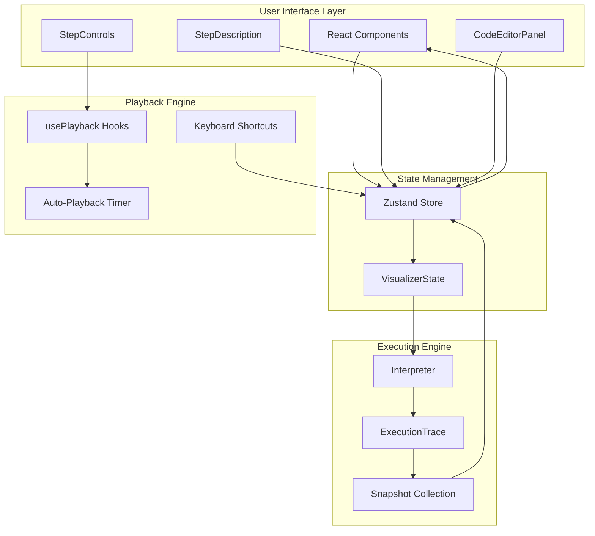
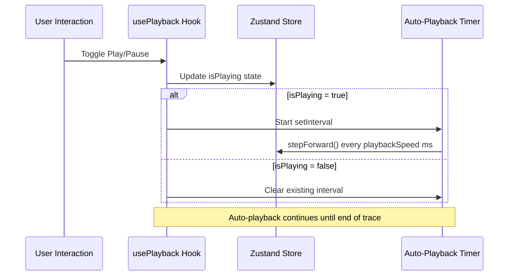
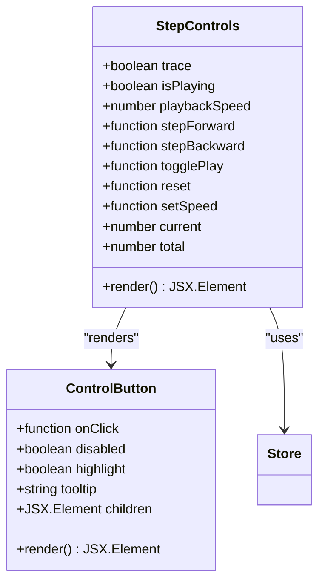
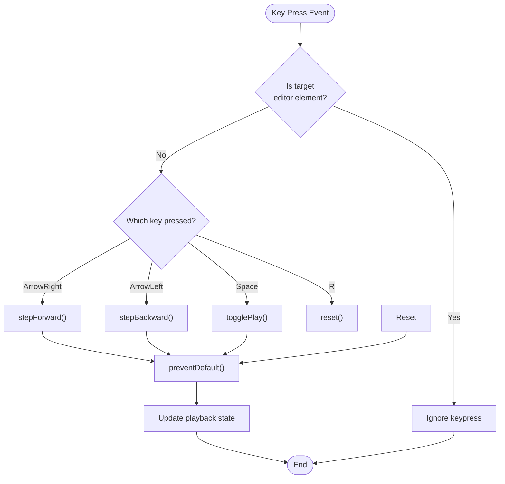
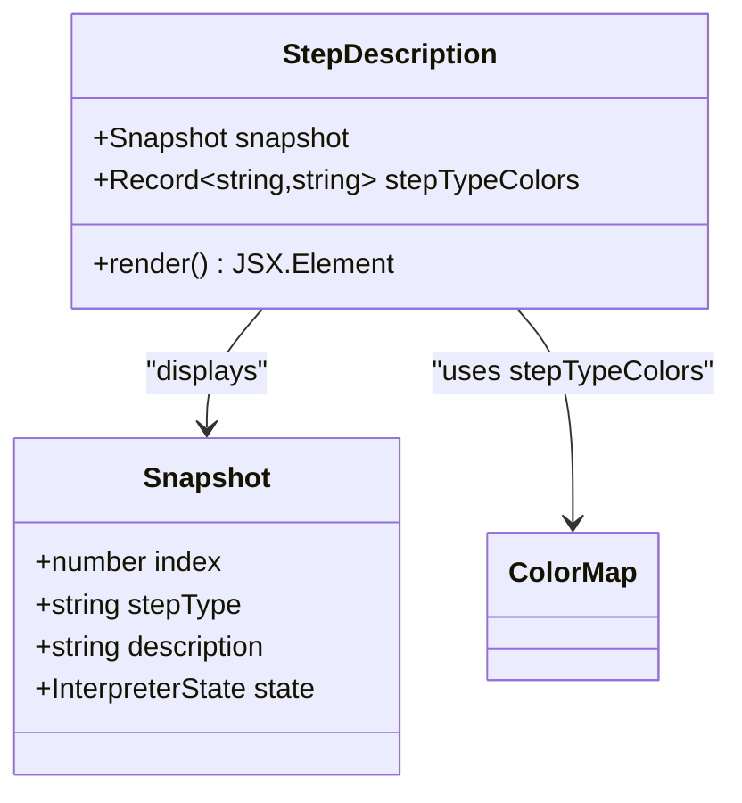
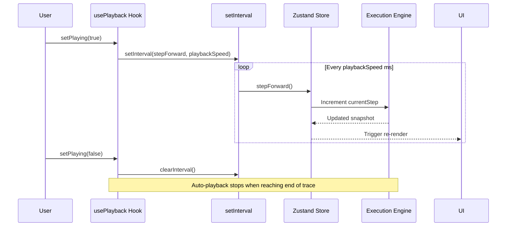
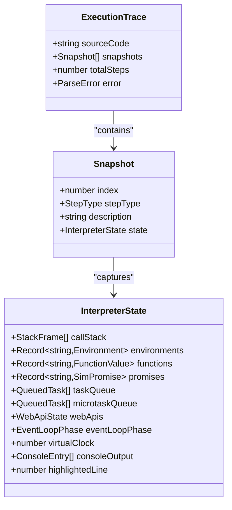
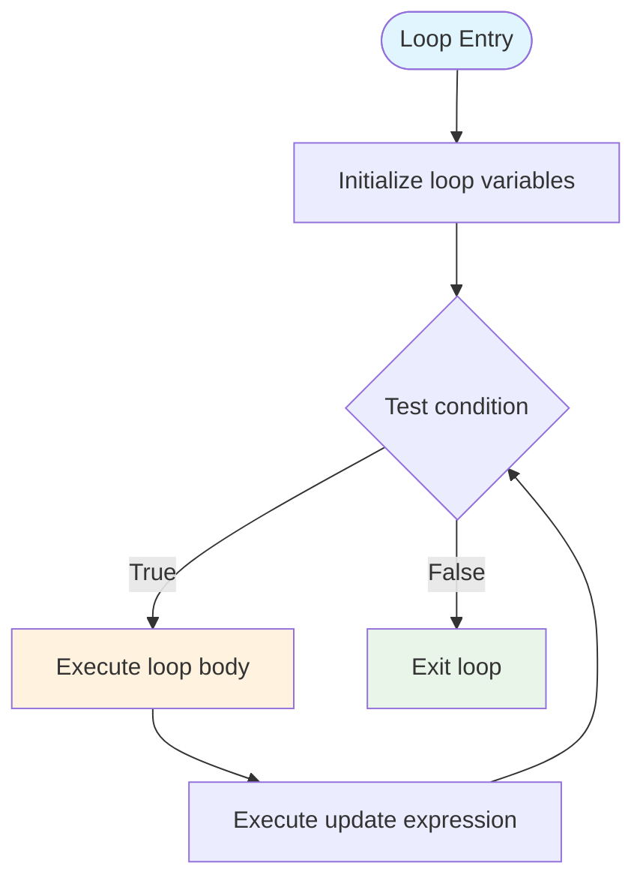

# Playback System

<cite>
**Referenced Files in This Document**
- [usePlayback.ts](file://src/hooks/usePlayback.ts)
- [StepControls.tsx](file://src/components/controls/StepControls.tsx)
- [StepDescription.tsx](file://src/components/controls/StepDescription.tsx)
- [useVisualizerStore.ts](file://src/store/useVisualizerStore.ts)
- [interpreter/index.ts](file://src/engine/interpreter/index.ts)
- [types.ts](file://src/engine/runtime/types.ts)
- [App.tsx](file://src/App.tsx)
- [examples/index.ts](file://src/examples/index.ts)
- [CodeEditorPanel.tsx](file://src/components/editor/CodeEditorPanel.tsx)
- [AppShell.tsx](file://src/components/layout/AppShell.tsx)
</cite>

## Table of Contents
1. [Introduction](#introduction)
2. [System Architecture](#system-architecture)
3. [Core Components](#core-components)
4. [Playback Controls](#playback-controls)
5. [Keyboard Shortcuts](#keyboard-shortcuts)
6. [Step Description Panel](#step-description-panel)
7. [Auto-Playback Feature](#auto-playback-feature)
8. [Execution Tracing](#execution-tracing)
9. [Practical Usage Examples](#practical-usage-examples)
10. [Common Scenarios](#common-scenarios)
11. [Troubleshooting Guide](#troubleshooting-guide)
12. [Conclusion](#conclusion)

## Introduction

The JS Visualizer's playback system provides an interactive way to step through JavaScript execution, enabling developers to understand how code executes in real-time. This system offers precise control over execution flow, allowing users to navigate forward and backward through execution steps, control playback speed, and observe the runtime state at each moment.

The playback system integrates seamlessly with the visualizer's architecture, providing both mouse-based and keyboard-driven controls for an optimal debugging and educational experience.

## System Architecture

The playback system follows a unidirectional data flow pattern with clear separation of concerns:

**Diagram sources**
- [App.tsx:125-137](file://src/App.tsx#L125-L137)
- [useVisualizerStore.ts:27-98](file://src/store/useVisualizerStore.ts#L27-L98)
- [usePlayback.ts:4-28](file://src/hooks/usePlayback.ts#L4-L28)

The architecture ensures that:
- UI components remain declarative and reactive
- State management is centralized and predictable
- Playback logic is encapsulated in reusable hooks
- Execution tracing maintains immutable snapshots

## Core Components

### Zustand Store Implementation

The [`useVisualizerStore`:27-98](file://src/store/useVisualizerStore.ts#L27-L98) serves as the central state manager for the entire playback system. It maintains:

- **Execution State**: Current code, execution trace, and current step position
- **Playback Controls**: Play/pause state, playback speed, and step navigation
- **Runtime Information**: Error handling and execution metadata

Key state properties include:
- `code`: Current JavaScript source code
- `trace`: Complete execution trace with all snapshots
- `currentStep`: Index of the currently displayed step
- `isPlaying`: Auto-playback state flag
- `playbackSpeed`: Interval between steps in milliseconds

**Section sources**
- [useVisualizerStore.ts:5-33](file://src/store/useVisualizerStore.ts#L5-L33)

### Playback Hook System

The [`usePlayback`:4-28](file://src/hooks/usePlayback.ts#L4-L28) hook manages auto-playback functionality:

**Diagram sources**
- [usePlayback.ts:10-27](file://src/hooks/usePlayback.ts#L10-L27)
- [useVisualizerStore.ts:75-86](file://src/store/useVisualizerStore.ts#L75-L86)

**Section sources**
- [usePlayback.ts:4-28](file://src/hooks/usePlayback.ts#L4-L28)

## Playback Controls

### StepControls Component

The [`StepControls`:13-165](file://src/components/controls/StepControls.tsx#L13-L165) component provides comprehensive playback interface:

**Diagram sources**
- [StepControls.tsx:13-165](file://src/components/controls/StepControls.tsx#L13-L165)

#### Control Features

**Navigation Controls**:
- **Previous Button**: Steps backward to previous execution step
- **Play/Pause Button**: Toggles auto-playback mode
- **Next Button**: Steps forward to next execution step
- **Reset Button**: Returns to initial execution state

**Progress Tracking**:
- Step counter showing current step out of total steps
- Visual progress bar with clickable timeline
- Real-time step percentage animation

**Speed Control**:
Four predefined speed levels:
- 0.5x (1600ms per step)
- 1x (800ms per step) - default
- 2x (400ms per step)
- 4x (200ms per step)

**Section sources**
- [StepControls.tsx:27-32](file://src/components/controls/StepControls.tsx#L27-L32)
- [StepControls.tsx:105-123](file://src/components/controls/StepControls.tsx#L105-L123)

## Keyboard Shortcuts

### Keyboard Shortcuts Hook

The [`useKeyboardShortcuts`:30-78](file://src/hooks/usePlayback.ts#L30-L78) hook provides comprehensive keyboard-driven playback control:

**Diagram sources**
- [usePlayback.ts:37-72](file://src/hooks/usePlayback.ts#L37-L72)

### Available Shortcuts

| Shortcut | Action | Description |
|----------|--------|-------------|
| Arrow Right | Next Step | Move to next execution step |
| Arrow Left | Previous Step | Move to previous execution step |
| Space | Play/Pause | Toggle auto-playback mode |
| R | Reset | Reset to initial execution state |

**Section sources**
- [usePlayback.ts:49-69](file://src/hooks/usePlayback.ts#L49-L69)

## Step Description Panel

### StepDescription Component

The [`StepDescription`:37-86](file://src/components/controls/StepDescription.tsx#L37-L86) component displays detailed information about the current execution step:

**Diagram sources**
- [StepDescription.tsx:37-86](file://src/components/controls/StepDescription.tsx#L37-L86)

### Step Type Categories

The system categorizes execution steps with distinct visual indicators:

| Step Type | Purpose | Visual Color |
|-----------|---------|--------------|
| `program-start` | Program initialization | Context accent |
| `program-end` | Program completion | Context accent |
| `variable-declaration` | Variable creation | Context accent |
| `variable-assignment` | Variable modification | Context accent |
| `function-declaration` | Function definition | Blue (#61AFEF) |
| `function-call` | Function invocation | Call stack accent |
| `function-return` | Function completion | Call stack accent |
| `console-log` | Console output | Console accent |
| `register-timer` | Timer registration | Web API accent |
| `register-fetch` | Fetch initiation | Web API accent |
| `timer-fires` | Timer callback execution | Web API accent |
| `fetch-completes` | Fetch completion | Web API accent |
| `promise-created` | Promise instantiation | Microtask accent |
| `promise-resolved` | Promise fulfillment | Microtask accent |
| `promise-rejected` | Promise rejection | Red (#FF6B6B) |
| `then-registered` | Promise handler registration | Microtask accent |
| `enqueue-microtask` | Microtask scheduling | Microtask accent |
| `dequeue-microtask` | Microtask execution | Microtask accent |
| `enqueue-macrotask` | Macrotask scheduling | Task queue accent |
| `dequeue-macrotask` | Macrotask execution | Task queue accent |
| `event-loop-check` | Event loop cycle | Event loop accent |
| `await-suspend` | Await suspension | Purple (#C678DD) |
| `await-resume` | Await continuation | Purple (#C678DD) |
| `runtime-error` | Execution error | Red (#FF6B6B) |

**Section sources**
- [StepDescription.tsx:10-35](file://src/components/controls/StepDescription.tsx#L10-L35)

## Auto-Playback Feature

### Auto-Playback Mechanism

The auto-playback system operates through a sophisticated timer-based approach:

**Diagram sources**
- [usePlayback.ts:10-27](file://src/hooks/usePlayback.ts#L10-L27)
- [useVisualizerStore.ts:52-60](file://src/store/useVisualizerStore.ts#L52-L60)

### Speed Configuration

The system provides four configurable playback speeds:

| Speed Level | Interval | Use Case |
|-------------|----------|----------|
| 0.5x | 1600ms | Slow observation, educational purposes |
| 1x | 800ms | Normal debugging speed |
| 2x | 400ms | Quick review of familiar code |
| 4x | 200ms | Rapid exploration of complex async flows |

**Section sources**
- [StepControls.tsx:27-32](file://src/components/controls/StepControls.tsx#L27-L32)
- [useVisualizerStore.ts:90](file://src/store/useVisualizerStore.ts#L90)

## Execution Tracing

### ExecutionTrace Structure

The [`ExecutionTrace`:235-240](file://src/engine/runtime/types.ts#L235-L240) represents the complete execution history:

**Diagram sources**
- [types.ts:235-249](file://src/engine/runtime/types.ts#L235-L249)

### Step Types Coverage

The interpreter generates comprehensive step types covering all JavaScript execution patterns:

**Synchronous Operations**:
- Variable declarations and assignments
- Function calls and returns
- Conditional statements (if/else)
- Loop constructs (for, while)
- Block scoping

**Asynchronous Operations**:
- Promise creation and resolution
- Microtask queue management
- Timer registration and execution
- Fetch API simulation
- Event loop phase transitions

**Advanced Features**:
- Closure management
- Error handling and propagation
- Async/await suspension and resumption
- Memory management through garbage collection

**Section sources**
- [types.ts:199-224](file://src/engine/runtime/types.ts#L199-L224)
- [interpreter/index.ts:139-150](file://src/engine/interpreter/index.ts#L139-L150)

## Practical Usage Examples

### Debugging Code with Playback

**Example 1: Understanding Variable Scope**
1. Load the closure demo example
2. Step through function creation
3. Observe how closures capture variables
4. Watch variable assignments in different scopes

**Example 2: Tracing Promise Chains**
1. Load the promise chain example
2. Step through promise creation
3. Observe microtask queue growth
4. Watch then handlers execution order

**Example 3: Event Loop Analysis**
1. Load the event loop order example
2. Step through synchronous execution
3. Observe microtask vs macrotask timing
4. Understand execution precedence

### Teaching JavaScript Concepts

**Educational Workflow**:
1. **Introduction**: Show basic variable declarations
2. **Development**: Demonstrate function calls and returns
3. **Advanced**: Introduce closures and scope chains
4. **Modern**: Explain async patterns and event loops

**Interactive Learning**:
- Students can pause at critical moments
- Visualize memory allocation and deallocation
- Observe garbage collection effects
- Understand error propagation

### Code Review and Analysis

**Performance Analysis**:
- Step through complex algorithms
- Identify bottlenecks in execution flow
- Analyze time complexity visually
- Compare different implementation approaches

**Security Auditing**:
- Trace variable modifications
- Monitor sensitive data handling
- Verify input validation steps
- Track error conditions

## Common Scenarios

### Stepping Through Loops

**Best Practices**:
- Use slower playback speed for complex loops
- Step through each iteration carefully
- Observe variable changes in each iteration
- Pay attention to memory usage patterns

### Navigating Conditional Statements

**If/Else Flow**:
1. Execute condition evaluation
2. Step into appropriate branch
3. Observe variable modifications
4. Continue to next statement

**Switch Statements**:
- Step through case evaluation
- Watch fall-through behavior
- Observe default case handling

### Handling Asynchronous Operations

**Promise Resolution**:
1. Step through promise creation
2. Observe microtask queue growth
3. Watch then handlers execution
4. Understand error propagation

**Timer Callbacks**:
- Step through timer registration
- Observe virtual clock advancement
- Watch callback execution timing
- Understand setInterval behavior

**Section sources**
- [interpreter/index.ts:360-395](file://src/engine/interpreter/index.ts#L360-L395)
- [interpreter/index.ts:410-429](file://src/engine/interpreter/index.ts#L410-L429)

## Troubleshooting Guide

### Common Issues and Solutions

**Playback Stalls or Freezes**:
- **Cause**: Infinite loop or excessive execution steps
- **Solution**: Increase maximum steps limit or fix code logic
- **Prevention**: Use step counter to monitor progress

**Keyboard Shortcuts Not Working**:
- **Cause**: Focus on editor input field
- **Solution**: Click outside editor or press Escape
- **Verification**: Check browser console for key events

**Auto-Playback Stops Unexpectedly**:
- **Cause**: Reached end of execution trace
- **Solution**: Reset to beginning or adjust speed
- **Feature**: Auto-reset at trace completion

**Memory Usage Concerns**:
- **Cause**: Large execution traces consume memory
- **Solution**: Use reset functionality between sessions
- **Optimization**: Clear old traces when switching examples

### Performance Optimization

**Large Codebases**:
- Use higher playback speeds for quick reviews
- Focus on critical execution paths
- Utilize step filtering for relevant operations

**Complex Async Patterns**:
- Step slowly through promise chains
- Monitor microtask queue growth
- Observe event loop phase transitions

**Section sources**
- [interpreter/index.ts:140-142](file://src/engine/interpreter/index.ts#L140-L142)
- [useVisualizerStore.ts:88](file://src/store/useVisualizerStore.ts#L88)

## Conclusion

The JS Visualizer's playback system provides a comprehensive solution for understanding JavaScript execution flow. Its combination of precise step control, visual feedback, and educational features makes it an invaluable tool for both debugging and learning.

Key strengths include:
- **Intuitive Controls**: Both mouse and keyboard interfaces
- **Rich Visual Feedback**: Color-coded step descriptions and progress tracking
- **Educational Value**: Excellent for teaching JavaScript concepts
- **Debugging Power**: Precise control over execution flow
- **Performance Monitoring**: Insight into memory and execution patterns

The system's modular architecture ensures maintainability while providing a smooth user experience. Whether used for debugging production code, teaching programming concepts, or exploring advanced JavaScript features, the playback system delivers exceptional value.

Future enhancements could include:
- Export/import of execution traces
- Customizable step filters
- Performance profiling integration
- Collaborative debugging features