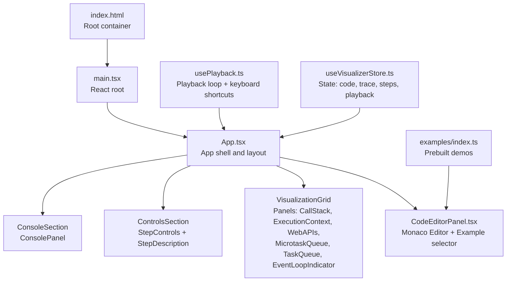
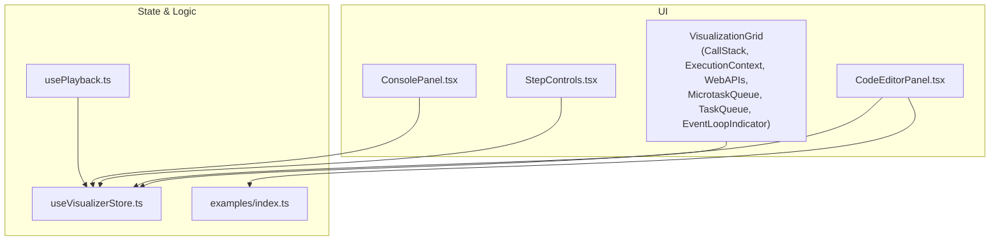
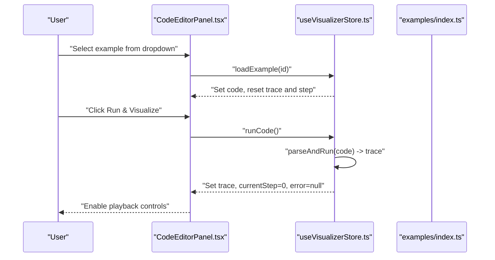
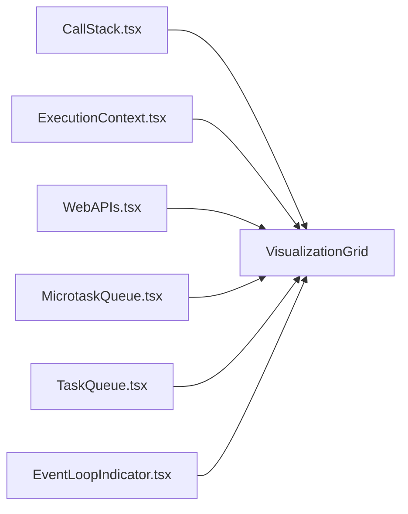
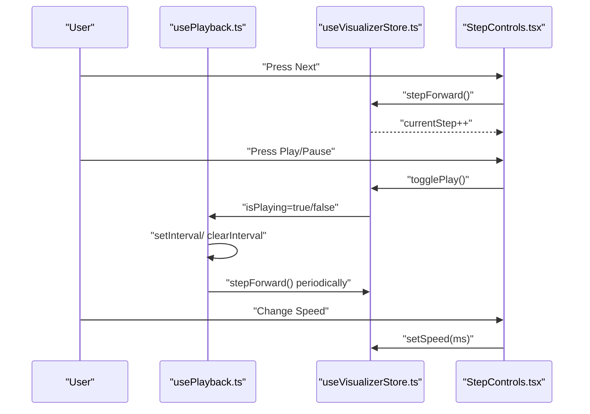
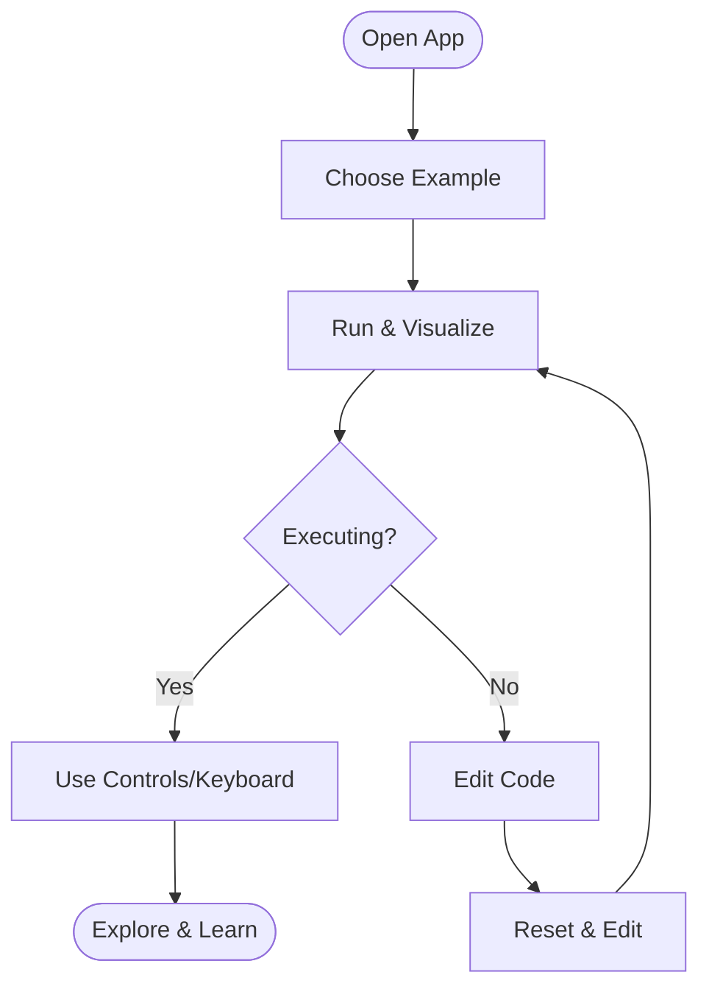
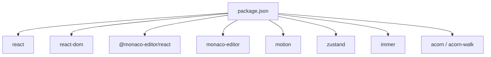

# User Guide

<cite>
**Referenced Files in This Document**
- [App.tsx](file://src/App.tsx)
- [main.tsx](file://src/main.tsx)
- [package.json](file://package.json)
- [index.html](file://index.html)
- [CodeEditorPanel.tsx](file://src/components/editor/CodeEditorPanel.tsx)
- [ExampleSelector.tsx](file://src/components/editor/ExampleSelector.tsx)
- [editorTheme.ts](file://src/components/editor/editorTheme.ts)
- [CallStack.tsx](file://src/components/visualizer/CallStack.tsx)
- [ExecutionContext.tsx](file://src/components/visualizer/ExecutionContext.tsx)
- [WebAPIs.tsx](file://src/components/visualizer/WebAPIs.tsx)
- [MicrotaskQueue.tsx](file://src/components/visualizer/MicrotaskQueue.tsx)
- [TaskQueue.tsx](file://src/components/visualizer/TaskQueue.tsx)
- [EventLoopIndicator.tsx](file://src/components/visualizer/EventLoopIndicator.tsx)
- [ConsolePanel.tsx](file://src/components/console/ConsolePanel.tsx)
- [StepControls.tsx](file://src/components/controls/StepControls.tsx)
- [usePlayback.ts](file://src/hooks/usePlayback.ts)
- [useVisualizerStore.ts](file://src/store/useVisualizerStore.ts)
- [examples/index.ts](file://src/examples/index.ts)
</cite>

## Table of Contents
1. [Introduction](#introduction)
2. [Project Structure](#project-structure)
3. [Core Components](#core-components)
4. [Architecture Overview](#architecture-overview)
5. [Detailed Component Analysis](#detailed-component-analysis)
6. [Dependency Analysis](#dependency-analysis)
7. [Performance Considerations](#performance-considerations)
8. [Troubleshooting Guide](#troubleshooting-guide)
9. [Conclusion](#conclusion)
10. [Appendices](#appendices)

## Introduction
JS-Visualizer is an interactive learning tool designed to help you understand how JavaScript executes, including the call stack, execution context, Web APIs, and the event loop with microtask and task queues. It provides a code editor, step-by-step playback, auto-playback with adjustable speed, keyboard shortcuts, and a suite of built-in examples to explore fundamental and advanced JavaScript concepts.

## Project Structure
The application is a React + TypeScript app bundled with Vite. It uses Monaco Editor for the code editing experience, Zustand for state management, and Framer Motion for smooth animations. The UI is organized into panels for visualization and controls, with a central App shell orchestrating layout and playback hooks.

**Diagram sources**
- [index.html](file://index.html)
- [main.tsx](file://src/main.tsx)
- [App.tsx](file://src/App.tsx)
- [CodeEditorPanel.tsx](file://src/components/editor/CodeEditorPanel.tsx)
- [CallStack.tsx](file://src/components/visualizer/CallStack.tsx)
- [ExecutionContext.tsx](file://src/components/visualizer/ExecutionContext.tsx)
- [WebAPIs.tsx](file://src/components/visualizer/WebAPIs.tsx)
- [MicrotaskQueue.tsx](file://src/components/visualizer/MicrotaskQueue.tsx)
- [TaskQueue.tsx](file://src/components/visualizer/TaskQueue.tsx)
- [EventLoopIndicator.tsx](file://src/components/visualizer/EventLoopIndicator.tsx)
- [ConsolePanel.tsx](file://src/components/console/ConsolePanel.tsx)
- [StepControls.tsx](file://src/components/controls/StepControls.tsx)
- [usePlayback.ts](file://src/hooks/usePlayback.ts)
- [useVisualizerStore.ts](file://src/store/useVisualizerStore.ts)
- [examples/index.ts](file://src/examples/index.ts)

**Section sources**
- [index.html](file://index.html)
- [main.tsx](file://src/main.tsx)
- [App.tsx](file://src/App.tsx)
- [package.json](file://package.json)

## Core Components
- Code Editor Panel: Monaco Editor-based editor with syntax-aware theme, line highlighting, and example loading. Includes a “Run & Visualize” button and error display.
- Visualization Panels: Call Stack, Scope/Variables, Web APIs, Microtask Queue, Task Queue, and Event Loop Indicator.
- Playback Controls: Step backward, play/pause, step forward, reset, progress bar, and speed selection.
- Store: Centralized state for code, execution trace, current step, playback state, and playback speed.
- Hooks: Playback loop and keyboard shortcuts for navigation and control.
- Examples: Prebuilt demonstrations covering setTimeout basics, Promise chains, event loop order, mixed async patterns, constructors, closures, nested timers, and call stack growth.

**Section sources**
- [CodeEditorPanel.tsx](file://src/components/editor/CodeEditorPanel.tsx)
- [CallStack.tsx](file://src/components/visualizer/CallStack.tsx)
- [ExecutionContext.tsx](file://src/components/visualizer/ExecutionContext.tsx)
- [WebAPIs.tsx](file://src/components/visualizer/WebAPIs.tsx)
- [MicrotaskQueue.tsx](file://src/components/visualizer/MicrotaskQueue.tsx)
- [TaskQueue.tsx](file://src/components/visualizer/TaskQueue.tsx)
- [EventLoopIndicator.tsx](file://src/components/visualizer/EventLoopIndicator.tsx)
- [StepControls.tsx](file://src/components/controls/StepControls.tsx)
- [useVisualizerStore.ts](file://src/store/useVisualizerStore.ts)
- [usePlayback.ts](file://src/hooks/usePlayback.ts)
- [examples/index.ts](file://src/examples/index.ts)

## Architecture Overview
The app renders a responsive grid of visualization panels and integrates Monaco Editor for code input. Playback is managed via a hook that updates the current step at a configurable interval. The store coordinates parsing, execution, and snapshot retrieval.

**Diagram sources**
- [App.tsx](file://src/App.tsx)
- [CodeEditorPanel.tsx](file://src/components/editor/CodeEditorPanel.tsx)
- [CallStack.tsx](file://src/components/visualizer/CallStack.tsx)
- [ExecutionContext.tsx](file://src/components/visualizer/ExecutionContext.tsx)
- [WebAPIs.tsx](file://src/components/visualizer/WebAPIs.tsx)
- [MicrotaskQueue.tsx](file://src/components/visualizer/MicrotaskQueue.tsx)
- [TaskQueue.tsx](file://src/components/visualizer/TaskQueue.tsx)
- [EventLoopIndicator.tsx](file://src/components/visualizer/EventLoopIndicator.tsx)
- [ConsolePanel.tsx](file://src/components/console/ConsolePanel.tsx)
- [StepControls.tsx](file://src/components/controls/StepControls.tsx)
- [useVisualizerStore.ts](file://src/store/useVisualizerStore.ts)
- [usePlayback.ts](file://src/hooks/usePlayback.ts)
- [examples/index.ts](file://src/examples/index.ts)

## Detailed Component Analysis

### Code Editor Interface (Monaco Editor)
- Features:
  - Syntax-aware dark theme tailored for JS-Visualizer.
  - Line highlighting for the currently executing statement.
  - Read-only during execution to prevent mid-run edits.
  - Example selector dropdown to load prebuilt demos.
  - Run/Reset buttons with clear affordances.
  - Error banner for parse/runtime errors.
- Options:
  - Monospace fonts, line numbers, minimal decorations, compact scrollbar, and automatic layout.
- Keyboard and UX:
  - While executing, the editor is read-only; after resetting, you can edit again.

**Diagram sources**
- [CodeEditorPanel.tsx](file://src/components/editor/CodeEditorPanel.tsx)
- [useVisualizerStore.ts](file://src/store/useVisualizerStore.ts)
- [examples/index.ts](file://src/examples/index.ts)

**Section sources**
- [CodeEditorPanel.tsx](file://src/components/editor/CodeEditorPanel.tsx)
- [ExampleSelector.tsx](file://src/components/editor/ExampleSelector.tsx)
- [editorTheme.ts](file://src/components/editor/editorTheme.ts)

### Visualization Panels and Interpretation
- Call Stack:
  - Displays active stack frames with optional line numbers.
  - Highlights the current frame; recent additions animate in.
- Scope / Variables:
  - Walks up the scope chain and lists bindings with kinds and colored values.
  - Animates when scopes change.
- Web APIs:
  - Shows active timers and fetches with animated visuals indicating timing and ongoing requests.
- Microtask Queue:
  - Lists pending microtasks; items animate in/out.
- Task Queue:
  - Lists pending macrotasks; items animate in/out.
- Event Loop Indicator:
  - Visualizes the current phase (idle, executing sync, checking microtasks, executing microtask, checking tasks, executing task, advancing timers).
  - Animated ring highlights the active phase.

**Diagram sources**
- [App.tsx](file://src/App.tsx)
- [CallStack.tsx](file://src/components/visualizer/CallStack.tsx)
- [ExecutionContext.tsx](file://src/components/visualizer/ExecutionContext.tsx)
- [WebAPIs.tsx](file://src/components/visualizer/WebAPIs.tsx)
- [MicrotaskQueue.tsx](file://src/components/visualizer/MicrotaskQueue.tsx)
- [TaskQueue.tsx](file://src/components/visualizer/TaskQueue.tsx)
- [EventLoopIndicator.tsx](file://src/components/visualizer/EventLoopIndicator.tsx)

**Section sources**
- [CallStack.tsx](file://src/components/visualizer/CallStack.tsx)
- [ExecutionContext.tsx](file://src/components/visualizer/ExecutionContext.tsx)
- [WebAPIs.tsx](file://src/components/visualizer/WebAPIs.tsx)
- [MicrotaskQueue.tsx](file://src/components/visualizer/MicrotaskQueue.tsx)
- [TaskQueue.tsx](file://src/components/visualizer/TaskQueue.tsx)
- [EventLoopIndicator.tsx](file://src/components/visualizer/EventLoopIndicator.tsx)

### Playback Controls and Navigation
- Controls:
  - Previous, Play/Pause, Next, Reset.
  - Step counter and progress bar; clicking the bar jumps to a step.
  - Speed presets: 0.5x, 1x, 2x, 4x.
- Behavior:
  - Auto-play advances by stepping forward at the selected interval.
  - At the end, toggling play restarts from the beginning.
- Keyboard Shortcuts:
  - Arrow keys: step backward/forward.
  - Space: play/pause.
  - R: reset.

**Diagram sources**
- [usePlayback.ts](file://src/hooks/usePlayback.ts)
- [useVisualizerStore.ts](file://src/store/useVisualizerStore.ts)
- [StepControls.tsx](file://src/components/controls/StepControls.tsx)

**Section sources**
- [StepControls.tsx](file://src/components/controls/StepControls.tsx)
- [usePlayback.ts](file://src/hooks/usePlayback.ts)
- [useVisualizerStore.ts](file://src/store/useVisualizerStore.ts)

### Example System: Load, Modify, Experiment
- Loading:
  - Use the Example Selector to pick a demo; the editor loads the example code and clears previous trace.
- Modifying:
  - After resetting, edit the code; the editor becomes writable again.
- Experimenting:
  - Adjust code to observe how changes affect the call stack, scope, queues, and event loop phases.
  - Use playback controls to step through subtle differences.

**Diagram sources**
- [CodeEditorPanel.tsx](file://src/components/editor/CodeEditorPanel.tsx)
- [ExampleSelector.tsx](file://src/components/editor/ExampleSelector.tsx)
- [useVisualizerStore.ts](file://src/store/useVisualizerStore.ts)
- [usePlayback.ts](file://src/hooks/usePlayback.ts)

**Section sources**
- [examples/index.ts](file://src/examples/index.ts)
- [ExampleSelector.tsx](file://src/components/editor/ExampleSelector.tsx)
- [CodeEditorPanel.tsx](file://src/components/editor/CodeEditorPanel.tsx)
- [useVisualizerStore.ts](file://src/store/useVisualizerStore.ts)

### Best Practices for Effective Learning
- Start with simple synchronous examples to understand call stack and scope, then progress to async patterns.
- Use slower playback speeds to observe microtasks running before macrotasks.
- Step through incrementally to connect each editor line to the highlighted execution line.
- Compare outputs across examples to internalize event loop ordering.
- Keep experiments small and focused; introduce one concept at a time.

### Common Workflows
- Beginner:
  - Load “setTimeout Basics,” run, and step through to see callbacks land in the task queue.
  - Switch to “Promise Chain” to see microtasks appear and run before subsequent macrotasks.
- Intermediate:
  - Load “Event Loop Order” and “Mixed Async” to compare microtask vs. macrotask execution.
  - Modify delays and promises to see timing effects.
- Advanced:
  - Explore “new Promise()” to distinguish executor sync execution from .then async scheduling.
  - Investigate nested timers and closure demos to understand scoping and function stacking.

### Practical Scenarios
- Scenario 1: Understanding microtasks vs. macrotasks
  - Load “Event Loop Order,” run, and step through. Observe the microtask queue being drained before the task queue.
- Scenario 2: Debugging asynchronous code
  - Load “Mixed Async,” slow down playback, and watch timers and promises interleave.
- Scenario 3: Learning scope and closures
  - Load “Closure Demo,” step through function invocations, and inspect variable bindings in the scope panel.

## Dependency Analysis
External libraries and their roles:
- react, react-dom: UI framework.
- @monaco-editor/react, monaco-editor: Code editor with syntax highlighting and theming.
- motion: Smooth animations for panels and indicators.
- zustand: Lightweight state management for execution trace and playback.
- immer: Immutability helpers used by the store.
- acorn, acorn-walk: Parsing and AST walking for the interpreter.

**Diagram sources**
- [package.json](file://package.json)

**Section sources**
- [package.json](file://package.json)

## Performance Considerations
- Keep playback speed reasonable when stepping through complex examples to maintain comprehension.
- Prefer smaller code examples to reduce rendering overhead of many queue items.
- Avoid excessive re-renders by limiting manual edits while executing; use Reset to reload after changes.

## Troubleshooting Guide
- Editor appears read-only:
  - The editor is intentionally read-only during execution. Click “Reset & Edit” to unlock editing.
- No output in visualization:
  - Ensure the code runs successfully; check the error banner below the editor for messages.
- Playback does nothing:
  - Confirm an example is loaded or valid code exists; the store sets an error if parsing fails.
- Keyboard shortcuts not working:
  - They are ignored while typing in the editor or Monaco’s input areas; press keys outside the editor.

**Section sources**
- [CodeEditorPanel.tsx](file://src/components/editor/CodeEditorPanel.tsx)
- [usePlayback.ts](file://src/hooks/usePlayback.ts)
- [useVisualizerStore.ts](file://src/store/useVisualizerStore.ts)

## Conclusion
JS-Visualizer bridges the gap between written JavaScript and its runtime behavior. By combining an editor, stepwise playback, and animated panels, it makes the call stack, scope, Web APIs, and event loop tangible. Use the built-in examples as starting points, adjust playback speed to match your learning pace, and experiment freely to deepen your understanding of JavaScript execution.

## Appendices

### Keyboard Shortcuts Reference
- Arrow Left: Step backward
- Arrow Right: Step forward
- Space: Play/Pause
- R: Reset

**Section sources**
- [usePlayback.ts](file://src/hooks/usePlayback.ts)

### Playback Speeds
- Presets: 0.5x, 1x, 2x, 4x

**Section sources**
- [StepControls.tsx](file://src/components/controls/StepControls.tsx)