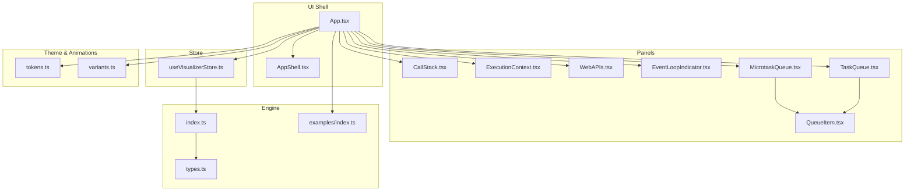
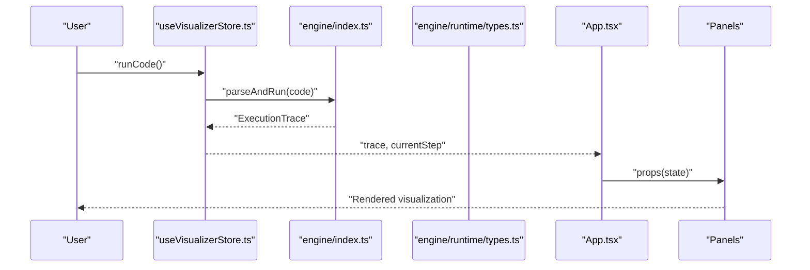
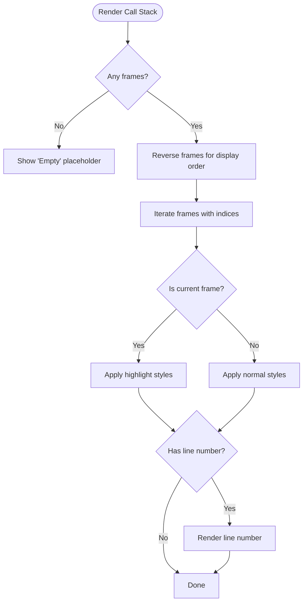
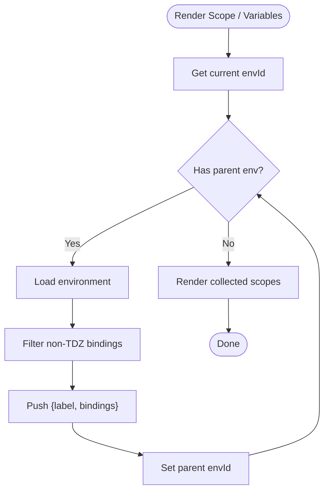
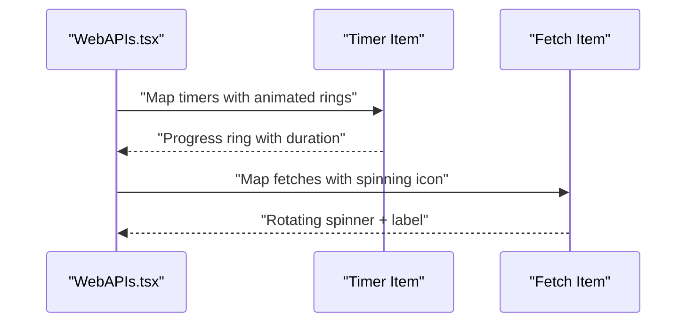
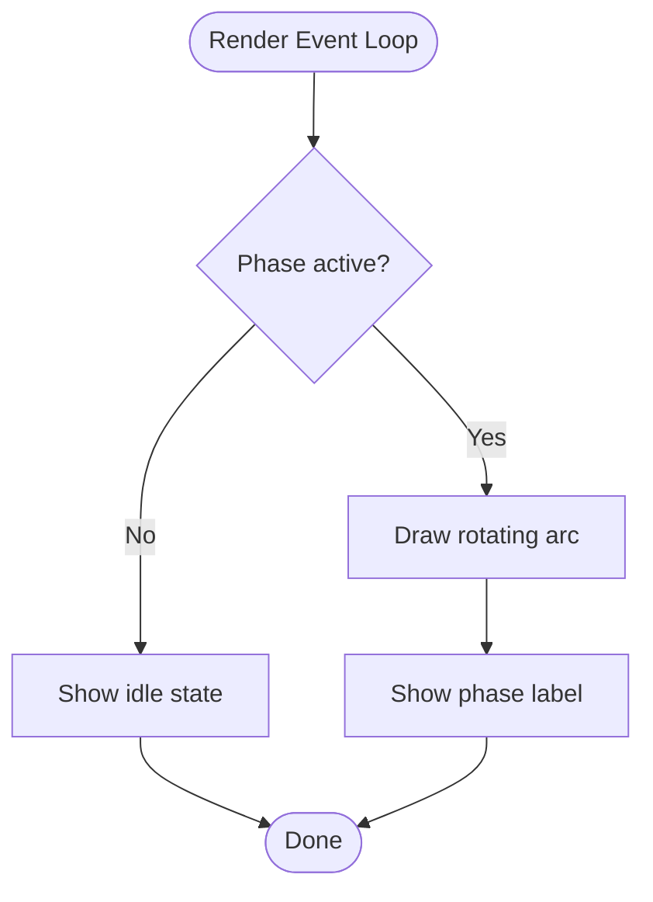
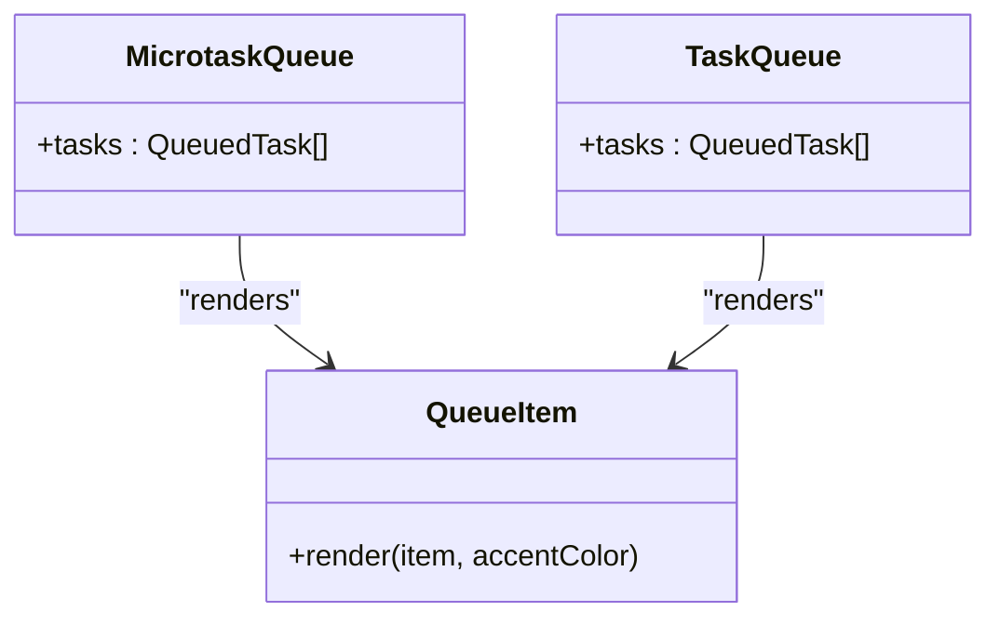
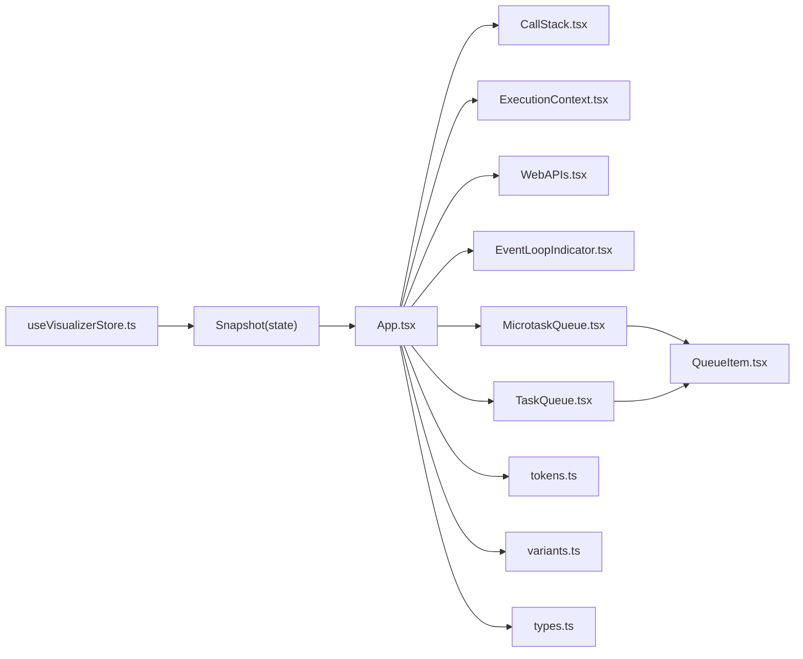

# Visualization Controls

<cite>
**Referenced Files in This Document**
- [App.tsx](file://src/App.tsx)
- [CallStack.tsx](file://src/components/visualizer/CallStack.tsx)
- [ExecutionContext.tsx](file://src/components/visualizer/ExecutionContext.tsx)
- [WebAPIs.tsx](file://src/components/visualizer/WebAPIs.tsx)
- [EventLoopIndicator.tsx](file://src/components/visualizer/EventLoopIndicator.tsx)
- [MicrotaskQueue.tsx](file://src/components/visualizer/MicrotaskQueue.tsx)
- [TaskQueue.tsx](file://src/components/visualizer/TaskQueue.tsx)
- [QueueItem.tsx](file://src/components/visualizer/QueueItem.tsx)
- [useVisualizerStore.ts](file://src/store/useVisualizerStore.ts)
- [types.ts](file://src/engine/runtime/types.ts)
- [index.ts](file://src/engine/index.ts)
- [variants.ts](file://src/animations/variants.ts)
- [tokens.ts](file://src/theme/tokens.ts)
- [examples/index.ts](file://src/examples/index.ts)
</cite>

## Table of Contents
1. [Introduction](#introduction)
2. [Project Structure](#project-structure)
3. [Core Components](#core-components)
4. [Architecture Overview](#architecture-overview)
5. [Detailed Component Analysis](#detailed-component-analysis)
6. [Dependency Analysis](#dependency-analysis)
7. [Performance Considerations](#performance-considerations)
8. [Troubleshooting Guide](#troubleshooting-guide)
9. [Conclusion](#conclusion)
10. [Appendices](#appendices)

## Introduction
This document explains the visualization control system that renders JavaScript execution in real time. It focuses on:
- Interpreting the call stack visualization (function frames, parameters, and scope chains)
- Understanding the execution context panel (variable bindings and memory-like representation)
- Monitoring Web APIs (setTimeout, setInterval, and fetch)
- Reading the event loop indicator and its relation to call stack and queues
- Interpreting microtask and macrotask queues and their roles in asynchronous execution
- Practical examples for reading the panels across scenarios from synchronous code to complex Promise chains and async/await patterns

## Project Structure
The visualization system is organized around a grid layout that places panels for call stack, execution context, Web APIs, event loop, and queues. The store holds the execution trace and current step, and the engine defines the runtime types and execution model.

**Diagram sources**
- [App.tsx:17-107](file://src/App.tsx#L17-L107)
- [CallStack.tsx:12-79](file://src/components/visualizer/CallStack.tsx#L12-L79)
- [ExecutionContext.tsx:33-128](file://src/components/visualizer/ExecutionContext.tsx#L33-L128)
- [WebAPIs.tsx:13-154](file://src/components/visualizer/WebAPIs.tsx#L13-L154)
- [EventLoopIndicator.tsx:30-143](file://src/components/visualizer/EventLoopIndicator.tsx#L30-L143)
- [MicrotaskQueue.tsx:12-41](file://src/components/visualizer/MicrotaskQueue.tsx#L12-L41)
- [TaskQueue.tsx:12-41](file://src/components/visualizer/TaskQueue.tsx#L12-L41)
- [QueueItem.tsx:12-38](file://src/components/visualizer/QueueItem.tsx#L12-L38)
- [useVisualizerStore.ts:27-98](file://src/store/useVisualizerStore.ts#L27-L98)
- [types.ts:183-195](file://src/engine/runtime/types.ts#L183-L195)
- [index.ts:1-17](file://src/engine/index.ts#L1-L17)
- [examples/index.ts:8-152](file://src/examples/index.ts#L8-L152)
- [tokens.ts:1-49](file://src/theme/tokens.ts#L1-L49)
- [variants.ts:3-39](file://src/animations/variants.ts#L3-L39)

**Section sources**
- [App.tsx:17-107](file://src/App.tsx#L17-L107)
- [useVisualizerStore.ts:27-98](file://src/store/useVisualizerStore.ts#L27-L98)
- [types.ts:183-195](file://src/engine/runtime/types.ts#L183-L195)

## Core Components
- Call Stack: Displays active function frames, highlighting the current frame and optionally showing line numbers.
- Execution Context: Renders visible bindings across the current scope chain, grouped by environment labels.
- Web APIs: Shows pending timers and ongoing fetches with animated progress indicators.
- Event Loop Indicator: Visualizes the current phase of the event loop and highlights microtasks, macrotasks, and timers.
- Microtask Queue: Lists queued microtasks awaiting execution after the current run-of-call-stack.
- Task Queue: Lists queued macrotasks (e.g., timers) scheduled to run after microtasks.

These components consume the current snapshot from the store and render the interpreter state defined by the engine types.

**Section sources**
- [CallStack.tsx:12-79](file://src/components/visualizer/CallStack.tsx#L12-L79)
- [ExecutionContext.tsx:33-128](file://src/components/visualizer/ExecutionContext.tsx#L33-L128)
- [WebAPIs.tsx:13-154](file://src/components/visualizer/WebAPIs.tsx#L13-L154)
- [EventLoopIndicator.tsx:30-143](file://src/components/visualizer/EventLoopIndicator.tsx#L30-L143)
- [MicrotaskQueue.tsx:12-41](file://src/components/visualizer/MicrotaskQueue.tsx#L12-L41)
- [TaskQueue.tsx:12-41](file://src/components/visualizer/TaskQueue.tsx#L12-L41)

## Architecture Overview
The visualization pipeline:
- The store runs the code via the engine and produces an execution trace with snapshots.
- The UI reads the current snapshot and passes state slices to each panel.
- Panels render with animations and theme tokens for clarity and feedback.

**Diagram sources**
- [useVisualizerStore.ts:37-50](file://src/store/useVisualizerStore.ts#L37-L50)
- [index.ts:1-17](file://src/engine/index.ts#L1-L17)
- [types.ts:183-231](file://src/engine/runtime/types.ts#L183-L231)
- [App.tsx:17-107](file://src/App.tsx#L17-L107)

## Detailed Component Analysis

### Call Stack Visualization
Purpose:
- Show the active call frames, the most recent frame being the current execution context.
- Optionally display line numbers for each frame.

Key behaviors:
- Reverses frames to show the most recent frame last.
- Highlights the current frame with a distinct background and border.
- Uses motion animations for smooth additions/removals.

**Diagram sources**
- [CallStack.tsx:30-76](file://src/components/visualizer/CallStack.tsx#L30-L76)

**Section sources**
- [CallStack.tsx:12-79](file://src/components/visualizer/CallStack.tsx#L12-L79)
- [variants.ts:3-7](file://src/animations/variants.ts#L3-L7)

### Execution Context Panel
Purpose:
- Display variable bindings visible in the current scope chain.
- Group bindings by environment and filter out uninitialized bindings.

Key behaviors:
- Walks up the scope chain using parent environment IDs.
- Filters bindings to exclude temporal dead zones.
- Color-codes values by type for readability.
- Uses animated fade-ins for dynamic updates.

**Diagram sources**
- [ExecutionContext.tsx:34-46](file://src/components/visualizer/ExecutionContext.tsx#L34-L46)
- [ExecutionContext.tsx:14-18](file://src/components/visualizer/ExecutionContext.tsx#L14-L18)
- [ExecutionContext.tsx:20-31](file://src/components/visualizer/ExecutionContext.tsx#L20-L31)

**Section sources**
- [ExecutionContext.tsx:33-128](file://src/components/visualizer/ExecutionContext.tsx#L33-L128)
- [types.ts:70-85](file://src/engine/runtime/types.ts#L70-L85)
- [types.ts:100-108](file://src/engine/runtime/types.ts#L100-L108)
- [variants.ts:34-38](file://src/animations/variants.ts#L34-L38)

### Web APIs Monitoring
Purpose:
- Track active timers and fetches registered by the program.
- Provide animated progress for timers and loading spinners for fetches.

Key behaviors:
- Renders timers with a circular progress ring whose duration reflects the delay.
- Renders fetches with a rotating spinner and a “Loading…” indicator.
- Uses motion variants for entrance/exit animations.

**Diagram sources**
- [WebAPIs.tsx:35-95](file://src/components/visualizer/WebAPIs.tsx#L35-L95)
- [WebAPIs.tsx:96-147](file://src/components/visualizer/WebAPIs.tsx#L96-L147)
- [variants.ts:15-19](file://src/animations/variants.ts#L15-L19)

**Section sources**
- [WebAPIs.tsx:13-154](file://src/components/visualizer/WebAPIs.tsx#L13-L154)
- [types.ts:119-143](file://src/engine/runtime/types.ts#L119-L143)

### Event Loop Indicator
Purpose:
- Show the current phase of the event loop and animate when the loop is active.
- Highlight microtasks, macrotasks, and timers phases.

Key behaviors:
- Maps phase to label and color.
- Draws a circular indicator with a rotating arc when active.
- Emphasizes current and executing sub-phases.

**Diagram sources**
- [EventLoopIndicator.tsx:30-143](file://src/components/visualizer/EventLoopIndicator.tsx#L30-L143)
- [types.ts:164-171](file://src/engine/runtime/types.ts#L164-L171)

**Section sources**
- [EventLoopIndicator.tsx:30-143](file://src/components/visualizer/EventLoopIndicator.tsx#L30-L143)
- [tokens.ts:11-19](file://src/theme/tokens.ts#L11-L19)

### Microtask and Macrotask Queues
Purpose:
- Visualize queued tasks that will run asynchronously.
- Distinguish microtasks (processed after the current run-of-call-stack) and macrotasks (processed after microtasks).

Key behaviors:
- Each queue panel lists queued tasks with animated entrances/exits.
- Queue items are truncated with ellipsis to fit long labels.
- Uses shared QueueItem component for consistent rendering.

**Diagram sources**
- [QueueItem.tsx:12-38](file://src/components/visualizer/QueueItem.tsx#L12-L38)
- [MicrotaskQueue.tsx:12-41](file://src/components/visualizer/MicrotaskQueue.tsx#L12-L41)
- [TaskQueue.tsx:12-41](file://src/components/visualizer/TaskQueue.tsx#L12-L41)

**Section sources**
- [MicrotaskQueue.tsx:12-41](file://src/components/visualizer/MicrotaskQueue.tsx#L12-L41)
- [TaskQueue.tsx:12-41](file://src/components/visualizer/TaskQueue.tsx#L12-L41)
- [QueueItem.tsx:12-38](file://src/components/visualizer/QueueItem.tsx#L12-L38)
- [types.ts:110-118](file://src/engine/runtime/types.ts#L110-L118)

## Dependency Analysis
- App orchestrates panels and passes state derived from the current snapshot.
- Panels depend on engine types for shape and semantics.
- Store depends on the engine to produce snapshots.
- Theme and animation tokens unify visual design and motion.

**Diagram sources**
- [useVisualizerStore.ts:101-109](file://src/store/useVisualizerStore.ts#L101-L109)
- [App.tsx:56-104](file://src/App.tsx#L56-L104)
- [types.ts:183-195](file://src/engine/runtime/types.ts#L183-L195)
- [tokens.ts:1-49](file://src/theme/tokens.ts#L1-L49)
- [variants.ts:3-39](file://src/animations/variants.ts#L3-L39)

**Section sources**
- [App.tsx:56-104](file://src/App.tsx#L56-L104)
- [useVisualizerStore.ts:101-109](file://src/store/useVisualizerStore.ts#L101-L109)
- [types.ts:183-195](file://src/engine/runtime/types.ts#L183-L195)

## Performance Considerations
- Use layout animations judiciously; the panels leverage layout transitions for stack/frame changes.
- Keep queue item labels concise; long labels are truncated to maintain readability.
- Prefer filtered binding rendering to reduce DOM nodes in the context panel.
- Use motion variants to batch animations and avoid unnecessary reflows.

[No sources needed since this section provides general guidance]

## Troubleshooting Guide
- Empty panels:
  - Call Stack: Occurs when the interpreter is idle or has finished executing.
  - Scope / Variables: Occurs when no bindings are in scope or all are TDZ.
  - Web APIs: Occurs when no timers or fetches are registered.
  - Microtask/Task Queues: Occur when queues are empty.
- Unexpected delays:
  - Web API timers rely on simulated delays; ensure the delay values are reasonable.
- Misaligned phases:
  - Event Loop phases reflect the interpreter’s internal state; verify the current snapshot’s phase.

**Section sources**
- [CallStack.tsx:19-29](file://src/components/visualizer/CallStack.tsx#L19-L29)
- [ExecutionContext.tsx:56-66](file://src/components/visualizer/ExecutionContext.tsx#L56-L66)
- [WebAPIs.tsx:22-32](file://src/components/visualizer/WebAPIs.tsx#L22-L32)
- [MicrotaskQueue.tsx:19-29](file://src/components/visualizer/MicrotaskQueue.tsx#L19-L29)
- [TaskQueue.tsx:19-29](file://src/components/visualizer/TaskQueue.tsx#L19-L29)

## Conclusion
The visualization controls present a comprehensive, real-time view of JavaScript execution. By interpreting the call stack, scope chain, Web APIs, event loop phases, and queues, learners can understand how synchronous and asynchronous code interacts. The included examples demonstrate typical patterns, enabling users to correlate observed visuals with expected execution order.

[No sources needed since this section summarizes without analyzing specific files]

## Appendices

### How to Read the Panels: Practical Examples

- Synchronous function calls
  - Observe the call stack growing with each function invocation and unwinding upon return.
  - Inspect the execution context to see local variables and parameters in scope.
  - The event loop remains idle or executing sync depending on whether the program is still running.

- setTimeout and setInterval
  - Web APIs panel shows pending timers with animated progress rings.
  - The task queue grows with timer callbacks; the event loop advances timers and executes macrotasks.

- Promise microtasks
  - Microtask queue shows then handlers enqueued after the current run-of-call-stack.
  - The event loop checks microtasks before moving to macrotasks; observe the indicator’s microtask phase.

- Mixed microtasks and macrotasks
  - The classic order: microtasks run before macrotasks. Watch the event loop indicator cycle accordingly.

- new Promise executor
  - The executor runs synchronously; then handlers enqueue as microtasks afterward.

- Nested setTimeout
  - Each timer callback adds another task to the task queue; observe the task queue panel grow.

- async/await
  - Await suspends execution and enqueues a microtask; the event loop resumes when the promise settles.

**Section sources**
- [examples/index.ts:8-152](file://src/examples/index.ts#L8-L152)
- [EventLoopIndicator.tsx:10-28](file://src/components/visualizer/EventLoopIndicator.tsx#L10-L28)
- [types.ts:164-171](file://src/engine/runtime/types.ts#L164-L171)
- [types.ts:119-143](file://src/engine/runtime/types.ts#L119-L143)
- [types.ts:110-118](file://src/engine/runtime/types.ts#L110-L118)